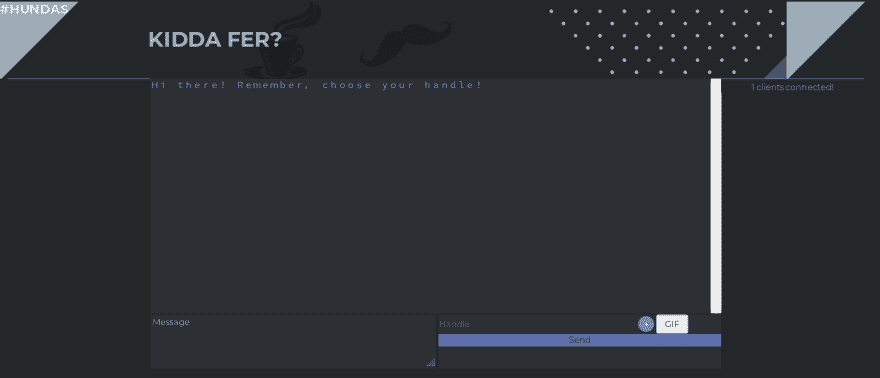
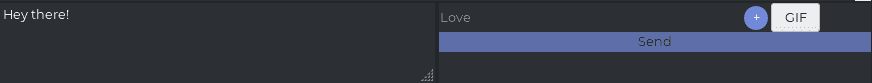
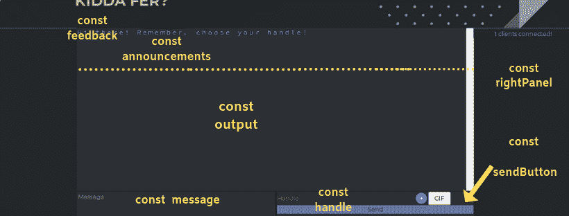
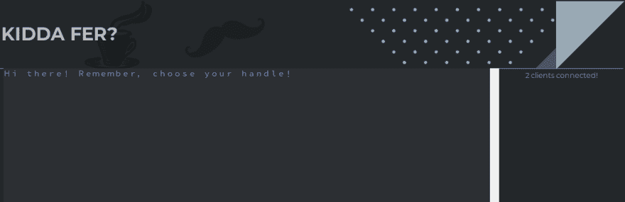

# 新手指南:用 socket 编写一个聊天应用。超正析象管(Image Orthicon)

> 原文：<https://dev.to/kauresss/newbie-guide-socket-io-code-a-chat-app-part-2-2c47>

# 编写一个聊天应用

## 向导

1.  [此处第 1 部分](https://dev.to/kauresss/socket-io-guide-for-newbies-5hdm)
2.  介绍
3.  聊天应用程序的功能
4.  插座。IO 方法
5.  插座。IO 事件
6.  回调函数
7.  目录结构
8.  迄今为止..
9.  设置 index.html 和 style.css
10.  从客户端向服务器发送消息
11.  在服务器处接收来自客户端的消息
12.  向所有连接的客户端显示消息
13.  正在广播“用户正在键入...”消息
14.  当有人加入聊天时显示问候信息
15.  显示用户总数

## 1。介绍

从[第一部分](https://dev.to/kauresss/socket-io-guide-for-newbies-5hdm)开始，本指南将重点介绍如何开发一款名为“Kidda Fer”的聊天应用。

## 2。聊天应用的功能

本指南中聊天应用程序的功能包括:

1.  连接时给用户的问候消息🙂
2.  一个或多个用户在聊天室发送消息，该消息立即显示给所有用户[又名**聊天**💻**T3】**
3.  当用户正在键入消息时，服务器广播一条消息:“用户正在键入…”给⌨️所有其他用户的消息
4.  在面板中显示连接的用户数量🌎

## 3。插座。IO 方法

`socket`对象使用套接字。IO 在任何特定情况下跟踪给定的套接字连接。`socket`对象有您可以访问和使用的方法和属性。

对象是属性的集合，即键值对。属性可以描述为与对象相关联的变量，该变量可以引用任何数据类型(例如字符串、数字、布尔值等)。一个方法是一个对象的函数，在我们的例子中，它是`socket`对象。

`socket`方法和属性的一些例子有:

| 方法 | 性能 |
| --- | --- |
| socket . emit()[向所有连接的客户端发出事件] | socket . id[访问套接字连接的唯一 id] |
| socket . join()[将套接字订阅给定的聊天室] | socket . connected[返回真或假] |
| socket . send()[发送通过“消息”事件接收的消息] | socket . disconnected[返回 true 或 false] |
| socket . on()[该方法将 eventName 和回调函数作为参数] | socket . custom property[在 socket 对象上设置自定义属性] |

*新手注意:注意套接字方法是由圆括号“()”识别的，而你只是通过点符号访问`socket`对象的属性。*

让我们来看看插座。IO 属性:

```
console.log(socket.connected);
console.log(socket.id);
console.log(socket.disconnected); 
```

Enter fullscreen mode Exit fullscreen mode

退货:

```
true
CYpR8HOx2dECnJy0AAAA
false 
```

Enter fullscreen mode Exit fullscreen mode

这些插座。IO 方法有两个参数:

*   事件的名称
*   回调函数

让我们继续讨论套接字。IO 事件。

## 4。插座。IO 事件

由于这是一个聊天应用程序，我们保证有“事件”，如连接，断开，重新连接，甚至加入主频道内的特定聊天室。

自插座。IO 提供了服务器端和客户端 API，我们必须同时处理双方的事件。

以前面教程中 index.js 的代码为例，我们创建了一个服务器和:

```
//declare var io which is a reference to a socket connection made on the server
var io= socket(server);

//Then use the io.on method which looks for a connection
//upon a connection execute a callback function which will console.log something
io.on('connection', function(){
  console.log('made socket connection');
}); 
```

Enter fullscreen mode Exit fullscreen mode

io.on 事件“处理”连接。在这种情况下，我们使用`var io`引用服务器端发起的任何连接。和`on`一个“连接”事件，我们希望运行一个回调函数，该函数将 console.log 字符串:进行套接字连接

从根本上说,“emit”和“on”方法负责“聊天”。这是通过 emit 方法发送消息并使用“on”方法侦听发出的消息来实现的。

有保留的服务器和客户端事件。其中一些是:

| 服务器端事件 | 客户端事件 |
| --- | --- |
| 连接 | 连接 |
| 再连接 | 拆开 |
|  | 加入/离开 |
|  | 再连接 |

语法是这样的，好像你在监听和触发事件。这些事件由套接字处理。IO 服务器和客户端方法。

## 5。回调函数

如上所述插座。IO 方法将事件和回调函数作为参数。如果你想知道什么是回调函数，你可以阅读这个小工作表[这里](https://dev.to/kauresss/coding-worksheet-4-callback-functions-k0g)。

对我们来说，回调函数本质上是一个响应于某些事件而触发的函数，例如“连接”或“断开”事件。

## 6。目录结构

您的目录结构将如下所示。与第 1 部分的[相同。](https://dev.to/kauresss/socket-io-guide-for-newbies-5hdm)
chat _ app
├──node _ modules
├──公共
│index.html
│└──style . CSS
│└──chat . js
├──index . js
├──package . JSON

我们将主要处理的文件是包含服务器代码的 index.js 和包含客户端代码的 chat.js。

## 7。迄今为止..

在上一个教程中，我们设置了所有的依赖项，使用 express.js 创建了一个服务器，包括了对 socket 的引用。index.html 的 IO 库，然后设置 socket。通过 it 在服务器端和客户端进行 IO。

到目前为止，您的代码应该是这样的:

*注意:我之前用了‘var’而不是 const*

index.js

```
const express = require('express');
const socket = require('socket.io')
let clients = 0;

const app = express();
const server = app.listen(4000, function(){
    console.log('listening for requests on port 4000,');
});

app.use(express.static('public'));

const io= socket(server); 
```

Enter fullscreen mode Exit fullscreen mode

chat.js

```
 const io= socket(server);

io.on('connection', function(){
  console.log('made socket connection');
}); 
```

Enter fullscreen mode Exit fullscreen mode

index.html

```
<!DOCTYPE html>
<html>
    <head>
        <meta charset="utf-8">
        Newbie Guide
       <script src="/socket.io/socket.io.js"></script>
        <link href="/style.css" rel="stylesheet" />
    </head>
    <body>
        <h1>Socket.io</h1>
    <script src="/chat.js"></script>
    </body>
</html> 
```

Enter fullscreen mode Exit fullscreen mode

## 8。设置 index.html 和 style.css

[](https://res.cloudinary.com/practicaldev/image/fetch/s--Lt8L0M9_--/c_limit%2Cf_auto%2Cfl_progressive%2Cq_auto%2Cw_880/https://thepracticaldev.s3.amazonaws.com/i/ajefzh9ic2vt35n5kifo.png)

设置 index.html 为 so:

```
<!DOCTYPE html>
<html lang="en">
   <head>
      <meta charset="UTF-8">
      <meta name="description" content="Chat">
      <meta name="keywords" content="HTML,CSS,JavaScript,SOCKET.IO">
      <meta name="author" content="Kauress">
      <meta name="viewport" content="width=device-width, initial-scale=1.0">
      #KIDDAFER
      <script src="/socket.io/socket.io.js"></script>
      <!-- Latest compiled and minified CSS -->
      <link rel="stylesheet" href="https://maxcdn.bootstrapcdn.com/bootstrap/4.0.0/css/bootstrap.min.css" integrity="sha384-Gn5384xqQ1aoWXA+058RXPxPg6fy4IWvTNh0E263XmFcJlSAwiGgFAW/dAiS6JXm" crossorigin="anonymous">
      <link href="https://maxcdn.bootstrapcdn.com/font-awesome/4.4.0/css/font-awesome.min.css" rel="stylesheet">
      <link rel="stylesheet" href="https://use.fontawesome.com/releases/v5.8.1/css/all.css" integrity="sha384-50oBUHEmvpQ+1lW4y57PTFmhCaXp0ML5d60M1M7uH2+nqUivzIebhndOJK28anvf" crossorigin="anonymous">
      <link href="/style.css" rel="stylesheet" >
   </head>
   <body>
      <div class="container-fluid header-container px-0">
         <div class="row mx-0">
            <div class="col-sm-12 px-0">
               <div class="row">
                  <div class="col-sm-2">
                     <h4 class="header-text">#hundas</h4>
                  </div>
                  <div class="col-sm-4">
                     <br> <br>
                     <h1 class="header-text">Kidda Fer?</h1>
                  </div>
               </div>
            </div>
            <!-- end of col-sm-12 -->
         </div>
         <!-- end of row -->
      </div>
      <!-- end of container> -->
       <div>
       <p id="feedback"></p>
      </div>
      <div class="container-fluid" id="output-container">
         <div class="row no-gutters">
            <div class="col-sm-2 side" id="left-panel"></div>
            <div class="col-sm-8" id="main-output">
               <div class="row output-row no-gutters">
                  <div class="col-sm-12"id="output">
                     <p class="announcements"></p>
                  </div>
               </div>
               <!-- end of row -->
               <div class="row no-gutters">
                  <div class="col-sm-6">
                     <textarea id="message" type="text" placeholder="Message"></textarea>
                  </div>
                  <!-- end of col-sm-6-->
                  <div class="col-sm-6 no-gutters" id="action-here">
                     <input id="handle" type="text" placeholder="Handle" />
                     <input id='fileid' type='file' hidden/>
                     <input id='file-button' type='button' value='+' />
                     <input id='gif-button' type='button' value='GIF' />
                     <button class="btn-btn-success btn-block" id="send">Send</button>
                  </div>
                  <!--end of col-sm-12 -->
               </div>
               <!-- end of nested row -->
            </div>
            <!-- end of col-sm-8 -->
            <div class="col-sm-2 side" id="right-panel"></div>
         </div>
         <!-- end of row -->
      </div>
      <!-- end of container -->
      <script src="/chat.js"></script>
      <!-- jQuery library -->
      <script src="https://ajax.googleapis.com/ajax/libs/jquery/3.3.1/jquery.min.js"></script>
      <!-- Latest compiled JavaScript -->
      <script src="https://maxcdn.bootstrapcdn.com/bootstrap/3.4.0/js/bootstrap.min.js"></script>
   </body>
</html> 
```

Enter fullscreen mode Exit fullscreen mode

如下设置 style . CSS:

```
@import url("https://fonts.googleapis.com/css?family=Montserrat:400,400i,700");
body{
  font-family: Montserrat, sans-serif;
  color: #FFFFFF;
  background-color: #23272A;
  overflow-x: hidden;
}

.header-container{
  background-image: url("images/kidda.png");
  height:150px;
  border-top: 3px solid #23272A;

}
.header-text{
  text-transform: uppercase;
  font-weight: 900;
  opacity: 0.7;
}

#main-output{
  background-color: #2C2F33;
}
#output{
  height: 450px;
  overflow-y: scroll;
  background-color: #2C2F33;
  border-bottom: 3px solid #23272A;
}

#message {
    width: 100%;
    height: 100px;
    background-color:#2C2F33;
    color: #FFFFFF;
    border: 3px solid #2C2F33;
    overflow:auto;
}
.fa-smile-o{
  color: #FFFFFF;
}
#action-here{
  border-left: 5px solid #23272A;

}
#file-button{
  background-color: #7289DA;
  color: #FFFFFF;
  width: 30px;
  height: 30px;
  border-radius: 30px;
  border: none;
}
#send{
  background-color: #7289DA;
  border: none;
  opacity: 0.7;
}

#handle{
  width: 70%;
  background-color:#2C2F33;
  opacity: 0.5;
  border: none;
  height: 30%;
  color:#FFFFFF;
}
#date{
font-style: oblique;
color:#99AAB5;
font-size: 14px;
}

#style-handle{
  color: #7289DA;
}
.announcements{
    color: #7289DA;
    text-transform: full-width;
}
#right-panel{
  padding-top: 3px;
  text-align:center;
  color: #7289DA;
  border-top: 2px solid #7289DA;
}
#left-panel{
  padding-top: 3px;
  text-align:center;
  color: #7289DA;
  border-top:2px solid #7289DA;
}
/*
#7289DA
#FFFFFF
#99AAB5
#2C2F33
#23272A
*/ 
```

Enter fullscreen mode Exit fullscreen mode

## 9。从客户端向服务器发送消息

[](https://res.cloudinary.com/practicaldev/image/fetch/s--C2_ZL0Y0--/c_limit%2Cf_auto%2Cfl_progressive%2Cq_auto%2Cw_880/https://thepracticaldev.s3.amazonaws.com/i/5mr8rgpg77e0ycvnsc2l.png)

现在让我们从实际的聊天部分开始..

在 chat.js 中，我们首先要做的是查询来自 index.html 的 DOM 元素，并为它们创建引用。
在`const socket= io.connect('[http://www.localhost:4000'](http://www.localhost:4000'))`的正下方输入以下内容:

```
const socket = io.connect('http://localhost:4000');

// Query DOM elements
const message = document.getElementById('message');
const handle = document.getElementById('handle');
const sendButton = document.getElementById('send');
const output = document.getElementById('output');
const announcements = document.querySelectorAll('.announcements');
const feedback = document.getElementById('feedback');
const rightPanel = document.getElementById('right-panel');

//create date object
const date = new Date().toDateString(); 
```

Enter fullscreen mode Exit fullscreen mode

[](https://res.cloudinary.com/practicaldev/image/fetch/s--N6snXWZp--/c_limit%2Cf_auto%2Cfl_progressive%2Cq_auto%2Cw_880/https://thepracticaldev.s3.amazonaws.com/i/o5ccyggyxanozyandk71.png)

1.  `const message`引用 DOM `textarea`元素，用户在其中键入消息。
2.  `handle`是输入元素，用户将在这里输入他们的聊天句柄
3.  `sendButton`被你猜对了，发送按钮。
4.  const `output`是聊天消息将输出到屏幕上的 div。
5.  `const announcements`引用所有具有“通知”类的元素，这将显示通知，例如当用户加入聊天时。
6.  id 为“反馈”的 div 将显示消息:“用户正在输入消息……”。
7.  `const rightPanel`引用了类为`right-panel`的 div，它将显示聊天室中的用户总数
8.  我们还创建了一个新的日期对象，因为我们将日期显示为一个字符串，这个字符串将被`const date`引用

现在，我们希望发生的是，当用户在他们的句柄中键入一条消息并单击“发送”按钮时，该消息应该被发送到服务器以供接收。服务器依次将消息发送给所有客户端。

在 chat.js 中继续

因此，如果消息长度和句柄长度大于 0，我们希望使用“emit”方法发送聊天消息。我们检查 message 和 handle 的 length 属性的原因是为了防止用户发送空的聊天消息。emit 方法将通过套接字向服务器发送消息。它需要两个参数:

1.  消息事件的名称，无论您选择如何称呼它。我们称之为“聊天”

2.  “聊天”的数据值是聊天消息输入。我们将一个对象与 emit 方法一起发送给【the emit 方法是一个 JavaScript 对象，具有以下键:值对:

    *   message: message.value 是 textarea 元素的值
    *   handle: handle.value，它是句柄输入值

```
sendButton.addEventListener('click', function(){
  /*make sure user does not send an empty message with an empty handle which is annoying and spammy*/
   if(message.value.length > 0 & handle.value.length > 0){
  socket.emit('chat', {
      message: message.value,
      handle: handle.value
  });
}
//once the message is sent, reset the innerHTML of the message div to an empty string
  message.value = "";
}); 
```

Enter fullscreen mode Exit fullscreen mode

现在让我们在服务器的另一端接收“聊天”消息。

## 10。在服务器处接收来自客户端的消息

在 index.js 中，我们将收到客户端发出的“聊天”消息。我们想要做的不仅是接收“聊天”消息，还要将它发送给所有连接的客户端。我们将在回调函数中完成，当与客户端建立套接字连接时，将调用回调函数。

```
socket.on("chat",function(data){
    io.sockets.emit("chat",data)
  });
});//main 
```

Enter fullscreen mode Exit fullscreen mode

发生什么事了？

1.  “套接字”是指与客户端建立的特定“套接字连接”。
2.  我们使用“on”方法监听“chat”事件并触发一个回调函数
3.  该函数将“数据”作为参数，并将接收我们发送的数据。
4.  我们发送带有`io.sockets.emit`的聊天消息——在本例中,`io.sockets`是指所有连接的客户端。
5.  并且再次发送“聊天”消息事件以及从第一客户端接收的数据，该数据是作为第二参数的“数据”对象。

## 11。向所有连接的客户端显示消息

所以我们从客户端向服务器发送了一条消息。然后，服务器接收消息，并将其发送给连接到服务器的所有客户端。这包括邮件的原始发件人。

但是我们仍然需要显示从服务器发送到所有连接的客户端的消息。方法是返回到 chat.js，简单地接收“chat”消息，并使用 display output 元素的 innerHTML 属性显示它。

在 chat.js

```
socket.on('chat', function(data){
   feedback.innerHTML = '';
  output.innerHTML += '<p>'+ '<span id="date">' + date  + "  " + '</span>' + '<span id="style-handle">' + data.handle + '  :   ' + '</span>'  + data.message + '</p>';
}); 
```

Enter fullscreen mode Exit fullscreen mode

发生什么事了？

1.  `socket`指`const socket`以便为客户端提供单独的插座
2.  再次使用`on`方法监听从服务器返回的“聊天”事件
3.  在“聊天”事件发生时，我们触发一个回调函数，该函数将`data`作为参数
4.  现在不要担心..
5.  在回调函数中，我们可以对收到的数据做一些事情。因此显示接收到的数据对象，它具有句柄和消息键

## 12。向连接的客户端广播消息

什么是广播事件？当服务器广播一条消息时，它会通过套接字连接**将消息发送给每个客户端，除了最初发送消息的客户端**。

现在我们要做的是，当用户“A”正在键入消息时，向所有其他用户广播“用户正在键入消息”。

在 chat.js

```
message.addEventListener('keypress', function(){
  if(handle.value.length > 0){
    socket.emit('typing', handle.value);
  }
}); 
```

Enter fullscreen mode Exit fullscreen mode

发生什么事了？

1.  将`addEventListener`方法附加到引用 index.html 的`textarea`元素的`message`变量上
2.  事件监听器“监听”按键事件
3.  当按键事件发生时，您将运行一个回调函数
4.  如果 handle.value.length 为> 0(即用户实际输入了自己的用户名)，回调函数将向服务器发送一个“输入”事件，同时发送用户的句柄(`handle.value` )

 **服务器将依次接收发出的消息。然后将该消息广播给除发出“打字”事件的客户端之外的所有客户端**。**

在 index.js 中:

主连接功能`socket.on('chat'..)`内部

```
 // Handle typing event
   socket.on('typing', function(data){
    socket.broadcast.emit('typing', data);
 }); 
```

Enter fullscreen mode Exit fullscreen mode

发生什么事了？

1.  创建另一个监听“输入”事件的`socket.on`方法
2.  当事件发生时，运行一个回调函数，该函数将“数据”作为参数
3.  这种情况下的“数据”是用户的 handle.value
4.  然后，我们希望向所有连接的客户端广播一条消息
5.  `socket`再次指的是在服务器和客户端之间创建的单个套接字连接
6.  `broadcast.emit`方法将发送“输入”事件和数据，即 handle.value

现在让我们在客户端工作，它将接收从服务器广播的“输入”消息。

在 chat.js

```
socket.on('typing', function(data){
    feedback.innerHTML = '<p><em>' + data + ' is typing a message...</em></p>';
}); 
```

Enter fullscreen mode Exit fullscreen mode

发生什么事了？

1.  `socket`指客户端和服务器之间的特定套接字连接
2.  使用`on`方法
3.  `on`的第一个参数是`typing`事件
4.  在发生`typing`事件时，我们将运行一个回调函数，该函数将`data`作为参数
5.  在函数内部，你将对“数据”做一些事情
6.  在这种情况下，我们将把反馈元素的 innerHTML 属性更改为 data + ' is typing a message ... '

## 13。显示用户总数并向用户发送“欢迎”消息

[](https://res.cloudinary.com/practicaldev/image/fetch/s--VBGgJbM9--/c_limit%2Cf_auto%2Cfl_progressive%2Cq_auto%2Cw_880/https://thepracticaldev.s3.amazonaws.com/i/7otw93vv6xfqgy46yczg.png)

在本节中，我们将:

1.  在主聊天框右侧的面板中显示聊天用户的总数
2.  当用户在聊天页面时向他们显示问候

在 index.js 中，声明`clients`，它将跟踪客户端总数

```
const express = require('express');
const socket = require('socket.io')
let clients = 0; 
```

Enter fullscreen mode Exit fullscreen mode

而主`socket.on`之上..连接功能，键入以下内容:

```
socket.emit("message", {
greeting: "Hi there! Remember, choose your handle! "
  });
clients++;
 socket.broadcast.emit('newClientConnect',{ description: clients + ' clients connected!'});
 socket.emit('newClientConnect',{ description: clients + ' clients connected!'});

 socket.on('disconnect', function () {
    clients--;
    socket.broadcast.emit('newClientConnect',{ description: clients + ' clients connected!'});

 }); 
```

Enter fullscreen mode Exit fullscreen mode

发生什么事了？

1.  当套接字连接建立后，我们将使用 emit 方法
2.  该方法将在客户端接收的事件作为参数。这个事件被称为“消息”
3.  作为对“消息”事件的响应，将发出一些数据，即对象
4.  这个对象有一个“问候”键，它的值是字符串:“你好！记住，选择你的手柄！
5.  之后，您将使用`clients++`将客户端计数器增加 1
6.  然后，您将使用`emit`和`broadcast.emit`方法发送一个“newClientConnected”消息
7.  该消息将包含连接的客户端数量和一个字符串:`description: clients + ' clients connected!'`
8.  一旦发生断线事件，`socket.on`将运行一个回调函数
9.  回调函数将通过`clients--`将`clients`减 1
10.  如果发生“断开”事件，我们将更新`newClientConnected`消息以显示更新后的客户端数量

唷！现在让我们在客户端接收这条消息！

在 chat.js

```
socket.on('message',function(data){
   announcements[0].innerHTML+= data.greeting;
});

socket.on('newClientConnect',function(data) {
  rightPanel.innerHTML= data.description;
 }); 
```

Enter fullscreen mode Exit fullscreen mode

发生什么事了？

1.  `socket.on`方法接收 `event which in turn triggers a callback function that takes `data`作为参数`
`*   然后，我们更改索引[0]处的元素的 innerHTML(因为我们使用“announcements”类迭代 DOM 元素*   innerHTML 包括问候:“你好！记住，选择你的手柄！*   然后，`socket.on`方法接收到`newClientConnect`事件，该事件将运行一个回调函数*   以`data`为参数的函数将显示任意时刻连接的客户端总数`**