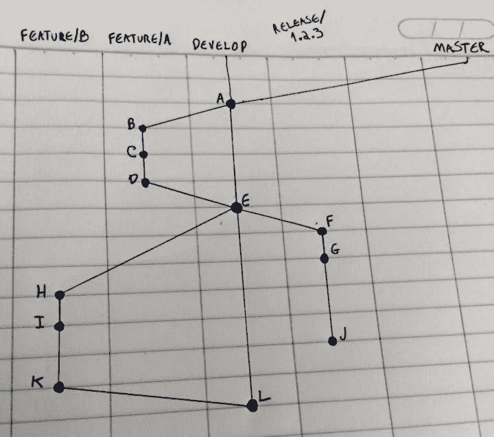
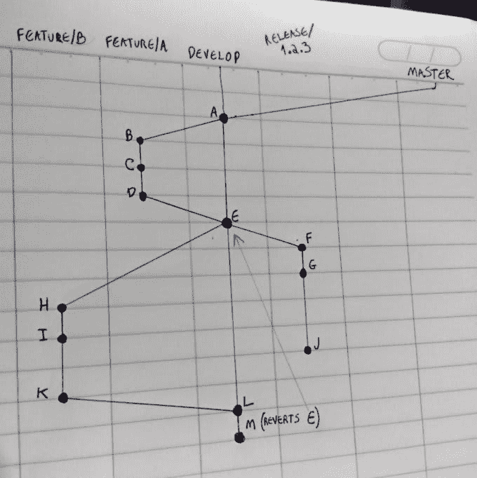
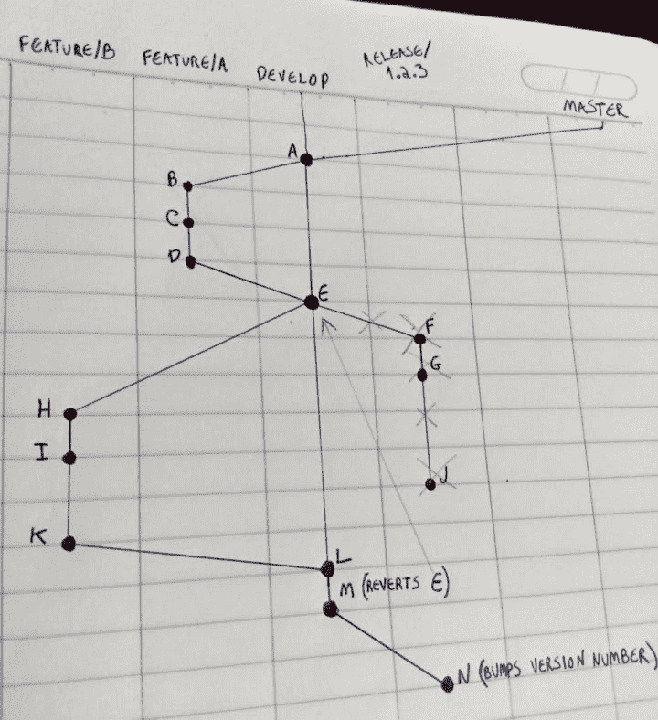
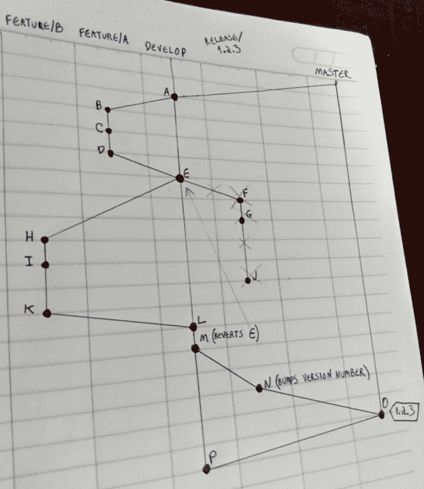
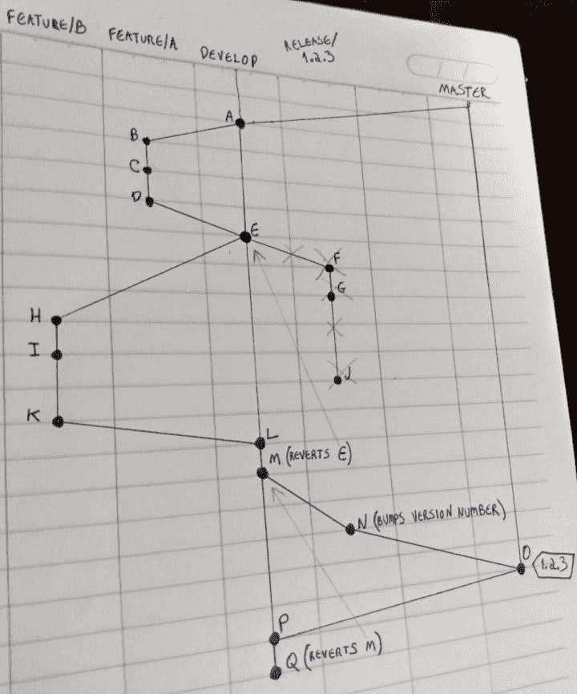

# Git 手术#1

> 原文：<https://dev.to/victorosilva/git-surgery-1-51m0>

## 上下文

在工作中，我们使用文森特·德里森的 [Git 流](https://nvie.com/posts/a-successful-git-branching-model/)分支模型。最近我们发现自己处于以下情况:

*   特写**一个**已经完成并合并成`develop`
*   包含特性**和**的发布`1.2.3`已经开始
*   剧情片 **B** 已经开始*之后*开始上映`1.2.3`
*   发布`1.2.3`分支中的特性 **A** 有一些调整提交
*   特征 **B** 已经完成并合并到`develop`
*   特征 **B** 不依赖于特征 **A** 添加的任何代码。

视觉上，这就是我们所拥有的(每一列代表一个分支；并且每个点代表一个提交，用单个字母代替它的散列):

现在我们只需测试并完成发布`1.2.3`(将其合并到`master`，在合并时创建一个标签`1.2.3`，然后将标签合并到`develop`，以便集成提交`F`、`G`和`J`，并将新创建的标签部署到生产中。然后我们将为特性 **B** (可能是`1.2.4`)创建另一个版本，测试、完成并部署它。

## 问题

出于本帖不相干的原因，我们决定在特辑 **A** 之前 **B** 特辑*应该投入制作。为了不弄乱我们的版本号:*

*   版本`1.2.3`现在应该包含特性 **B** ，但是
    *   *无*特征代码 **A** 提交( *B* 、 *C* 、 *D* 和 *E* )
    *   *无*调整代码提交 *F* 、 *G* 和 *J*
*   “新”版本`1.2.3`应该被测试、完成和部署
*   特性 **A** 及其调整提交应该在新版本(`1.2.4`)中
*   `develop`的提交历史是否应该由**而不是**重写，因为它是一个共享分支，其他特性可能已经基于它启动。

## 解

*注意:为了简单起见，在下面的 Git 命令中，我将使用用于表示图像中每个提交的字母，而不是提交的散列。*

1.  我们注意到了特性的散列值 **A** 调整提交( *F* 、 *G* 和 *J* )
2.  在分支`develop`，[上，我们恢复了将`feature/A`合并到`develop`T5 的提交(合并提交 *E* ，这样与特性 **A** 相关的代码就从`develop`中“移除”了:](https://git-scm.com/book/en/v2/Git-Tools-Advanced-Merging#_reverse_commit)

    *   `<master> $ git checkout develop`
    *   `<develop> $ git revert -m 1 E # creates commit M` 
3.  我们使用`reset --hard`将分支`release/1.2.3`重置为`develop`，这样`release/1.2.3`指向提交 *M*

    *   `<develop> $ git checkout release/1.2.3`
    *   `<release/1.2.3> $ git reset --hard develop`
4.  仍然在`release/1.2.3`上，我们提交了一个修改版本号的请求(Git 流需要的一个修改

    *   `<release/1.2.3> $ echo '1.2.3' > version.txt`
    *   `<release/1.2.3> $ git add version.txt && git commit -m "Bump version number" # creates commit N` 注意，从`reset --hard`开始，提交的 *F* 、 *G* 和 *J* 已经“丢失”。这就是为什么我们一开始就注意到了它们的哈希值——我们稍后会把它们带回来。
5.  在测试发布版`1.2.3`之后，它现在只包含与特性 **B** 相关的代码，我们完成(创建它的标签并将标签合并到`develop`中)并部署它

    *   `<release/1.2.3> $ git checkout master`
    *   `<master> $ git merge --no-ff release/1.2.3 # creates commit O`
    *   `<master> $ git tag -a 1.2.3`
    *   `./fictional-deploy.sh`
    *   `<master> $ git checkout develop`
    *   `<develop> $ git merge --no-ff 1.2.3 # creates commit P` 在这一点上，我们只发布了特性 **B** ，但是现在我们必须带回特性 **A** 的代码，用它创建一个新的发布，并且带回它的调整提交。
6.  在开发时，我们恢复了提交 *M* ，这本身就是一个恢复提交。是的，我们“还原了一个 revert”。

    *   `<develop> $ git revert M # creates commit Q` 在实践中，这将特性 **A** (插入提交 *B* 、 *C* 、 *D* 和 *E* )的代码带回开发。
7.  最后，我们创建了新的版本(`1.2.4`)，并在其中加入了之前对**和**的调整

    *   `<develop> $ git checkout -b release/1.2.4`
    *   `<release/1.2.4> $ git cherry-pick F # creates commit R`
    *   `<release/1.2.4> $ git cherry-pick G # creates commit S`
    *   `<release/1.2.4> $ git cherry-pick J # creates commit T` 

## 结论

使用一些基本的 Git 命令(`reset`、`revert`、`cherry-pick`等)。)我们能够解决我们的问题:

*   仅部署了与功能 **B** 相关的代码
*   特性 **A** 及其调整提交尚未丢失
*   我们没有弄乱我们的版本号
*   分支`develop`的历史没有被改写。

