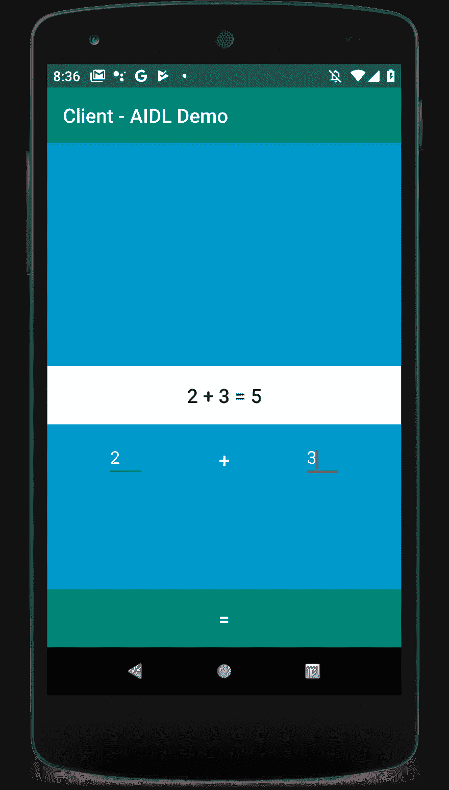

# Android 中的进程间通信——经验和教训

> 原文：<https://dev.to/xuhaibahmad/inter-process-communication-in-android-lessons-learnings-1p6n>

最近，我在 [SodaLabs](https://sodalabs.co/) 接受了为我们的一个产品构建 OTA(空中下载)更新解决方案的任务。对于那些不熟悉这个概念的人，这里有一个由 [TechTarget](https://searchmobilecomputing.techtarget.com/definition/OTA-update-over-the-air-update) 给出的定义:

> 空中更新是将新软件或数据无线传送到移动设备。无线运营商和原始设备制造商(OEM)通常使用空中下载(OTA)更新来部署固件和配置手机，以便在他们的网络上使用。例如，新购买的电话的初始化需要空中更新。随着智能手机、平板电脑和物联网(IoT)设备的兴起，运营商和制造商也转向通过无线更新来为这些设备部署新的操作系统(OS)。

基本上，您收到的 Android、iOS、Windows、Mac 或 Linux 设备的更新是通过称为 OTA 编程的机制分发的。

## 走沙盒路

围绕如何构建这个 OTA 客户端，我们有几个选择，但最终我们决定将其作为一个完全独立的项目来构建。原因是主产品和 OTA 客户端都是同样复杂的解决方案，我们不想通过将 OTA 作为主项目的一部分来增加它的复杂性。

OTA 本质上只是一种服务，作为后台进程运行，并通过 AIDL(即 Android 使用的 IPC 机制)与主应用程序(OTA 应该管理其更新的产品)进行通信。

这是我第一次和 IPC 一起工作。所以毫不奇怪，有很多挫折，通过尝试和错误来学习和修正。

我在这篇文章中的目标是写一些基础知识，并分享一些我的经验，这样你就可以避免我不得不面对的困惑。

## 进程间通信

让我们从理解什么是进程间通信开始。简而言之，进程间通信(IPC)是一种允许多个独立进程进行通信和交换数据的机制。

这种通信通常是通过使用接口描述语言(IDL)定义的一些共享接口来实现的。它所做的基本上是建立一套所有感兴趣的进程都遵循的规则。这些共享接口充当所有各方用来相互通信的公共语言。

## IPC 如何在 Android 中工作

Android 中的所有应用程序都在沙盒环境中运行在自己的进程中。这意味着每个应用程序都是相互独立的。这种隔离有助于提高整个系统的性能，并通过不同级别的许可和访问特权实现更好的安全性。

Android 有自己的 IDL 版本，称为 Android 接口定义语言(AIDL)，它有非常类似 Java 的语法。你基本上是从定义一个接口(或基于你的用例的多个接口)开始，然后在你的应用和希望与我们的应用通信的客户端应用中实现这个接口。

## 了解架构

需要理解的重要一点是，Android 中的 IPC 通信也是基于客户端-服务器的。这意味着一个应用程序必须充当服务器，而其他应用程序可以使用它公开的接口与之交互。

通常，该服务器应用程序是您正在编写的应用程序，并且您希望从外部资源对其进行控制。以下是涉及的组件和步骤:

*   **AIDL 接口:**您在您的服务器应用程序中定义一个接口，该接口包含您想要向客户端公开的 API。
*   **AIDL 接口的实现:**重新构建您的项目将从您的 AIDL 文件中生成一个 java 接口，然后您可以使用它来编写它的具体实现。

*   **向客户端公开接口:**现在，您已经有了 AIDL 接口的具体实现，是时候通过将它绑定到服务来向客户端公开了。外部应用程序可以调用该服务，然后使用通信通道。

*   **通过 IPC 交换数据:**在 Android 上，一个进程不能正常访问另一个进程的内存。也就是说，他们需要将他们的对象分解成操作系统可以理解的原语，并为您跨越边界整理对象。这意味着您只能以最基本的形式通过 IPC 交换原始类型数据。

*   编写可打包的实现:因为在大多数现实世界的应用程序中，你不能只依靠原语。Android 还提供了一种通过 IPC 使用 Parcelables 来交换对象的机制。

这是在应用程序中实现 IPC 功能所需的 5 个主要步骤。然而，不可否认，它们并不简单，而且一定会给你带来很多麻烦。现在让我们来看看实现。

## 关代码

让我们构建一个非常基本的应用程序，让您执行加法。为了演示原语和对象的数据交换，我们将返回一个虚构的`Result`对象，而不是返回一个简单的整数值。

首先创建一个包含两个模块的简单项目，一个作为客户机，另一个作为服务器。你可以在文章末尾找到完整代码的链接。

### AIDL 界面

现在您已经有了一个基本的设置，让我们首先定义我们非常简单的 AIDL 接口，在这个接口中，我们想要公开一个名为`performAddition`的方法，它接受 2 个整数值并返回一个虚构的`Result`对象。

```
// IAddition.aidl
package com.zuhaibahmad.aidldemo;

import com.zuhaibahmad.aidldemo.Result;
// Declare any non-default types here with import statements

interface IAddition {
    Result performAddition(int numOne, int numTwo);
} 
```

正如我上面提到的，因为我们使用了一个自定义对象，我们也需要为它定义一个简单的 AIDL 实现。

```
// Result.aidl
package com.zuhaibahmad.aidldemo;

parcelable Result; 
```

构建项目，如果没有错误发生，那么您应该能够找到您的 AIDL 接口的 java 实现。

> 一旦成功，确保将您的两个 AIDL 文件也复制到客户端项目中。

### 实现 AIDL 接口

下一步是提供 AIDL 接口的具体实现。对于`Result`对象，您所需要的只是它的一个`parcelable` POJO。然而！你需要用传统的 java 方式来写。

我知道你喜欢 Kotlin，并且一定在考虑使用`parcelize`或者至少利用更简单的 Kotlin 代码来实现数据类，但是由于某些原因，基于 Kotlin 的 parcelables 在本文撰写之时并不工作。

[](https://res.cloudinary.com/practicaldev/image/fetch/s--KVbNHmuM--/c_limit%2Cf_auto%2Cfl_progressive%2Cq_66%2Cw_880/https://media.giphy.com/media/26u4cIC1w7AKK9LJ6/giphy.gif%23center)

所以这里是你在*纯* java 风格中对`Result`类的实现:

> 确保将这个类也复制到客户端的源代码中，因为客户端需要它来解释`Result` AIDL 接口。

```
package com.zuhaibahmad.aidldemo;

import android.os.Parcel;
import android.os.Parcelable;

public class Result implements Parcelable {
    private int numOne;
    private int numTwo;
    private int result;

    public Result() {}

    public Result(int numOne, int numTwo, int result) {
        this.numOne = numOne;
        this.numTwo = numTwo;
        this.result = result;
    }

    public int getNumOne() {
        return numOne;
    }

    public void setNumOne(int numOne) {
        this.numOne = numOne;
    }

    public int getNumTwo() {
        return numTwo;
    }

    public void setNumTwo(int numTwo) {
        this.numTwo = numTwo;
    }

    public int getResult() {
        return result;
    }

    public void setResult(int numResult) {
        this.result = numResult;
    }

    @Override
    public String toString() {
        return numOne + " + " + numTwo + " = " + result;
    }

    @Override
    public int describeContents() {
        return 0;
    }

    @Override
    public void writeToParcel(Parcel parcel, int i) {
        parcel.writeInt(numOne);
        parcel.writeInt(numTwo);
        parcel.writeInt(result);
    }

    public static final Parcelable.Creator<Result> CREATOR = new Parcelable.Creator<Result>(){

        @Override
        public Result createFromParcel(Parcel parcel) {
            Result res=new Result();
            res.numOne = parcel.readInt();
            res.numTwo = parcel.readInt();
            res.result = parcel.readInt();
            return res;
        }

        @Override
        public Result[] newArray(int size) {
            return new Result[size];
        }
    };
} 
```

[](https://res.cloudinary.com/practicaldev/image/fetch/s--xADsjeHd--/c_limit%2Cf_auto%2Cfl_progressive%2Cq_66%2Cw_880/https://media.giphy.com/media/84BjZMVEX3aRG/giphy.gif%23center)

不管怎样，现在让我们在服务器应用程序中提供我们的`IAddition` AIDL 接口的实现:

```
package com.zuhaibahmad.aidldemo

import android.app.Service
import android.content.Intent
import android.os.IBinder
import android.util.Log

class AdditionService : Service() {

    override fun onBind(intent: Intent?): IBinder? {
        Log.e("server", "Binding Service")
        return object : IAddition.Stub() {
            override fun performAddition(numOne: Int, numTwo: Int): Result {
                return Result(numOne, numTwo, numOne + numTwo)
            }
        }
    }
} 
```

当我们这样做的时候，让我们也在我们的`manifest`文件中注册这个服务。这样，我们的服务器应用程序就准备好了:

```
<service
    android:name=".AdditionService"
    android:enabled="true"
    android:exported="true" >
    <intent-filter>
        <action android:name="com.zuhaibahmad.aidldemo.AdditionService" />
    </intent-filter>
</service> 
```

### 将服务挂钩到客户端

最后一步是将服务器应用程序中的`AdditionService`绑定到客户端应用程序，并远程启动它。我有一个非常基本的活动，客户端应用程序的用户界面如下:

[](https://res.cloudinary.com/practicaldev/image/fetch/s--HUu_lrKZ--/c_limit%2Cf_auto%2Cfl_progressive%2Cq_auto%2Cw_880/https://zuhaibahmad.com/asseimg/posts/aidl_demo_ui.png%23center)

现在让我们实施活动:

```
package com.zuhaibahmad.aidldemo

import android.content.ComponentName
import android.content.Context
import android.content.Intent
import android.content.ServiceConnection
import android.os.Bundle
import android.os.IBinder
import android.support.v7.app.AppCompatActivity
import android.util.Log
import kotlinx.android.synthetic.main.activity_main.btEquals
import kotlinx.android.synthetic.main.activity_main.etNumOne
import kotlinx.android.synthetic.main.activity_main.etNumTwo
import kotlinx.android.synthetic.main.activity_main.tvResult

class MainActivity : AppCompatActivity(), ServiceConnection {

    private var isBound: Boolean = false
    private var iRemoteService: IAddition? = null

    // Called when the connection with the service is established
    override fun onServiceConnected(className: ComponentName, service: IBinder) {
        // Following the example above for an AIDL interface,
        // this gets an instance of the IRemoteInterface, which we can use to call on the service
        Log.e("client", "Service connected!")
        iRemoteService = IAddition.Stub.asInterface(service)
        isBound = true
    }

    // Called when the connection with the service disconnects unexpectedly
    override fun onServiceDisconnected(className: ComponentName) {
        Log.e("client", "Service disconnected!")
        iRemoteService = null
    }

    override fun onCreate(savedInstanceState: Bundle?) {
        super.onCreate(savedInstanceState)
        setContentView(R.layout.activity_main)

        bindService()

        btEquals.setOnClickListener {
            onPerformAddition()
        }
    }

    private fun onPerformAddition() {
        val numOne = etNumOne.text.toString().toInt()
        val numTwo = etNumTwo.text.toString().toInt()

        tvResult.text = if (isBound) {
            val result = iRemoteService?.performAddition(numOne, numTwo)
            result.toString()
        } else {
            "Service not bound!"
        }
    }

    override fun onDestroy() {
        unbindService()
        super.onDestroy()
    }

    private fun bindService() {
        Log.e("client", "Attempting to bind service")
        val serviceIntent = Intent()
        serviceIntent.setClassName(PACKAGE_NAME, SERVICE_NAME)
        serviceIntent.action = ACTION_REMOTE_BIND
        bindService(serviceIntent, this, Context.BIND_AUTO_CREATE)
    }

    private fun unbindService() {
        if (isBound) {
            // Detach our existing connection.
            unbindService(this)
            isBound = false
        }
    }

    companion object {
        @JvmStatic
        val PACKAGE_NAME: String = "com.zuhaibahmad.aidldemo"

        @JvmStatic
        val SERVICE_NAME: String = "com.zuhaibahmad.aidldemo.AdditionService"

        @JvmStatic
        val ACTION_REMOTE_BIND = "$SERVICE_NAME-remote-bind"
    }
} 
```

如果一切顺利，你应该能够通过服务器应用程序使用 AIDL 接口计算你的加法。

## 要记住的事情

最后，正如您可能已经意识到的那样，这种机制不是很健壮，并且容易出错。因此，这里有一些我在使用 Android 的 IPC 时学到的技巧，关于那些容易出错并让你浪费大量时间的事情。

*   对于你用来触发服务的意图要非常小心，一个小小的打字错误将会导致服务永远不会启动。

*   同样，如果您在开始时遇到无法获得结果的情况，那么在开始调试之前，首先验证您的服务绑定。这可能只是一个错误的服务绑定，会节省你很多努力。

*   请记住，只允许基本类型，所以请始终确保您没有意外地接受或返回非基本对象。

*   最大的痛苦之一是线程，我从来没有意识到线程也会影响 IPC。基本上，从本地进程发出的调用在发出调用的同一个线程中执行。如果这是您的主 UI 线程，该线程将继续在 AIDL 界面中执行。因此，如果使用 RxJava 或任何其他异步机制，就要非常小心。

*   记住，Kotlin 类不适用于 AIDL 的可打包实现。至少在我写这篇文章的时候没有，更糟糕的是它没有给你任何错误。

* * *

## 有用的资源

*   这个由 [DevArea](https://devarea.com/android-services-and-aidl/) 发布的令人敬畏的帖子。
*   [官方安卓资源](https://developer.android.com/guide/components/aidl)上关于安卓中 IPC 的详细指南。
*   还有，这个[中条](https://android.jlelse.eu/android-aidl-937daf89e685)。

* * *

你可以在这里找到这篇文章[的完整源代码](https://github.com/xuhaibahmad/AIDL-Demo)

对于建议和疑问，只需[联系我](http://linkedin.com/in/xuhaibahmad)。