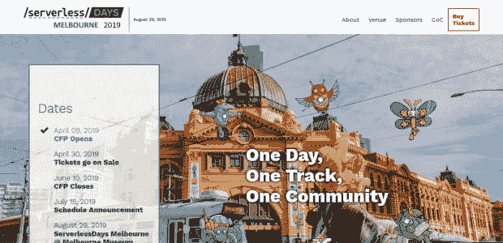

# 网状样条…

> 原文：<https://dev.to/tdwright/reticulating-splines-4mfl>

距离我上一篇帖子已经有一段时间了，所以我想我最好做一个快速的状态检查。我最近在忙什么？到底是什么让我如此忙碌以至于不能写博客？它主要是工作内容和一个大项目的混合。请继续阅读，了解更多关于这两者的信息，以及一些其他的零碎信息，或许还有一些关于未来帖子的预告。

### 工作中的变化

今年 3 月，我被要求在我工作的初创公司开始管理开发团队。

阻止我写更多博文的一个重要原因是，我已经花了很多时间做管理方面的事情:招聘、入职、规划、形成流程……你懂的。这也意味着我已经从有趣的科技事物中退了一点。所以我要写的东西更少了，写作的时间也更少了。

“但是，汤姆，”我听到你说，“当你离开上一份工作(以及上一份工作)时，你说你厌倦了当经理，你只想写代码。”没错。那是我。当我和老板谈论这些变化时，我自己的话在我耳边回响。那我为什么要再做一遍呢？

嗯，首先，我终于在一个我觉得可以发展自己管理风格的组织里了。我可以把我以前在两家公司做经理时学到的东西，应用到一家人才济济的创业公司的沃土上。

另一个因素是更内向的。我现在对自己身份中的“经理”部分感到平静。我想我已经足够成熟，可以坦然承认自己很擅长与人相处。另外，我对事情的过程很满意。

无论如何，我仍然是软件工程师而不是经理，我希望这篇文章的其余部分会证明这一点。

### 墨尔本无服务器日

这是一条大新闻。八月份，我将在墨尔本组织一次“无服务器日”会议。

2019 年墨尔本无服务器日将于 8 月 29 日在墨尔本博物馆举行。CFP 已经开放，我们已经收到了一些优秀的作品。我们已经获得了一些伟大的赞助商，但仍有一些空位(下载[我们的招股说明书](https://www.serverlessdays.me/Prospectus-v3.pdf))。门票随时会开始发售，所以请关注[我们的 Twitter 消息](https://twitter.com/ServerlessMEL)。

### ConTabs 和 dotnet whois

最近，ConTabs 成了我繁忙日程的牺牲品。我们已经非常接近为 v2 发布做好准备，但是只剩下一个[大特性](https://github.com/tdwright/contabs/issues/54)需要解决。

除了 v2，我还有一篇关于迁移到的帖子。Net 标准 2.0。简而言之，这使得依赖性的东西(之前给我带来太多痛苦的东西)更容易加载。

我还启动了一个项目，我称之为`dotnet whois`。这有点像 dotnet CLI 的名片。现在还为时尚早，但是如果你感兴趣的话，看看[Github 回购](https://github.com/tdwright/dotnetwhois)吧。

### 未来的岗位

我将齐心协力写更多的博客。在不太遥远的将来，我希望发表关于…

*   我的面试过程
*   我怎么找不到女人来申请我的工作
*   组织一次会议所涉及的所有材料
*   ConTabs v2(当我最终完成它时)
*   将联系人移动到。网络标准 2.0
*   Dotnet whois 和为什么你们都应该叉它

总之，计划就是这样。敬请期待孩子们。