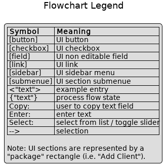
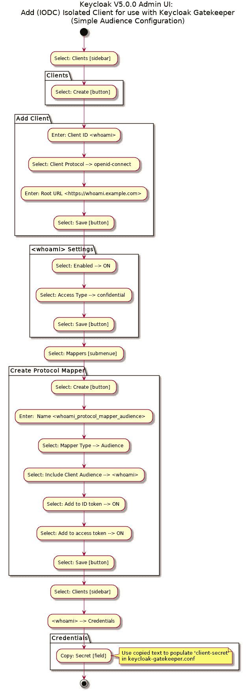
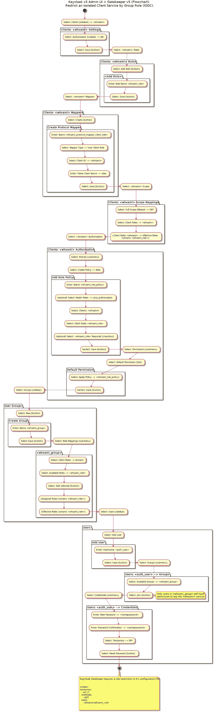

# Keycloak v5 + Gatekeeper v5:流程图-通过组角色轻松创建和限制独立的(IODC)客户端服务

> 原文：<https://dev.to/karlredman/keycloak-v5-gatekeeper-v5-flowcharts-easily-create-and-restrict-an-isolated-iodc-client-service-by-group-role-53h4>

这是我为创建一个家庭/笔记本电脑开发实验室生态系统而写的一系列文章中的另一个工件。我现在分享这些人工制品，因为我正在写的系列至少一个月后才会发布(对我来说，这是一项巨大的事业)。

这些流程图展示了在身份验证/授权代理(Keycloak Gatekeeper)后面创建 Keycloak 客户端服务的最简单形式(IMHO)。我想，如果您正在阅读这篇文章，您可能已经对仅仅在 Keycloak 中创建一个简单的客户端和/或试图找出如何限制授权以便只允许一个组中的特定用户通过 Keycloak 登录感到沮丧。希望这是足够的线索来帮助人们，直到我能够出版整个系列文章。

### 神器详情:

*   Keycloak v5
*   钥匙锁关守 v5
*   原始 PlantUML 源文件+图像文件:[此处](https://github.com/karlredman/Articles/tree/master/content/dev.to/keycloakV5_oidc_client_flowcharts)
*   编辑的原始源:
    *   vim[iam CCO/markdown-preview . nvim :( neo)vim](https://github.com/iamcco/markdown-preview.nvim)的 markdown 预览插件
    *   vs code[plant UML-Visual Studio 扩展](https://marketplace.visualstudio.com/items?itemName=jebbs.plantuml)
*   *注意:*虽然当前(版本 6.0.0)的 Keycloak 文档规定可以在`Keycloak Gatekeeper`中直接使用组，但在版本 5.0.0 中只提供基于角色的授权

### 流程图说明:

*   whoami:正在创建的示例客户端服务
*   auth_user:为登录 whoami 服务而创建的用户
*   whoami_group:映射到客户机角色的用户组，由 Keycloak Gatekeeper 授权
*   [https://whoami . example . com:](https://whoami.example.com:)我们客户端服务的 URL

### 相关文献参考:

*   [安全应用和服务指南](https://www.keycloak.org/docs/latest/securing_apps/index.html#_keycloak_generic_adapter)

