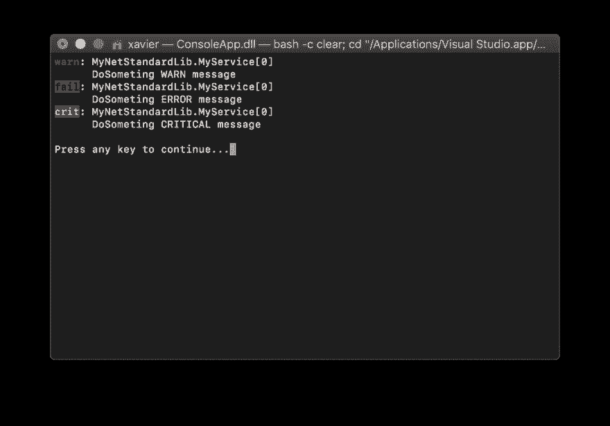
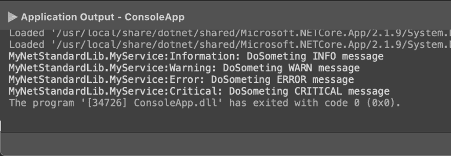

# 登录. Net 核心库

> 原文：<https://dev.to/xfischer/logging-in-a-net-core-library-292m>

## 前言

在这篇文章中，我将尝试解释如何在. Net 核心库中设置日志记录(以及过程中的依赖注入),并设置一个配置监听器和过滤器的应用程序作为示例。

你可以[直接去解](#the-solution)如果你愿意的话。

## 上下文，心灵过程

我的[DEM.Net 项目](https://github.com/dem-net)是一个类库，打算用作任何类型的 NuGet 包。Net 应用(WebAPI，控制台 app，WinForms，其他类库)。

在这个项目的早期开发阶段，作为 Visual Studio 内部的一名开发人员，我使用良好的旧的`Console.WriteLine()`或`Debug.WriteLine()`语句向我提供输出。

然后，当这些类正常时，我需要在特定情况下只写*和*警告。我仍然可以使用

`Console.WriteLine("WARNING: bla bla")`

，但这是丑陋的，我知道你能感觉到。

## 我为什么要登录

> 我通常记录
> 
> *   对于故障排除:任务的进度、遇到的情况、内存结构的转储:如果我需要知道什么在运行以及为什么运行，这些都是有用的。
> *   让消费代码对他们的需求过程有一个基本的了解。任何可以防止“黑盒”效应的事情:等待没有反馈的事情完成。
> *   在不同的级别(跟踪、调试、信息、警告、错误、关键) :区分什么是重要的，什么是内部的或关键的，这一点非常重要。
> *   使用*类别*，允许对消息进行逻辑分组。

经验法则是:阅读日志，你应该确切地知道代码内部发生了什么。

所以我为不同类型的日志构建了一个定制的包装器。

```
using System.Diagnostics;

public static class Logger
{
  public static void Info(string message)
  {
    Trace.TraceInformation(message);
  }
  // ... plus other methods for each log lvel
} 
```

我可以用一行代码发出日志，并且我知道当我找到干净日志的解决方案时，我可以毫不费力地进行迁移。

```
Logger.Info($"Processing file {fileName}..."); 
```

## 问题

*   使用`System.Diagnostics.Trace`，库消费者被约束监听跟踪，并且以这种方式编码，没有类别使他们能够过滤掉那些跟踪日志。-根据用户日志记录系统，他们可能需要重定向我的跟踪输出。这要求太多了，他们可能永远不会那样做。-我需要启用日志记录**，而不实际记录任何地方**。使用者可以选择跟踪的位置，控制台、跟踪、数据库、事件日志、文件，...-我需要找到一个可靠的解决方案，那里没有自定义的手工编码类，我想成为 pro。

## 解

### `ILogger<T>`界面

这个接口驻留在 NuGet 包`Microsoft.Extensions.Logging.Abstractions`中，它是[ASP.Net 扩展目录](https://github.com/aspnet/Extensions)的一部分。

> 。NET APIs，用于常用的编程模式和实用程序，如依赖注入、日志记录和配置。

这绝不仅仅是 ASP.Net 的问题。我们可以在图书馆使用它！

这个接口很简单，允许在没有具体实现的情况下进行日志调用。不要深入内部，这是为了方便使用。请记住，通用类型 T 是记录日志的服务的类型。记住 T 是 T*YourService*。

让我们来设置:

*   服务简单的图书馆。我们希望这个服务记录它的活动。
*   引用库并调用服务的控制台应用程序。

### 1。起点:一个类库，里面有你的`MyService`

创建一个新的类库项目`MyNetStandardLib`定位。Net 标准 2.0。

您的服务接受一个参数，并模拟一个 1 秒钟的长处理任务。

```
using System;
using System.Threading;

namespace MyNetStandardLib
{
    public class MyService
    {
        public void DoSomething(string theParam)
        {
            // Simulate something we do for 1 second
            Thread.Sleep(1000);

            // done
        }
    }
} 
```

### 2。添加软件包 Microsoft。扩展.日志.抽象

你可以通过右击你的项目并选择 *Add NuGet Packages 来完成...*或通过 dotNet CLI:

```
nuget add Microsoft.Extensions.Logging.Abstractions 
```

### 3。添加对`ÌLogger<TYourService>`的支持

按如下方式更改服务类别:

*   添加一个采用`ILogger<MyService>`的构造函数
*   为记录器添加支持字段

```
public class MyService
{
    // backing field
    private readonly ILogger<MyService> _logger;

    // constructor
    public MyService(ILogger<MyService> logger = null)
    {
        _logger = logger;
    }

    public void DoSomething(string theParam)
    {
        _logger?.LogInformation($"DoSometing with {theParam}...");

        // Simultate something me do for 1 second
        Thread.Sleep(1000);

        // Test logs at each level
        _logger?.LogTrace("DoSometing TRACE message");
        _logger?.LogDebug("DoSometing DEBUG message");
        _logger?.LogInformation("DoSometing INFO message");
        _logger?.LogWarning("DoSometing WARN message");
        _logger?.LogError("DoSometing ERROR message");
        _logger?.LogCritical("DoSometing CRITICAL message");
    }
} 
```

至此，除了新的*微软。extensions . logging . abstracts*dependency，从调用者的角度来看，什么都没有改变。

*   如果一个程序正在调用`MyService`，它在重新编译后仍然可以这样做，因为`ILogger`是可选的。
*   如果`ÌLogger`通过了`null`，由于空校验操作符`_logger` **，服务仍然工作？** `.LogInformation()`相当于:

```
if (_logger != null)  _logger.LogInformation(...); 
```

请注意，如果您要从已经有带参数的构造函数的代码中迁移现有服务，则可以将可选的 ILogger 作为最后一个参数传递。

作为参数传递的 ILogger 非常适合依赖注入。通过依赖注入，我们可以在调用者端注册记录器的具体实现。让我们开始吧。净道！

### 4。调用程序应用程序，使用依赖注入

所以，现在我们有了一个正在记录日志的类库。如何连接电线？

ASP.Net 核心已经有阿迪集装箱，可以直接打电话给我们的图书馆。但是这已经有了很好的记录，超出了本文的范围。

我们将创建一个简单的控制台应用程序。遵循这些步骤，以便设置依赖注入和日志记录:

*   创建新的控制台应用程序，
*   添加一个项目引用到`MyNetStandardLib`，
*   添加一个 NuGet 包`Microsoft.Extensions.DependencyInjection`。这是微软的 DI 容器。还有很多其他的(AutoFac、StructureMap、Ninject 等等)，但是我将坚持使用。Net 基础堆栈。

所以让我们把`Program.cs`文件从这个:

```
namespace TestConsole
{
    class Program
    {
        static void Main(string[] args)
        {
            Console.WriteLine("Hello World!");
        }
    }
} 
```

到那:

```
using Microsoft.Extensions.DependencyInjection;
using System;

namespace TestConsole
{
    // Program with Dependency Injection
    // Still no logging support!
    class Program
    {
        static void Main(string[] args)
        {
            // Setting up dependency injection
            var serviceCollection = new ServiceCollection();
            ConfigureServices(serviceCollection);
            var serviceProvider = serviceCollection.BuildServiceProvider();

            // Get an instance of the service
            var myService = serviceProvider.GetService<MyNetStandardLib.MyService>();

            // Call the service (logs are made here)
            myService.DoSomething();

            Console.ReadLine();
        }

        private static void ConfigureServices(ServiceCollection services)
        {
            // Register service from the library
            services.AddTransient<MyNetStandardLib.MyService>();
        }
    }
} 
```

我们来解释一下:

*   为了清楚起见，我们创建了 DI 容器`ServicesCollection`并在一个单独的方法中配置它。
*   我们将我们的`MyService`注册为一个瞬态(即:调用代码变量范围内的短期实例)
*   当我们调用`var myService = serviceProvider.GetService<MyNetStandardLib.MyService>();`时，DI 容器将实例化`MyService`并将检查对象的依赖树，并传递在容器中注册的所需实例。由于我们还没有注册任何`ILogger`，一个`null`将被通过。
*   我们可以像往常一样使用`myService`变量，调用`DoSomething`服务

### 5。添加日志记录支持

我们将添加**控制台**和**调试**记录器。对于一个控制台应用程序，这将是有用的，因为我们将在控制台和*输出>调试*窗口中看到日志。

添加以下 NuGet 包:

*   `Microsoft.Extensions.Logging`
*   `Microsoft.Extensions.Logging.Console`
*   `Microsoft.Extensions.Logging.Debug`

在`Program.cs`
的顶部添加以下`using`语句

```
using Microsoft.Extensions.Logging;
using Microsoft.Extensions.Logging.Console;
using Microsoft.Extensions.Logging.Debug; 
```

将`ConfigureServices`方法更改如下:

```
private static void ConfigureServices(ServiceCollection services)
{
    services.AddLogging(config =>
    {
        config.AddDebug(); // Log to debug (debug window in Visual Studio or any debugger attached)
        config.AddConsole(); // Log to console (colored !)
    })
    .Configure<LoggerFilterOptions>(options =>
    {
        options.AddFilter<DebugLoggerProvider>(null /* category*/ , LogLevel.Information /* min level */);
        options.AddFilter<ConsoleLoggerProvider>(null  /* category*/ , LogLevel.Warning /* min level */);
    })
    .AddTransient<MyNetStandardLib.MyService>(); // Register service from the library
} 
```

非常，**非常**整齐有力。我们来解释一下:

*   `services.AddLogging`允许我们将*各种*记录器添加到 DI 容器中，并配置它们的选项。这里我们用`AddConsole()`和`AddDebug()`注册*控制台*和*调试*记录器:两个扩展方法由各自的 NuGet 包提供。
*   然后，我们配置(可选)他们的过滤级别。
    *   第一个参数是类别:没有很好地记录，它充当了`ILogger<T>`的类型名称`T`上的 *StartsWith* 或 *Contains* 过滤器，允许过滤我们想要收听或静音的日志。
    *   第二个参数取一个`LogLevel`，只允许在 log 有一个大于或等于指定参数的下限时监听。

该配置也可以通过[配置文件](https://docs.microsoft.com/fr-fr/aspnet/core/fundamentals/configuration/options?view=aspnetcore-2.2)进行。
现在，每次需要一个`ILogger<T>`时，就像在我们的`MyService`构造函数中一样，一个实例将被注入，这个实例将记录到注册的目的地。

### 6。试运转

控制台应用程序启动后，这是我们在控制台窗口中看到的内容。请注意，按照配置，只写入警告、错误和严重日志:

[](https://res.cloudinary.com/practicaldev/image/fetch/s--a_ZgjSDu--/c_limit%2Cf_auto%2Cfl_progressive%2Cq_auto%2Cw_880/https://thepracticaldev.s3.amazonaws.com/i/heliirdv9yg7nrttd45r.png)

这是我们在调试窗口中看到的内容，请注意，还会按照配置写入信息级别:

[](https://res.cloudinary.com/practicaldev/image/fetch/s--dwOHJCeH--/c_limit%2Cf_auto%2Cfl_progressive%2Cq_auto%2Cw_880/https://thepracticaldev.s3.amazonaws.com/i/ysfs05i359jaji0gngc6.png)

## 结论

我们已经看到了依赖注入是多么强大，以及我们如何在不约束调用应用程序的情况下构建一个支持日志记录的库。

你可以在这里找到这个项目的所有源文件(在 VS2019 上测试，Windows 和 Mac 都有):[https://github.com/xfischer/CoreLoggingTests](https://github.com/xfischer/CoreLoggingTests)。

## 来源

那些文章对我帮助很大，引用一下也不错:

*   官方 MS doc:[ASP.NET 岩心测井](https://docs.microsoft.com/aspnet/core/fundamentals/logging)
*   [记录和监控。NET/C#](https://microsoft.github.io/code-with-engineering-playbook/Engineering/DevOpsLoggingDetailsCSharp.html)