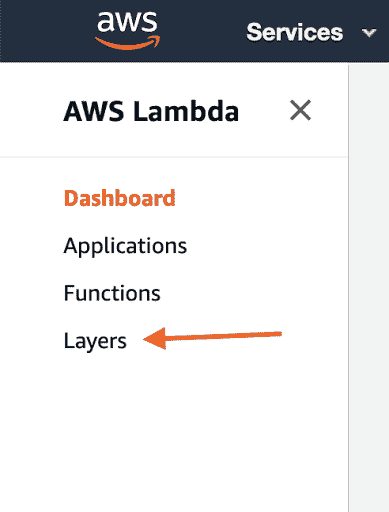
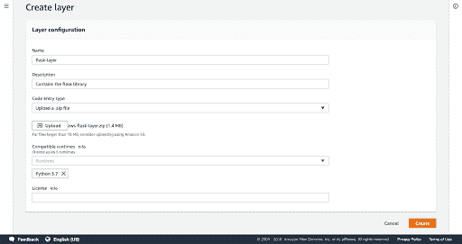
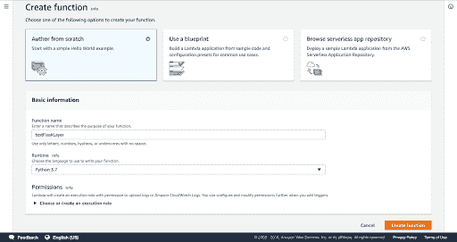
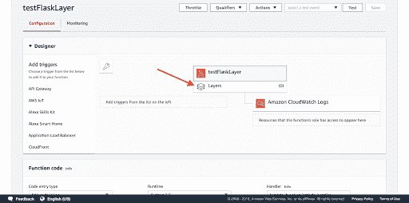
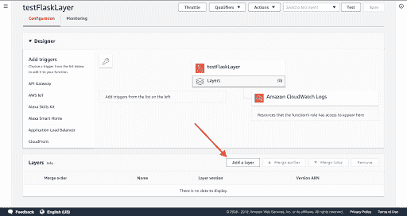
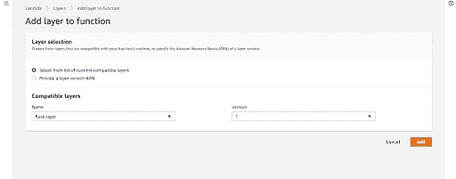

# AWS Lambda 层入门

> 原文：<https://dev.to/matthewvielkind/getting-started-with-aws-lambda-layers-4ipk>

一旦你开始使用 Lambda 函数，总有一天你不得不在函数中包含一个外部库。现成的 Lambda 函数只支持有限数量的库及其运行时。为了让您的函数访问这些外部依赖项，您必须将它们包含在您的[部署包](https://docs.aws.amazon.com/lambda/latest/dg/lambda-python-how-to-create-deployment-package.html#python-package-dependencies)中。每次部署 Lambda 函数时，确保在部署包中包含外部依赖是工作流的一部分。在部署 Lambda 函数的这一步中，我发现自己在想，“一定有更好的方法”。现在有了！随着 AWS Lambda 层的引入，您不再需要将外部依赖项与部署包捆绑在一起。层允许你跨 Lambda 函数管理和共享你的外部依赖。在这篇文章中，我将，

1.  解释什么是层及其优点
2.  演练如何在 Lambda 函数中创建和使用层
3.  提供一些最佳实践和技巧

尽管这篇文章主要关注 Python，但是许多核心课程也可以扩展到 AWS 支持的其他语言。在开始之前，快速免责声明。AWS Lambda 函数有许多内置的细微差别和限制。虽然分层是有帮助的，但它们不是灵丹妙药。请花点时间阅读关于最佳实践的最后一部分。与任何工具一样，如果使用不当，它将变得毫无用处，因此花一两分钟了解其局限性可以避免您以后的头痛和沮丧。

## 介绍 AWS 图层

那么，这些层是什么，它们有什么用呢？一个 [AWS Lambda 层](https://docs.aws.amazon.com/lambda/latest/dg/configuration-layers.html)包含额外的代码、库和依赖项，它们被加载以在运行时支持 Lambda 函数。层消除了在您的部署包中为您创建的每个 Lambda 函数打包外部依赖项的需要。层是 Lambda 函数所需的所有外部依赖项的包。在运行时，层中指定的依赖项被加载并可用于 Lambda 函数。层也不特定于单个 Lambda 函数。一旦你创建了一个层，你就可以使用这个层来支持多个不同的 Lambda 函数。没有必要为每个 Lambda 函数重新创建一个层。每个 Lambda 函数可以支持多达 5 个不同的层，提供了混合和匹配不同层的灵活性。

层还支持版本控制，使它们更易于管理。当与其他人协作时，更容易有一个可以引用的 Lambda 依赖关系的集中位置，而不是每个人在部署时构建他们自己的依赖关系，其中存在软件包版本可能变得不同步和潜在不兼容的风险。有了一点什么层的背景，让我们创建一个我们自己的！

## 创建 AWS 层

现在你已经知道什么是层以及为什么你可能想要使用它，让我们创建一个。对于这个初始示例，我们将创建一个层，使`flask`框架可用于我们的 Lambda 函数。构建一个层有三个一般步骤，

1.  使用该层的所有依赖项构建 zip 文件
2.  将 zip 文件上传到 AWS 中的图层
3.  将层与 Lambda 函数相关联

让我们开始为我们的层创建部署包。

#### 构建代码包

我们的层的部署包是一个 zip 文件，包含了我们想要包含在层中的所有代码。这个过程非常类似于如何将依赖项合并到 Lambda 部署包中，但是不同的是对于层，您只需执行一次这个过程，而不是每次部署。这里的代码可以是定制代码或任何其他外部 Python 包本身(注意，我在这里使用 Python，但是层支持所有不同类型的运行时)。在这个介绍中，我们将保持我们的部署简单，并将创建一个层，使`flask`库对我们的 Lambda 可用。我们需要做的是将`flask`安装到一个目录中，然后创建该目录的 zip 存档。在为一个层构建代码包时，一个[需求](https://docs.aws.amazon.com/lambda/latest/dg/configuration-layers.html#configuration-layers-path)是我们的代码必须嵌套在一个 Lambda 运行时支持的文件夹中。在我们的例子中，我们将使用 Python，所以`flask`代码必须在名为`python`的子目录中嵌套的 zip 文件中。我们可以从终端完成所有这些工作。

首先，在终端中，让我们为我们的项目创建一个目录，我们将其命名为`flask-layer`，并将一个`python`文件夹作为子目录。

```
mkdir -p flask-layer/python 
```

接下来，将`flask`包安装到`flask-layer/python`目录下，

```
pip3 install flask -t flask-layer/python 
```

最后，将`flask-layer`的内容压缩到一个 zip 存档文件中。

```
cd flask-layer
zip -r aws-flask-layer.zip python 
```

### 在 AWS 中创建图层

接下来，我们可以将代码上传到 AWS。在 AWS 控制台中，转到 Lambda 服务页面。在左侧菜单中选择“层”。
[](https://res.cloudinary.com/practicaldev/image/fetch/s--nZRvkddv--/c_limit%2Cf_auto%2Cfl_progressive%2Cq_auto%2Cw_880/https://lh3.googleusercontent.com/Bxt04Q1nZityJgAoQofGyEGtRZLVEU4rEImcg0G3ggboxQ5lioCupS9perg4nrug431WZ-sDfMzK) 
在下一页右上角点击【创建图层】。现在我们将定义我们的层。我用一个简短的描述命名了这个层`flask-layer`。我们需要输入的下一条信息是“代码输入类型”。请注意下拉列表下方的警告。在本例中，我们的代码包远小于 10MB 的限制，因此我们将选择“上传. zip 文件”选项，然后单击“上传”按钮，并选择您在上面创建的`aws-flask-layer.zip`文件。如果你的。zip 文件是 10MB，您需要将文件上传到 S3，然后提供文件在 S3 的路径。最后，我们需要将我们的层与运行时相关联。在这个例子中，我们将使用 Python 3.7 运行时，但是您可以将一个层与多达 5 个不同的运行时相关联。当你完成后，你的页面应该看起来像这样，点击右下角的
[](https://res.cloudinary.com/practicaldev/image/fetch/s--470OjohB--/c_limit%2Cf_auto%2Cfl_progressive%2Cq_auto%2Cw_880/https://lh3.googleusercontent.com/Yfy9rUqTP6c-NrlKmPmnJSDe2nOGO7hXf4YVkDzsI9Q8036ebnvAVGE62mFliFB4VALUouRMLBVI) 
“创建图层”。现在我们已经创建了层，让我们把它使用。

### 在λ函数中使用我们的图层

回到 Lambda 仪表盘，点击右上角的“创建函数”。我们的函数将被命名为`testFlaskLayer`。我们将使用 Python 3.7 运行时来匹配我们为我们的层选择的运行时。如果您选择的运行时不同于您为图层选择的运行时，则您将无法通过函数访问图层。如果您有 Lambda 权限，请选择一个现有角色，或者允许 AWS 为您创建一个角色，然后单击底部的“创建函数”。
[](https://res.cloudinary.com/practicaldev/image/fetch/s--WatssWdi--/c_limit%2Cf_auto%2Cfl_progressive%2Cq_auto%2Cw_880/https://lh3.googleusercontent.com/G_zZfM0GwNhpq-r3zithCzyMlT3BQ5Vwi7-uTk0nogBz3mKFRSx3FqxkdII0dAfCquVe8otDReM-) 
在下一页中，我们需要用 Lambda 函数连接我们创建的图层。在页面中间写着“testFlaskLayer”的方框下面，点击下面的“Layers”方框。
[](https://res.cloudinary.com/practicaldev/image/fetch/s--olezzeZy--/c_limit%2Cf_auto%2Cfl_progressive%2Cq_auto%2Cw_880/https://lh3.googleusercontent.com/i0u-bEtTjL0KylYoWkiyxNDIFR41gxf01wxXMtLTcwnhsJ4lR7KRZrc2CXr0XQvjaSRZtSyCYlwz) 
向下滚动页面，点击“添加图层”按钮。
[](https://res.cloudinary.com/practicaldev/image/fetch/s--aJQNwusV--/c_limit%2Cf_auto%2Cfl_progressive%2Cq_auto%2Cw_880/https://lh3.googleusercontent.com/q5brHmnIR4mYcQcZh5ur8aJ-91diuX_mEdr-OJR4gRz-bZCoOZBqj6cFD6yKoFyygtIbMCXs_TQh) 
从下拉列表中选择`flask-layer`，然后指定我们正在使用的图层版本 1，然后点击【添加】。
[](https://res.cloudinary.com/practicaldev/image/fetch/s--4pSaQM_H--/c_limit%2Cf_auto%2Cfl_progressive%2Cq_auto%2Cw_880/https://lh3.googleusercontent.com/EbxID-crHlPrDYgbbaNBb2d-87r1UTZqjSdHeFYNUxpGwDXK7kgb8xdqBYesDa8R1-Wwlf4BmfNY) 
回到 Lambda 设计器点击【保存】。现在我们的 Lambda 函数可以访问`flask`包了！为了确认这一点，我们来做一个快速测试。

在设计器中，向下滚动到内嵌编辑器，然后粘贴以下代码。我们所做的就是证明我们能够加载`flask`库，因为我们添加了层，我们将只输出我们正在使用的`flask`的版本。

```
import json
import flask

def lambda_handler(event, context):
    return {
        'statusCode': 200,
        'body': json.dumps(flask.__version__)
    } 
```

保存 Lambda 函数。现在滚动到顶部，运行“Hello World”测试。使用您在输出主体中使用的版本`flask`应该会得到一个成功的结果。如果你回到你的层，从你的 Lambda 中删除`flask-layer`，保存函数，然后重新运行测试，你会得到一个失败。通过移除该层，Lambda 函数不再能够访问`flask`库。在这种情况下，当 Lambda 试图导入`flask`库时，将会抛出一个错误。

如果你有其他需要访问`flask`的 Lambda 函数，你所要做的就是将`flask-layer`添加到 Lambda 函数中，你就万事俱备了！

## 最佳实践和其他提示

为了最大限度地利用各层，要严格定义组成任何一层的代码。当您开始跨功能共享层时，具有窄定义的层限制了您包含未使用的依赖项的风险。Lambda 中的依赖性膨胀在额外的执行成本、时间和性能方面有实际成本。严格定义图层有助于避免这些成本。您想要更小的层的另一个原因是因为层不是 Lambda 部署包大小的变通办法。我承认，当我开始使用图层时，有一瞬间我以为图层可以绕过这些限制，但事实并非如此。Lambda 中包含的层将计入 Lambda 功能的部署大小，从而有助于 Lambda 功能的部署包大小的[硬限制](https://docs.aws.amazon.com/lambda/latest/dg/limits.html)。由于这些大小限制，保持您的层较小可以让您充分利用您的部署包，而不会在您不需要的依赖项上浪费空间。

为了确保你的 Lambda 函数拥有所有需要的依赖关系，你需要堆叠你的层。Lambda 函数允许您包含多达 5 个独特的层。堆叠层允许您混合和匹配您已创建的各个层，以便为您的功能创建一组自定义的依赖项。

最后，还有一个关于创建图层的注意事项。您在图层 zip 文件中包含的任何代码都必须与 AWS 兼容。如[中所述，本次](https://aws.amazon.com/premiumsupport/knowledge-center/lambda-python-package-compatible/)发布的一些 python 包(即`numpy`)包含与 AWS 不兼容的编译代码。这些实例的解决方法是用预编译的。whl 文件而不是使用`pip install`。在`numpy`和`scipy`的例子中，亚马逊创建了一个[公共层](https://aws.amazon.com/blogs/aws/new-for-aws-lambda-use-any-programming-language-and-share-common-components/)任何你可以合并到你的代码中的人。

## 包装完毕

层是帮助管理 AWS Lambda 函数的外部依赖性的工具。它们为跨 Lambda 函数共享依赖关系提供了一个系统化的解决方案，消除了将这些依赖关系打包到每个部署中的需要，因此您可以专注于 Lambda 函数本身的代码。分层确实有其局限性，所以这里有一些要点，

*   层管理 Lambda 函数的外部依赖性
*   层可以跨 Lambda 函数共享
*   保持层较小，并利用在函数中堆叠层的能力。较小的层更容易确保一个函数只具有执行其任务所需的依赖关系。
*   层仍然受到代码部署大小的 Lambda 限制。它们不是那些硬性限制的变通办法。
*   依赖关系必须与 AWS 环境兼容，这意味着您可能不能仅仅`pip install`某些包。

我希望你发现这个层的介绍有用！我刚刚开始做这件事，所以如果有什么不清楚或者你有进一步的问题，请让我知道！