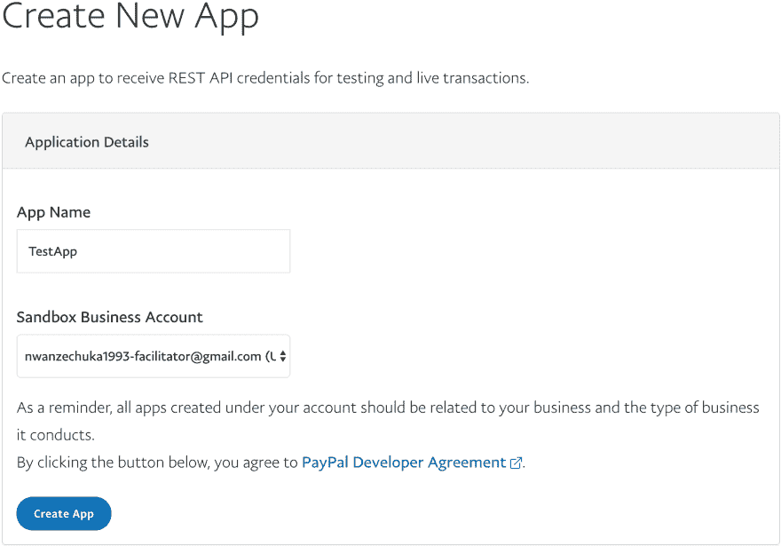

# React Native WebView 中的 Paypal

> 原文：<https://dev.to/franko4don/paypal-in-react-native-4emd>

React native 是最流行、使用最广泛的 Javascript 跨平台移动开发框架之一。它是基于 ReactJS 的，因此对于已经擅长 ReactJS 的开发人员来说很容易钻研它。想了解更多关于 React Native 的信息，请点击这里。

过程
我最近在做一个需要集成 Paypal 的项目，但找不到稳定的开源 React 原生模块，所以我想出了一个基于 WebView 的实现。

实施前要完成的步骤

*   如果您还没有 Paypal 帐户，请创建一个
*   登录开发者并创建一个沙盒帐户
*   使用现有的沙盒帐户创建应用程序，并获取客户端 ID

设置反应原生零件

在这一点上，假设你的应用程序的大部分工作，也许你需要支付部分来完成流程。由于我们正在使用 WebView，我们将设计一个 HTML 文件来适应我们的应用程序用户界面和一个与 WebView 来回通信的组件。

`PayPal.js`