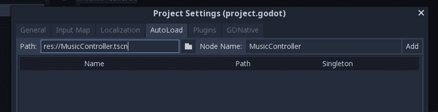
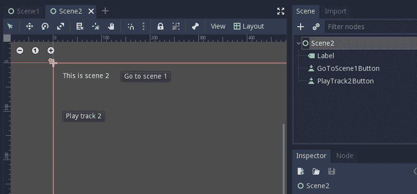
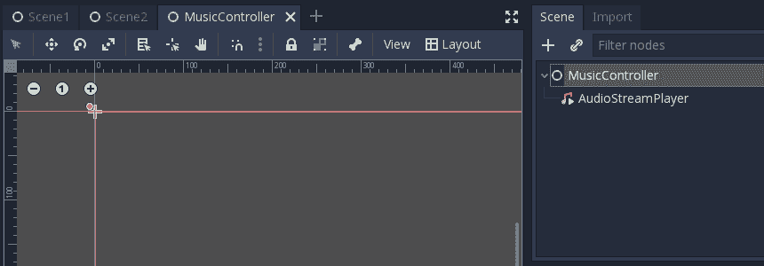
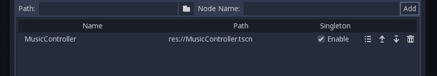

# 在 Godot 中制作背景音乐播放器

> 原文：<https://dev.to/woubuc/a-background-music-player-in-godot-h6e>

这是我的第一篇博客。如果你注意到任何不寻常的东西(样式，结构，内容，任何东西)，让我知道，这样我可以修复它，并为我的下一篇帖子学习！

有多种方法来播放和管理游戏中的音乐，但大多数都与你的场景有关。在本教程中，我们将制作一个自动加载音乐管理器，允许你播放独立于游戏场景的背景音乐。

## 我们需要什么

### 戈多 3.1

你可以用另一个版本的 Godot，但是这个教程是用 Godot 3.1 写的。

在[godotengine.org](https://godotengine.org)下载 Godot

### 音乐

因为我们正在制作一个音乐播放器，你需要两条音乐轨道。戈多支持。wav 和。ogg 格式，但是他们推荐使用[。ogg 用于背景音乐](https://docs.godotengine.org/en/3.1/getting_started/workflow/assets/importing_audio_samples.html)因为它比. wav 占用的磁盘空间少很多。

如果没有音乐，可以在的 [incompetech](https://incompetech.com/music/royalty-free/music.html) 找到一些好听的免费曲目。

## 自动加载

我们将使用 Godot 中的**自动加载**特性。这让我们可以将静态节点添加到场景树中，这些节点将一直存在，独立于我们的游戏场景。

这是保持我们的音乐播放的完美方式，即使我们改变了场景。

如果你想了解更多关于自动加载的知识，你可以[查阅 Godot 文档](https://docs.godotengine.org/en/3.1/getting_started/step_by_step/singletons_autoload.html)。

## 入门

我们的项目将包括 3 个场景:**场景 1** 和**场景 2** 将是我们的常规游戏场景，我们将为它们添加一些按钮来管理音乐。

音乐控制器将会是我们特别的自动加载场景。我们将在这个场景中添加一些自定义功能，这样我们就可以在游戏中的任何地方轻松播放音乐。

### 场景 1

创建一个新场景，命名为`Scene1`。然后添加 **1 个标签和 3 个按钮**，如下图所示。

[](https://res.cloudinary.com/practicaldev/image/fetch/s---6vA9yzg--/c_limit%2Cf_auto%2Cfl_progressive%2Cq_auto%2Cw_880/https://thepracticaldev.s3.amazonaws.com/i/pvx7uxyhle7fiqfwzmwv.png)

给场景的根节点添加一个脚本，将三个按钮的`pressed()`事件连接到它上面。

```
# Scene1.gd

extends Control

func _on_GoToScene2Button_pressed():
    get_tree().change_scene("res://Scene2.tscn")

func _on_PlayTrack1Button_pressed():
    pass # Replace with function body.

func _on_StopMusicButton_pressed():
    pass # Replace with function body. 
```

Enter fullscreen mode Exit fullscreen mode

### 场景二

现在再做一个场景，叫`Scene2`。添加 **1 个标签和 2 个按钮**。

[](https://res.cloudinary.com/practicaldev/image/fetch/s--YAP5SRKU--/c_limit%2Cf_auto%2Cfl_progressive%2Cq_auto%2Cw_880/https://thepracticaldev.s3.amazonaws.com/i/p2p9yvg98ylvd5xl7tjh.png)

接下来，向场景的根节点添加一个脚本，并将两个按钮的`pressed()`事件连接到它。

```
# Scene2.gd

extends Control

func _on_GoToScene1Button_pressed():
    get_tree().change_scene("res://Scene1.tscn")

func _on_PlayTrack2Button_pressed():
    pass # Replace with function body. 
```

Enter fullscreen mode Exit fullscreen mode

## 音乐控制器

现在是时候创建我们的音乐控制器场景了。

创建一个新场景，命名为`MusicController`。添加 **1 AudioStreamPlayer** 来播放我们的音乐。

[](https://res.cloudinary.com/practicaldev/image/fetch/s--YEjW9jwI--/c_limit%2Cf_auto%2Cfl_progressive%2Cq_auto%2Cw_880/https://thepracticaldev.s3.amazonaws.com/i/j5jffl3bbxus431f0xu7.png)

向场景的根节点添加一个脚本，并向其中添加以下代码:

```
# MusicController.gd

extends Control

# Load the music player node
onready var _player = $AudioStreamPlayer

# Calling this function will load the given track, and play it
func play(track_url : String):
    pass

# Calling this function will stop the music
func stop():
    pass 
```

Enter fullscreen mode Exit fullscreen mode

如你所见，我们定义了两个函数:`play()`和`stop()`。我们将使用这些来播放和停止游戏场景中的音乐。

**旁注:**想知道那个`track_url : String`语法是什么？这是 Godot 3.1 中的一个新功能，叫做[可选打字](https://godotengine.org/article/optional-typing-gdscript)。这意味着我们希望函数参数是一个字符串，如果我们用非字符串调用函数，编辑器会警告我们。

### 停止()

让我们从最容易实现的函数开始。`stop()`函数只需要停止音乐——因此得名。

查看[文档](https://docs.godotengine.org/en/3.1/classes/class_audiostreamplayer.html#class-audiostreamplayer-method-stop)，我们可以看到 AudioStreamPlayer 有一个`stop()`方法，所以我们需要做的就是调用那个方法。

```
func stop():
    _player.stop() 
```

Enter fullscreen mode Exit fullscreen mode

### 播放()

这个有点复杂。当调用`play()`函数时，我们需要做 3 件事:

1.  停止上一首曲目
2.  从`track_url`功能参数加载新轨道
3.  开始播放新曲目。

幸运的是，用 GDScript 做这些事情并不困难。

#### 停止

为了停止，前面的轨道，我们简单地调用我们自己的`stop()`方法。

```
stop() 
```

Enter fullscreen mode Exit fullscreen mode

#### 加载

接下来，我们需要加载新的轨道。GDScript 通过`load()`函数使这变得非常容易。

```
var new_track = load(track_url) 
```

Enter fullscreen mode Exit fullscreen mode

#### 更新

现在我们必须更新播放器，告诉它使用我们刚刚加载的曲目。

回到[文档](https://docs.godotengine.org/en/3.1/classes/class_audiostreamplayer.html#class-audiostreamplayer-property-stream)，我们可以看到 AudioStreamPlayer 有一个我们可以设置的属性`stream`。

```
_player.stream = new_track 
```

Enter fullscreen mode Exit fullscreen mode

#### 播放

现在我们要做的就是开始比赛。

```
_player.play() 
```

Enter fullscreen mode Exit fullscreen mode

#### 一切都在一起

我们的 MusicController 脚本现在看起来是这样的:

```
# MusicController.gd

extends Control

# Load the music player node
onready var _player = $AudioStreamPlayer

# Calling this function will load the given track, and play it
func play(track_url : String):
    var track = load(track_url)
    _player.stream = track
    _player.play()

# Calling this function will stop the music
func stop():
    _player.stop() 
```

Enter fullscreen mode Exit fullscreen mode

## 设置自动加载

我们需要做的最后一件事是告诉 Godot 实际加载我们的自动加载场景。

进入`Project`菜单并打开`Project Settings`。然后点击`AutoLoad`标签。这是我们可以配置自动加载脚本的地方。

自动加载脚本总是有一个指向应该加载的资源(脚本或场景)的**路径**，以及一个可以在代码中用来引用它的**名称**。

**边注:**还可以通过场景树访问自动加载节点。更多信息参见[自动加载文档](https://docs.godotengine.org/en/3.1/getting_started/step_by_step/singletons_autoload.html)。

要将我们的`MusicController`场景添加到自动加载设置中，在**路径**字段中选择它。您可以通过单击字段旁边的小按钮，用文件浏览器查找它。

**节点名称**应该根据场景名称自动填充。如果你愿意，你可以改变它，但是我们现在就把它留下。

[](https://res.cloudinary.com/practicaldev/image/fetch/s--UyHYAMpv--/c_limit%2Cf_auto%2Cfl_progressive%2Cq_auto%2Cw_880/https://thepracticaldev.s3.amazonaws.com/i/s8i2il1z19gh8bfvz5cu.png)

点击**添加**按钮，将自动加载场景添加到项目中。它将出现在下面的列表中。

每个自动加载脚本都有一些按钮，允许您编辑或删除自动加载脚本，以及更改它们的加载顺序。它们还有一个 **enabled** 复选框，这样你就可以暂时禁用一个自动加载脚本，而不必删除它，如果你想测试什么的话，就重新添加它。

确保为我们新的 MusicController 自动加载脚本选中了 **enabled** 。

[](https://res.cloudinary.com/practicaldev/image/fetch/s--zpmR8ubk--/c_limit%2Cf_auto%2Cfl_progressive%2Cq_auto%2Cw_880/https://thepracticaldev.s3.amazonaws.com/i/gdfn1dpozul654v4xgge.png)

就是这样！我们的自动加载场景已经添加，现在在项目中是活跃的！这意味着我们可以通过全局`MusicController`变量访问我们制作的`play()`和`stop()`函数。所以让我们来试试。

## 使用您的自动加载功能

在`Scene1`和`Scene2`脚本中，我们现在可以在按下的事件中调用我们需要的函数。该脚本将看起来像这样:

```
# Scene1.gd

extends Control

# Switch to the other scene
func _on_GoToScene2Button_pressed():
    get_tree().change_scene("res://Scene2.tscn")

# Load and play track 1
func _on_PlayTrack1Button_pressed():
    MusicController.play("res://tracks/track 1.ogg")

# Stop the music
func _on_StopMusicButton_pressed():
    MusicController.stop() 
```

Enter fullscreen mode Exit fullscreen mode

```
# Scene2.gd

extends Control

# Switch to the other scene
func _on_GoToScene1Button_pressed():
    get_tree().change_scene("res://Scene1.tscn")

# Load and play track 2
func _on_PlayTrack2Button_pressed():
    MusicController.play("res://tracks/track 2.ogg") 
```

Enter fullscreen mode Exit fullscreen mode

不要忘记设置正确的轨道路径。

## 搞定

现在我们可以运行游戏，享受音乐。注意它是如何不停播放的，即使你换到另一个场景！

这就是自动加载的意义所在。