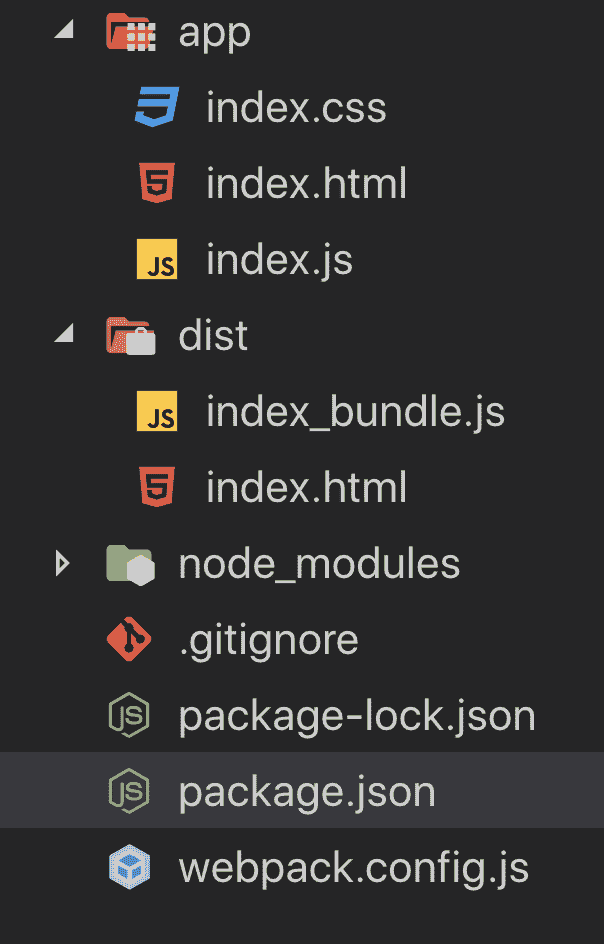

# 不使用 create-react-app 创建 React 项目

> 原文：<https://dev.to/vish448/create-react-project-without-create-react-app-3goh>

## 为什么发这个帖子？

按照这些命令，用终端创建 react 应用程序非常简单。

```
npx create-react-app my-app
cd my-app
npm start 
```

Enter fullscreen mode Exit fullscreen mode

简单对吗？然而，有一种可能性是我们不知道幕后是什么。让我们的 react 应用程序正常工作需要哪些组件。这就是我们在这篇文章中看到的。如何从头开始制作 react 应用程序？

为了实现这一点，我们需要在您的系统中安装 npm

## 步骤

在系统中创建一个目录

> mkdir 我的应用

转到目录

> cd 我的应用程序

创建 package.json 文件

> npm 初始化-y

npm init 将创建新的 package.json 文件
, Flag-y 将告诉 npm 在创建 package.json 时使用所有默认配置选项

安装 react 和 react-dom

> npm 安装反应反应随机

使用:它将在 package.json 文件的依赖项下添加 react 和 react-dom，并创建 node_modules 目录，其中包含所有其他依赖库。

创建 gitIgnore 以避免将不必要的代码推送到 github

> 我来了。吉蒂尔

gitignore 文件中可能需要的条目有

节点 _ 模块
。DS_Store -如果你在 mac 电脑上
dist

dist(分发文件夹)-是一个构建目录，它是在我们构建代码时由 webpack 和 babel 生成的。因此，我们不希望这个文件夹在生产应用程序的编译器上生成时继续存在。

创建应用程序文件夹

> mkdir 应用程序

在其中创建两个文件。

> 触摸 index.js index.css

开始编写你的 hello world react 应用程序

```
import React from 'react';
import ReactDOM from 'react-dom';
import './index.css';

class App extends React.Component{
    render(){
        return(
            <div>Hello World</div>
        )
    }
}

ReactDOM.render(<App />, document.getElementById('app')) 
```

Enter fullscreen mode Exit fullscreen mode

所以当你试图在浏览器中运行这段代码时，它会给出一个错误，因为我们的代码是在 JSX 写的，浏览器不能理解它。

所以这就是 Babel 和 Webpack 发挥作用的地方。要安装这两个组件所需的所有依赖项，请在终端上运行以下命令。

npm 安装-保存-dev[@ babel](https://dev.to/babel)/core[@ babel](https://dev.to/babel)/preset-env[@ babel](https://dev.to/babel)/preset-react web package-CLI web package-dev-server babel CSS loader style-loader html web package 插件

Flag - save-dev:我们使用这个标志来区分构建依赖和应用依赖

您可以检查您的 package.json 文件，看看这个标志在这方面有何不同。

## Webpack 配置

Webpack 是模块捆绑器。所以目前我们只有一个模块。然而，随着我们的应用程序的扩展，我们将有更多的模块。因此，webpack 智能地将所有这些模块绑定在一起，并创建一个服务于所有这些模块的单个文件。

> touch webpack.config.js

```
var path = require('path');
var HtmlWebpackPlugin =  require('html-webpack-plugin');

module.exports = {
    entry : './app/index.js',
    output : {
        path : path.resolve(__dirname , 'dist'),
        filename: 'index_bundle.js'
    },
    module : {
        rules : [
            {test : /\.(js)$/, use:'babel-loader'},
            {test : /\.css$/, use:['style-loader', 'css-loader']}
        ]
    },
    mode:'development',
    plugins : [
        new HtmlWebpackPlugin ({
            template : 'app/index.html'
        })
    ]

} 
```

Enter fullscreen mode Exit fullscreen mode

如何配置 webpack 查看我之前的帖子

[](/vish448) [## React 网络包(简介)

### vishang Apr 22 ' 195 分钟读取

#react #webpack](/vish448/webpack-for-react-intro-3n01)

结合我们的 babel-loader 工程，我们必须将 babel 预设配置添加到我们的 package.json 文件

```
"main": "index.js",
"babel":{
    "presets" : [
      "@babel/preset-env",
      "@babel/preset-react"
    ]
  } 
```

Enter fullscreen mode Exit fullscreen mode

要运行构建，我们必须将 webpack 添加到我们的 package.json
中的脚本标签中

```
"main": "index.js",
  "babel":{
    "presets" : [
      "@babel/preset-env",
      "@babel/preset-react"
    ]
  },
  "scripts": {
    "create": "webpack"
  }, 
```

Enter fullscreen mode Exit fullscreen mode

因此，当我从终端运行 **npm run create** 时，它将运行 webpack，该 web pack 将创建 dist 文件夹和我们的带有 index.html 文件的捆绑文件。

每次运行 webpack 都很麻烦。所以您可以启动一个 webpack 开发服务器。所以只要你运行它，它就会开始编译你代码。使用下面的
修改 package.json 中的脚本

```
"scripts": {
    "start": "webpack-dev-server --open"
  } 
```

Enter fullscreen mode Exit fullscreen mode

现在，当您运行 **npm run start** 时，它将启动开发服务器并在浏览器中打开您的应用程序。

最终的目录结构将是这样的
[](https://res.cloudinary.com/practicaldev/image/fetch/s--I87x6LWQ--/c_limit%2Cf_auto%2Cfl_progressive%2Cq_auto%2Cw_880/https://user-images.githubusercontent.com/1841822/56835623-b9739200-6842-11e9-9dbc-a4c58353574d.png)

要点