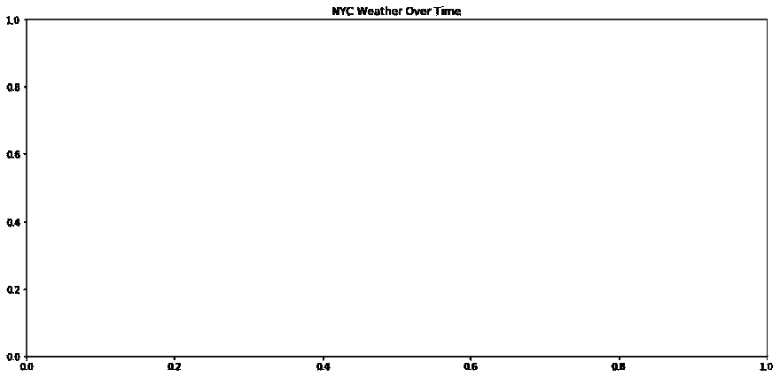

# 用海豹和熊猫绘制数据

> 原文：<https://dev.to/hackersandslackers/plotting-data-with-seaborn-and-pandas-59nk>

[](https://res.cloudinary.com/practicaldev/image/fetch/s--BTKb2F3d--/c_limit%2Cf_auto%2Cfl_progressive%2Cq_auto%2Cw_880/https://hackersandslackers.com/conteimg/2019/04/seaborn-2-1.jpg)

Python 中有很多很好的数据图表库，可能*太多*了。Plotly 很棒，但是 25 张免费图表的限制并不是一个起点。当然，有 Matplotlib，但我们肯定会发现一些更少的东西...好吧，蹩脚。所有简单而强大的图表库都在哪里？

你可能已经猜到了，这就是 Seaborn 的用武之地。Seaborn 不是第三方库，所以您可以在不创建用户帐户或担心 API 限制等情况下开始使用。Seaborn 也是建立在 Matplotlib 之上的，对于任何想要从图表中获得一些火力的人来说，这是合乎逻辑的下一步。

我们将通过自己绘制一些数据来探索 Seaborn。我们将逐步完成为图表准备数据、绘制所述图表以及探索可用功能的过程。本教程假设你对熊猫有一定的了解，并且可以访问 Jupyter 笔记本界面。

## 在熊猫中准备数据

首先，我们需要一些数据。为了将我们的重点放在图表上，而不是复杂的数据清理上，我将使用人类已知的最简单的数据集:天气。作为一个额外的奖励，这将使我们能够庆祝我们不可避免的即将到来的厄运，因为在未来几年，世界平均气温将上升 3 摄氏度以上。我们将使用的数据集是 [Kaggle 的历史每小时天气数据](https://www.kaggle.com/selfishgene/historical-hourly-weather-data)。

有了这些本地保存的 CSV，我们可以开始检查我们的数据:

```
import pandas as pd
import seaborn as sns
from matplotlib import pyplot

temperature_df = pd.read_csv('temperature.csv')

print(temperature_df.head(5))
print(temperature_df.tail(5)) 
```

这为我们提供了以下输出:

thead tr td:第一个孩子{
min-width:190 px；
}
tbody tr td:第一个孩子{
min-width:190 px；
}

|  | 日期 | 纽约 |
| --- | --- | --- |
| Twenty-four | 2012-10-02 | Two hundred and eighty-nine point nine nine |
| Forty-eight | 2012-10-03 | Two hundred and ninety point three seven |
| seventy-two | 2012-10-04 | Two hundred and ninety point eight four |
| Ninety-six | 2012-10-05 | Two hundred and ninety-three point one eight |
| One hundred and twenty | 2012-10-06 | Two hundred and eighty-eight point two four |
| Eight thousand six hundred and forty | 2013-09-26 | Two hundred and eighty-six point two two |
| Eight thousand six hundred and sixty-four | 2013-09-27 | Two hundred and eighty-five point three seven |
| Eight thousand six hundred and eighty-eight | 2013-09-28 | Two hundred and eighty-six point six five |
| Eight thousand seven hundred and twelve | 2013-09-29 | Two hundred and eighty-six point two nine |
| Eight thousand seven hundred and thirty-six | 2013-09-30 | Two hundred and eighty-three point four three five |

这告诉我们一些事情:

*   此数据集的范围从 2012 年 10 月 1 日开始，到 2017 年 11 月 29 日结束。
*   并非所有的城市都有足够的数据，这些数据在这些日期开始和结束。
*   每天 24 次，每次 1 小时采集一次数据。
*   温度以开尔文为单位:这是世界上最没用的测量单位。

### 删除无关数据

每天 24 次阅读是很多的。创建图表会占用大量的系统资源(和时间)，这使得每天 24 个独立的温度变得荒谬可笑。让我们通过把我们记录的温度降低到每天一个读数来为我们自己节省 23/24 的头痛。

我们将修改数据帧，使其每 24 行中只包含一行:

```
modified_df = temperature_df.iloc[::24] 
```

### 取一个样本大小

我们只想绘制一个地点的值，所以让我们从纽约开始。

绘制逐年的数据图来观察任何变化也是很有趣的。为此，我们将减少数据集，只包括第一年的读数。

最后，我们要从这个不完整的数据集中删除那些我们注意到的空单元格。以上所有给了我们以下几点:

```
import pandas as pd
import seaborn as sns
from matplotlib import pyplot as plt

temperature_df = pd.read_csv('temperature.csv')
nyc_df = temperature_df[['datetime','New York']]
nyc_df = nyc_df.iloc[::24]
nyc_df.dropna(how='any', inplace=True)

print(nyc_df.head(5))
print(nyc_df.tail(5)) 
```

结果片段为我们提供了第一年中每天记录的温度。输出应该如下所示:

thead tr td:第一个孩子{
min-width:190 px；
}
tbody tr td:第一个孩子{
min-width:190 px；
}

|  | 日期 | 纽约 |
| --- | --- | --- |
| Twenty-four | 2012-10-02 | Two hundred and eighty-nine point nine nine |
| Forty-eight | 2012-10-03 | Two hundred and ninety point three seven |
| seventy-two | 2012-10-04 | Two hundred and ninety point eight four |
| Ninety-six | 2012-10-05 | Two hundred and ninety-three point one eight |
| One hundred and twenty | 2012-10-06 | Two hundred and eighty-eight point two four |
| Eight thousand six hundred and forty | 2013-09-26 | Two hundred and eighty-six point two two |
| Eight thousand six hundred and sixty-four | 2013-09-27 | Two hundred and eighty-five point three seven |
| Eight thousand six hundred and eighty-eight | 2013-09-28 | Two hundred and eighty-six point six five |
| Eight thousand seven hundred and twelve | 2013-09-29 | Two hundred and eighty-six point two nine |
| Eight thousand seven hundred and thirty-six | 2013-09-30 | Two hundred and eighty-three point four three five |

### 固定我们的温度

我们得对凯尔文的情况做点什么。我上一次用开尔文测量任何东西是在《机甲战士 2》中监测我的反应堆热量的时候。不要试图找到那个游戏，它是 90 年代的遗物。

快速的谷歌搜索揭示了将开尔文转换为华氏温度的公式:

```
(x − 273.15) × 9/5 + 32 
```

这需要一个 lambda 函数！

```
nyc_df['temp'] = nyc_df['temp'].apply(lambda x: (x-273.15) * 9/5 + 32) 
```

用`print(nyc_df.head(5))`检查我们的工作:

| 日期 | 温度 | 指数 |
| --- | --- | --- |
| 2012-10-02 | 62.584651 | Zero |
| 2012-10-03 | Sixty-three point two six six | one |
| 2012-10-04 | Sixty-four point one one two | Two |
| 2012-10-05 | Sixty-eight point three two four | three |
| 2012-10-06 | Fifty-nine point four three two | four |

### 调整我们的数据类型

我们从 CSV 加载数据，所以我们*知道*我们的数据类型将会是无用的。众所周知，当 Pandas 不知道发生了什么时，它会将 CSV 中的数据类型存储为对象。快速运行`print(nyc_df.info())`揭示了这一点:

```
<class 'pandas.core.frame.DataFrame'>
Int64Index: 1852 entries, 24 to 44448
Data columns (total 2 columns):
date 1852 non-null object
temp 1852 non-null float64
dtypes: float64(1), object(1)
memory usage: 43.4+ KB
None 
```

“对象”是一个有趣的熊猫词，表示“无用的数据类型的宽泛分类”Pandas 发现了该列数据中的特殊字符，因此立即放弃了对这些数据进行逻辑解析的任何尝试。让我们来解决这个问题:

```
nyc_df['date'] = pd.to_datetime(nyc_df['date']) 
```

。info()现在应该将“日期”列显示为“日期时间”数据类型:

```
<class 'pandas.core.frame.DataFrame'>
Int64Index: 1852 entries, 24 to 44448
Data columns (total 2 columns):
date 1852 non-null datetime64[ns]
temp 1852 non-null float64
dtypes: datetime64[ns](1), float64(1)
memory usage:43.4 KB
None 
```

### Seaborn 友好的数据格式

考虑一下我们将要制作的图表:我们希望在一个单独的图上制作一个多线图表，其中我们将温度读数一年一年地叠加在一起。尽管绘制了多条线，但 Seaborn plots 将只接受一个数据帧，该数据帧对于所有 X 值都有一列，对于所有 Y 值都有一列。这意味着尽管有多行，我们所有行的值都将存在于单个大的列中。因此，我们需要以某种方式对该列中的单元格进行分组，就好像说“这些值属于第 1 行，那些值属于第 1 行”。

我们可以通过第三个专栏来实现这一点。该列作为一个“标签”,将同一标签的所有值组合在一起(即:创建一行)。我们每年创造一个地块，所以这实际上很容易:

```
nyc_df['year'] = nyc_df['date'].dt.year 
```

就这么简单！我们需要在一年的第*天再做一次，来表示我们的 X 值:*

```
nyc_df['day'] = nyc_df['date'].dt.dayofyear 
```

检查输出:

```
 date temp year day 
0 2012-10-02 12:00:00 62.3147 2012 276 
1 2012-10-03 12:00:00 62.9960 2012 277 
2 2012-10-04 12:00:00 63.8420 2012 278 
3 2012-10-05 12:00:00 68.0540 2012 279 
4 2012-10-06 12:00:00 59.1620 2012 280 
```

### 大扫除

我们刚刚做了一大堆，但在这个过程中我们弄得有点乱。

首先，我们从未修改过我们的列名。为什么在一个已经命名的数据集中有一个名为 **New York** 的列？谁会知道这一栏里的数字到底代表什么？让我们调整一下:

```
nyc_df.columns = ['date','temperature'] 
```

我们的行索引需要在之前删除所有那些空行之后进行修复。让我们来解决这个问题:

```
nyc_df.reset_index(inplace=True) 
```

咻，太多了！让我们回顾一下到目前为止我们所做的一切:

```
import pandas as pd
import seaborn as sns
from matplotlib import pyplot as plt

# Load Data From CSV temperature_df = pd.read_csv('temperature.csv')

# Get NYC temperatures daily nyc_df = temperature_df[['datetime','New York']]
nyc_df = nyc_df.iloc[::24]
nyc_df.dropna(how='any', inplace=True)

# Convert temperature to Farenheight nyc_df['New York'] = nyc_df['New York'].apply(lambda x: (x-273.15) * 9/5 + 32)

# Set X axis, group Y axis nyc_df['date'] = pd.to_datetime(nyc_df['date'])
nyc_df['year'] = nyc_df['date'].dt.year
nyc_df['day'] = nyc_df['date'].dt.dayofyear

# Cleanup nyc_df.columns = ['date','temperature']
nyc_df.reset_index(inplace=True) 
```

## 图表准备

我们要看的第一种图表是折线图，显示温度随时间的变化。在映射这些数据之前，我们必须首先设置阶段。如果没有为我们的图表设置适当的元数据，它将默认为一个难看的、没有标题的 5x5 正方形。

### 在 Jupyter 中显示内嵌图表

在我们可以看到任何图表之前，我们需要显式地配置我们的笔记本来显示内联图表。这是在 Jupyter 中用一个“[魔法函数](https://ipython.readthedocs.io/en/stable/interactive/magics.html)完成的。滚动回笔记本的开头，确保`%matplotlib inline`从头开始出现:

```
import pandas as pd
import seaborn as sns
from matplotlib import pyplot as plt
%matplotlib inline 
```

### 设置地块大小

如果您熟悉 Matplotlib，那么下一部分应该看起来很熟悉:

```
plt.figure(figsize=(15, 7)) 
```

事实上，我们正在对`plt`进行操作，这是我们给`pyplot`的别名(从 Matplotlib 库导入)。上面设定了图表的尺寸:15x7 英寸。因为 Seaborn 的核心运行在 Matplotlib 上，所以我们可以使用与修改 Matplotlib 图表相同的语法来修改我们的图表。

### 设置我们的图表颜色

但是颜色呢？Seaborn 的“漂亮”不正是我们使用它的全部原因吗？的确如此，朋友:

```
sns.palplot(sns.color_palette("husl", 8)) 
```

...输出是:

[](https://res.cloudinary.com/practicaldev/image/fetch/s--RyOu5PGa--/c_limit%2Cf_auto%2Cfl_progressive%2Cq_auto%2Cw_880/https://hackersandslackers.com/conteimg/2019/04/download-1.png) 

<figcaption>缩略图为“husl”Seaborn 调色板。</figcaption>

等等，我们刚刚做了什么？我们使用 Seaborn 中内置的“husl”调色板为图表设置了一个新的调色板。还有很多其他方法来控制你的调色板，这在他们的文档[这里](https://seaborn.pydata.org/tutorial/color_palettes.html)中解释得很少。

在此添加 STYLE=TICKS。

### 命名我们的图表

另一个例子:

```
plt.set_title('NYC Weather Over Time') 
```

我们现在将我们的图表命名为**纽约天气随时间的变化。**上面两行代码的组合结果如下:

[](https://res.cloudinary.com/practicaldev/image/fetch/s--IJtBRsrc--/c_limit%2Cf_auto%2Cfl_progressive%2Cq_auto%2Cw_880/https://hackersandslackers.com/conteimg/2019/04/plot.png) 

<figcaption>看哪:一块空白的画布。</figcaption>

我们现在已经设置了图表的样式，设置了大小尺寸，并给它起了个名字。我们差不多准备好做生意了。

## 绘制折线图

现在是好东西:创建图表！在 Seaborn 中，通过使用`sns.plottype()`语法创建一个图，其中`plottype()`将被替换为我们想要查看的图表类型。我们正在绘制折线图，所以我们将使用`sns.lineplot()`:

```
nyc_chart = sns.lineplot(x="day",
                         y="temp",
                         hue='year',
                         data=nyc_df
                         ).set_title('NYC Weather Over Time')
plt.show() 
```

请注意我们在这里通过的论点:

*   包含图表数据的熊猫数据框。
*   `x`和`y`是我们的数据帧中的列，应该分别分配给 **x** 和 **y** 轴。
*   `hue`是对 Y 轴的值进行分组所依据的标签。

当然，`lineplot()`接受了更多我们没有提到的论点。例如:

*   `ax`接受 Matplotlib“plot”对象，就像我们创建的包含图表元数据的对象一样。我们不需要传递这个消息，因为 Seaborn 会自动继承我们默认保存到`plt`变量中的内容。如果我们有多个地块，这将是有用的。
*   `size`允许我们根据变量改变线宽。
*   `legend`为如何显示图例提供了三种不同的选项。

被`lineplot()`接受的所有论点的完整文档可以在[这里](https://seaborn.pydata.org/generated/seaborn.lineplot.html)找到。聊够了，让我们看看我们的图表是什么样的！

她是个美人。

你一定是波塞冬，因为你现在看起来像海洋之王。

### 成就解锁

我赞扬你耐心地耐心等待又一个关于清理数据的罗嗦。不幸的是，3 年的时间不足以直观地证明气候变化的存在:预计在大约几百年的时间里，世界气温将平均上升 2-3 摄氏度，因此我们的图表实际上并不十分有用。

Seaborn 有很多图表类型，不仅仅是简单的折线图。希望你感觉足够舒服，可以开始浏览文档并展开翅膀。