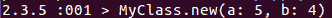
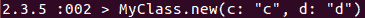
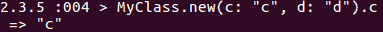
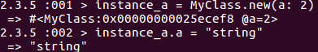
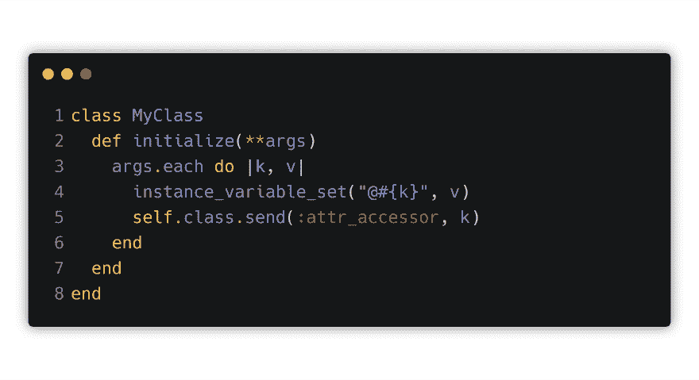
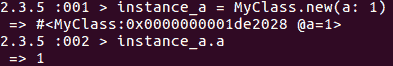
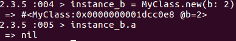
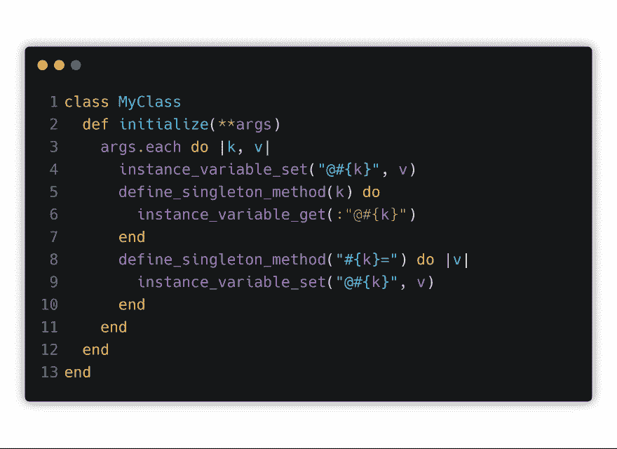
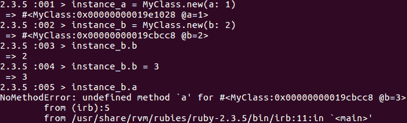

# 创建动态属性访问器

> 原文：<https://dev.to/2nit/creating-dynamic-attribute-accessors-10p2>

元编程是一种搅乱编程语言内部的艺术，是有抱负的程序员可以利用的最强大的学习工具之一。很容易认为给定语言的工作是理所当然的，但这样做几乎没有任何改进的余地。恰恰相反，忘记事情在幕后是如何工作的，可能会让你无法理解你可能会在日常项目中用到的许多概念。不幸的是，对于元编程来说，由于大多数项目并没有真正深入这个神秘的领域，投入使用的机会可能在很长一段时间内都不会到来。

这可不好。让我们扭曲现实，创造我们自己的机会。你在空闲时间还能做些什么呢？玩电子游戏？真是个书呆子。

为了扩大我们的知识这一更高的目的，我们必须忘记(只是一点点)前面的例子的实际用法。现在，只有我们的目标和实现目标的方法才是最重要的。比方说，出于某种奇怪的，可能是性的原因，你想为你的类创建一个初始化器，它可以接受任意数量的散列参数，并为每个参数创建相应的访问器。你为什么要这么做？我不知道也不在乎，但我们肯定会这么做。

所以我们要这个:

要像这样可行:

并且能够像这样访问这些变量的值:

并这样设置它们:

因此，为了解开所有的包:我们需要让我们的 initialize 方法接受一个参数的散列，迭代它们，将它们设置为实例变量，并为它们中的每一个创建一个访问器。让我们试试这个:

看起来不错。Double splat 运算符(**)是作为哈希处理的参数的指示符。“实例变量集”是我们的首选方法...你知道，这是不言自明的，所以我就让你自己弄清楚吧。最后一行是对我们的类的私有方法的调用，其中的参数是我们之前设置为实例变量的变量的名称，我们希望能够访问或设置这些变量。好吧，让我们来看看后果是什么:

好的，看起来效果不错...如果你愿意无视这一点:

你看，我们的“send”方法直接作用于我们的类，所以我们这样设置的访问器不会无处可去，并且对这个类的所有未来实例都是免费可用的。这是个烂摊子，我们不能容忍。我们设置的访问器应该仅限于我们用来初始化类实例的参数，并且只能用于给定的实例。因此，我们真正需要做的是，通过创建每个实例的方法，简单地返回先前设置的实例变量或为它们设置新值，来欺骗我们进入类似访问器的行为。问题来了:你知道也可以为实例创建单例方法吗？我知道你会怎么想:这在一般的项目环境中几乎是极其罕见的。当然可以，但是当我们可以创造自己的事件时，为什么要为无聊的现实而烦恼呢？让我们现在就开始:

这次我们完全不用‘attr _ accessor’业务。相反，通过我们的参数迭代，我们为每个参数创建两个单独的方法——其中一个简单地命名为您的变量名，它简单地调用先前使用的“instance_variable_set”的反函数“instance_variable_get”来获得它的值，第二个——在变量名后面加上等号(也接受附加参数),为我们的变量设置新值。让我们来看看整个事件给我们带来了什么:

瞧。不能从第二个实例访问第一个实例的变量，getters 和 setters 按预期工作。现在，就元编程而言，这是一个非常基本和原始的例子，但它只是为了表明，一般来说，编程语言拥有许多巧妙的技巧，可以使您按照自己的意愿改变游戏规则。