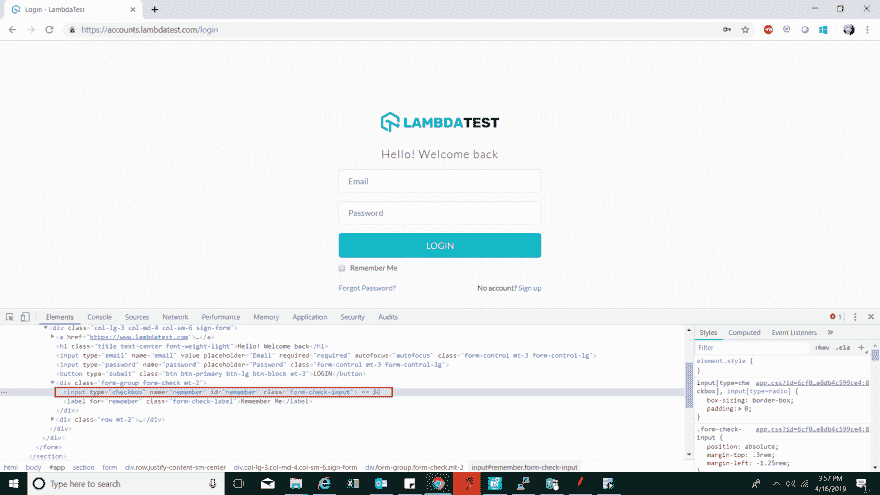
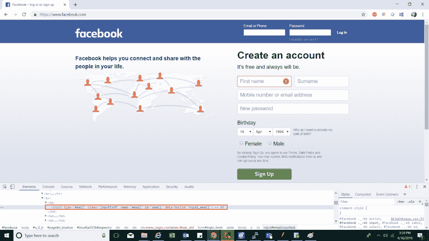
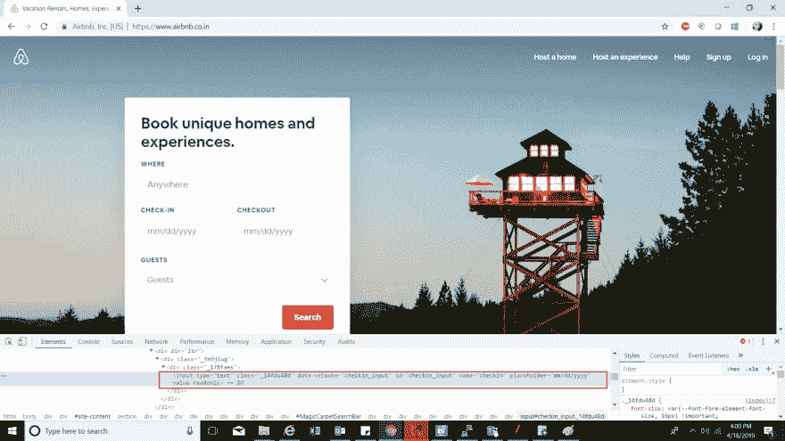

# 在 Selenium WebDriver 中使用 ID 定位器进行移动

> 原文：<https://dev.to/lambdatest/making-the-move-with-id-locator-in-selenium-webdriver-2g25>

如果您刚开始使用 Selenium，您可能不确定要做什么以及如何做？在我看来，我发现定位器是开始刷牙或学习硒的最佳步骤。定位器是构建 Selenium 脚本的基础。通过使用定位器，可以在网页上定位元素。不仅定位一个元素很重要，确保它的快速和准确也同样重要。一个这样的定位器是 Selenium WebDriver 中的 ID 定位器，它执行这项业务。

在这篇 WebDriver 教程中，了解什么是 WebDriver、它的特性、它是如何工作的、最佳实践等等。

## 何时在 Selenium WebDriver 中选择 ID 定位器？

在 Selenium WebDriver 中使用 ID 定位器是所有定位器中最快和最可靠的。每个元素的 ID 应该是唯一的，这使得 ID 定位器成为一个可靠的选择。因为浏览器并没有强制要求 ID 必须是唯一的，这使得开发人员利用了这一点，并可能导致 ID 不是作为属性的一部分出现或自动生成，或者对于页面来说不是唯一的。由于上述问题，可能需要切换到其他定位器。

您可以查看 Selenium 中关于不同 CSS 定位器的其他文章，Selenium 通过各种方式帮助定位元素:

*   [链接文本&硒中部分链接文本](https://www.lambdatest.com/blog/using-link-text-and-partial-link-text-in-selenium/)

*   [在 Selenium 中命名定位器](https://www.lambdatest.com/blog/how-to-use-name-locator-in-selenium-automation-scripts/)

*   [Selenium 中的类名定位器](https://www.lambdatest.com/blog/selenium-java-tutorial-class-name-locator-in-selenium/)

*   [Selenium 中的标记名定位器](https://www.lambdatest.com/blog/how-to-use-name-locator-in-selenium-automation-scripts/)

*   [Selenium 中的 CSS 选择器](https://www.lambdatest.com/blog/how-pro-testers-use-css-selectors-in-selenium-automation-scripts/)

*   [硒中的 XPath](https://www.lambdatest.com/blog/complete-guide-for-using-xpath-in-selenium-with-examples/)

如果你是一个高级或中级硒从业者，那么你可以在上面提到的专门文章卡盘。并获取我们的完整指南，帮助您说明 Selenium 中 CSS locator 的实际演示。

## 在 Selenium WebDriver 中使用 ID 定位器

在这里，我将看到一个 LambdaTest 登录页面的例子，**‘记住我’**功能的例子。下面是同样的截图。

[](https://res.cloudinary.com/practicaldev/image/fetch/s--Ex3Owsin--/c_limit%2Cf_auto%2Cfl_progressive%2Cq_auto%2Cw_880/https://cdn-images-1.medium.com/max/3840/0%2AvNhFRcZNmpTaw8QM.png)

引用“记住我”元素的以下 DOM 结构:

```
<input type="checkbox" name="remember" id="remember" class="form-check-input"> 
```

Enter fullscreen mode Exit fullscreen mode

如您所见，上面的标签有多个属性，其中之一是 **ID 定位器**。

[](https://res.cloudinary.com/practicaldev/image/fetch/s--zA_vmb64--/c_limit%2Cf_auto%2Cfl_progressive%2Cq_auto%2Cw_880/https://cdn-images-1.medium.com/max/2000/0%2AT7nVHTjDdMqdXTVb.png)

该认证是为那些希望在硒自动化测试领域保持领先地位的专业人士准备的。

以下是来自 LambdaTest 的 Selenium 101 认证的简要介绍:

[https://www.youtube.com/embed/qx9FPFfJm7E](https://www.youtube.com/embed/qx9FPFfJm7E)

***嘿！在[安卓在线模拟器](https://www.lambdatest.com/android-emulator-online?utm_source=devto&utm_medium=organic&utm_campaign=aug31_sd&utm_term=sd&utm_content=webpage)上测试你的网络和移动应用。确保您的应用程序兼容最新和传统的 Android 操作系统、设备和浏览器。***

## Selenium web driver 中 ID 定位器的语法

为了使用 ID Selenium 定位器通过 ID 查找元素，我们使用以下语法:

driver.findElement(By.id("记住"))；

现在，让我们试着把它结合到一个实时的例子中。在这个例子中，我将使用 facebook 登录页面，使用 ID 定位器登录，以便与 WebElement 对象进行交互。

下面是 facebook 登录页面的电子邮件、密码和登录字段的 DOM 结构:

```
<input type="email" class="inputtext" name="email" id="email" value="[sadhvisingh9049@gmail.com](mailto:sadhvisingh9049@gmail.com)" data-testid="royal_email">

<input type="password" class="inputtext" name="pass" id="pass" data-testid="royal_pass">

<input value="Log In" aria-label="Log In" data-testid="royal_login_button" type="submit" id="u_0_8"> 
```

Enter fullscreen mode Exit fullscreen mode

引用的是突出显示相同内容的截图:

[](https://res.cloudinary.com/practicaldev/image/fetch/s--j8f3-fCq--/c_limit%2Cf_auto%2Cfl_progressive%2Cq_auto%2Cw_880/https://cdn-images-1.medium.com/max/3840/0%2A6lczmLeh3ds8BCW3.png)

[](https://res.cloudinary.com/practicaldev/image/fetch/s--qO553sgX--/c_limit%2Cf_auto%2Cfl_progressive%2Cq_auto%2Cw_880/https://cdn-images-1.medium.com/max/2000/0%2Aw4rUP6KmkRlzGXmZ.jpg)

## 钻研 Selenium WebDriver 中的 ID 定位器代码

下面的代码将帮助您更好地理解 Selenium WebDriver 中的 ID locator 演示。让我们深入了解一下:

```
package Chromedriver;

import org.openqa.selenium.By;
import org.openqa.selenium.WebDriver;
import org.openqa.selenium.WebElement;
import org.openqa.selenium.chrome.ChromeDriver;

public class Locator_By_ID {

public static void main(String[] args) {
        // TODO Auto-generated method stub

//Setting up chrome using chromedriver by setting its property
        System.setProperty("webdriver.chrome.driver", "Pth of chrome driver"); 

        //Opening browser
        WebDriver driver= new ChromeDriver() ;

        //Opening window tab in maximize mode
        driver.manage().window().maximize();

        //Opening application
        driver.get("[https://www.facebook.com](https://www.facebook.com)");

        //Locating the email field element via ID tag and storing it in the webelement
        WebElement email_field=driver.findElement(By.id("email"));

        //Entering text into the email field
        email_field.sendKeys("[sadhvisinghXXXX@gmail.com](mailto:sadhvisinghXXXX@gmail.com)");

        //Locating the password field element via ID tag and storing it in the webelement
        WebElement password_field=driver.findElement(By.id("pass"));

        //Entering text into the password field
        password_field.sendKeys("xxxxxxxxx");

        //Locating the login button to login to the application
        WebElement login_button=driver.findElement(By.id("u_0_2"));

        //Clicking on the 'login' button
        login_button.click();

}

} 
```

Enter fullscreen mode Exit fullscreen mode

引用的是突出显示相同内容的截图:

[](https://res.cloudinary.com/practicaldev/image/fetch/s--2af2y-4w--/c_limit%2Cf_auto%2Cfl_progressive%2Cq_auto%2Cw_880/https://cdn-images-1.medium.com/max/3840/0%2A8zuH5Il3SKi3jFqS.png)

[](https://res.cloudinary.com/practicaldev/image/fetch/s--hH-VeWTx--/c_limit%2Cf_auto%2Cfl_progressive%2Cq_auto%2Cw_880/https://cdn-images-1.medium.com/max/2000/0%2AxTdZryk_eTOlWJzM.jpg)

***嘿！在[在线安卓模拟器](https://www.lambdatest.com/android-emulator-online?utm_source=devto&utm_medium=organic&utm_campaign=aug31_sd&utm_term=sd&utm_content=webpage)上测试你的网络和移动应用。确保您的应用程序兼容最新和传统的 Android 操作系统、设备和浏览器。***

## 钻研 Selenium WebDriver 中的 ID 定位器代码

下面的代码将帮助您更好地理解 Selenium WebDriver 中的 ID locator 演示。让我们深入了解一下:

```
package Chromedriver;

import org.openqa.selenium.By;
import org.openqa.selenium.WebDriver;
import org.openqa.selenium.WebElement;
import org.openqa.selenium.chrome.ChromeDriver;

public class Locator_By_ID {

public static void main(String[] args) {
        // TODO Auto-generated method stub

//Setting up chrome using chromedriver by setting its property
        System.setProperty("webdriver.chrome.driver", "Pth of chrome driver"); 

        //Opening browser
        WebDriver driver= new ChromeDriver() ;

        //Opening window tab in maximize mode
        driver.manage().window().maximize();

        //Opening application
        driver.get("[https://www.facebook.com](https://www.facebook.com)");

        //Locating the email field element via ID tag and storing it in the webelement
        WebElement email_field=driver.findElement(By.id("email"));

        //Entering text into the email field
        email_field.sendKeys("[sadhvisinghXXXX@gmail.com](mailto:sadhvisinghXXXX@gmail.com)");

        //Locating the password field element via ID tag and storing it in the webelement
        WebElement password_field=driver.findElement(By.id("pass"));

        //Entering text into the password field
        password_field.sendKeys("xxxxxxxxx");

        //Locating the login button to login to the application
        WebElement login_button=driver.findElement(By.id("u_0_2"));

        //Clicking on the 'login' button
        login_button.click();

}

} 
```

Enter fullscreen mode Exit fullscreen mode

## 另一个展示 ID 定位器的例子

让我们考虑另一个类似的 ID 示例，我们通过 Airbnb 进行预订:

[](https://res.cloudinary.com/practicaldev/image/fetch/s--__RfZxjR--/c_limit%2Cf_auto%2Cfl_progressive%2Cq_auto%2Cw_880/https://cdn-images-1.medium.com/max/3840/0%2AM6uyvHvcxh4a1TOU.png)

下面是相同的 DOM 结构:

**位置字段:**

```
<input type="text" class="_up0kwni" aria-autocomplete="list" aria-describedby="Koan-magic-carpet-koan-search-bar__description" aria-expanded="false" autocomplete="off" autocorrect="off" spellcheck="false" id="Koan-magic-carpet-koan-search-bar__input" name="query" placeholder="Anywhere" role="combobox" value="Delhi"> 
```

Enter fullscreen mode Exit fullscreen mode

**签到:**

```
<input type="text" class="_14fdu48d" data-veloute="checkin_input" id="checkin_input" name="checkin" placeholder="dd-mm-yyyy" value="Wed, 10th Apr" readonly="" <="" pre="">

<b>Checkout:</b>

<pre> <input type="text" class="_14fdu48d" data-veloute="checkout_input" id="checkout_input" name="checkout" placeholder="dd-mm-yyyy" value="Sun, 14th Apr" readonly=""> 
```

Enter fullscreen mode Exit fullscreen mode

**搜索按钮:**

```
<button type="submit" class="_z5x9aua" aria-busy="false"><span class="_ftj2sg4">Search</span></button> 
```

Enter fullscreen mode Exit fullscreen mode

现在让我们深入研究代码片段:

```
package Chromedriver;

import org.openqa.selenium.By;
import org.openqa.selenium.Keys;
import org.openqa.selenium.WebDriver;
import org.openqa.selenium.WebElement;
import org.openqa.selenium.chrome.ChromeDriver;

public class ID_Location {

public static void main(String[] args) throws InterruptedException {
        // TODO Auto-generated method stub

//Setting up chrome using chromedriver by setting its property
        System.setProperty("webdriver.chrome.driver", "path of chromedriver"); 

        //Opening browser
        WebDriver driver= new ChromeDriver() ;

        //Opening window tab in maximize mode
        driver.manage().window().maximize();

        //Opening application
        driver.get("[https://www.airbnb.co.in/](https://www.airbnb.co.in/)");

        //Locate element via ID for Location field and store it in Webelement
        WebElement Location= driver.findElement(By.id("Koan-magic-carpet-koan-search-bar__input"));

        //Input value in Location field
        Location.sendKeys("Delhi", Keys.ENTER);

        //Locate element via ID for Check-in field and store it in Webelement
                WebElement Check_in= driver.findElement(By.id("checkin_input"));

                //Click on Check_in field to select the date
                Check_in.click();

                //Select the desired date
                driver.findElement(By.xpath("//*[[@id](http://twitter.com/id)='MagicCarpetSearchBar']/div[2]/div/div/div/div[2]/div/div/div/div/div/div[2]/div[2]/div/div[2]/div/table/tbody/tr[2]/td[3]")).click();

              //Locate element via ID for Check-out field and store it in Webelement
                WebElement Check_out= driver.findElement(By.id("checkout_input"));

                //Click on Check_out field to select the date
                Check_out.click();

                //Wait for date selection
                Thread.sleep(3500);

                //Select the desired date
                driver.findElement(By.xpath("//*[[@id](http://twitter.com/id)='MagicCarpetSearchBar']/div[2]/div/div/div/div[3]/div/div/div/div/div/div[2]/div[2]/div/div[2]/div/table/tbody/tr[2]/td[4]")).click();

                //Locating the submit button and clicking on it
                driver.findElement(By.tagName("button")).click();

                //close the driver
                driver.close();

    }

} 
```

Enter fullscreen mode Exit fullscreen mode

***嘿！在[在线模拟器 Android](https://www.lambdatest.com/android-emulator-online?utm_source=devto&utm_medium=organic&utm_campaign=aug31_sd&utm_term=sd&utm_content=webpage) 上测试你的网络和移动应用。确保您的应用程序兼容最新和传统的 Android 操作系统、设备和浏览器。***

## 一言为定！

由于元素的唯一性，ID 是定位元素的最可靠和最简单的方法。因此，如果您开始使用 Selenium WebDriver，ID 可以成为您最好的朋友。但是在定位它们的时候，一定要确保在正确的轨道上，并且注意重复的 id 或者自动生成的 id。测试愉快！🙂