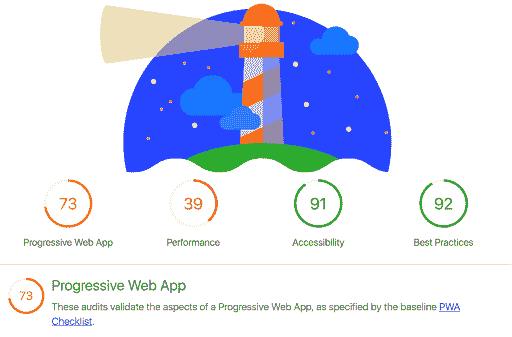
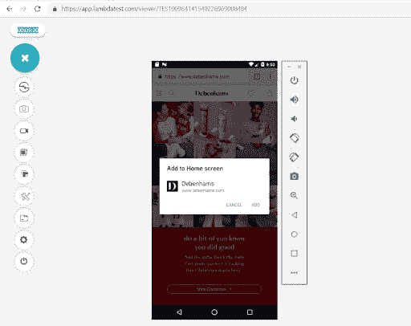

# 测试渐进式 Web 应用程序的技巧

> 原文：<https://dev.to/akshaypai/tips-for-testing-a-progressive-web-application-545j>

技术的进步为更好的用户体验铺平了道路。如今有惊人的 25 亿人使用智能手机。为这些智能手机构建的应用程序能够通过充分利用设备硬件和屏幕上呈现的视觉不动产来提供复杂和定制的用户体验。直到最近，为在线业务开发一个移动应用似乎是必须的。由于渐进式网络应用的成功实施，我们现在正在观察一个范式的转变。

## 什么是渐进式 Web Apps？

渐进式网络应用(PWA)是 2015 年起源于谷歌内部的一个术语，是一套设计原则。现代浏览器能够提供通常由各种操作系统上的本地应用程序使用的功能。指导开发人员最好地使用浏览器临时功能的设计原则包括 PWA。

在 PWA 的所有各种属性中，Google 将其缩小到下面提到的三个主要特征。

### 1。可靠性

现代浏览器有一个特性叫做服务人员。常规网站需要网络连接才能正常加载页面并提供服务。然而，服务人员可以在不考虑网络条件的情况下立即加载具有一些存储内容的网页。

这提高了可靠性，因为所有用户都能够立即看到加载的一些页面组件以及一些数据。信息的预缓存将允许网络应用即使在没有网络连接的情况下也能提供功能。

### 2。速度

速度是渐进式 Web 应用程序的一个重要性能指标。当我们说速度时，它意味着网页加载和提供用户试图寻找的信息的速度有多快。谷歌对网站性能的一项研究发现，如果网站加载时间超过 3 秒，移动用户就会离开网站。

为了确保用户不会因为漫长的加载时间而迷失，PWAs 遵循构建简单、轻便的组件的原则，这些组件可以更快地加载和设计页面，这样就不需要任何笨重的滚动来获取正确的信息。

### 3。迷人的体验

手机用户总是被引人入胜的体验所吸引，而 pwa 现在可以实现以前不可能实现的事情。

*   PWA 可以安装在智能手机的主屏幕上。这种行为只有手机应用程序才有。
*   PWA 可以像应用程序一样提供全屏体验，而浏览器标签不会占用网页可以利用的一些空间。
*   浏览器的功能称为 web 应用程序清单，允许 PWAs 以某种方式设计，网页可以加载并以某些方式显示，使其看起来像其他应用程序一样。

## PWAs 的验收

理论上，渐进式网络应用的概念似乎很有前途。但是在这个名字被创造出来 3 年后，它被采用了吗？

答案是肯定的。PWAs 在业务绩效指标方面的优势和改进导致了它的广泛接受和实施。

一项评估艾滋病人增长的独立研究得出了一些有趣的结论。

截至今天，大约 87%的网络战略家或网络体验制作者采用渐进式网络应用。

通过 Https 提供网页服务是 PWA 的关键要求之一。通过 https 提供服务的网站数量从 25%增加到 75%。

同一项研究还发现，他们分析的大多数网站都有 85%的高 SEO 得分，这些高得分网站中排名前 1%的网站也有高 PWA 得分。这意味着 PWA 甚至被大型组织所采用。

## 测试渐进式 Web 应用

就像任何其他 web 应用程序一样，测试 PWAs 也是必不可少的。然而，测试 PWA 与测试传统的 web 应用程序有很大的不同。

在传统的 web 应用程序中，人们会测试应用程序提供的特性。较新的测试类型包括检查它们是否在各种移动设备上适当地呈现，并确保行为是可预测的和一致的。但是现在有了渐进式 web 应用程序，执行跨浏览器测试的方法有了很大的不同。原因如下。

除了测试应用程序的特性或功能之外，PWA 还必须遵循决定其特性的指导原则。这涉及到在许多不同的浏览器和设备上手动和基于软件的测试的结合。让我们来看看测试一个渐进式 web 应用程序的过程。

### 1。可靠性测试

PWA 的可靠性取决于通过 https 提供页面服务的能力。使用像 [Lighthouse](https://developers.google.com/web/tools/lighthouse/) 这样的工具可以让你确保所有的网页都是通过 https 服务的。

正如我们在后续章节中看到的，Lighthouse 不仅仅可以用于测试网站的可靠性。

### 2。手动测试类似本机的行为

这种类型的测试需要在各种不同的浏览器和设备上手动测试。LambdaTest 为 1000 多种移动设备和个人电脑提供实时[跨浏览器测试](https://www.lambdatest.com/real-time-browser-testing?utm_source=dev&utm_medium=Blog&utm_campaign=ak-13-260419eu&utm_term=OrganicPosting)。

一个主要的行为是能够像其他应用程序一样将 PWA 添加到主屏幕。随着 web 应用程序被添加到主屏幕，它应该开始像一个应用程序而不像一个网站。这包括它的启动方式，以及即使在没有网络连接的情况下也能有一些内容的能力。

使用 LambdaTest，您将能够在各种设备上测试这些功能。这里有一个例子，将 PWA 添加到主屏幕，并在没有任何网络连接的情况下进行测试(在飞行模式下)。

### 3。基于软件的类本机行为测试

建议在一些最常见的设备上对最常见的浏览器进行手动测试。然而，由于不可能在所有浏览器和所有设备上进行测试，您可以使用工具 Lighthouse 来评估一些类似本机的功能。

例如，可以使用 Lighthouse 测试脱机功能的存在和脱机模式下页面的加载。该软件通过寻找元数据来检查这些功能，这些元数据让浏览器知道当 PWA 在离线模式下启动时该做什么。

Lighthouse 还会在离线模式下测试所有网页的加载能力。它通过测试每个 URL 在被调用时是否给出 200 状态码作为响应来做到这一点。

### 4。充分利用 URL

正如我们所看到的，渐进式 web 应用程序可以像应用程序一样外观和行为。然而，人们必须记住，它仍然是一个网站。因此，所有网页都必须有一个可以在社交媒体上分享的 URL。所有有 URL 的页面也确保了搜索引擎爬虫正确地索引整个网站。

可能有一些内容可能有非常相似的网址。这种情况经常发生在 PWA 中，并在页面的头部添加一个规范的标签。这将是一个信号，通知搜索引擎两个页面上的内容是相同的。这些被称为[规范 URL](https://yoast.com/rel-canonical/)。

### 5。跨浏览器测试

正如我们之前看到的，PWA 非常依赖现代浏览器的功能。这使得确保网站在所有不同类型的浏览器(如 Firefox、Chrome、Safari 等)上都能按预期加载和运行变得极其重要。

一些较旧的浏览器(如 internet explorer 8.0 和更早版本)不支持 PWAs。因此，检查它在这种旧浏览器上的行为是至关重要的。

浏览器的实现也不同。这意味着每个浏览器都可以用自己的方式处理特定的场景。为了确保一致性，您必须在各种移动和桌面设备上手动检查网站的加载和呈现，并在多种浏览器上进行测试。

在这里，LambdaTest 及其大量的移动仿真器和模拟器将帮助您快速测试您的 PWA，并评估它在所有不同类型的设备上的行为。

跨浏览器测试已经流行了很长时间。然而，由于世界各地的浏览器和设备缺乏标准和统一性，它的重要性显著增加。数十亿台设备中，大多数运行不同版本或类型的操作系统，并使用不同的浏览器，这使得开发人员很难知道 web 应用程序是否会按预期运行。考虑到 PWA 对现代浏览器的严重依赖，PWA 应用的跨浏览器测试在当今的移动第一世界中具有重要意义。有了 LambdaTest 这样的工具，就有可能显著降低不明行为的风险。

## 结论

PWAs 的发展对许多组织的在线发展产生了显著的影响。它有助于提高用户参与度，在某些情况下有助于建立对品牌的信任。

我们已经浏览了一些基本的测试技术，这些技术是确保 progressive web app 符合标准和规范所必需的。然而，一些更好的细节可以进一步改善使用 PWA 的体验。搜索引擎优化、加载时间调整和快速加载技术等功能可以使用流行的工具进行测试。

正如我们所见，PWA 测试工作流程的大部分主要依赖于手动跨浏览器测试。在一些工具的帮助下，手工进行这些测试的开销可以显著减少。

渐进式网络应用为用户与网站互动的新方式打开了大门，并允许在线企业吸引和留住更多客户。测试 PWA 与构建 PWA 一样重要，现在正是利用这个机会向 PWA 敞开大门的时候。

**相关帖子:**

1.  [创建浏览器兼容 HTML 和 CSS 的完整指南](https://www.lambdatest.com/blog/complete-guide-on-creating-browser-compatible-html-and-css/?utm_source=dev&utm_medium=Blog&utm_campaign=ak-13-230419eu&utm_term=OrganicPosting)

2.  [自动化跨浏览器测试](https://www.lambdatest.com/blog/automated-cross-browser-testing/?utm_source=dev&utm_medium=Blog&utm_campaign=ak-13-230419eu&utm_term=OrganicPosting)

3.  [使用 LambdaTest](https://www.lambdatest.com/blog/performing-cross-browser-testing-with-lambdatest/?utm_source=dev&utm_medium=Blog&utm_campaign=ak-13-230419eu&utm_term=OrganicPosting) 执行跨浏览器测试