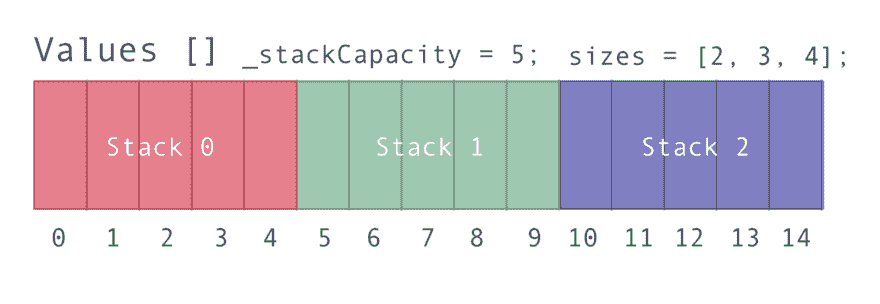
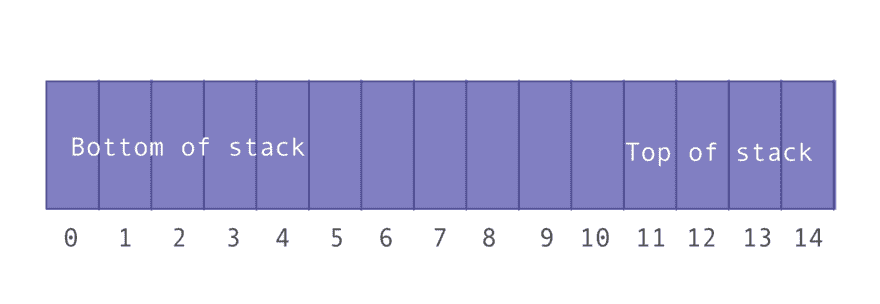

# 用 JavaScript 创建 3 个堆栈和 1 个数组

> 原文：<https://dev.to/emmabostian/creating-3-stacks-with-1-array-in-javascript-514b>

*这个问题是来自[破解编码采访](https://www.amazon.de/Cracking-Coding-Interview-6th-Programming/dp/0984782850/ref=asc_df_0984782850/?tag=googshopde-21&linkCode=df0&hvadid=310817730623&hvpos=1o1&hvnetw=g&hvrand=15089778271391464692&hvpone=&hvptwo=&hvqmt=&hvdev=c&hvdvcmdl=&hvlocint=&hvlocphy=9041968&hvtargid=pla-388890317700&psc=1&th=1&psc=1&tag=&ref=&adgrpid=70301320788&hvpone=&hvptwo=&hvadid=310817730623&hvpos=1o1&hvnetw=g&hvrand=15089778271391464692&hvqmt=&hvdev=c&hvdvcmdl=&hvlocint=&hvlocphy=9041968&hvtargid=pla-388890317700)一书的提示。练习是:“描述如何使用单个数组实现三个堆栈。”*

# 什么是栈？

堆栈是一种基于“后进先出”或“LIFO”概念的数据结构你可以把它想象成一堆书，在你可以取回最下面的书之前，最上面的书必须被拿走。JavaScript 没有本机堆栈数据结构，所以我们今天要创建一个。

我们的数组将包含三个不同的固定大小的堆栈。栈顶在右边，栈底在左边。你可以把它想象成类似于这张图。如果该堆栈已满，底部元素将位于`stack[0]`，顶部元素将位于`stack[stack.length-1]`。

# 阶级细分

我们的栈将有一个固定的大小，它将等于实例化时传入的参数。

### 属性

以下属性将在构造函数中初始化:

*   `_stackCapacity`:一个栈中可以容纳的最大元素数。这是一个只读属性，这也是它前面加下划线的原因。
*   `values`:包含三个堆栈中所有元素的数组
*   `sizes`:具有三个索引的数组，每个索引代表各自堆栈中元素的当前数量。
*   s:一个常量，代表我们允许数组保存的堆栈总数。我们将它初始化为三个，但是这个多堆栈类的未来迭代可以接受第二个参数来定制数组可以容纳的堆栈数量。

### 方法

我们的多堆栈类将包含以下方法:

*   返回每个堆栈的总容量(这只是我检查所有东西是否都按预期工作的一种方式，我们不会真的使用它。)
*   `push(stackNumber, value)`:将值推送到相应堆栈编号的顶部。
*   `pop(stackNumber)`:弹出相应堆栈编号的顶部项目。
*   `peek(stackNumber)`:返回相应堆栈编号的顶部项目。它只是我们“窥视”顶部是什么元素的一种方式；不会发生堆栈突变。
*   `isEmpty(stackNumber)`:返回一个 boolean 值，表示各个栈是否有值。
*   `isFull(stackNumber)`:返回一个 boolean 值，表示相应的堆栈是否已满。
*   `indexOfTop(stackNumber)`:一个 helper 方法，它返回相应堆栈中顶部元素在 values 数组中的索引。

### 构造函数

我们要做的第一件事是创建我们的构造函数。它将接受一个参数，堆栈大小。因此，我们的值数组的总长度将是堆栈大小的 3 倍(因为我们将`numberOfStacks`初始化为 3)。

我们将初始化 sizes 数组，使其包含三个值为零的索引。出于我们的目的，我们将假设被压入堆栈的值是正整数。您可以根据自己的需要更改这个逻辑。