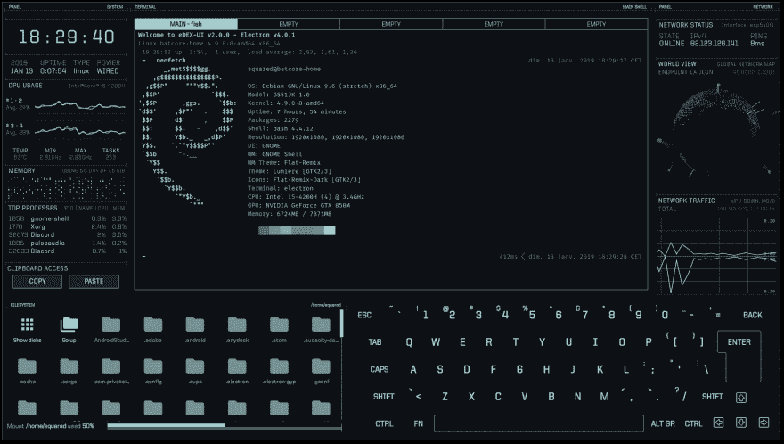

# 一个很棒的终端。

> 原文：<https://dev.to/kelp404/an-awesome-terminal-12h8>

今天看到了这个项目。太酷了！

## [【gitsquared】](https://github.com/GitSquared)/[【edex-ui】](https://github.com/GitSquared/edex-ui)

### 一个跨平台、可定制的科幻小说终端模拟器，具有高级监控和触摸屏支持。

<article class="markdown-body entry-content container-lg" itemprop="text">

eDEX-UI 是一个全屏的、跨平台的终端模拟器和系统监视器，看起来和感觉上都像科幻小说中的计算机界面。

从 [TRON 遗留的电影特效](https://web.archive.org/web/20170511000410/http://jtnimoy.com/blogs/projects/14881671)(尤其是[的董事会会议室场景](https://gmunk.com/TRON-Board-Room))中得到很大启发，eDEX-UI 项目原本打算成为*[DEX-UI](https://github.com/seenaburns/dex-ui)少一些艺术，多一些可分发软件*。在保持未来外观和感觉的同时，它努力保持一定的功能水平，并可用于现实生活中，更大的目标是将科幻 UXs 带入主流。

这可能是个玩笑，也可能不是。

*(跳转至:[截图](https://raw.githubusercontent.com/GitSquared/edex-ui/master/#screenshots) - [提问&回答](https://raw.githubusercontent.com/GitSquared/edex-ui/master/#qa) - **[下载](https://raw.githubusercontent.com/GitSquared/edex-ui/master/#how-do-i-get-it)-**-[精选](https://raw.githubusercontent.com/GitSquared/edex-ui/master/#featured-in) - [开发者须知](https://raw.githubusercontent.com/GitSquared/edex-ui/master/#useful-commands-for-the-nerds) - [学分](https://raw.githubusercontent.com/GitSquared/edex-ui/master/#credits) )*

## 特征

*   全功能终端模拟器，有标签、颜色、鼠标事件，支持类似于`curses`和`curses`的应用。
*   实时系统(CPU、RAM、交换、进程)和网络(GeoIP、活动连接、传输速率)…

</article>

[View on GitHub](https://github.com/GitSquared/edex-ui)