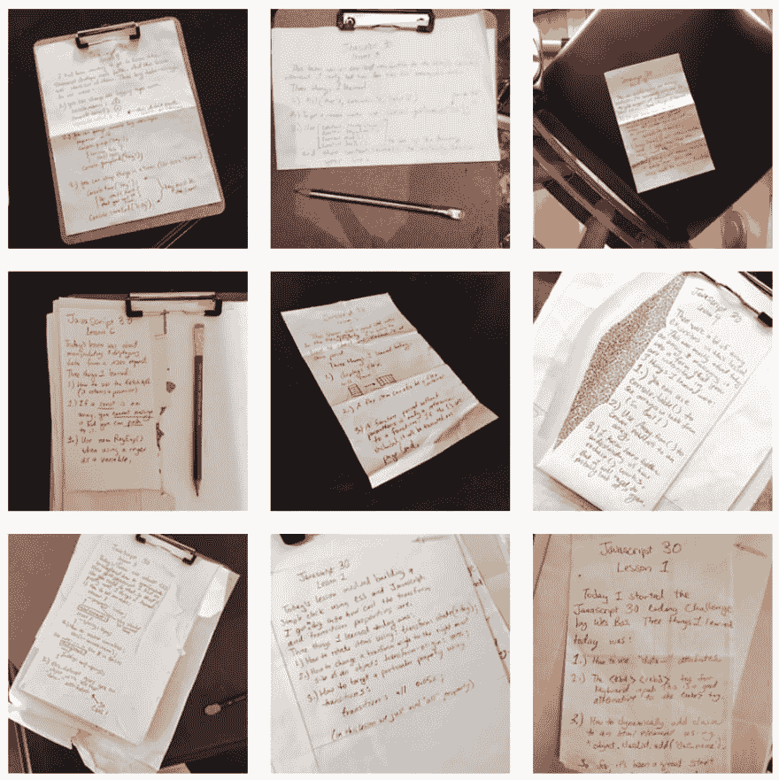

# JavaScript30 的回顾，也就是如何完成你的在线课程

> 原文：<https://dev.to/grepliz/a-review-of-javascript30-aka-how-to-finish-your-online-courses-hpk>

我爱学校。我在大学里学完了 3 个专业，毕业时已经有了 45 个额外的单元。如果我能找到一种通过成为专业学生来赚钱的方法，我会永远呆在大学里。

我喜欢在软件行业工作。总是有工作要做，有很多东西要学。最重要的是，有大量的资源可以让你学到任何你想学的东西。我特别喜欢像 egghead.io 或 T2 Coursera 这样的组织提供的在线课程。每当我在某个学习平台上阅读课程目录时，我就像一个在糖果店的孩子。

不过，我有一个问题。一个我大学没有的问题。

我开始的在线课程比我实际完成的要多得多。

我被工作、责任和闪亮的新事物分散了注意力。因此，当我开始参加由[韦斯·博斯](https://twitter.com/wesbos)发起的为期 30 天的编码挑战 [JavaScript30](https://javascript30.com/) 时，我想更加努力地完成课程。

这个课程非常棒。每一课，Wes 都带领观众构建纯粹的普通 JavaScript 项目。没有 React，没有 Vue，没有 jQuery 或者 Angular，只有 JavaScript。这种方法真的帮助我了解了 web 开发的基本构件。我只有专业的 React 开发经验，实际上我很惊讶我可以在不知道的情况下仍然是一名 React 开发人员(也许这比其他任何事情都更能证明 React 框架)。

反正我跑题了。课程开始得很好，我想确保自己有办法真正完成它。所以我想出了一个计划，在这个计划中，我采取了两个帮助我在大学里保持成功的关键因素:写笔记和 T2 责任。

# 写笔记

每节课结束后，我会削一支铅笔，拿一张再生纸，写下我学到的三件事。不管它有多简单或复杂，我都写了下来。这只花了几分钟，但我发现这个回顾/总结笔记的过程极大地帮助巩固了我所学的东西。同时，我也在为我的进步创建日志和索引。

# 问责

当我写完笔记后，我给它拍了张照片，并把它发布到一个专门创建的 Instagram 账户上。有趣的是，虽然我没有那么多关注者，但这种社交媒体分享成了我完成任务的责任。每次我看着那个账户，我都觉得有动力再做一课，离完成又近了一步。

虽然，我没有在 30 天内完成课程，但我确实完成了。我相信这项技术(我将亲切地称之为 *InstaLearning* )提供了足够的结构，让我保持纪律，同时又足够有趣，不会觉得自己是个负担。我鼓励任何喜欢在线课程的人尝试一下 *InstaLearning* 。

任何想学习更多 Javascript 的人，都可以参加 [JavaScript30](https://javascript30.com/) 课程。太牛逼了！