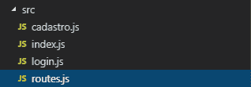

# 如何在 React Native 中从 MySQL 数据库获取数据

> 原文：<https://dev.to/saulojoab/how-to-get-data-from-an-mysql-database-in-react-native-53a4>

### 放弃

这篇文章已经过时了。
我很久以前写的，当时我对 NodeJS 不太了解:)

React Native 是一个很棒的工具，我一直用它来开发我的初创公司的应用程序， [AlluGo](http://instagram.com/allugo_app) ！有时我会发现自己很难做一些简单的事情，比如从本地 MySQL 数据库获取数据。因此，我决定写这篇文章，以帮助任何人与同样的问题作斗争。艾伦-y！

*(顺便说一下，我在这里用 PT-BR [写了这篇文章，以防你们是巴西同胞)](https://www.linkedin.com/pulse/react-native-como-pegar-dados-do-banco-de-mysql-rest-penha-simplicio/)*

**<u>步骤【0】:导入包。</u>T3】**

首先，在你的命令提示符*(是的，我用 windows plz 不要杀我)*，进入你的 React 原生项目的文件夹，使用以下命令:

```
npm install express

npm install body-parser

npm install mysql 
```

这可能需要一点时间，但事情就是这样。别担心，稍后我会解释这些包的作用。

**<u>步骤【1】:创建你的 MySQL 数据库。</u>T3】**

我是说，你可能已经做过了...我使用 Wamp 服务器来处理我的本地 MySQL 数据库，以防你需要它。

**<u>步骤【2】:routes . js .</u>T3】**

在你的 **React 原生项目** *(你可以把它放在你想要的任何地方 tho)* 中，创建一个名为**‘routes . js’**的文件。这将是我们的服务器 **(NodeJS)** ，我们将使用它从数据库中获取数据。

是的，没错。您正在创建一个*(简单)* NodeJS 服务器！你可以做一个**完整的 CRUD** 如果你想要*的话，但这不是本文的重点！:p*
这是我的文件:

[](https://res.cloudinary.com/practicaldev/image/fetch/s--bvs04Qq9--/c_limit%2Cf_auto%2Cfl_progressive%2Cq_auto%2Cw_880/https://media.licdn.com/dms/image/C5612AQEqEapDLgB84A/article-inline_image-shrink_1000_1488/0%3Fe%3D1561593600%26v%3Dbeta%26t%3DXtGwGajJkmjGIuYOW4c0QTagpBE9DTH_QLD09U9OKGA)

**<u>步骤【3】:数据库连接。</u>T3】**

现在事情可能变得有点棘手，但是**不要担心**。首先，我会给你看代码，然后我会解释一切都在做什么。看看这个:

```
// This is the routes.js file!

const express = require('express');
const bodyParser = require('body-parser');
const mysql = require('mysql');

const connection = mysql.createPool({
  host     : 'localhost',
  user     : 'me',
  password : 'secret',
  database : 'my_db'
}); 
```

好的。很漂亮，对吧？我们一步一步来。前三行只是简单的**导入**。

*   在第一行，我们正在导入 [Express](https://expressjs.com/pt-br/) 。这是一个节点框架，它将创建我们的服务器路由。他非常擅长创建 API 之类的东西。

*   在第二行，我们正在导入[主体解析器](https://www.npmjs.com/package/body-parser)。它将帮助我们从请求体中获取数据。

*   从第三行开始，我们导入 MySQL 模块并创建与数据库的连接。一旦你这样做了，就用你的数据库的数据填充它(没有双关语的意思)。下面这个例子:

```
const connection = mysql.createPool({
  host     : 'localhost', // Your connection adress (localhost).
  user     : 'root',     // Your database's username.
  password : '',        // Your database's password.
  database : 'my_db'   // Your database's name.
}); 
```

**<u>步骤【4】:从表格中获取数据。</u>T3】**

好吧，现在这可能变得有点棘手*(我希望不是)*。同样，我将展示代码，然后解释它:

```
// We're still in routes.js! Right below everything else.

// Starting our app.
const app = express();

// Creating a GET route that returns data from the 'users' table.
app.get('/users', function (req, res) {
    // Connecting to the database.
    connection.getConnection(function (err, connection) {

    // Executing the MySQL query (select all data from the 'users' table).
    connection.query('SELECT * FROM users', function (error, results, fields) {
      // If some error occurs, we throw an error.
      if (error) throw error;

      // Getting the 'response' from the database and sending it to our route. This is were the data is.
      res.send(results)
    });
  });
});

// Starting our server.
app.listen(3000, () => {
 console.log('Go to http://localhost:3000/users so you can see the data.');
}); 
```

*   首先，我们**启动我们的快递 app** 。
*   然后，我们创建一个名为“users”的 **GET 路由**，该路由将执行一个查询，为我们从“users”表中获取所有数据。
*   *边注:路由和表名**不需要**相等！*
*   之后，我们**在 3000 端口上启动我们的服务器**。

**<u>步骤【5】:运行一切。</u>T3】**

好吧，酷。现在，我们如何运行我们的服务器？为此，**你还不需要运行你的 React 原生应用**。

*   **打开**你的命令提示符，**导航**到你的‘routes . js’，**执行**它。为此，使用以下命令:`node routes.js`

如你所见，你的 CMD 上有这样一条小信息:`Go to http://localhost:3000/users so you can see the data`。
现在，打开你的浏览器，前往那里。如你所见，**成功了！！11!！** *(大概)*

现在，我们如何在我们的 **React 本地应用**上获取数据？

*   这很简单，我们使用`fetch`函数。
*   要做到这一点，而不是使用“本地主机:3000”，你将不得不**直接插入你的电脑的 ip 地址**。如果你使用“本地主机”，你正在访问你的**智能手机/模拟器的本地主机**。这不是我们想要的。按照这个例子:

```
test(){
    fetch('http://yourPCip:3000/users')
      .then(response => response.json())
      .then(users => console.warn(users))
  } 
```

所有数据都将存储在`users`变量中。我将这个函数添加到一个按钮的`onPress`事件中。如你所见，**有数据** :
[](https://res.cloudinary.com/practicaldev/image/fetch/s--QPO_6-TZ--/c_limit%2Cf_auto%2Cfl_progressive%2Cq_auto%2Cw_880/https://media.licdn.com/dms/image/C5612AQHwTa7lU49Q0Q/article-inline_image-shrink_1500_2232/0%3Fe%3D1561593600%26v%3Dbeta%26t%3D6u2vXWhDuuBsFKgOhmB-WhHA9ZKI2egwPyfEuv_qdoI)

继续做你想做的任何事情吧！我希望一切都解决了，我没有让你困惑...**如果出现问题**或者您有任何问题/等等，请随时发表评论！这是我在 dev.to 上的第一篇帖子:)