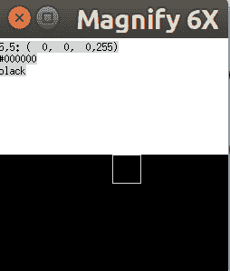

# 让我们建立浏览器引擎！在带颜色的 typescript vol1 画布中

> 原文：<https://dev.to/sanemat/let-s-build-browser-engine-in-typescript-vol1-canvas-with-color-2nd7>

目标:了解如何将 html 和 css 转换成图像。

我照着打字稿写的。[我们来搭建一个浏览器引擎吧！第 1 部分:入门](https://limpet.net/mbrubeck/2014/08/08/toy-layout-engine-1.html)

注:这是 2014 年的方式。这是 html4.01，css2 等。

我想一步步了解。我想看看增量。一些程序用颜色创建画布，然后我可以把它绘制到标准输出。

```
// node_modules/.bin/ts-node example/canvas-color.ts | display

import * as Jimp from "jimp";

import { Canvas } from "../src/painting";
import { Color } from "../src/css";
const white = new Color(255, 255, 255, 255);
const black = new Color(0, 0, 0, 255);

const canvas = new Canvas(
  new Array(5 * 10).fill(white).concat(new Array(5 * 10).fill(black)),
  10,
  10
);

Jimp.create(canvas.width, canvas.height)
  .then((value: Jimp) => {
    let buffer = value.bitmap.data;
    for (let i = 0; i < canvas.pixels.length; i++) {
      buffer[i * 4] = canvas.pixels[i].r;
      buffer[i * 4 + 1] = canvas.pixels[i].g;
      buffer[i * 4 + 2] = canvas.pixels[i].b;
      buffer[i * 4 + 3] = canvas.pixels[i].a;
    }
    return value.getBufferAsync(Jimp.MIME_PNG);
  })
  .then((value: Buffer) => {
    process.stdout.write(value);
  })
  .catch((error: Error) => {
    console.error(error);
  }); 
```

Enter fullscreen mode Exit fullscreen mode

[](https://res.cloudinary.com/practicaldev/image/fetch/s--XaLzR2Vg--/c_limit%2Cf_auto%2Cfl_progressive%2Cq_auto%2Cw_880/https://thepracticaldev.s3.amazonaws.com/i/8l4xck4g1m2s4mw2mt4y.png)

这是我的第一步。如果我能做到这一点，那么我会对我的成功问心无愧:)

```
import { Color } from "../src/css";

test("a", () => {
  expect(new Color(0, 0, 0, 255).a).toEqual(255);
}); 
```

Enter fullscreen mode Exit fullscreen mode

```
export class Color {
  r: number;
  g: number;
  b: number;
  a: number;

  constructor(r: number, g: number, b: number, a: number) {
    this.r = r;
    this.g = g;
    this.b = b;
    this.a = a;
  }
} 
```

Enter fullscreen mode Exit fullscreen mode

```
import { Canvas } from "../src/painting";
import { Color } from "../src/css";

test("canvas pixels length", () => {
  const canvas = Canvas.Create(2, 3);
  expect(canvas.pixels.length).toEqual(6);
});

test("canvas is filled by white", () => {
  const canvas = Canvas.Create(2, 3);
  const white = new Color(255, 255, 255, 255);

  expect(canvas.pixels).toEqual([white, white, white, white, white, white]);
}); 
```

Enter fullscreen mode Exit fullscreen mode

```
import { Color } from "./css";

export class Canvas {
  pixels: Color[];
  width: number;
  height: number;

  constructor(pixels: Color[], width: number, height: number) {
    this.pixels = pixels;
    this.width = width;
    this.height = height;
  }

  static Create(width: number, height: number): Canvas {
    const white = new Color(255, 255, 255, 255);
    return new Canvas(new Array(width * height).fill(white), width, height);
  }
} 
```

Enter fullscreen mode Exit fullscreen mode

终于，我得到了这个，耶！

[](https://res.cloudinary.com/practicaldev/image/fetch/s--XaLzR2Vg--/c_limit%2Cf_auto%2Cfl_progressive%2Cq_auto%2Cw_880/https://thepracticaldev.s3.amazonaws.com/i/8l4xck4g1m2s4mw2mt4y.png)

## 参考文献

*   [我们来搭建一个浏览器引擎吧！第 1 部分:入门](https://limpet.net/mbrubeck/2014/08/08/toy-layout-engine-1.html)
*   [姆布鲁贝克/罗宾逊](https://github.com/mbrubeck/robinson)
*   [sanemat/js-toy-engine](https://github.com/sanemat/js-toy-engine)
*   [sanemat/ts-toy-engine](https://github.com/sanemat/ts-toy-engine)

## 系列

*   [让我们来打造浏览器引擎吧！在 typescript vol0 玩具浏览器引擎](https://dev.to/sanemat/let-s-build-browser-engine-in-typescript-vol0-toy-browser-engine-egm)
*   [让我们来打造浏览器引擎吧！在 typescript vol1 画布上用颜色](https://dev.to/sanemat/let-s-build-browser-engine-in-typescript-vol1-canvas-with-color-2nd7)
*   [让我们来打造浏览器引擎吧！在 typescript vol2 中显示命令](https://dev.to/sanemat/let-s-build-browser-engine-in-typescript-vol2-display-command-3466)
*   [让我们来打造浏览器引擎吧！在 typescript vol3 布局框中，尺寸](https://dev.to/sanemat/let-s-build-browser-engine-in-typescript-vol3-layout-box-dimensions-4613)
*   [让我们来打造浏览器引擎吧！在 typescript vol4 布局树中显示列表](https://dev.to/sanemat/let-s-build-browser-engine-in-typescript-vol4-layout-tree-to-display-list-c54)