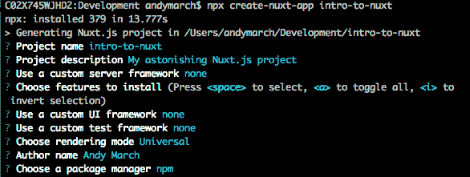
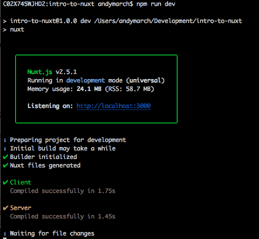
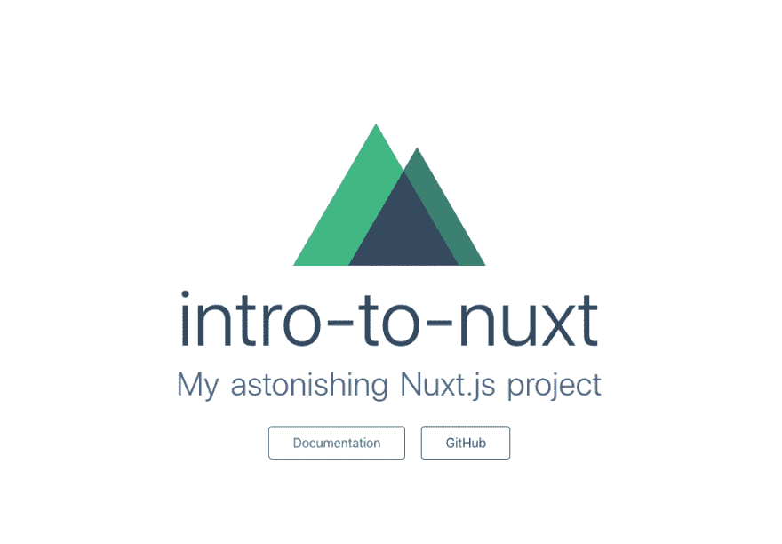
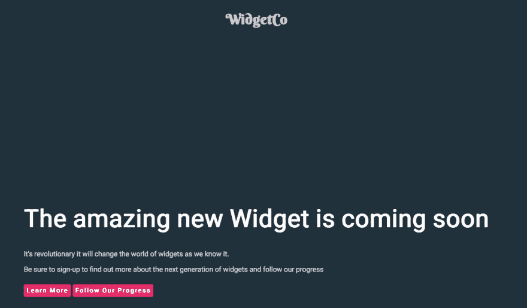
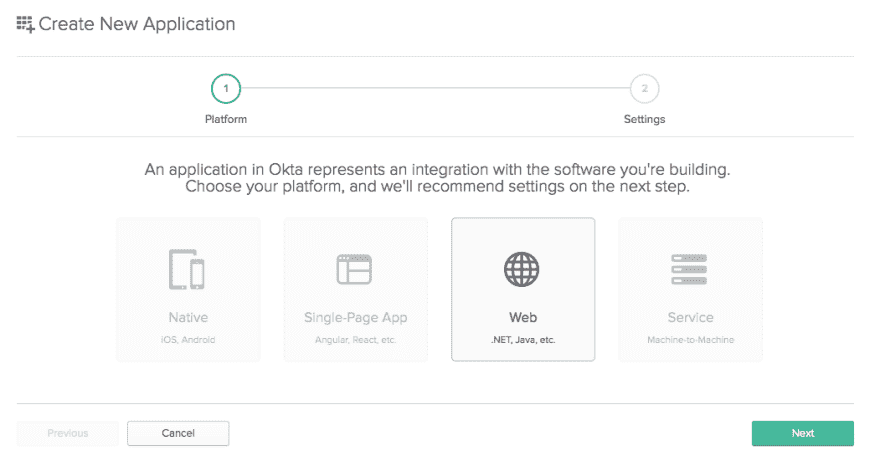
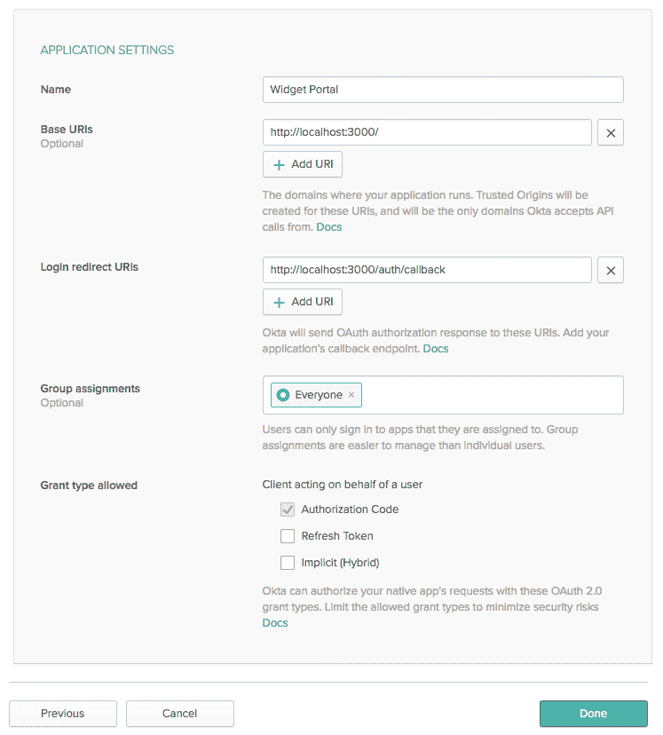
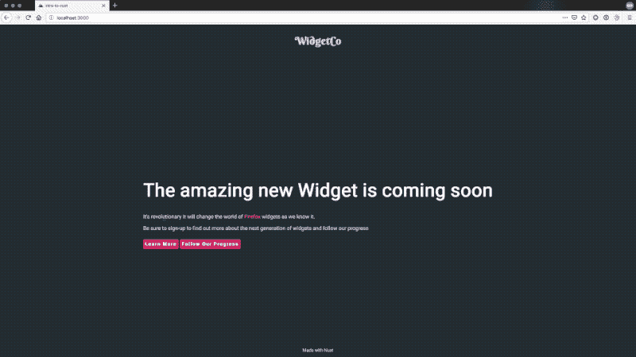

# 教程:用 Nuxt.js 构建通用应用程序

> 原文：<https://dev.to/oktadev/tutorial-build-universal-applications-with-nuxt-js-1p0o>

缩短用户点击应用程序和显示内容之间的时间至关重要。优化的图像？检查！缩小的 CSS？检查！缩小的 JS？检查！但是如果您的应用程序是单页面应用程序(或 SPA ),那么在呈现站点之前，必须有大量的 JavaScript 到达用户。

通用应用程序通过尽可能多地在服务器上执行并只将完成的页面发送给客户机来解决这个问题。js 是一个构建在 Vue 之上的框架，旨在提供自以为是的默认值，以解决开发人员在开发通用应用程序时遇到的许多问题。

在本教程中，您将使用 Nuxt 构建一个应用程序，该应用程序使用来自 API 的数据填充多个路由，这些数据都呈现在服务器上。然后，您将使用[身份验证](https://developer.okta.com/product/authentication/)来保护这些信息，并要求用户登录。你所需要做的就是使用比 5.2.0 更新的 NPM 版本和你喜欢的编辑器。

有了 Vue 单页 app，你的索引页看起来是这样的:

```
<html lang="en">
  <head>
    <meta charset="utf-8">
    <meta http-equiv="X-UA-Compatible" content="IE=edge">
    <meta name="viewport" content="width=device-width,initial-scale=1.0">
    <link rel="icon" href="<%= BASE_URL %>favicon.ico">
    Demo App
  </head>
  <body>
    <noscript>
      <strong>We're sorry but WidgetCo doesn't work properly without JavaScript enabled. Please enable it to continue.</strong>
    </noscript>
    <div id="app"></div>
  <script type="text/javascript" src="/app.js"></script>
  </body>
</html> 
```

只有从服务器检索到最终的 app.js，页面中的所有内容才会呈现出来。这不仅影响了网速较慢的客户端，也影响了那些无法访问 JavaScript 应用程序的人，他们将会看到一个空白页或`noscript`警告。绝大多数用户现在都将运行 JavaScript，但这仍然会阻止一个主要访问者访问您的网站内容，即搜索引擎爬虫。一种解决方法是创建静态内容页面，但是如果您想将此内容放在您在路由器中定义的验证逻辑之后，这可能会导致进一步的问题。

看用 Nuxt 准备的同一个页面。

```
<html data-n-head-ssr data-n-head="">
  <head data-n-head="">
    intro-to-nuxt
    <meta data-n-head="true" charset="utf-8">
    <meta data-n-head="true" name="viewport" content="width=device-width, initial-scale=1">
    <meta data-n-head="true" data-hid="description" name="description" content="My astonishing Nuxt.js project">
    <link data-n-head="true" rel="icon" type="image/x-icon" href="/favicon.ico">
    <link data-n-head="true" rel="stylesheet" href="https://fonts.googleapis.com/css?family=Berkshire+Swash|Roboto">
  </head>
  <body data-n-head="">
    <div data-server-rendered="true" id="__nuxt">
        <div id="__layout">
            <div id="defaultLayout">
                <header>
                    <h1 id="branding">WidgetCo</h1>
                </header>
                <div class="content">
                    <div>
                        <h1 class="statement">The amazing new Widget is coming soon</h1>
                        <p class="subtext">It's revolutionary it will change the world of <span class="userAgent"></span> widgets as we know it.</p>
                        <p class="subtext">Be sure to sign-up to find out more about the next generation of widgets and follow our progress</p>
                        <a href="/learnMore" class="callToAction">Learn More</a> <a href="/progress" class="callToAction">Follow Our Progress</a>
                    </div>
                </div>
                <footer id="footer">
                    Made with Nuxt
                </footer>
            </div>
        </div>
    </div>
  </body>
</html> 
```

这些内容可读性更强，易于机器人索引，无需单独管理内容就能找到。

js 为您的应用程序提供了三个部署选项:传统 SPA、服务器呈现和静态生成。根据您的部署选项，Nuxt 智能地将 Vue 2、Vue 路由器、Vuex、Vue 服务器渲染器和 Vue-meta 捆绑到一个 60kB 的包中，包中有`webpack`、`vue-loader`和`babel-loader`，以支持捆绑和 ES6/7 传输。

你能在不使用 Nuxt 的情况下在 Vue 中完成所有这些吗？绝对的！有一个关于使用 Vue 构建 SSR 应用的完整指南。Nuxt 只为项目结构提供合理的默认配置。如果您想直接构建应用程序逻辑，而不需要太多的布线，那么像 Nuxt 这样固执己见的框架是一个很好的起点。

## 零比一

首先，从终端执行以下命令来启动 Nuxt 模板。

```
npx create-nuxt-app intro-to-nuxt 
```

Nuxt 模板指导您完成项目元数据的设置。为了简单起见，您应该为每个选项选择默认值。

[](https://res.cloudinary.com/practicaldev/image/fetch/s--oeCuc41H--/c_limit%2Cf_auto%2Cfl_progressive%2Cq_auto%2Cw_880/https://d33wubrfki0l68.cloudfront.net/dfe69da41a8a2a2f6eeaf4a044f60d27861168e8/b4551/assets-jekyll/blog/build-universal-apps-with-nuxt/image9-8e9f09064e534144b3f30fa966c8d1402483176e3ee9d1b019afd2fcdfbd0ca1.png)

模板完成后，您将得到一个简单的项目结构，并可以使用以下两个命令在开发模式下启动应用程序。

```
cd intro-to-nuxt  
npm run dev 
```

[](https://res.cloudinary.com/practicaldev/image/fetch/s--7RRxfuAf--/c_limit%2Cf_auto%2Cfl_progressive%2Cq_auto%2Cw_880/https://d33wubrfki0l68.cloudfront.net/78d896291e2decba5fcc3fac175b81be34648d0b/b3882/assets-jekyll/blog/build-universal-apps-with-nuxt/image6-95b035fddd70d6b31f6566e8e28eeaca13bc11c0e425a2126a11204522e9d902.png)

在构建过程中，您会注意到客户机和服务器包都准备好了。一旦构建完成，如果你打开浏览器到 [http://localhost:3000](http://localhost:3000) ，你会看到一个 Nuxt 闪屏。

[](https://res.cloudinary.com/practicaldev/image/fetch/s--tZ4JB8ym--/c_limit%2Cf_auto%2Cfl_progressive%2Cq_auto%2Cw_880/https://d33wubrfki0l68.cloudfront.net/41ec3989776382cdf8022a1923eeac2f8ef337e8/4adfe/assets-jekyll/blog/build-universal-apps-with-nuxt/image7-c4bae12c08ee2fc78c44bbc6d0530341ef7e00649efc802de475fe1ae75e7565.png)

现在您已经有了一个正在运行的应用程序，您可以浏览一下 Nuxt 为您创建的结构。

*   **资产**和**组件:**这些正如你所期望的一样出现在 Vue 项目中，除了它们现在出现在根级别而不是在`/src`中。
*   **Static:** 包含资源，这些资源从应用程序的根开始就完全可用。这与您通过 Vue 项目获得的公共目录相同。
*   布局:这个文件夹中的 Vue 文件为你的应用程序提供了脚手架。这些是显示页面的`<nuxt /` >标签的包装器。
*   **中间件:**该文件夹中的 Vue 文件在渲染页面前被路由器调用。
*   这些是你的 Nuxt 应用程序的路径。Nuxt 生成的路由器将为这个目录中的每个 Vue 文件创建一个路由。
*   **插件:**这个目录下的 Vue 文件允许你在运行应用之前执行逻辑。
*   **Store:** 这个文件夹充当 Vuex 的存储库(Vue 的状态管理库)。

最后，在根目录下，你会看到`nuxt.config.js`。这允许我们定义 Nuxt 应用程序的行为，比如设置全局包含和中间件。这里可用的键是广泛的，我们将在本教程中触及一些，但值得浏览一下[配置文档](https://nuxtjs.org/guide/configuration/)来查看所有可用的选项。

## 构建您的 Nuxt 应用程序

让我们将示例构建得更真实一些。在本教程中，您将为产品构建一个简单的促销和发布状态页面。

在您选择的编辑器中，打开由 Nuxt 模板创建的目录。

用一些相关内容更新 pages 目录中的`index.vue`:

```
<template>
  <div>
    <h1 class="statement">The amazing new Widget is coming soon</h1>
    <p class="subtext">It's revolutionary it will change the world of <UserAgent /> widgets as we know it.</p>
    <p class="subtext">Be sure to sign-up to find out more about the next generation of widgets
    and follow our progress</p>
  </div>
</template>

<script>
import UserAgent from '../components/userAgent.vue'
export default {
  components: {
    UserAgent
  }
}
</script>

<style>
</style> 
```

这个页面现在引用了我们的组件目录中的一个标准 Vue 组件，所以您必须在那个目录中创建文件`userAgent.vue`，其内容如下:

```
<template>
    <span class="userAgent"></span>
</template>
<script>
export default {
  data() {
    return {
      userbrowser: detectAgent()
    }
  }
}
function detectAgent(){
    if(process.client){
        if(navigator.userAgent.indexOf("Firefox") !== -1 ) 
        {
            return 'Firefox'
        }
        else if(navigator.userAgent.indexOf("Chrome") !== -1 )
        {
            return 'Chrome'
        }
        else if(navigator.userAgent.indexOf("Safari") !== -1)
        {
            return 'Safari'
        }
        else 
        {
            return 'browser'
        }
    }
}
</script>
<style>
</style> 
```

在通用应用程序中处理最初为 spa 构建的组件的困难之一是管理当用户的浏览器不存在时如何检测和表现。Nuxt 全局公开了`process.client`、`process.server`和`process.static`来确定渲染器运行的上下文。在`userAgent.vue`中，你使用`process.client`条件来确保导航器在服务器端渲染时不会被引用。如果您要删除这个条件逻辑，您将在构建期间得到如下错误:

[](https://res.cloudinary.com/practicaldev/image/fetch/s--QPsrwj85--/c_limit%2Cf_auto%2Cfl_progressive%2Cq_auto%2Cw_880/https://d33wubrfki0l68.cloudfront.net/2d28f5cf9c5cf8f204521c7852f5fdef035f855e/999b1/assets-jekyll/blog/build-universal-apps-with-nuxt/image5-e00d955d5195c351011a2555c6dfc671b70273c6c7e1f171675b8134129f4314.png)

现在您已经有了一个登录页面，您可以构建一些额外的内容。在`index.vue`的 div 标签中添加以下内容。

```
 <nuxt-link to="/learnMore" class="callToAction">Learn More</nuxt-link>
    <nuxt-link to="/progress" class="callToAction" no-prefetch>Follow Our Progress</nuxt-link> 
```

`nuxt-link`的行为与 Vue 中的`router-link`非常相似，用于创建应用程序页面之间的链接。使用`nuxt-link`的一个好处是当显示一个`nuxt-link`时，链接的页面被预取以提高响应能力。您可以通过向链接添加`no-pretech`属性来禁用这种行为。

再添加两个页面来填充这些链接。在 pages 文件夹中创建文件`learnMore.vue`和`progress.vue`。Nuxt 路由器将根据文件名自动为这些页面创建路由。

首先是`learnMore.vue` :

```
<template>
  <div>
    <h1 class="statement">Learn more about our widgets</h1>
    <p class="bodytext">We grow the finest widgets with our secret recipe.</p>
    <p class="bodytext">
        Lorem ipsum dolor sit amet, consectetur adipiscing elit. Maecenas in 
        urna sed mauris consequat semper. Vestibulum faucibus id velit facilisis
        pharetra. Vivamus tincidunt orci eget metus pretium tristique. Nullam mi
        massa, interdum et sagittis in, pellentesque id metus. Praesent in 
        mattis purus, vitae auctor nisi. Maecenas ut orci nec urna vestibulum
        laoreet. Phasellus lacinia iaculis imperdiet. Nullam tincidunt velit
        eu tortor varius scelerisque. Nullam placerat ligula tincidunt mi
        placerat blandit.
        Interdum et malesuada fames ac ante ipsum primis in faucibus. Maecenas sodales
        finibus diam, a aliquet sapien. Nam molestie eros non tincidunt facilisis.
        Praesent facilisis massa a lorem commodo, a ultricies arcu vehicula. Curabitur a
        tincidunt magna. Maecenas porta sodales turpis id tempus. Etiam fringilla
        tincidunt ullamcorper. Phasellus quis dolor dignissim, tincidunt dolor et,
        viverra neque. Praesent at tellus turpis. Integer nec aliquet est, ut ultricies
        ex. Sed purus ex, pretium ut facilisis quis, accumsan eu elit. Nullam ac egestas
        metus, non viverra libero. Integer a turpis diam. Duis ullamcorper eleifend est
        id ullamcorper.
    </p>
    <nuxt-link to="/" class="callToAction">Go back</nuxt-link>
  </div>
</template>

<script>
    export default {
        head () {
            return {
                title: `About our widgets`,
                meta: [
                    { hid: 'description', name: 'description', content: 'WidgetCo provides the finest in modern widgets, find out how...' },
                    { name: 'keywords', content: 'widgetCo, widgets, widget design'},
                ]
            }
        }
    }
</script>

<style>
</style> 
```

对于“了解更多”页面，您已经扩展了默认的 head 值，以确保您在元中嵌入了良好的页面描述和关键字。此处设置的任何值都将覆盖您在`nuxt.config.js`中设置的任何全局头值。这都是由`[vue-meta](https://github.com/nuxt/vue-meta)`处理的。

接下来，您将通过与 API 对话来创建一个包含一些动态内容的页面。在本教程中，我们将用一个静态 JSON 文件模拟一个 API。在静态文件夹中创建`status.json`，并赋予其以下内容:

```
{  "statusDate":  "2018-04-14",  "statusUpdate":  "We are sorry to report that bad weather has impacted the growth of our widgets. We are working as fast as we can to get widgets dispatched to you."  } 
```

为了进行 API 调用，您将使用承诺驱动的 Axios 库。从终端，使用以下命令安装这个包:

```
npm install axios 
```

您现在已经准备好创建您的页面了。在 pages 目录中创建`progress.vue`，并用以下内容填充它:

```
<template>
  <div>
    <h1 class="statement">Progress Report</h1>
    <p></p>
    <p class="bodytext">

    </p>
    <nuxt-link to="/" class="callToAction">Go back</nuxt-link>
  </div>
</template>

<script>
const axios = require('axios'); 
export default {
  asyncData ({ params }) {
    return axios.get('http://localhost:3000/status.json')
    .then((res) => {
      return {
        statusUpdate: res.data.statusUpdate,
        statusDate: res.data.statusDate
      }
    })
  }
}
</script>

<style>
</style> 
```

在这个页面上，您将使用`asyncData`组件进行 Axios 调用。在服务器端，使用`syntax`解析结果并提供给模板。`asyncData`和数据语法的区别在于调用是在哪里执行的。对于数据，调用总是从客户端发出。在页面到达客户端后，会发出进一步的调用来替换页面附带的值。使用`asyncData`，请求由服务器发出，然后结果与数据中已经存在的值合并。

更好，但是页面之间通用的结构呢？

这就是布局的用武之地。您刚刚创建的每个页面都位于一个布局中，因此您可以重用功能，而无需将它们写入每个页面。由于您尚未明确定义布局，因此将使用模板创建的默认布局。从布局文件夹中打开`default.vue`。布局必须包括呈现页面的`<nuxt />`标签，但是，结构的其余部分由您决定，包括您需要的任何 HTML 或 Vue 组件。将`default.vue`内容替换为以下内容:

```
<template>
  <div id=defaultLayout>
    <header><h1 id="branding">WidgetCo</h1></header>
    <div class="content">
      <nuxt />
    </div>
    <footer id="footer">
      Made with Nuxt
    </footer>
  </div>
</template>

<style>
  body # __nuxt, #__ layout,#defaultLayout {
    display: flex;
    min-height: 98vh;
    flex-direction: column;
  }
  .content {
    flex: 1;
  }
</style> 
```

现在，您有了可以显示在页面周围的通用元素。您可以使用不同的布局来处理网站不同部分之间的表示变化，从营销到文档再到教程。

目前，你的应用程序看起来很平淡，所以让我们添加一些 CSS。在资产目录中创建一个名为`css`的新文件夹，并添加一个包含以下内容的`main.css`文件:

```
html{
    background: #20313b;
}

body{
    font-family: 'Roboto', sans-serif;
    color: hsl(240, 5%, 83%);
}

.content{
    margin-top: 50px;
    display: flex;
    flex-direction: column;
    flex-wrap: wrap;
    justify-content: center;
    align-items: center;
    font-weight: lighter;
}

footer{
    font-size: smaller;
    display: flex;
    flex-direction: column;
    flex-wrap: wrap;
    justify-content: center;
    align-items: center;
    font-weight: lighter;
}

header{
    display: flex;
    flex-direction: column;
    flex-wrap: wrap;
    justify-content: center;
    align-items: center;
    font-weight: lighter;
}

#branding{
    font-family: 'Berkshire Swash', cursive;
}

.statement{
    color: white;
    font-size: 350%
}

.callToAction {
    background-color: #e22866;
    color: white;
    border-radius: 4px;
    font-size: 14px;
    font-weight: 600;
    letter-spacing: 2px;
    line-height: 45px;
    height: 45px;
    border: 6px solid transparent;
    cursor: pointer;
    text-decoration: none;
}

.userAgent{
    color: #e22866
}

.page-enter-active, .page-leave-active{
    transition: opacity .5s
}

.page-enter, .page-leave-active{
    opacity: 0
} 
```

通过将这个样式表添加到`nuxt.config.js`中，可以很容易地将它添加到所有页面的头部。从项目的根目录打开这个文件，这个文件被组织成若干数组。模板项目已经为你包含了常见的，每个都有一个简短的注释描述更新全局 CSS 以包含你的新文件:

```
 /*
  ** Global CSS
  */
  css: [
    '@/assets/css/main.css'
  ], 
```

该样式表还包括一些来自 Google 的字体，您需要从您的`head`链接这些字体。你会发现这个声明在文件的顶部。您将向 link 部分添加到样式表的链接。

```
 /*
  ** Headers of the page
  */
  head: {
    title: pkg.name,
    meta: [
      { charset: 'utf-8' },
      { name: 'viewport', content: 'width=device-width, initial-scale=1' },
      { hid: 'description', name: 'description', content: pkg.description }
    ],
    link: [
      { rel: 'icon', type: 'image/x-icon', href: '/favicon.ico' },
      { rel: 'stylesheet', href: 'https://fonts.googleapis.com/css?family=Berkshire+Swash|Roboto' }
    ]
  } 
```

保存`nuxt.config.js`时，您的控制台可能会显示刷新。然而，由于`nuxt.config.js`是在服务运行之前执行的，您需要停止正在运行的进程并使用`npm run dev`重启。一旦你这样做了，你将会有一个风格化的页面，如下所示。

[](https://res.cloudinary.com/practicaldev/image/fetch/s--VKqMrTA_--/c_limit%2Cf_auto%2Cfl_progressive%2Cq_auto%2Cw_880/https://d33wubrfki0l68.cloudfront.net/0892d0a4c78b47facfc36a385f3db3071527f9ba/bd022/assets-jekyll/blog/build-universal-apps-with-nuxt/image4-c68a3128e49827970127ab2aad81b155dbaad729ed72983dd1c0f4ae61a9e14e.png)

## 在 Nuxt 中保护你的资源

也许你不想与访问该网站的任何人共享进度页面上的信息。相反，您希望将该信息限制给已经注册的人。您还希望使用 OAuth 和 OpenID Connect 等现代 web 身份验证标准，您将使用这些标准来检索令牌，从而授予对资源的访问权限。

你可以自己构建一切，毕竟我们只需要电子邮件地址和密码。但是您应该如何存储密码呢？如果有人忘记了密码，如何重新进入他们的帐户？当您需要启用多因素身份认证时，会发生什么情况？您如何允许此网站的用户访问您公司的其他网站？

奥克塔来救援了！ [Okta](//developer.okta.com) 为您的应用提供一个安全、简单、基于标准的身份源。不用再写登记表了！

首先，去[developer.okta.com/signup](https://developer.okta.com/signup/)，它会引导你在 Okta 上获得一个免费的开发者租户。你的房客将有一个名字，如 dev-1234.okta.com，记下这个地址，我们以后会用到。

作为管理员登录后，从页面顶部的菜单中选择`Applications`，然后选择`Add application`。

由于您是作为通用应用程序工作的，您将在此选择`Web`。这决定了是否为应用程序生成客户端机密。单页应用程序没有这个秘密的安全存储，所以如果您选择“单页应用程序”，就不会生成一个。

[](https://res.cloudinary.com/practicaldev/image/fetch/s--BuP0Uzkw--/c_limit%2Cf_auto%2Cfl_progressive%2Cq_auto%2Cw_880/https://d33wubrfki0l68.cloudfront.net/5e11f992a46efae229434b4870a805063c5475e8/08ca3/assets-jekyll/blog/build-universal-apps-with-nuxt/image2-7dfaeb8c39f68525521219ea8acfb49904adf8e54214e55a2a2f0e0be9e8413c.png)

在下一个屏幕上，您需要提供一些关于您正在创建的应用程序的细节。关键值是基本 URIs 和登录重定向 URIs。前者告诉 Okta 预期认证尝试来自哪里，后者告诉 Okta 在认证后允许将用户发送到哪里。对于您的开发环境，添加`http://localhost:3000`作为基本 URI，添加`http://localhost:3000/auth/callback`作为登录重定向 URI。点击完成！

[](https://res.cloudinary.com/practicaldev/image/fetch/s--Tqdsj1Lh--/c_limit%2Cf_auto%2Cfl_progressive%2Cq_auto%2Cw_880/https://d33wubrfki0l68.cloudfront.net/eb0a25b69546e5c587061b7f8fb24665081a6fcf/7e6df/assets-jekyll/blog/build-universal-apps-with-nuxt/image3-2c07bdd544661084d28898acb26d5775ae1e4bb0834a4cfa4f611f64fe0f9bec.png)

下一页显示了您的应用程序的配置。您需要显示在该页面最底部的两个值，客户端 ID 和客户端密码。

[](https://res.cloudinary.com/practicaldev/image/fetch/s--Fd2WxUk---/c_limit%2Cf_auto%2Cfl_progressive%2Cq_auto%2Cw_880/https://d33wubrfki0l68.cloudfront.net/10400aa0167dbf26fd4e420dd32195ad0a1a8aad/59219/assets-jekyll/blog/build-universal-apps-with-nuxt/image8-902a537f4157c34e8ed8daa66de8e7eac9823ed7fabd09f2a8dbc04aab838d4a.png)

您将把它们放在项目根目录下的一个`.env`文件中，您的 OAUTH_ISSUER 将包含您的租户名称，后跟`/oauth2/v1`。

```
SECRET_KEY="sufficiently long random string to encrypt cookies"
OAUTH_ISSUER="https://{yourOktaDomain}/oauth2/v1/"
CLIENT_ID="{yourClientId}"
CLIENT_SECRET="{yourClientSecret}t" 
```

请记住，该文件包含您的应用程序对 OAuth 提供程序的访问，不应该签入源代码控制。要使 Nuxt 能够读取这个文件，您需要从 npm 安装一个包。

```
npm i @nuxtjs/dotenv 
```

安装完成后，在`nuxt.config.js`的顶部添加以下代码行:

```
require('dotenv').config() 
```

您还需要使您的 Nuxt 应用程序能够使用您的身份提供者作为用户源。为此，您将使用另一个 npm 包使应用程序能够识别 OAuth。

在您的终端中，停止正在运行的应用程序，并使用以下命令安装库:

```
npm i nuxt-oauth 
```

> 注意:有官方的 [Nuxt 社区认证模块](https://auth.nuxtjs.org/)，支持 OAuth。然而，在撰写本文时，它还没有包含令牌请求的 nonce。因此，它不符合标准。

一旦安装完毕，您需要在`nuxt.config.js`中配置它的行为。首先，将`nuxt-oauth`添加到模块数组中。

```
 modules: [
    ['nuxt-oauth']
  ], 
```

然后添加一个新的`oauth`部分来配置 OAuth 库。

```
 oauth: {
    sessionName: 'WidgetCoSession',
    secretKey: process.env.SECRET_KEY,
    oauthHost: process.env.OAUTH_ISSUER,
    oauthClientID: process.env.CLIENT_ID,
    oauthClientSecret: process.env.CLIENT_SECRET,
    scopes: ['openid', 'profile'],
  }, 
```

这个实现需要一个 Vuex 存储。默认情况下，Nuxt 不会创建存储，您必须在`store`文件夹中创建一个空的`index.vue`文件。一旦 Nuxt 检测到这个文件，它将为您包含正确的依赖项。

现在您已经配置了 OAuth，您需要配置哪些路由需要身份验证。您可以通过向页面的默认导出添加值`authenticated: true`来实现这一点。用下面的代码更新`pages`文件夹中`progress.vue`的脚本标签。

```
<script>
const axios = require('axios'); 
export default {
  authenticated: true,
  asyncData ({ params }) {
    return axios.get('http://localhost:3000/status.json')
    .then((res) => {
      return {
        statusUpdate: res.data.statusUpdate,
        statusDate: res.data.statusDate
      }
    })
  }
}
</script> 
```

在浏览器中启动一个私有会话，并重新访问 localhost:3000。现在，当您导航到进度屏幕时，您需要登录。

[](https://res.cloudinary.com/practicaldev/image/fetch/s--xt0mE1Ag--/c_limit%2Cf_auto%2Cfl_progressive%2Cq_66%2Cw_880/https://d33wubrfki0l68.cloudfront.net/7c9a6ef3ee802264add36fb288ee83af583b7bda/40fab/assets-jekyll/blog/build-universal-apps-with-nuxt/image1-68a915a0d8180ef26034e11fa1fdf360a58bf27594ca1310d001fac28b9ce019.gif)

恭喜你！现在，您已经构建了一个通用的 JavaScript 应用程序！内容在服务器上准备好，并以多个 SEO 友好页面的形式发送给用户，这些页面包含特定于路由的元数据。您已经使用`asyncData`用来自 API 的动态内容填充了您的页面。最后，您在身份提供者后面保护了敏感信息，并且可以强制用户在授予访问权限之前登录。

> 注意:本文的所有源代码都可以在 [GitHub](https://github.com/oktadeveloper/okta-universals-apps-with-nuxt) 上找到。

## 了解有关 Vue 和认证的更多信息

如果你喜欢这篇文章，你可能会对 Okta 开发者博客上的其他精彩内容感兴趣！

*   OAuth 到底是什么？
*   [在 20 分钟内为您的普通 JavaScript 应用添加身份验证](https://developer.okta.com/blog/2018/06/05/authentication-vanilla-js)
*   [如何使用 Cloudflare 和 Netlify 配置更好的网站安全性](https://developer.okta.com/blog/2019/04/11/site-security-cloudflare-netlify)
*   [用 Go 和 Vue 构建单页应用](https://developer.okta.com/blog/2018/10/23/build-a-single-page-app-with-go-and-vue)

一如既往，欢迎在下面发表评论，别忘了在 [Twitter](https://twitter.com/oktadev) 上关注我们，在 [YouTube](https://www.youtube.com/channel/UC5AMiWqFVFxF1q9Ya1FuZ_Q) 上关注我们！