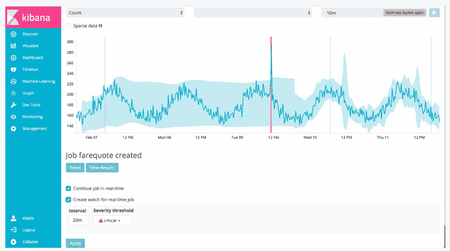

# Elasticsearch 不仅仅是为了搜索

> 原文：<https://dev.to/_codingblocks/elasticsearch-is-not-just-for-search-3fi1>

Elasticsearch 通常被描述为一个开源、可扩展的全文搜索和分析引擎。这是真的，但是这句话并没有真正告诉你开发人员实际上用它做了什么。

许多听到“搜索引擎”的人可能会对开发者使用它们的目的有先入之见，这要归功于它与诸如 [Google](https://www.google.com/) 、 [Bing](https://www.bing.com/) 或 [Duck Duck Go](https://duckduckgo.com/) 等服务的强烈关联。公平地说，Elasticsearch 的全文搜索也能给你类似的结果，但远没有谷歌那么复杂，但这只是一部分。

由于底层技术的本质和对水平可伸缩性的关注，Elasticsearch 也是一个非常棒的分析工具。“分析”是一个模糊的术语，所以我想列出 4 个弹性搜索的常见用例，希望更相关。

* * *

## 1。全文搜索

Elasticsearch 对[文本分析](https://www.elastic.co/guide/en/elasticsearch/reference/current/analysis-analyzers.html)有很大的支持。像同义词、停用词、词干、短语、模糊搜索和相关性评分这样的东西被嵌入并支持[许多不同的语言](https://www.elastic.co/guide/en/elasticsearch/reference/current/analysis-lang-analyzer.html)。我在这里举的例子是负责像谷歌这样的网站的搜索框。你搜索“空手道少年龟”，最后得到的结果是关于“忍者神龟”。科瓦邦加！

Elasticsearch 还内置了对自动完成和建议的支持。为什么要让你的客户猜测你能帮助他们找到你所拥有的信息呢？

<figure>[](https://res.cloudinary.com/practicaldev/image/fetch/s--odI4kOde--/c_limit%2Cf_auto%2Cfl_progressive%2Cq_auto%2Cw_880/https://www.codingblocks.net/wp-content/uploads/2019/04/image.png) 

<figcaption>这是关于“搜索引擎”</figcaption>

</figure>

的很多人的用例

## 2。电子商务/分面导航

全文搜索很棒，但这只是开发人员使用它的一小部分目的。Elasticsearch 在计数方面也很棒。

这对于电子商务应用程序来说非常重要，因为在电子商务应用程序中，用户会主动寻找符合他们需求的产品。在这些应用程序中，为用户提供一个搜索框是很常见的，就像上面的 Google 例子一样，但是给用户提供关于搜索结果的汇总信息也是很常见的，这样他们就可以快速找到他们想要购买的商品。

在下面的查询片段中，我要求 Elasticsearch 搜索一个“相机”，但我也要求按品牌、发布日期和价格范围对结果进行计数。如您所见，这个查询非常适合这些类型的用例。(注意:它同时返回正常搜索结果)

<figure>[](https://res.cloudinary.com/practicaldev/image/fetch/s--0NKvIIcI--/c_limit%2Cf_auto%2Cfl_progressive%2Cq_auto%2Cw_880/https://www.codingblocks.net/wp-content/uploads/2019/04/image-3.png) 

<figcaption>查看左侧导航！</figcaption>

</figure>

```
POST /products/_search?size=24 {
  "aggs": {
    "brand" : {
      "terms" : { "field" : "brand" }
    },
    "release_date" : {
      "date_histogram" : {
        "field" : "release_date",
        "interval" : "month"
      }
    },
    "range" : {
      "field" : "price",
      "ranges" : [
        { "to" : 100.0 },
        { "from" : 100.0, "to" : 200.0 },
        { "from" : 200.0 }
      ]
    }
  }
} 
```

Enter fullscreen mode Exit fullscreen mode

## 3。日志记录和分析

第二个用例借鉴了第一个用例的功能，在全搜索功能的基础上增加了聚合功能，以提供一个伟大的电子商务故事。同样，第三种情况，日志和分析，建立在前两种的基础上。

Elasticsearch 是水平可扩展的，这意味着如果你愿意为硬件买单，它可以很好地处理大量数据。

你说有多大？

对于组织来说，处理数十亿个文档，跨越数万亿字节的数据是很常见的。不算太寒酸！如果您将 Elasticsearch 的水平可伸缩性与它的计数能力结合起来，那么您就拥有了一个伟大的日志和分析工具的基础。一端是数据流，另一端是图表。Elasticsearch 索引数据的方式意味着这可以非常快速有效地完成。

你说有多快？

“几乎”实时。在这种情况下，“几乎”意味着在文档接收和准备返回之间会有一些延迟，但是接收和处理足够快，系统不会备份。您可能有 5 秒的延迟，但是(给定适当的硬件)该延迟应该保持不变。Elastic 公司还提供了一个很棒的工具 Kibana，用于创建和管理围绕 Elasticsearch API 构建的可视化。

这里的一个用例可能是像 [DataDog](https://www.datadoghq.com/) 这样的工具(他们赞助了几集代码块，但不是这篇文章)，它跟踪你的基础设施的健康状况。第三个用例背后的能力与前两个没有太大的不同，尽管最终结果看起来很不一样:

<figure>[](https://res.cloudinary.com/practicaldev/image/fetch/s--i95T_QU_--/c_limit%2Cf_auto%2Cfl_progressive%2Cq_auto%2Cw_880/https://www.codingblocks.net/wp-content/uploads/2019/04/image-1.png) 

<figcaption>这是一个基于来自 DataDog</figcaption>

</figure>

的近实时分析的定制仪表板

## 4。监控和警报

最后，Elasticsearch 支持“反向搜索”、机器学习和通知。这意味着您可以配置 Elasticsearch 根据一些预定义的设置代表您采取行动。这非常适合实时聚合，也非常适合其他三个用例。

比如当……

*   当出现不寻常的编辑或搜索模式时，维基百科会发出警报。
*   如果产品销售速度超过预期，亚马逊会发出警报
*   当关键服务器运行不佳时，DataDog 会发送通知

这些都是很方便的功能，虽然它们不一定是整个应用程序的必备功能，但这些通知对一个组织来说是至关重要的，当你通过已经成为你产品核心的工具(如 Elasticsearch)来“免费”获得这一功能时，就更好了。

注意:公平地说，该功能的一部分是在 Elasticsearch 之外用生态系统中的其他工具完成的，如 Kibana 和 X-Pack。(感谢 [Evaldas](https://dev.to/buinauskas) ！)

<figure>[](https://res.cloudinary.com/practicaldev/image/fetch/s--M4LfhjYD--/c_limit%2Cf_auto%2Cfl_progressive%2Cq_auto%2Cw_880/https://www.codingblocks.net/wp-content/uploads/2019/04/image-2.png) 

<figcaption>基于 Elastic 的 Kibana 工具创建警报，根据机器学习作业的结果发送警报。</figcaption>

</figure>

* * *

## 总之…

我提到了对 Elasticsearch 有意义的四个主要用例，并解释了为什么它们能如此完美地结合在一起。当谈到这些能力时，我讨厌想到有多少组织正在重新发明轮子，所以希望这篇文章对你有一些好处，以便你下次面临搜索或分析问题时知道你有什么选择。

PS:喜欢这个帖子？也许你也会喜欢播客！