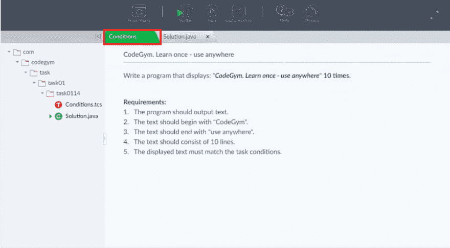
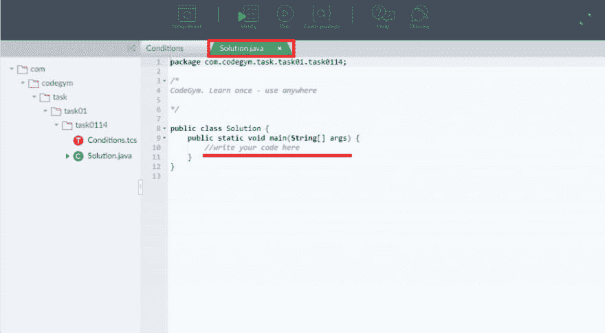
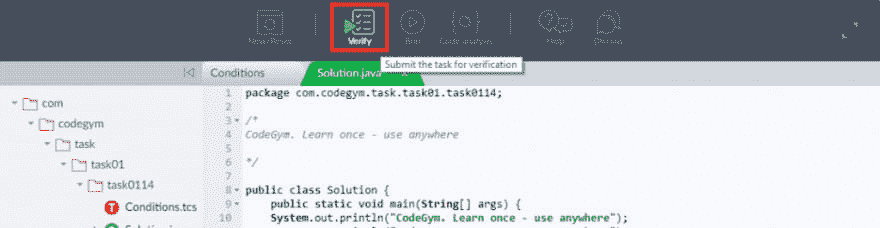
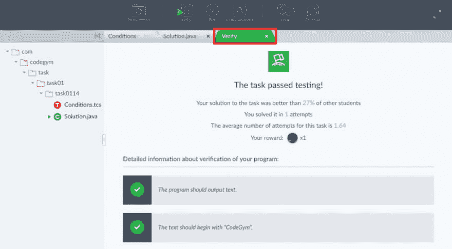
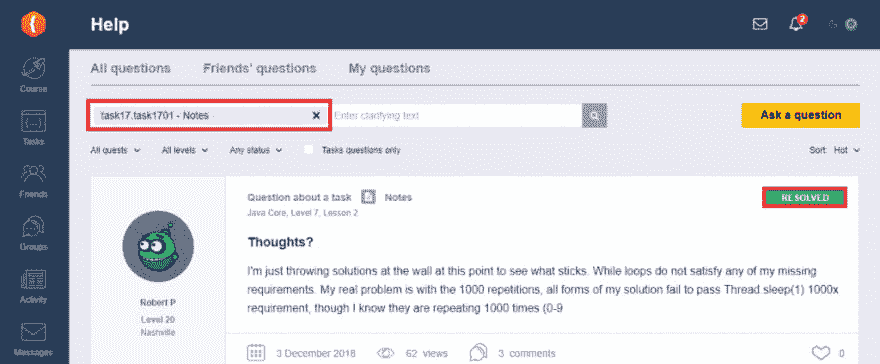

# CodeGym.cc:玩个游戏学习 Java 编程

> 原文：<https://dev.to/codegym_cc/codegym-cc-play-a-game-to-learn-java-programming-ibe>

游戏化的教育已经准备好将枯燥的学习踢出我们的生活。今天我们来看看 CodeGym.cc，一个游戏化的课程，在这里你可以从头开始学习如何用 Java 编程。

但首先，为什么要在几十种语言中选择 Java 来创业呢？统计数字没有说谎。在过去的 20 年里，Java 一直处于编程语言流行度排行榜的前列。今天，全世界有超过 1000 万的 Java 开发人员，对于新来者来说有足够的空间。

Java 无处不在:大数据开发、物联网、企业解决方案，甚至太空探索。它是一种灵活、安全、跨平台和多用途的编程语言，可以为任何设备编写程序。

更重要的是，得益于广泛的在线课程，你可以在任何地方学习编程。让我们看看，学习 Java 编码的最好方法是什么，当你独自学习时，有没有可能不失去动力。

CodeGym.cc 是一个相对较新的掌握 Java 编程的在线平台。以下是本课程的五个主要特点，可能有助于学习如何用 Java 编写代码，并对它有信心。

## 1。面向初学者的游戏化 Java 教程

CodeGym.cc 面向零编程经验的学习者。尽管具有开发人员背景的学生肯定会接受这个平台的许多特性。

该课程采用多种游戏技术，旨在提供更好的学习体验，并帮助用户清除主要障碍——缺乏自学动力。在这种情况下，一个未来主义的情节，生动的人物和通过现实生活中的例子解释复杂概念的方式正在推动学生前进。

CodeGym 的故事情节在未来扩展。这是 3018 年，宇宙飞船坠毁在一个“野生”的机器人星球上。船员需要教他们编程来清除岩石和释放船只。一个用户的角色是一个名叫 Amigo 的年轻机器人，他将通过**四个教育任务**学习 Java 基础知识。

每个任务都引导用户完成某个一般主题，如 Java 核心、Java 语法、Java 集合和 Java 多线程。每个任务包括 10 个级别，12-13 节课和几十个不同的任务。

要成为一名程序员，你需要编码——这是这门课程的座右铭。这正是你在这个在线平台上大约 80%的时间需要做的事情。如果你想进步，想开新课，你需要一种“暗物质”，这种物质是你完成任务而获得的。

Java 中的每个新主题都由一名成员解释，而约翰·松鼠船长负责在每一关开始时带来一点动力。所有的讲座都是以对话的形式写的，有笑话和容易理解的例子。想象一下，你正在读一个有趣的故事，同时在学习 Java。听起来很酷，对吧？

## 2。从第一课开始，长达 500 多个小时的练习和编码

同样，编码技能只有通过实践才能提高。要记住一个新的理论，而不试图立即实施你刚刚学到的东西，这几乎是不可能的。

CodeGym 提供了练习 Java 编程的强大功能。总的来说，有三种不同类型的 1200 多项任务:

*   **编写自己的代码**
*   **修复源代码**
*   **重新键入代码部分**

该课程让学生习惯使用专业 Java 开发人员的工具，如 IntelliJ IDEA。尽管直接在 CodeGym.cc 网站上在线解决任务仍然很方便。每个任务都显示在一个框架(web IDE)中，带有不同的选项卡。第一个包含任务要求:

仔细阅读后，点击“解决方案”选项卡编写代码或修复源代码:

然后单击“验证”按钮检查您的解决方案:

在验证器将解决方案与任务需求匹配之后，您将在几秒钟内得到结果。

每一个成功的解决方案都会给你带来一些“暗物质”的信息。当然，更复杂的任务会给你带来更多的回报。

## 3。改进代码的有用提示

你在学习的时候很少考虑代码的风格，这没什么。首先，你需要掌握 Java 基础知识。但是代码的风格是区别专业人员和初学者的地方。完成解决方案后，单击“代码分析”按钮，从 CodeGym 的虚拟导师那里获得一些建议，并改进您的代码。

## 4。Java 基础与现实生活中的例子

说实话，学 Java 编程是有可能学无止境的。一个伟大的软件开发人员将终生研究一些新的东西，以扩大他的技术堆栈并跟随潮流。

但是你只需要很少的理论学习就可以开始编程并获得初级职位。在 CodeGym 的课程中，你将在短时间内获得最基本的理论，为进一步的职业发展打下坚实的基础。

课程中的每堂课都很简短，易于阅读。阅读新主题需要 5 到 10 分钟，然后直接进入任务。

## 5。一个不断发展和有益的社区

需要解决棘手任务的提示吗？当然，有一天你会需要它。CodeGym 有一个“帮助”部分，在这里你可以讨论任何任务，并从其他学生和熟练的软件开发人员那里获得解释。

此外，您可以在 CodeGym 的“组”部分讨论编程领域的几乎任何主题。现在说 CodeGym 是 Java 编程内容的一个很好的来源还为时过早，但是还有很多额外的材料，它们增强了课程本身。

**结论**

CodeGym 是一门以花式的方式通过实践学习 Java 编程的课程。

**优点:**

*   动手实践，大量的即时验证和代码改进技巧的酷任务；
*   寓教于乐的游戏化学习，而不是枯燥的讲座和视频教程；
*   继续学习直到掌握编码的强烈动机。

**缺点:**

*   需要额外的阅读来彻底理解 Java 语言；
*   目前，还没有完全适应在移动设备上学习。

发表在[技术通知博客](https://www.technotification.com/2019/04/play-game-to-learn-java-codegym.html)上