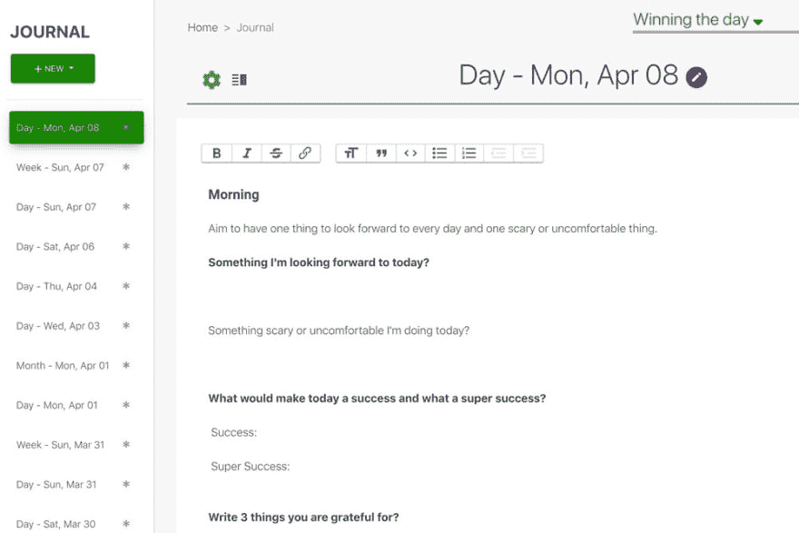
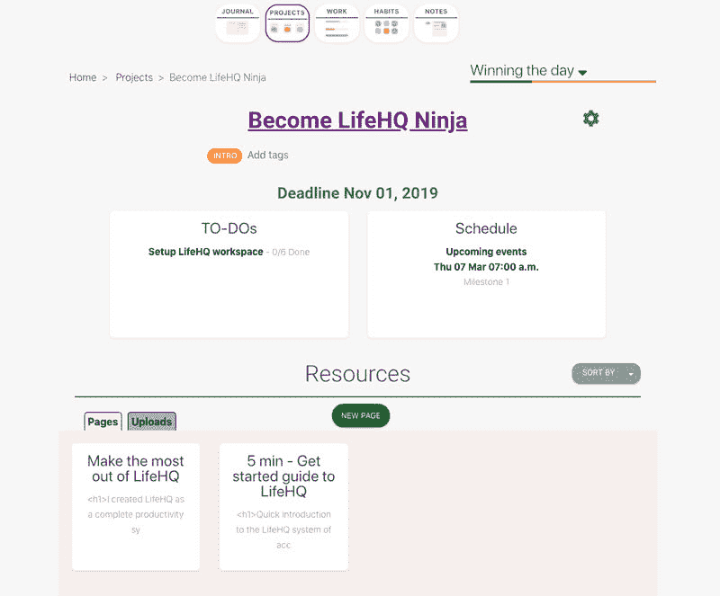
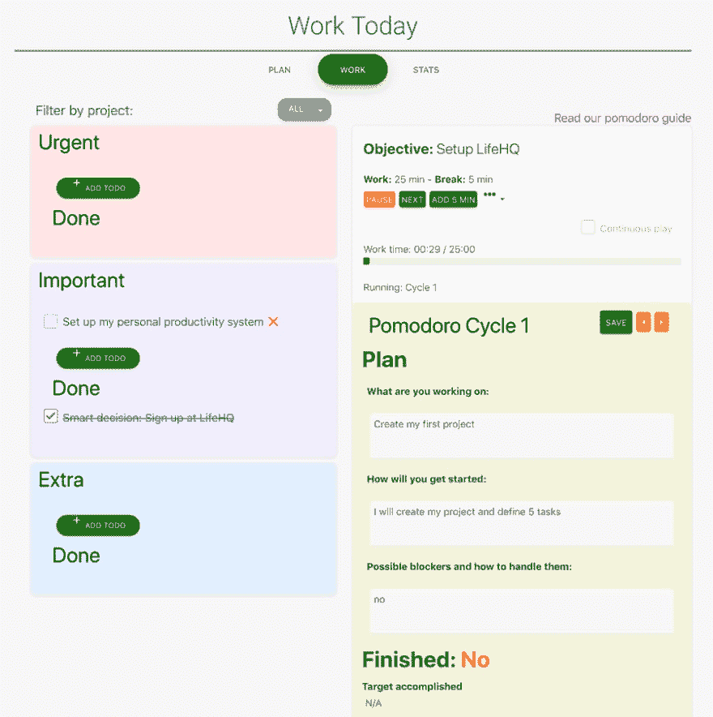

# 项目管理点缀着生产力和一点自我改进

> 原文：<https://dev.to/darkokolev/project-management-sprinkled-with-productivity-and-a-dash-of-self-improvement-1fi1>

### 将项目管理与生产力和自我提升相结合的愿景。

## 自我提升:变得更有能力去做工作

习惯:养成健康的习惯，让你有更多的精力、更健康的身体和精神，从而在更短的时间内完成更多的事情

写日记:只有在你坚持不懈的情况下才有帮助。记录下你每天的活动，至少是对你重要的部分，然后每周回顾你的日记到你的周记中。
这是检测你是否忙得团团转、无所事事或者你是否在正确的道路上的最快方法。如果向前移动，注意它是否是正确的方向，如果需要的话，调整路线。

## 项目管理:组织工作

一切都可以设定为一个项目，减肥，创业，开播客，组织活动。一旦你把任何目标具体化，它就会变成一个项目。
将你的目标组织成有具体任务、期限和文件的项目。

每天晚上使用主列表来计划第二天的任务。

## 生产力:做工作时，更加专注和富有成效

使用先进的番茄工作法在小范围内集中精力工作。更短的时间更容易防止分心和集中注意力。

## 是谁的

显然，任何人都可以从变得更好、更有条理和更快地工作中受益。

但不是每个人都会这么做。有的人懒，有的人走不出现在的套路。其他人已经有了适合他们的系统，这也很好。了解你的产品不适合谁也很重要。

### 两组人将从生活中获益最多

#### 第一组:你有一个系统，但是它坏了

通常那些已经有一个系统的人知道生产力，组织很重要，他们生活中有很多事情要做。

#### 企业家和自由职业者

人们为自己工作，并试图让他们的业务起飞。

他们已经尝试了许多生产力应用程序，并试图将它们结合到一个管理他们生活的系统中。

可能有 3 或 4 个不同的应用程序，但最终只使用他们必须使用的程序，那些有实际工作的程序。几天后，所有的习惯、日志和番茄工作法应用程序都会被遗忘，因为它们是最好的，而不是必须的。

LifeHQ 通过项目管理模块吸引你来解决这个问题，但一旦你到了那里，写日记、检查你的习惯和旋转几个工作周期就变得如此容易。

#### 第二组:没有任何系统

在这个小组里，我会安排学生，还有任何一个在新环境中想要证明自己的人。

刚开始学习的学生需要在学院或大学证明自己。

学生在学业结束后开始第一份工作时，必须在新的工作场所证明自己。

他们会更容易理解 LifeHQ，因为他们以前没有不良模式和生产力系统的经验。

## 主动软件

主动软件不仅仅是功能性的。它帮助你尽快成为超级用户。
因此，您可以更快地获得签约时获得的好处:生产力、组织性和一致性。

### life HQ 如何主动出击

*   LifeHQ 是一个现成的系统，2 分钟内即可使用。
*   所有 4 种类型的日志都有不同的模板，所以你永远不会盯着一个空白的屏幕不知道该写什么。
*   LifeHQ 知道你今天需要完成什么，并在早上、中午和晚上提醒你当天还剩下什么。
*   当你第一次登录时，你已经有了一个用真实任务创建的项目，用你的目标、项目和习惯来个性化你的系统。
*   介绍之旅:所有模块都有介绍之旅，解释你在每一页上看到的一切。

为了大幅提高你的工作效率，完成你的项目，并简单地完成更多免费试用。