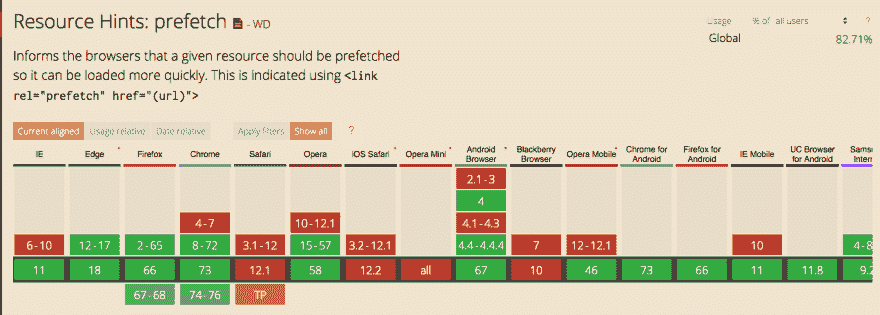
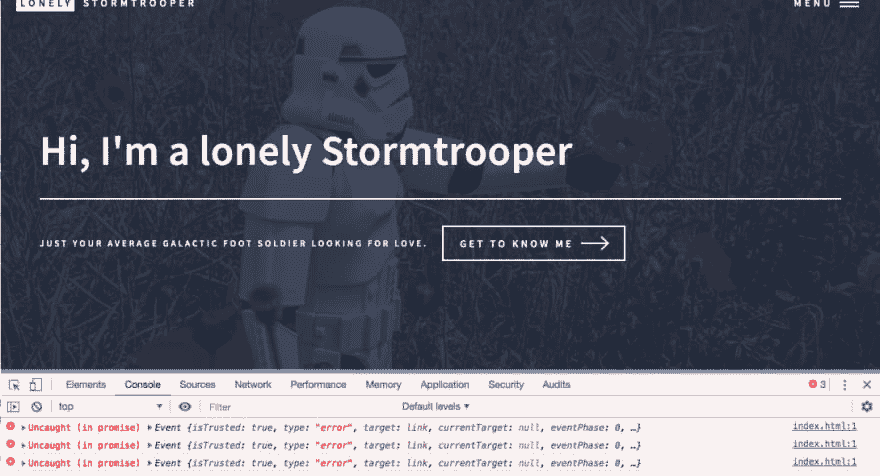
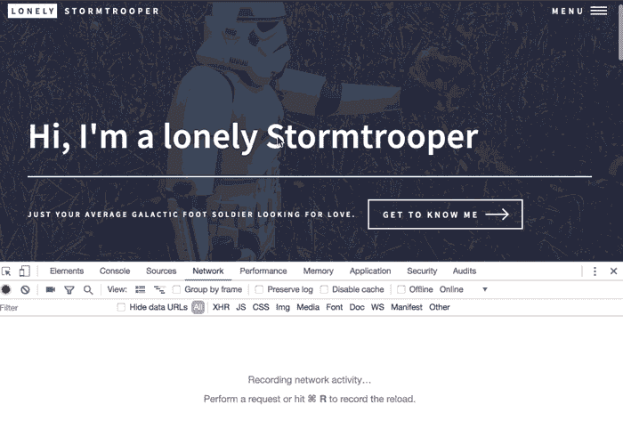

# 通过预取提升感知性能

> 原文：<https://dev.to/remotesynth/promoting-perceived-performance-with-prefetching-57c7>

你的网站的实际表现和人们对它的看法总是有差异的。这种可感知的性能受到许多因素的影响，其中一些因素是您无法控制的，从网络或连接速度到不同的用户期望。作为一名开发人员，实际的站点性能在很大程度上是您可以控制的，但是最终用户如何看待您的站点的性能，在很大程度上是您无法控制的。

这就是为什么一些新项目让我着迷。他们试图通过使用不同的方法来预取他们可能加载的内容，以允许它在他们想要的之前加载*，从而提高最终用户的感知性能。*

在这篇文章中，我想看看两个库:  和  。两者都试图利用`<link rel="prefetch>`特性来加载页面。这项功能相对较新，并未得到全面支持，这一点您可以在[caniuse.com](https://caniuse.com/#feat=link-rel-prefetch)的支持列表中看到。

[](https://res.cloudinary.com/practicaldev/image/fetch/s--3O9SsQo_--/c_limit%2Cf_auto%2Cfl_progressive%2Cq_auto%2Cw_880/https://thepracticaldev.s3.amazonaws.com/i/che0ca9ktzi4ajr7r2ep.png)

> 在伊凡·阿库洛夫的[这篇精彩文章中了解关于`preload`、`prefetch`、`preceonnect`和其他类型的`<link rel>`标签的所有信息。](https://3perf.com/blog/link-rels/)

## 快速链接

[Quicklink](https://github.com/GoogleChromeLabs/quicklink) 是谷歌 Chrome 实验室的一个项目。它旨在预取视图中的任何链接，以加速后续的页面加载。它依靠两个更新的浏览器 API 来做到这一点:[交集观察者](https://developer.mozilla.org/en-US/docs/Web/API/Intersection_Observer_API)和[请求回调](https://developer.mozilla.org/en-US/docs/Web/API/Window/requestIdleCallback)。

这些新的 API 不是普遍支持的，这意味着你必须使用一个或多个 polyfills(取决于你需要支持哪些浏览器)，否则支持仅限于 Chrome，Firefox，Edge，Opera，Android 浏览器，Samsung Internet。

让我们快速看一下如何在一个简单的网页中使用它。基本示例非常简单，只需在页面加载后调用`quicklink()`即可，方法是为 load 事件添加一个侦听器，或者只是将`<script>`标记放在结束的 body 标记之前。

```
window.addEventListener('load', () =>{
    quicklink();
}); 
```

Enter fullscreen mode Exit fullscreen mode

您不会收到任何内容已加载的通知，但您应该会立即注意到您单击的链接的加载时间有所改善。

还有一堆定制选项。默认情况下，这个库使用 XHR 来加载所有的链接，但是你可以让它使用 fetch API 并依靠 XHR:

```
quicklink({ priority: true}); 
```

Enter fullscreen mode Exit fullscreen mode

您还可以指定它应该预取的 URL，以防您想要限制它尝试预取的数量(基本上是当前视口内的任何内容)。例如，您可以指定一个包含要预取的 URL 的 DOM 元素。

```
const nav = document.getElementById('menu');
quicklink({ el: nav }); 
```

Enter fullscreen mode Exit fullscreen mode

您还可以指定要预取的 URL 的自定义数组，甚至是要忽略的 URL 的模式。

值得注意的是，默认情况下，这仅加载当前来源的内容(即相同的 URL)。这是因为除非其他人启用了 [CORS](https://developer.mozilla.org/en-US/docs/Web/HTTP/CORS) ，否则您将会遇到跨来源的安全问题。无论您指定一个 URL 列表，还是使用 fetch 或 XHR，都是如此。

要覆盖此行为，您可以指定一个允许原点的列表，也可以允许所有原点。

```
quicklink({origins: true}); 
```

Enter fullscreen mode Exit fullscreen mode

然而，允许 all 会导致一长串跨源脚本错误，这可能是您想要避免的，如下所示(这是在我为此创建的一个简单站点上进行的本地测试)。

[](https://res.cloudinary.com/practicaldev/image/fetch/s--hJ7QLcq9--/c_limit%2Cf_auto%2Cfl_progressive%2Cq_auto%2Cw_880/https://thepracticaldev.s3.amazonaws.com/i/fez4jki1602cnanjl47a.png)

总之，该库易于使用，即使接受浏览器兼容性问题，它也可以是一个非常容易的渐进增强，以提高支持它的浏览器的感知性能。

## instant.page

[instant.page](https://instant.page/) 用不同的方法解决同样的问题。它不是加载视窗中的所有内容，而是查看用户正在悬停或点击的内容，然后开始预取该内容。这防止了预加载太多的问题，而是专注于只预加载用户可能点击的内容。

这种方法的改变也影响了技术实现。instant.page 不依赖于`IntersectionObserver`或`requestIdleCallback`，因为它只根据`touchStart`或`mouseover`事件预取项目。然而，它仍然依赖于目前 Safari 或 Edge 不支持的`<link rel="prefetch">`。出于这个原因，它也被设计为一个渐进的增强，这意味着它将改善支持它的地方的体验，而不是伤害它不支持它的地方。

使用 instant.page 只是简单地包含它。

```
<script src="//instant.page/1.2.2" type="module" integrity="sha384-2xV8M5griQmzyiY3CDqh1dn4z3llDVqZDqzjzcY+jCBCk/a5fXJmuZ/40JJAPeoU"></script> 
```

Enter fullscreen mode Exit fullscreen mode

instant.page 的配置比 quicklink 少，但也有一些。例如，与 quicklink 一样，默认情况下不会预加载外部链接，但是将`data-instant-allow-external-links`添加到 body 标签会自动尝试预加载来自任何 URL 的链接，或者您可以通过向它们添加一个`data-instant`属性来指定特定的 URL。有趣的是，在我的本地示例中，这并没有产生跨源脚本错误。在下面的记录中，你在 network 选项卡中看到的唯一失败的加载是一个专门为测试目的而不存在的页面。

[](https://res.cloudinary.com/practicaldev/image/fetch/s--0gPig9bV--/c_limit%2Cf_auto%2Cfl_progressive%2Cq_66%2Cw_880/https://thepracticaldev.s3.amazonaws.com/i/zuws2ow79owcw7yefmds.gif)

我认为这只是实现上的差异，而不是功能上的差异，因为页面加载速度并没有明显加快，而且类似的 quicklink 测试也以类似的方式出现在 network 选项卡中，但确实触发了控制台错误。

还有一些类似的属性用于定制其他行为，比如允许预取带有查询字符串的页面(默认情况下不会预取，因为有些属性可能会触发某个操作)，或者指定不加载特定的链接。

## 有帮助吗？

测试感知性能是一项艰巨的任务。性能到底有多好取决于很多因素，包括用户的连接速度、网站的加载时间等等。它可能是很难精确测量的东西。我的本地演示没有做到技术公正，因为本地的一切都加载得很快，演示本身也相对简单——所以即使在外部托管上，可感知的差异也可能很小。在没有启用 CORS 的情况下，以这种方式加载大型外部站点的限制增加了测试和测量的难度。

quicklink 背后的谷歌 Chrome 实验室团队承认了这个问题。他们创建了一个更复杂的示例，并发现 quicklink 可以将页面加载性能提高多达 4 秒，正如他们在视频中演示的那样。这将是戏剧性的，但你的里程可能会有所不同。

也就是说，这两个库都非常容易实现，而且我发现它们没有什么缺点，所以使用它们似乎没有什么坏处——即使用户感觉到的性能有一点点提高，也会产生很大的有益影响。