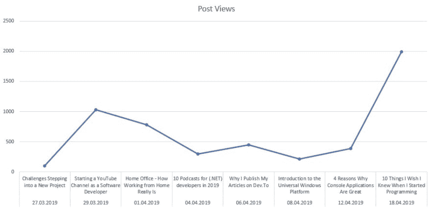

# 向 Dev 交叉发布四周的结果。到

> 原文：<https://dev.to/claudiobernasconi/the-results-of-four-weeks-of-cross-posting-to-dev-to-3d8b>

四周前，也就是 3 月 27 日，我决定给 dev.to 一个机会，发表了我的第一篇文章。这是一篇交叉发布的文章，我最初发布在我的博客上。

四个星期后，我认为这是一个回顾努力是否值得以及我的文章表现如何的好时机。毕竟，我想接触尽可能多的开发者。

到目前为止，我已经发表了八篇文章，这意味着我平均每周发表两篇文章。所有这些都是我博客上的交叉帖子。其中一些文章在同一周发表在我的博客上。其他文章是几周前的。

# 帖子视图

让我们来看看我的八篇文章的总体结果。我得到了 **5100+的浏览量**，这意味着我的文章平均总共得到了大约 640 的浏览量。每篇文章每天大约被阅读 23 次。

我有两篇文章，这两篇文章都占据了帖子的大部分浏览量。我最好的一篇文章获得了大约 2000 次浏览，第二好的文章获得了大约 1000 次浏览。这意味着其他 6 篇文章加起来只有 2000 次浏览。我的一篇文章甚至没有超过 100 次浏览。这是我第一篇关于 dev.to 的文章。

# 追随者

Dev.to 允许读者关注作者。我的八篇文章让我在四周内拥有了 1050 名粉丝。我在 dev.to 上读到过，他们向新用户推荐作者。

我假设一些人跟随了建议功能，因为 5000 个帖子中的 1050 个追随者将占 21%。我不认为有 21%的人会点击关注按钮。如果是真的，那就太棒了！

# 反应

dev.to 上的读者可以对一篇有爱心、有独角兽的文章做出反应，或者把这篇文章放在他们的阅读清单上。所有这三个动作合起来称为反应。我的八篇文章总共得到了 **306 个反馈**，这意味着每篇文章平均得到了大约 38 个反馈。

# 注释

我的文章总共有 17 条评论。其中一些意见是我对社区意见的回应。除去我的评论，我的文章有 **14 条评论**，这意味着一篇文章平均得到 1.75 条评论。

让我们仔细看看所有发表的文章和详细的统计数据。

# 按条表现

下图从左至右显示了按发布日期排序的文章的浏览量。

第二篇也是我最后一篇发表的文章是帖子浏览量最多的文章。

下表包含了每篇文章的所有数字，包括浏览量、反应和评论数。

| 出版 | 标题 | 视图 | 反应 | 评论 |
| --- | --- | --- | --- | --- |
| 27.03.2019 | [挑战步入新项目](https://dev.to/claudiobernasconi/challenges-stepping-into-a-new-project-1b8a) | Ninety-nine | five | Zero |
| 29.03.2019 | [以软件开发人员的身份创建 YouTube 频道](https://dev.to/claudiobernasconi/starting-a-youtube-channel-as-a-software-developer-16n9) | One thousand and twenty-eight | Eighty-one | four |
| 01.04.2019 | [家庭办公室——在家工作到底有多难](https://dev.to/claudiobernasconi/home-office-how-working-from-home-really-is-5a59) | Seven hundred and seventy-nine | forty-two | Two |
| 04.04.2019 | 10 个播客。NET)2019 年开发者 | Two hundred and ninety-eight | nine | one |
| 06.04.2019 | 我为什么在 Dev 上发表文章。至 | Four hundred and forty-four | forty-four | three |
| 08.04.2019 | [通用 Windows 平台简介](https://dev.to/claudiobernasconi/introduction-to-the-universal-windows-platform-1a0d) | Two hundred and fourteen | Nineteen | Two |
| 12.04.2019 | [控制台应用如此出色的 4 个原因](https://dev.to/claudiobernasconi/4-reasons-why-console-applications-are-great-3pnd) | Three hundred and eighty-eight | Sixteen | three |
| 18.04.2019 | [我希望在开始编程时就知道的 10 件事](https://dev.to/claudiobernasconi/10-things-i-wish-i-knew-when-i-started-programming-51al) | One thousand nine hundred and ninety-five | Ninety | Two |
|  | **总计** | Five thousand two hundred and forty-five | Three hundred and six | Seventeen |

# 结论和解释

我写了一篇文章，讲述了我为什么给 dev.to 一个机会，以及我对这个平台的设想。现在我有了一些自己写的文章的统计数据，我想看看我的假设是否正确。

首先，5000 的帖子浏览量没那么多。我的博客收到了大约 8000 个帖子。好吧，我的博客包含 60 篇文章，但是驱动流量最大的文章总是最新的文章，除了[一篇通过谷歌为我带来大量有机流量的文章](https://www.claudiobernasconi.ch/2013/07/22/when-to-use-ienumerable-icollection-ilist-and-list/)。

5000 的帖子浏览量也不错。我对这个数字很满意。作为 Dev.to 上的一名新作者，我认为我可以为 5000 名读者找到我的文章感到自豪和满意。

现在我们来谈谈令人印象深刻的数字。306 反应巨大。我有 6%的参与度，这与我的博客相比是很突出的，在我的博客中，人们对我的帖子只有很小一部分的反应。好吧，对我博客上的帖子做出反应的唯一方式是写评论——不是公平的比较。

尽管如此，我对这 5000 名读者的 300 多条反应感到高兴。人们想阅读我要说的话，这让我感觉很好。

1050 名追随者。多好的数字。当我在 dev.to 上发表我的第一篇文章时，我从未想到我在不到一个月的时间里达到了四位数。看来人们真的很喜欢我的内容，想从我这里读到更多。

这个数字最能激励我继续旅程，并思考可以与读者分享的有价值的内容。

我希望那些追随者中的一些人会回来阅读我未来的文章。如果我的文章有很大价值，我也希望一些读者开始通过在社交媒体上分享来传播我的文章。这将帮助我接触到更多的读者，并进一步扩大我的追随者。

只有四个星期。我很好奇接下来会发生什么。我唯一确定的是，我将继续在 dev.to 上交叉发布我的内容。这是一个很好的平台，结果不言自明。

**你在 dev.to 上写作的结果是什么？**请在下面的评论中告诉我。

*本文原载于 2019 年 4 月 24 日 [claudiobernasconi.ch](https://www.claudiobernasconi.ch/2019/04/24/the-results-of-four-weeks-of-cross-posting-to-dev-to/) 。*