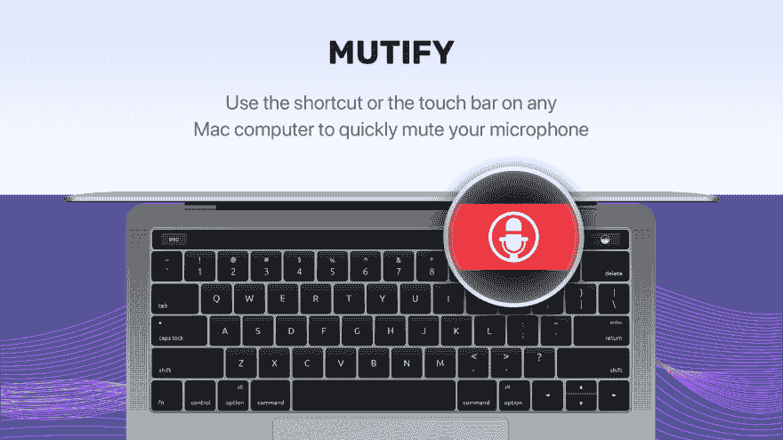
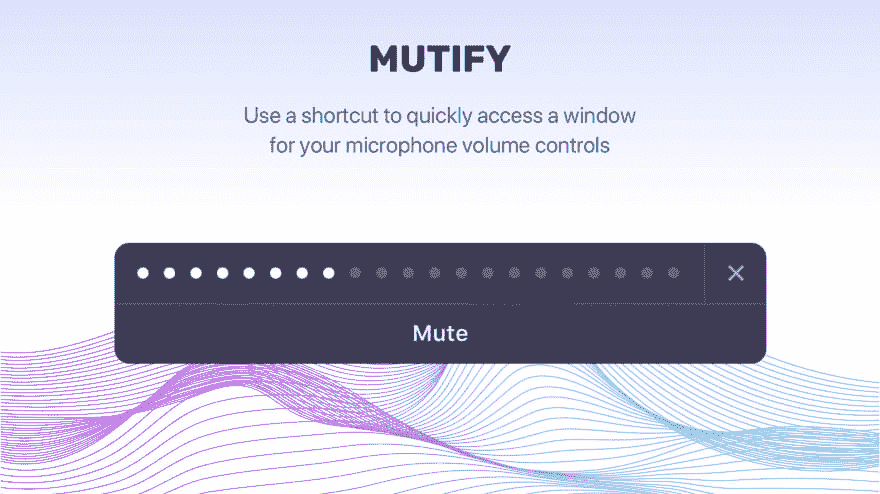
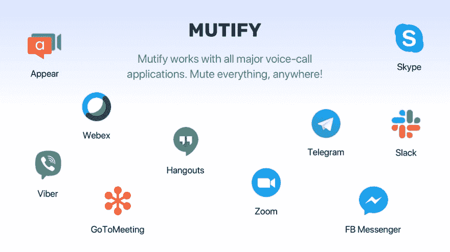

# 构建自己的 MacOS 应用程序的挑战

> 原文：<https://dev.to/alex_barashkov/the-challenges-of-building-own-macos-app-1acd>

两年前，我们开始构建一个简单的开源 MacOS 应用程序，作为一个附带项目，但这证明是一个比我们最初想象的更具挑战性的旅程。在这里，我们讨论这一旅程的各个阶段，包括:

*   我们如何使用快捷方式或触摸条图标构建[应用来静音/取消静音麦克风](https://mutify.app/);
*   为什么采用开源方法没有达到我们的期望；
*   苹果对 touchbar 设置了哪些限制，使得它无法满足我们的需求。

我们刚刚发布了产品搜索的 Mutify 应用程序，所以现在我们正在等待您的反馈和支持！

[https://www.producthunt.com/posts/mutify](https://www.producthunt.com/posts/mutify)

### 💡最初的想法

我经常在工作日中间花大量时间打电话，与从事各种不同项目的技术团队讨论任务、解决方案和未来计划。打电话的时候，我喜欢在不说话的时候把麦克风静音。然而，在这些会议中，我经常在浏览器选项卡之间切换或查看演示文稿，这使得我很难在搜索我需要的选项卡和取消静音图标时快速取消静音。为了解决这个问题，我开始使用带有 touchbar 的 MacBook 2016，认为在 touchbar 上添加静音按钮可能是一个有效的解决方案。这是引发最终导致我们新应用的旅程的原因。

### 从开源到付费 App

原则上我们对开源相当满意，所以我们最初开发了第一个版本的应用程序作为开源项目，自己投资成本。我们发布了它并做了一些推广，得到了积极的反馈，但也注意到了一些 bug。MacOS 比我们想象的更成问题。我们面临的特殊问题包括:

*   其他应用程序试图控制麦克风时出现的问题
*   不同版本的 MacOS 之间的兼容性
*   苹果公司设置的限制需要仔细调查

我们的应用程序社区定期增长，以便我们可以让一些贡献者能够帮助处理出现的问题。不幸的是，这并没有发生。从第一天开始，所有的开发都是我们自己完成的；Swift 上的开源开发与 JS 或 PHP 社区有很大不同，在那里你可以依赖外部开发者的小错误修复。这种有益社区的缺乏是 MacOS 开发的一个主要弱点。

我们在 Github 上有 159 颗星，超过 8000 个安装，零贡献者。然而，该应用程序仍然需要大量的工作来完成，所以我们决定从头开始重建它，并改为付费模式，以保证至少为未来的开发和应用程序改进提供一些支持。那如何[残害](https://mutify.app/)就诞生了。

#### 毁伤特征

#### 静音和取消静音麦克风

随时可用的热键或触摸条图标来静音和取消静音。

#### 噪音等级

显示当前的环境噪音水平，帮助您跟踪何时需要静音。

#### 综艺 app 支持

使用它与 Hangouts，Zoom，GoToMeeting，Skype，Telegram 等。不同的通话应用程序试图控制麦克风，但应用程序允许您保持控制。

### MAC OS App 开发的难点

我们几乎在发展的每一步都遇到了问题。很难构建一个完全定制的 UI，因为我们不想使用标准组件。当我们开发了一种低级别静音应用程序的方法时，一些应用程序在没有用户输入或通知的情况下取消静音。例如，当试图将麦克风静音并在 MacOS 设置中显示完全禁用时，GoToMeeting 或 GoToWebinar 只需在检测到麦克风已静音时再次取消静音即可。在与这些应用的支持团队讨论后，他们坚持认为这是正确的行为。从我们的角度来看，这是危险的，因为这表明会议应用程序只想一直听你说话。我们不得不寻找复杂的变通办法，以确保麦克风总是在我们希望的时候静音。

从第一天开始，我们就认为苹果会扩展 touchbar API 的功能，但目前还没有任何变化。Touchbar API 有很多限制，阻止开发人员使用它来构建潜在有用的软件。

例如:

*   在“自定义触摸条”设置中，第三方应用程序不能显示在触摸条的操作列表中；

*   您只能添加一个第三方应用程序图标，该图标总是与 Apple 开发的工具一起显示在 touchbar 中；

这些限制大大减少了扩展 touchbar 功能的可能性。这就是为什么我们也支持热键静音功能。即使对于一个简单的单动作应用程序，您也需要时间来构建如下功能:

*   入职屏幕
*   更新功能
*   集成支付功能
*   登录时打开功能
*   热键支持
*   网站(全球资讯网的主机站)

### 努力=质量

我们从这个项目中学到的主要教训是，做好一件事总是意味着不同技能的不同人的大量辛勤工作，包括一些不总是与应用程序的主要功能相关的工作。然而，最终，来自我们客户的积极反馈和使用我们自己的应用程序的个人满意度使我们觉得值得努力。

支持我们的[产品搜寻活动](https://www.producthunt.com/posts/mutify)，享受 30%的折扣！Mutify 也有一个七天的免费试用期，所以请随时测试它，我们希望你喜欢！