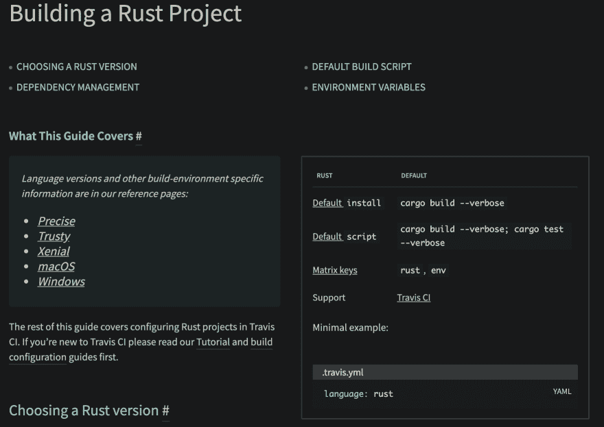
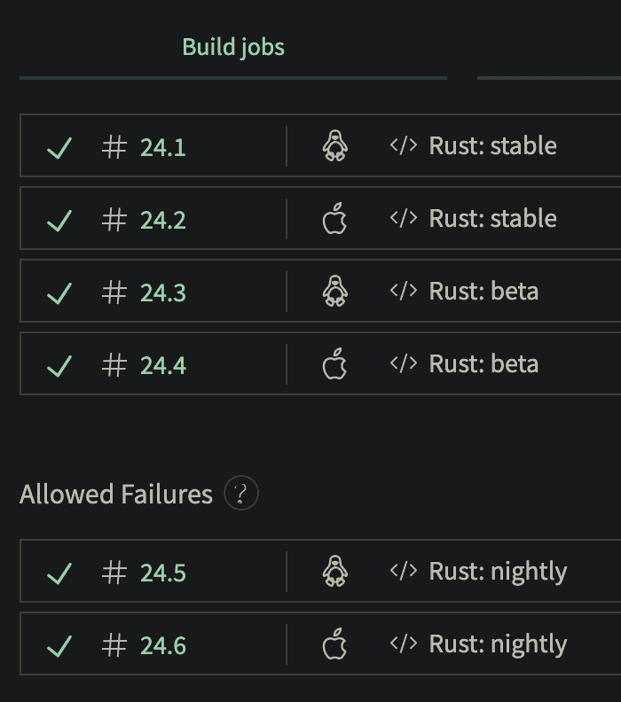
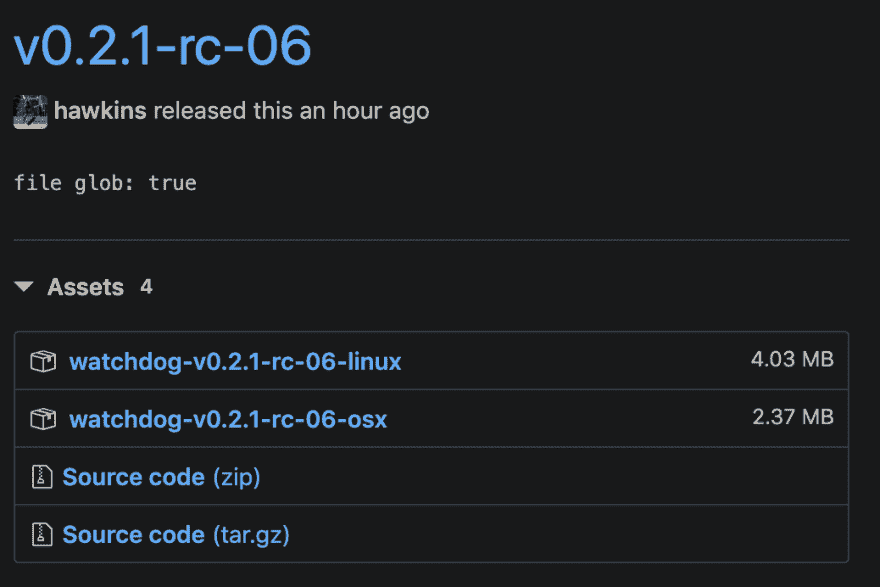

# 利用 Travis-CI 进行持续部署，将编译后的二进制文件发布到 GitHub

> 原文：<https://dev.to/hawkinjs/leveraging-travis-ci-for-continuous-deployment-to-publish-compiled-binaries-to-github-2k06>

最近，我在 Mac 上的 Rust 中编写了一个名为 [Watchdog](https://github.com/hawkins/watchdog) 的二进制文件，我想把它带到我经常使用的 Linux 系统中，但由于一些不相关的原因，我无法把 Rust 编译器带到这些系统中。这意味着我必须交叉编译我的应用程序，并且只发布二进制文件。

现在，我在这篇文章中做了一些自由展示，作为一个概念验证，但最值得注意的是*我没有处理动态链接库*。我发布了一个独立的二进制文件，也就是说，我构建的这个文件包含了它需要运行的所有东西，假设你在正确的平台上运行它。或者，我天真地希望——事情绝对可以比这更复杂。

* * *

## 什么是交叉编译？

交叉编译就是把你的代码在一个平台(对我来说是 Mac OS)上编译到另一个平台(对我来说是 Linux)上运行。如果您更熟悉 Ruby、JavaScript 和 Python 等语言，这可能没有太大意义，因为您的代码很可能已经运行在不同的平台上。但是对于 Rust，C++，C 等编译语言来说。，我们必须把它编译成可以在特定平台上运行的代码。这就是我们在这里所做的，我们在我的 Mac 上编译我的 Rust 代码，以便在另一台运行 Linux 的计算机上运行。

您可以在本地计算机上配置交叉编译，但是这可能很困难，并且经常会有一些大问题。当[在 rust for mac- > linux](https://github.com/hawkins/district-doughnut) 中交叉编译一个 lambda 函数时，我已经处理了这个问题。特别是，让 OpenSSL 正常运行简直是一场噩梦，扼杀了我几个月的动力。最终，我把这个问题抛到了一边，说我将引入 Docker 来解决它。您的里程可能会有所不同。

因此，我们将利用 Travis CI 免费进行本地编译，而不是本地编译。从技术上来说，这不是*交叉编译，因为 Travis 将在 Linux VM* 中编译它，但是完成的目标是相同的——为平台构建我的应用程序，否则我不能。所以，如果你想把我当成点击诱饵，我欢迎-我只是想不出更好的方式来描述我们在这里做什么！

## 你的代码在哪里？

你可以在我的 GitHub 项目上看到我为这篇文章写的所有代码！

##  [霍金斯](https://github.com/hawkins) / [看门狗](https://github.com/hawkins/watchdog)

### ⚠️观察文件系统变化，然后运行一个命令

<article class="markdown-body entry-content container-lg" itemprop="text">

# 看门狗

<g-emoji class="g-emoji" alias="warning" fallback-src="https://github.githubassets.cimg/icons/emoji/unicode/26a0.png">⚠️</g-emoji> 观察文件系统的变化，然后运行一个命令

非常适合自动运行`make test`或类似命令来响应文件更改。

## 使用

TODO:这还不稳定，但这里是 0.2 时`--help`的输出:

```
USAGE:
    watchdog [FLAGS] [OPTIONS] <COMMAND> [-- <PATH>...]

FLAGS:
    -h, --help       Prints help information
    -V, --version    Prints version information
    -v, --verbose    Enables verbose output

OPTIONS:
    -g, --glob <GLOB>    Glob used for matching files

ARGS:
    <COMMAND>    Command ran on response to changes
    <PATH>...    File path(s) used for matching files 
```

## 目标

*   选择要观看的文件的简单、直观的方法
    *   正则表达式(#1)
    *   全球
        *   通过你的外壳和生锈的内部，选择你的毒药！
    *   显式文件路径
*   明智的 GNU `make`互操作(#4)
*   简单、另类的 API
    *   这是个简单的问题。因此，保持解决方案简单，太愚蠢了。

</article>

[View on GitHub](https://github.com/hawkins/watchdog)

## 初始 Travis 配置

Travis 让我们通过代码来配置它，所以在我设置“交叉编译”之前，我的初始`.travis.yml`文件看起来是这样的:

```
language: rust
rust:
- stable
- beta
- nightly
matrix:
  allow_failures:
  - rust: nightly
  fast_finish: true
os:
- linux
- osx
deploy:
  # This part's not very relevant to this blog post, we'll add a new deploy step though, so I'll keep it as an example of what you might already have
  provider: cargo
  skip_cleanup: true
  on:
    tags: true
    condition: "$TRAVIS_RUST_VERSION  =  stable  &&  $TRAVIS_OS_NAME  =  linux"
    branch: master 
```

如果您不熟悉 Travis，我将简要介绍一下这个配置的功能。

1.  我们运行“矩阵”构建(多平台和 rust 版本)来测试稳定的 rust 版本和不同平台上 rust 编译器的夜间构建。
2.  每夜构建可能会失败，因为这些编译器不是最终的，可能有错误，所以如果只是出了问题，不要将这些构建失败标记为整体失败
3.  当我在 git 中标记一个版本时，将它作为一个新的版本发布到全局存储库中，这样其他 rust 用户就可以获得刚刚发布的最新版本

注意，还没有谈到发布二进制文件——因为这是我们今天要添加的新部分！

## 特拉维斯发布提供者

GitHub 已经有了一个 sweet releases 特性，我碰巧用它来做 Watchdog，所以我想在那里发布我构建的二进制文件，这样用户就可以很容易地找到它，如果他们像我在 linux 机器上一样，不能访问 Rust 编译器的话。

Travis CI 超级棒，所以自然他们已经有了对 GitHub 版本的强大支持！我们真幸运！

要使用此提供程序，我们必须:

1.  在 GitHub 上为 Travis 创建一个新的个人访问令牌，用于将二进制文件上传到您的版本:[https://github.com/settings/tokens](https://github.com/settings/tokens)
2.  将它们添加到您的 Travis 项目中:
    *   在您的终端中，运行以下命令:
    *   `cd <Your project>`
    *   (你当然需要 ruby + rubygems，这是 Mac OS 自带的)
    *   `travis encrypt`(然后按照提供的说明操作)
3.  将以下代码添加到您的`.travis.yml`:

```
deploy:
  - provider: releases
    skip_cleanup: true
    on:
      tags: true
      condition: "$TRAVIS_RUST_VERSION  =  stable"
      branch: master
    file: target/release/watchdog # where `watchdog` is your built rust binary
    api_token:
      secure: # this part from your `travis encrypt` command 
```

## 测试特拉维斯的变化

我不是 travis 专家，所以也许一个评论者可以帮助我们学习一种更好的测试方法，但是下面是我如何测试对我的 Travis 配置的更改:

1.  在 git 中提交更改
    *   为了保持理智，注释掉`branch: master`部分，这样你就可以在一个丢弃的分支上这样做了
2.  标记提交
3.  推送至 GitHub(切记带标签推送，即`git push --tags`！)

然后 Travis 将运行您的新版本。

## 连接圆点

上面的配置对我们来说不太适用，所以我们必须更聪明地处理发送给 GitHub 的内容。

如果你按照我的建议添加了最后一部分，你会注意到`target/release/watchdog`并不存在。这是因为默认情况下，Travis 在调试模式下构建(请注意，在“默认脚本”设置中，发布模式构建缺少 Rust 的必需的`--release`字段，这意味着它是调试的):

[](https://res.cloudinary.com/practicaldev/image/fetch/s--D32L7urB--/c_limit%2Cf_auto%2Cfl_progressive%2Cq_auto%2Cw_880/https://thepracticaldev.s3.amazonaws.com/i/bbas2erbge80zodm45me.png)

我们希望在发布模式下发布我们的二进制文件，所以让我们通过将这个键添加到 yaml 的根目录来修改我们的 yaml 以在发布模式下构建:

```
script: cargo build --verbose --release; cargo test --verbose 
```

太好了。现在，如果您测试了它，您应该会看到 Travis 有点慢(发布版本需要更多的工作！)但是你的文件要上传到 GitHub 发布版！🎉

## 但是等等，还有！

注意我们如何为两个平台构建，但是在发布中只看到一个二进制文件？我们也不知道它是为什么平台打造的，因为它只是被命名为`watchdog`？这不好，如果我在我的 linux 机器上下载，我不知道我下载的是 linux 二进制还是 mac 二进制。

**为什么只有一个？**

好吧，承认我自己没有遇到这种情况(所以你的确切错误可能会有所不同)因为我没有按顺序做，这些 Travis 构建没有按顺序运行，并发运行，所以你的 linux 构建可能会上传一个名为“watchdog”的文件，只有当它上传一个名为“watchdog”的不同文件时，才会被你的 mac 构建覆盖。所以，我们有一个竞争条件。

如何让两个二进制文件都上传，而不互相覆盖？

嗯，通过在文件名中指明它是为 linux 还是 mac 构建的，我们可以一石二鸟。这个想法是我们必须给不同版本的文件取不同的名字，这样我们就不会覆盖它们，所以我们也可以指定它们是为哪个平台构建的，这样对用户来说就更清楚了。

## 重命名二进制文件

这对我来说是有趣的部分，跟踪如何重命名二进制文件，这样我们就可以上传多个到 GitHub 并指定它们的平台。当我得知它提供了我所需要的所有构件时，我对特拉维斯的爱更加坚定了:

*   一个`before_deploy` [脚本步骤](https://docs.travis-ci.com/user/deployment/releases/#setting-the-tag-at-deployment-time)运行我想要的*在*之后我们运行`script`步骤然而*在*之前我们运行`deploy`步骤
*   一组[环境变量](https://docs.travis-ci.com/user/environment-variables)来告诉我们的构建器的各种事情，比如它的平台

考虑到这一点，我们可以在部署步骤中上传二进制文件之前，将它们连接起来以对其进行重命名:

```
before_deploy:
  - mv target/release/watchdog "target/release/watchdog-$TRAVIS_TAG-$TRAVIS_OS_NAME" 
```

但是，如果我们想要支持多个部署步骤(例如，发布到 crates.io 和 GitHub 版本)，这实际上会导致错误，并使整个构建失败。这是因为对于每个部署步骤，这个`before_deploy`脚本被调用一次*。这实际上让我焦头烂额，导致我的“最终”构建失败，因为第二次调用时，`mv`抛出了一个错误，因为`target/release/watchdog`不再存在。因此，考虑到这一点，您将需要一点 bash-fu 来再次更新您的 YAML:* 

```
before_deploy:
 - "if  [[  -f  target/release/watchdog  ]];  then  mv  target/release/watchdog  \"target/release/watchdog-$TRAVIS_TAG-$TRAVIS_OS_NAME\";  fi" 
```

这个修改所做的是使用 bash 只在文件存在的情况下运行`mv`,这样如果我们有多个部署步骤，我们就不会出错并使整个 Travis 构建失败。不管怎样....

Rad，现在我们的二进制文件被命名为`watchdog-v0.2.0-linux`！现在，我们可以调整部署步骤来找到这个新的命名模式:

```
deploy:
  - provider: releases
    skip_cleanup: true
    on:
      tags: true
      condition: "$TRAVIS_RUST_VERSION  =  stable"
      branch: master
    file_glob: true # <-- note this new field
    file: target/release/watchdog-*  # <-- note the `-*`
    api_token:
      secure: # this part from your `travis encrypt` command 
```

这里的关键是使用 globbing 来查找新的二进制文件，因为我们不能再硬编码这个名称了。我们必须使用`file_glob: true`来启用它，然后我们可以在文件名的末尾添加`-*`来轻松找到新的名称模式！

现在测试这个应该会显示一个 GitHub 版本，你的两个平台的二进制文件都上传了。好样的。🎉

| 特拉维斯 | 开源代码库 |
| --- | --- |
|  |  |

## 把所有的东西放在一起

这是我们使用的最终 Travis 配置:

```
language: rust
rust:
- stable
- beta
- nightly
matrix:
  allow_failures:
  - rust: nightly
  fast_finish: true
os:
- linux
- osx
before_deploy:
  - mv target/release/watchdog "target/release/watchdog-$TRAVIS_TAG-$TRAVIS_OS_NAME"
deploy:
  - provider: cargo
    skip_cleanup: true
    on:
      tags: true
      condition: "$TRAVIS_RUST_VERSION  =  stable  &&  $TRAVIS_OS_NAME  =  linux"
      branch: master
    token:
      secure: # ;)
  - provider: releases
    skip_cleanup: true
    on:
      tags: true
      condition: "$TRAVIS_RUST_VERSION  =  stable"
      branch: master
    file:
      - target/release/watchdog-*
    api_key:
      secure: # ;) 
```

就是这样！现在我们有了一个 Travis 配置，它允许我们在标记发布时为 Travis 支持的任何平台构建和发布二进制文件。

你可以在这里看看我剪辑的新闻稿:[https://github.com/hawkins/watchdog/releases/tag/v0.2.5](https://github.com/hawkins/watchdog/releases/tag/v0.2.5)

* * *

再一次，你可以在我的 GitHub 上用一个真实的 Rust 项目来回顾这一切。如果你有任何问题，请随时在这篇博客上发表评论，并在下面的回购上发布，或者给我发电子邮件！

##  [霍金斯](https://github.com/hawkins) / [看门狗](https://github.com/hawkins/watchdog)

### ⚠️观察文件系统变化，然后运行一个命令

<article class="markdown-body entry-content container-lg" itemprop="text">

# 看门狗

<g-emoji class="g-emoji" alias="warning" fallback-src="https://github.githubassets.cimg/icons/emoji/unicode/26a0.png">⚠️</g-emoji> 观察文件系统的变化，然后运行一个命令

非常适合自动运行`make test`或类似命令来响应文件更改。

## 使用

TODO:这还不稳定，但这里是 0.2 时`--help`的输出:

```
USAGE:
    watchdog [FLAGS] [OPTIONS] <COMMAND> [-- <PATH>...]

FLAGS:
    -h, --help       Prints help information
    -V, --version    Prints version information
    -v, --verbose    Enables verbose output

OPTIONS:
    -g, --glob <GLOB>    Glob used for matching files

ARGS:
    <COMMAND>    Command ran on response to changes
    <PATH>...    File path(s) used for matching files 
```

## 目标

*   选择要观看的文件的简单、直观的方法
    *   正则表达式(#1)
    *   全球
        *   通过你的外壳和生锈的内部，选择你的毒药！
    *   显式文件路径
*   明智的 GNU `make`互操作(#4)
*   简单、另类的 API
    *   这是个简单的问题。因此，保持解决方案简单，太愚蠢了。

</article>

[View on GitHub](https://github.com/hawkins/watchdog)