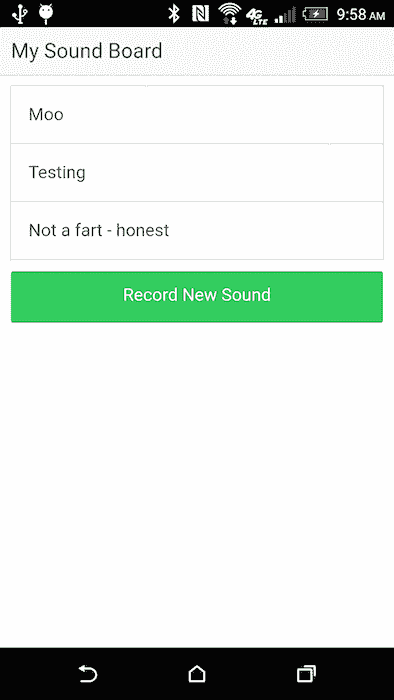
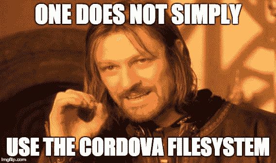

# 在 NativeScript 中使用音频-第一部分

> 原文：<https://dev.to/raymondcamden/working-with-audio-in-nativescript-part-one-337n>

这篇文章原本是一个演示应用程序，但我决定在使用我计划的应用程序时“暂停”，并分享一些我在 NativeScript 中使用音频的经验。最终目标是重现我不久前用 Ionic 和 Cordova 做的一个演示——一个定制的声卡。

这个应用程序相当简单。您录制了一个声音，给它起了一个名字，以后还可以播放。如果你不想读关于它的文章，下面是结果:

[](https://res.cloudinary.com/practicaldev/image/fetch/s--yuCoceKS--/c_limit%2Cf_auto%2Cfl_progressive%2Cq_auto%2Cw_880/https://static.raymondcamden.cimg/wp-content/uploads/2015/07/shot44.png)

总的来说，这很容易，一旦我努力将[持久记录](https://www.raymondcamden.com/2015/07/27/recording-and-saving-audio-in-cordova-applications)保存到设备上。与 Cordova 的文件 IO 是*从来没有*真正愉快的经历，只要我分享旧图像，我还不如把这个带回来:

[](https://res.cloudinary.com/practicaldev/image/fetch/s--2JOd3xOs--/c_limit%2Cf_auto%2Cfl_progressive%2Cq_auto%2Cw_880/https://static.raymondcamden.cimg/wp-content/uploads/2015/07/onesimply.jpg)

好，这就是科尔多瓦——用 NativeScript 录制、保存和播放音频有多难？

我开始在[市场](https://market.nativescript.org/)上搜索“音频”，然后发现了 [nativescript-audio](https://github.com/bradmartin/nativescript-audio) 。它支持录音和播放音频，所以理论上它有我需要的一切。不幸的是，文件在记录方面有点单薄，所以我不得不猜测一下。这个插件确实有一个用 Angular 编写的示例应用程序，我发誓，我现在几乎不能用 Angular 了。(主要是它试图找出哪个文件实际上有逻辑。这不是 Angular 的错，只是我现在对它生疏了！)

查看这个插件也迫使我接触到 NativeScript 中的文件系统访问。你可以说我带着一点恐惧来处理这件事。NativeScript 有一个内置的[文件系统](https://docs.nativescript.org/ns-framework-modules/file-system)模块。我马上看到了这一点，并且很高兴:“所有文件系统操作都有同步和异步的形式。”Cordova 中文件系统 API 最困难的问题之一是管理所有多个深度异步调用。我并不是说异步是不好的，也不是说工程不好，我只是说我讨厌和它一起工作。我还看到了许多内置的东西(我不相信)存在于 Cordova 插件中，比如能够清除文件夹的内容和路径规范化。

此外，和 Cordova 一样，它们可以让你更容易地找到你经常使用的文件夹。例如，假设我想在我的应用程序中使用一个文件夹来存储录音，下面是处理这个问题的基本伪代码:

```
const fileSystemModule = require('tns-core-modules/file-system');
const audioFolder = fileSystemModule.knownFolders.currentApp().getFolder('recordings'); 
```

Enter fullscreen mode Exit fullscreen mode

因此，`knownFolders`是重要文件夹别名的快捷方式，`currentApp()`是应用程序，`getFolder`将返回一个文件夹对象，如果它不存在，它也将处理创建。我喜欢这么简单！

在实际写入时，folder 对象有一个`.path`属性，所以我可以像这样构造一个文件名:`audioFolder.path+'/recording.mp4'`。

我只能说，在尝试使用 Cordova 中的文件系统被烧了这么多次之后，这实际上让我开始思考我可以使用它的其他方式(而不是避免它)。

有了这些知识，我演示的第一个版本只有两个按钮。一个用来录音，一个用来播放。我总是以相同的文件名录制(这个问题我会在下一篇博文中解决)，并且总是播放相同的文件。这是完整的代码。

```
<template>
    <Page class="page">
        <ActionBar class="action-bar">
            <Label class="action-bar-title" text="Home"></Label>
        </ActionBar>

        <StackLayout>
            <Button text="Record" @tap="doRecord" />
            <Button text="Test Play" @tap="doPlay" />
        </StackLayout>
    </Page>
</template>

<script>
const audio = require('nativescript-audio');
const fileSystemModule = require('tns-core-modules/file-system');
const audioFolder = fileSystemModule.knownFolders.currentApp().getFolder('recordings');
const platform = require('tns-core-modules/platform');

export default {
    methods:{
        async doRecord() {
            console.log('doRecord Called 1e');
            let recorder = new audio.TNSRecorder();

            /*
            from the sample app
            */
            let androidFormat;
            let androidEncoder;
            if (platform.isAndroid) {
                // static constants are not available, using raw values here
                // androidFormat = android.media.MediaRecorder.OutputFormat.MPEG_4;
                androidFormat = 2;
                // androidEncoder = android.media.MediaRecorder.AudioEncoder.AAC;
                androidEncoder = 3;
            }

            let options = {
                filename:audioFolder.path+'/recording.mp4',
                format:androidFormat,
                encoder:androidEncoder,
                infoCallback:info => {
                    //apparently I'm necessary even if blank
                },
                errorCallback:e => {
                    console.log('error cb',e);
                }
            };

            await recorder.start(options);
            console.log('in theory recording');
            setTimeout(() => {
                console.log('calling stop');
                recorder.stop()
                .then(() => {
                    console.log('really done');
                })
                .catch(e => {
                    console.log('error stopping', e);
                });
            }, 3000);
        },

        doPlay() {

            let player = new audio.TNSPlayer();
            player.playFromFile({
                audioFile:audioFolder.path+'/recording.mp4'
            })
            .then(() => {
                console.log('in then');
            })
            .catch(e => {
                console.log('in error', e);
            });
        }
    }
};
</script>

<style scoped lang="scss">
</style> 
```

Enter fullscreen mode Exit fullscreen mode

好了，我们从上到下来说说这个吧！顶部处理 UI，在本例中只有两个按钮。记录在`doRecord`方法中处理。在很大程度上，我只是从官方文件中复制粘贴。我添加了一个带有`setTimeout`的“自动停止”特性，这样我就不必为它添加 UI 了。我真正的应用程序当然会支持这一点。我也想为所有的`console.log`声明道歉。通常我会在发布前清理它们，但当我在使用这个应用程序时，我保留了它们作为我工作方式的证据。:)

`doPlay`处理实际播放的文件。你可以得到关于这个文件的信息，比如持续时间，但是对我来说，我只是想玩而不是担心它。在我真正的应用程序中，如果播放另一个声音文件，我需要一种方法来停止播放(也许——一次播放多个文件会很有趣)。

仅此而已。哦，我在上面跳过了这个，但是我也添加了这个插件。所以像往常一样，问我你有什么问题，在下一部分我会(希望！)在 NativeScript 中有一个完全工作的自定义声卡！