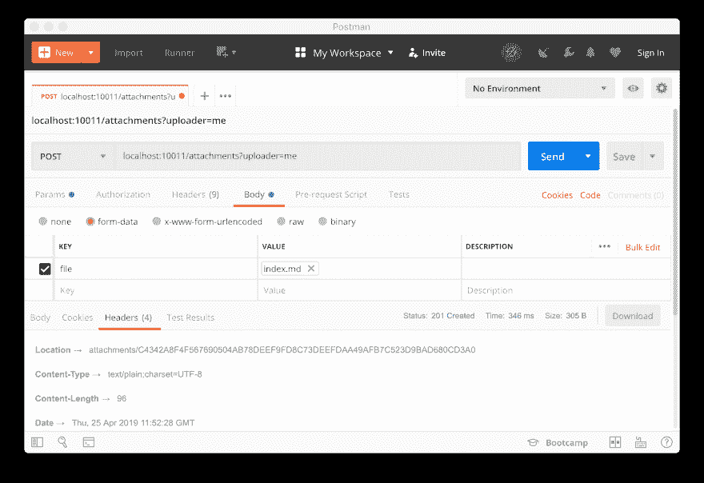
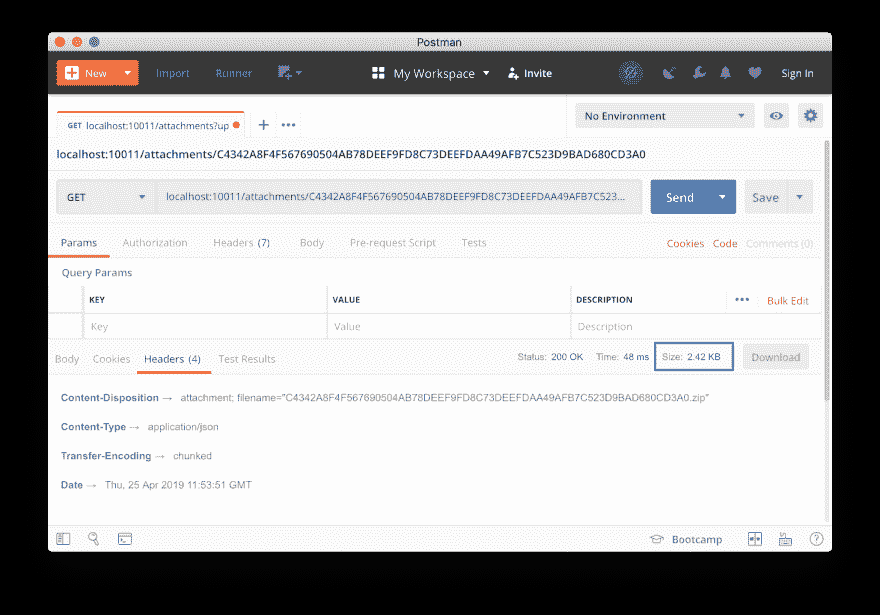
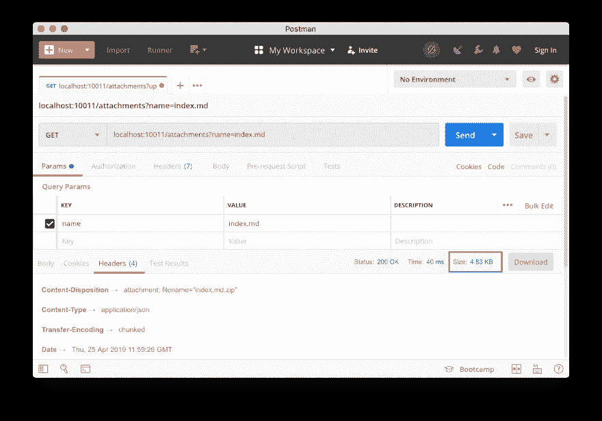

# 在 Corda 中上传和下载附件

> 原文：<https://dev.to/lankydandev/uploading-and-downloading-attachments-in-corda-3ad>

这篇文章是献给我在 Corda Slack 频道上看到的那些询问如何上传和下载附件到一个节点的人的。虽然这两者都可以通过 Corda Shell 实现。在这篇文章中，我将着重于编写一个客户端应用程序，它与一个节点交互来控制附件。

希望这篇短文能在将来为我节省很多时间，也能帮助你，读者，实现这个功能，而不需要向任何人寻求帮助。

作为一个 Spring 粉丝，我显然会在 Spring 中实现客户端应用程序。通过利用`spring-web`，一个应用程序可以不费吹灰之力地组装起来，而 Spring 则可以完成繁重的工作。这对你意味着什么？嗯，通过添加一些注释和使用正确的对象，它允许您向 Spring 应用程序发送文件和从 Spring 应用程序接收文件。赞美春天！🙌🙏

最后一件事，我确信有更好的代码可以做和我为这篇文章写的一样的事情。如果是这样，您可以随时提交一个“拉”请求来更改它😎。如果需要，可以在这里找到帖子[。](https://github.com/lankydan/lankydanblog-jamstack/blob/master/content/blog/2019/corda-attachment-download/index.md)

让我们继续吧。

## 上传

```
private val proxy: CordaRPCOps = rpc.proxy

@PostMapping
fun upload(@RequestParam file: MultipartFile, @RequestParam uploader: String): ResponseEntity<String> {
  val filename = file.originalFilename
  require(filename != null) { "File name must be set" }
  val hash: SecureHash = if (file.contentType != "zip" || file.contentType != "jar") {
    uploadZip(file.inputStream, uploader, filename!!)
  } else {
    proxy.uploadAttachmentWithMetadata(
      jar = file.inputStream,
      uploader = uploader,
      filename = filename!!
    )
  }
  return ResponseEntity.created(URI.create("attachments/$hash")).body("Attachment uploaded with hash - $hash")
}

private fun uploadZip(inputStream: InputStream, uploader: String, filename: String): AttachmentId {
  val zipName = "$filename-${UUID.randomUUID()}.zip"
  FileOutputStream(zipName).use { fileOutputStream ->
    ZipOutputStream(fileOutputStream).use { zipOutputStream ->
      val zipEntry = ZipEntry(filename)
      zipOutputStream.putNextEntry(zipEntry)
      inputStream.copyTo(zipOutputStream, 1024)
    }
  }
  return FileInputStream(zipName).use { fileInputStream ->
    val hash = proxy.uploadAttachmentWithMetadata(
      jar = fileInputStream,
      uploader = uploader,
      filename = filename
    )
    Files.deleteIfExists(Paths.get(zipName))
    hash
  }
} 
```

Enter fullscreen mode Exit fullscreen mode

正如我前面提到的，我确信可以做很多事情来改进它，但是，嘿，它做了工作。

我不认为这里有太多要深入的内容，因为很多代码都是关于检查和可能地将文件转换成正确的格式。

虽然，这确实提出了一个问题，为什么首先需要转换？在 Corda 中，只有拉链或罐子(实际上是拉链)可以作为附件存储。因此，如果接收到不同类型的文件，必须首先对其进行转换，以便将其存储在节点中。

这里唯一的 Corda 特定代码是对`uploadAttachmentWithMetadata`的调用。当试图检索和下载存储的附件时，设置`filename`变得很方便。

从端点返回散列(`AttachmentId`，是`SecureHash`的别名)。就像`filename`一样，这为以后检索附件提供了另一种方法。

在下图中可以看到一个上传附件的快速示例:

[](https://res.cloudinary.com/practicaldev/image/fetch/s--Bhwlcyus--/c_limit%2Cf_auto%2Cfl_progressive%2Cq_auto%2Cw_880/https://thepracticaldev.s3.amazonaws.com/i/xyvagorjp17xgz32m4qr.png)

## 下载

我实现了两个不同版本的附件下载。

### 按 Hash / AttachmentId

```
private val proxy: CordaRPCOps = rpc.proxy

@GetMapping("/{hash}")
fun downloadByHash(@PathVariable hash: String): ResponseEntity<Resource> {
  val inputStream = InputStreamResource(proxy.openAttachment(SecureHash.parse(hash)))
  return ResponseEntity.ok().header(
    HttpHeaders.CONTENT_DISPOSITION,
    "attachment; filename=\"$hash.zip\""
  ).body(inputStream)
} 
```

Enter fullscreen mode Exit fullscreen mode

此端点使用从上载端点返回的哈希来检索附件。`openAttachment`需要一个散列来从节点中提取附件。

散列作为一个`String`被传入，因为 Spring 似乎没有设置任何默认的到`SecureHash`的转换，这种情况下不值得设置。

需要添加正确的标题来触发呼叫者下载附件。调用此端点将返回如下结果:

[](https://res.cloudinary.com/practicaldev/image/fetch/s--bXjj-Ae1--/c_limit%2Cf_auto%2Cfl_progressive%2Cq_auto%2Cw_880/https://thepracticaldev.s3.amazonaws.com/i/fpd0pwrjfz2xb7odsk3p.png)

### 按名称排列

```
private val proxy: CordaRPCOps = rpc.proxy

@GetMapping
fun downloadByName(@RequestParam name: String): ResponseEntity<Resource> {
  val attachmentIds: List<AttachmentId> = proxy.queryAttachments(
    AttachmentQueryCriteria.AttachmentsQueryCriteria(filenameCondition = Builder.equal(name)),
    null
  )
  val inputStreams = attachmentIds.map { proxy.openAttachment(it) }
  val zipToReturn = if (inputStreams.size == 1) {
    inputStreams.single()
  } else {
    combineZips(inputStreams, name)
  }
  return ResponseEntity.ok().header(
    HttpHeaders.CONTENT_DISPOSITION,
    "attachment; filename=\"$name.zip\""
  ).body(InputStreamResource(zipToReturn))
}

private fun combineZips(inputStreams: List<InputStream>, filename: String): InputStream {
  val zipName = "$filename-${UUID.randomUUID()}.zip"
  FileOutputStream(zipName).use { fileOutputStream ->
    ZipOutputStream(fileOutputStream).use { zipOutputStream ->
      inputStreams.forEachIndexed { index, inputStream ->
        val zipEntry = ZipEntry("$filename-$index.zip")
        zipOutputStream.putNextEntry(zipEntry)
        inputStream.copyTo(zipOutputStream, 1024)
      }
    }
  }
  return try {
    FileInputStream(zipName)
  } finally {
    Files.deleteIfExists(Paths.get(zipName))
  }
} 
```

Enter fullscreen mode Exit fullscreen mode

这个片段，像上传的例子一样，有很多额外的代码来处理`OutputStream` s 和`InputStream` s。

这个端点利用`queryAttachments`函数来检索匹配输入标准的`AttachmentId`。一旦检索到`AttachmentId` s/hashes，仍然需要调用`openAttachment`来返回附件。

与`downloadByHash`端点相比，走这条路更有意义，因为文件名比散列更容易阅读。

本例中的大部分额外代码都是为了处理返回多个文件的可能性。如果有多个同名的附件，那么它们会被压缩并返回。

然后，您可以发出类似下面这样的请求，该请求可以处理可能出现的许多同名附件:

[](https://res.cloudinary.com/practicaldev/image/fetch/s--BZrBuMH7--/c_limit%2Cf_auto%2Cfl_progressive%2Cq_auto%2Cw_880/https://thepracticaldev.s3.amazonaws.com/i/54808m6shnj8a6f9n4fd.png)

> 请注意，由于我上传了另一个同名文件，文件大小比 by hash 版本大。

## 包装完毕

这里实在没有合适的结论可写。基本上，我要说的是，如果你想用 Spring 在 Corda 节点上上传和下载附件，那么这篇文章中的代码将会帮助你。我确信有更整洁的方式来处理所有的`InputStream`和`OutputStream`但是他们似乎完成了工作。

如果你觉得这篇文章很有帮助，并且想在我写文章的时候关注我，那么你可以在 Twitter 上关注我，地址是 [@LankyDanDev](https://twitter.com/lankydandev) 。