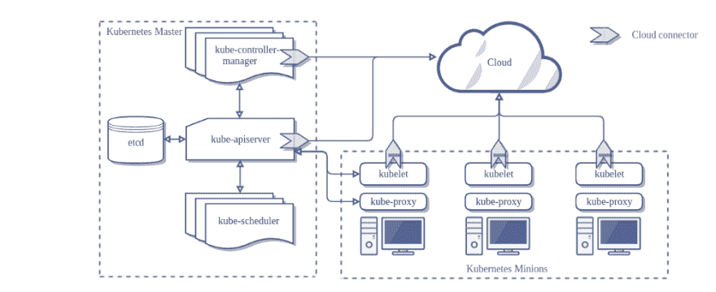

# Kubernetes 不是你的朋友

> 原文：<https://dev.to/aloneguid/kubernetes-is-not-your-friend-58om>

**警告！！！**我期待很多负面评论和对务实清廉的仇视，会很乐意接收！

[Kubernetes](https://kubernetes.io/) 。从领导者到开发人员和开发人员，业界对这个系统有太多的争议。每个人似乎都对此感到兴奋，并且有一个承诺，Kubernetes 将解决您的所有问题。但是什么是 K8 呢？官网上说:

Kubernetes (K8s) 是一个用于自动化部署、扩展和管理容器化应用程序的开源系统。

这到底是什么意思？顾名思义，K8 旨在帮助容器部署、升级和扩展。

## 关于容器的一切

K8 只和集装箱打交道，而且只和码头工人打交道。这有助于你招待他们。K8 不是第一个这样做的人，市场上还有许多其他的玩家。还有 Docker 自己的 [Docker Swarm](https://docs.docker.com/engine/swarm/) 、[马拉松](http://mesos.apache.org/)、[亚马逊 ECS](https://aws.amazon.com/ecs/) 、 [Azure 容器实例](https://docs.microsoft.com/en-gb/azure/container-instances/)、 [HashiCorp Nomad](https://www.nomadproject.io/) 等等。而这些只是运行 Docker 容器而已。但是为什么每个人都在谈论 K8 呢？这只是因为它变得最受欢迎，最容易接近，拥有最大的社区。是否意味着它是市场上最好的？

## 关于云的可移植性

K8 是最受欢迎和最容易使用的容器协调器，由所有主要的云提供商提供，例如:

*   微软的 Azure Kubernetes 服务
*   [谷歌 kubricks 引擎](https://cloud.google.com/kubernetes-engine/)
*   从亚马逊管理 K8-[亚马逊 EKS](https://aws.amazon.com/eks/)

这意味着，至少在理论上，你不需要依赖某个特定的云供应商来开发你的应用程序，只要它们是容器化的。理论上。

## 云与云之间不便携

云可移植性是一个很大的神话，它就是不工作。K8 承诺的是，你可以带着你的容器在任何地方运行，在本地或在任何云中。这是千真万确的。它在实践中也非常有效，前提是:

*   您的应用程序不存储任何数据
*   它不与网络做任何事情，至少它不接受任何传入流量
*   它不需要任何监控
*   它不使用任何其他 PaaS 服务
*   完全无状态，与自身之外的任何事物都没有交互

而这些只是最明显的几点。我还没见过多少不需要这些的应用程序，可能只有入门教程或技术讲座中的应用程序才需要这些。

## 这不是一个开发框架

与开发人员需要 K8 的普遍印象相反，这实际上是不正确的。K8 与代码或应用无关，它是一个纯粹的基础设施自动化解决方案。没有什么代码是专门为 K8 编写的，也没有什么需要考虑的。K8 经营集装箱，仅此而已。这是 DevOps 解决方案。

你不需要任何特殊的工具来为 K8 开发，无论是本地的还是远程的。只要你的应用程序可以被打包成一个容器，这并不重要。您不能在代码中使用任何东西来利用 K8 服务。K8 没有可供应用程序使用的服务。你是 K8 开发商吗？胡说，没有这回事。

## 设置它是一件痛苦的事情

建立 K8 是一件非常痛苦的事情。尤其是当你在现场安装[时。当然，设置过程是脚本化的，也很简单，但是您开箱即用的只是一个入门模板，您需要长时间工作来添加服务，这些服务可以在真实的生产场景中实际支持您的应用程序。这就是为什么当大公司为你提供托管实例时，K8 通常被用于云中。只是因为自己设置它是一个巨大的过度复杂的痛苦。你很容易把事情搞砸，导致整个集群瘫痪。](https://kubernetes.io/docs/setup/pick-right-solution/##custom-solutions)

## 专为小型工作负载而设计

惊讶吗？是的，K8 不是一个分布式系统。有趣的是，它是集中式的，速度很慢，并且不是为扩展而设计的。这是一个高度集中的系统。它在中间有 API 服务器，在所有的 worker 节点上安装了名为 Kubelets 的代理。由于各种各样的管理原因，所有的 Kubeletes 都一直与 API 服务器通信。显然，工作节点越多，集群正常运行所需的流量和压力就越大。当然，您可以增加 API 服务器节点的数量，但是这有一定的限制，而且很容易达到。

## 部署艰难

为了将任何东西部署到 K8，您需要创建一个[部署资源](https://kubernetes.io/docs/concepts/workloads/controllers/deployment/)。这是一个有点大而笨重的 yaml 文件。实际上，没有人使用本地 K8 特性来部署服务，因为它有相当丑陋的限制:

*   没有模板(即使用简单的环境相关变量)
*   无法描述对其他服务的依赖性
*   没办法描述一个应用，只能描述一个单一的服务，没那么有用。

为了克服这些限制，人们已经开始在 K8 上创建系统，仅仅是为了处理简单的部署，而且有很多这样的系统:

*   [Helm](https://helm.sh/) 包经理，是最受欢迎的一个。它表面上看起来很漂亮，但是混合了 yaml 和 go 模板语言，很快就变成了一场不可读的噩梦。
*   [git 多维数据集](https://gitkube.sh)
*   [Kapitan](https://kapitan.dev/)
*   [草薙](https://github.com/kubernetes-sigs/kustomize)
*   [Kontemplate](http://kontemplate.works/)
*   等等...

事实上，这些“工具”的数量正在增长，而且公司正在创建他们自己的定制工具来做类似的工作，因为内置工具无法交付，这让我不太信任这个系统。

## 但这是行业标准

这可能是对 K8 的主要论点。它是开放的，被许多人(在某种程度上)理解，并且不为一家公司所拥有。我不确定这是否是一个成功的论点。

## 数据存储不存在

你不能在 K8 存储数据，根本没有办法。完全不支持。对[卷](https://kubernetes.io/docs/concepts/storage/volumes/)的支持是可笑的，它只是一种通过网络将磁盘挂载到远程存储器来模拟磁盘的方式。是的，你可以把一个文件夹挂载到 Azure 文件共享或者 S3 桶，但是性能会非常差。如果您在本地运行，您可能会使用某种物理磁盘，但是设置所有这些并使其可靠是一件非常痛苦的事情。

存储数据的唯一方法是使用外部数据库，但这些数据库也必须在某个地方运行。而且你不能在 Kubernetes 中运行它们，因为没有存储支持，所以你必须依赖运行在裸机或 PaaS 服务(SQL Server、DynamoDB 等)上的外部提供商。)这也没有让它变得自给自足和云可移植。

## 你需要一支军队来支持它

它并不便宜，也不能只供开发者使用。

## 有什么好处？

老实说，我不知道。你能想到一个真实的用例吗？

如果我需要编写一个可扩展的无状态服务，并且我确实关心生产率、价格和交付业务目标，我会选择无服务函数(AWS Lambda、Azure 函数等)。

如果我需要在长时间运行的后台进程中处理大量数据，我会选择批处理解决方案，如 [Azure Batch](https://azure.microsoft.com/en-us/services/batch/) 或[AWS Batch](https://aws.amazon.com/batch/)——没有基础设施管理，成本低得多。

如果我需要开发一个需要处理大量数据且性能至关重要的服务，那么就选择 [Service Fabric](https://azure.microsoft.com/en-us/services/service-fabric/) ，顺便说一下，它也可以运行 Docker 容器，以及其他许多东西。

托管一个网站？我会疯狂地在 K8 举办这个，因为与 K8 相比，像 Azure 应用服务这样的 PaaS 解决方案在功能上是下一世纪的技术，在你需要自己再花一年时间来构建一切。

我需要托管容器吗？如果是这样的话， [Azure Container Instance](https://docs.microsoft.com/en-gb/azure/container-instances/) 或者来自其他提供商的替代品是一种前进的方式。

*本帖原载于[isolineltd.com](https://www.isolineltd.com/blog/kubernetes-is-not-your-friend.html)2019 年 4 月 25 日*