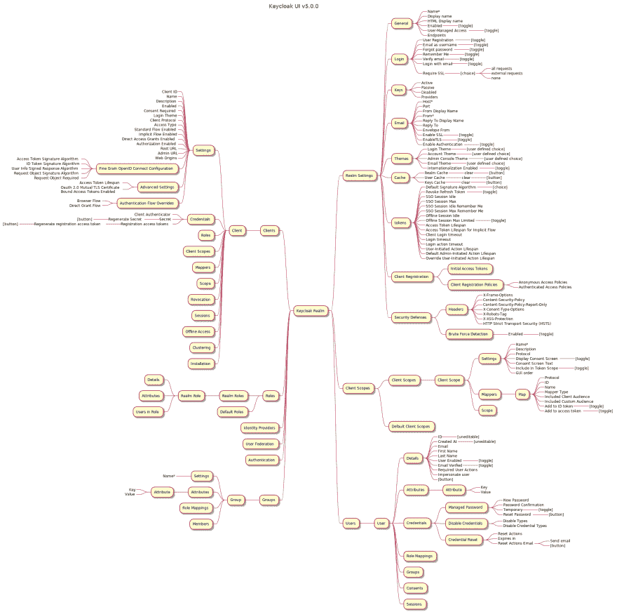

# 你没有要求的 Keycloak (v.5.0.0) UI 思维导图

> 原文：<https://dev.to/karlredman/the-keycloak-v-5-0-0-ui-mind-map-you-didn-t-ask-for-15a7>

我正在为创建一个家庭/笔记本电脑实验室撰写一组未来的文章，需要一个参考图。我想我也可以分享一下。该图旨在作为一个中级视图，显示所有内容在 UI 中的位置。

*   Keycloak 版本:v5.0.0
*   必填字段:用`*`后缀表示
*   原始 PlantUML 源文件+图像文件[此处](https://github.com/karlredman/Articles/tree/master/content/dev.to/keycloakV5_ui_mindmap)

