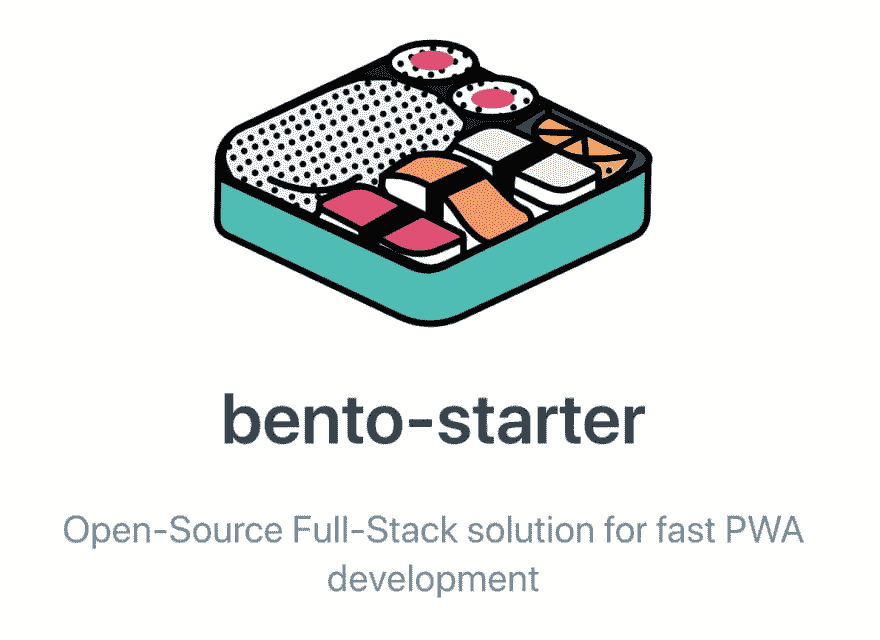

# 快速 PWA 开发的全栈解决方案！

> 原文：<https://dev.to/kefranabg/a-full-stack-solution-for-fast-pwa-development-4105>

你好👋,

如果你对构建渐进式网络应用感兴趣，我想分享一个我们已经工作了几个月的开源项目: **[bento-starter](https://bento-starter.netlify.com/)**

🍱bento-starter 是一个开源的全栈解决方案，可以帮助你使用 Vue.js、Firebase、渐进式 web 应用支持、动态离线支持等工具构建快速且可维护的 Web 应用...

该项目的目标是提供一个强大的和配置良好的堆栈(与 CI/CD，托管...)这样你就可以专注于非常快速地编写你的 web 应用了。

由于该项目是一个模板项目，而不是 CLI，您可以访问整个应用程序配置，因此您可以根据需要进行更改。

如果你感兴趣，可以去看一看！

👉github[https://github.com/kefranabg/bento-starter](https://github.com/kefranabg/bento-starter)👉doc[https://bento-starter.netlify.com/](https://bento-starter.netlify.com/)

如果你有问题，请发微博给我！ [@FranckAbgrall](https://twitter.com/FranckAbgrall)

希望有帮助！