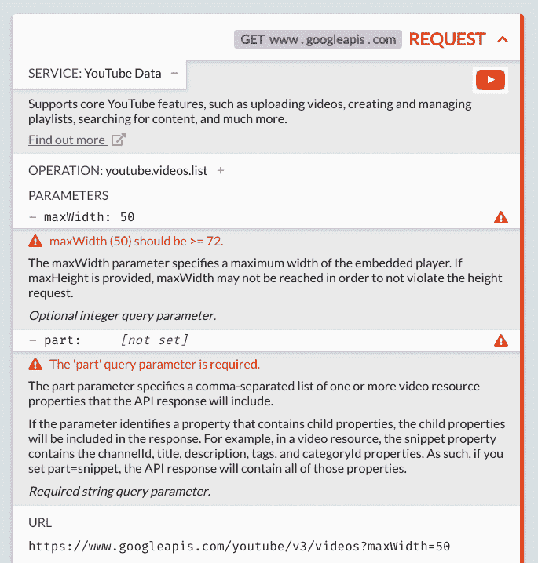
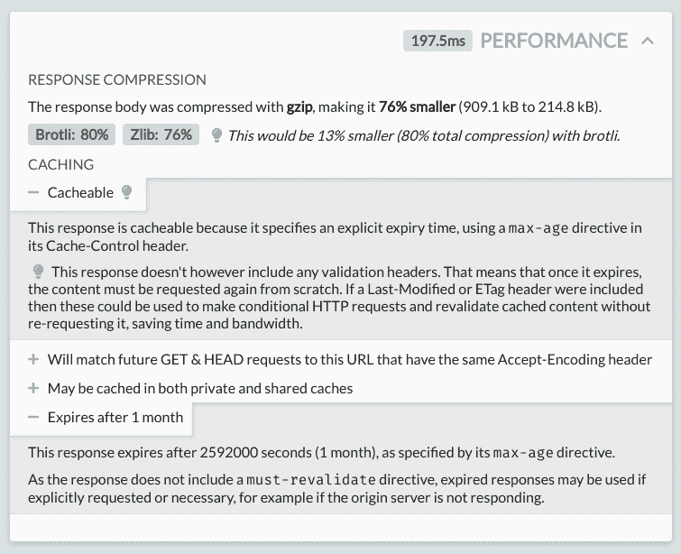

# HTTP 的 x 射线调试

> 原文：<https://dev.to/pimterry/x-ray-debugging-for-http-1ajf>

HTTP Toolkit 是一套开源的跨平台工具，用于开发、调试和测试任何使用 HTTP 的东西。它可以让你一键拦截 HTTP(S ),探索、检查和理解你的所有流量，发现错误，修复错误，并建立更好的软件。

第一个版本(HTTP View)的免费发布已经有一段时间了，今天我推出了一些新的杀手级功能，作为 [HTTP Toolkit Pro](https://dev.to/view) 的一部分，让您深入了解 HTTP 流量，了解您的应用程序正在做的一切所需的所有上下文。

## 1400 多个 API 的 API 集成

了解你的流量需要的不仅仅是原始数据。使用 [OpenAPI](https://swagger.io/docs/specification/about/) 和 [OpenAPI 目录](https://github.com/APIs-guru/openapi-directory)，HTTP Toolkit 可以准确地计算出每个请求正在与哪个 API 对话，从 AWS 到 Stripe 到 Github，等等。

有了它，我们可以做很多很酷的事情。例如:

这里，我们向 YouTube API 发出了一个请求，并立即计算出它在做什么操作，解释参数以提供内联文档，指出一个参数有一个无效值，并发现另一个所需的参数缺失。

在真实环境中调试工具——真正理解您正在尝试做什么的工具——让您将开发技能提升到一个全新的水平。

## 性能分析，提示&警告

表演很难。有很多方法可以用 HTTP 来调整应用程序的速度，有很多令人困惑的规范(一个`no-store`和`no-cache`缓存控制头之间有什么区别？)，而且建议也不多。

但是对于大多数应用程序来说，最重要的两件事是压缩和缓存。大量的响应流极大地降低了客户端应用程序的速度，缓存让它们完全避免了请求往返。

现在，您可以获得所有 HTTP 响应的自动化性能分析，包括响应时间本身，还包括请求和响应主体压缩的细节(与您可能使用的其他内容编码进行比较)，以及响应可缓存性本身的细分。

缓存详细信息包括一个摘要和详细的解释，说明请求是否以及为什么可缓存，以及它将匹配哪些未来的请求，谁可以缓存它(只是浏览器，还是 cdn 和代理？)，以及什么时候到期。

缓存很难，HTTP Toolkit 可以帮助您真正理解响应头的含义。此外，如果您犯了错误，比如丢失了使您的缓存更加一致和可靠的指令，或者不同意相同属性的配置(比如`Expires` & `max-age`)，您将获得提示和警告来帮助您轻松修复它们。

## 多多

最重要的是，我们现在有了亮、暗和高对比度主题，每个 HTTP 头和状态代码的内联文档，除了浏览器之外的终端(在所有平台上)的一键中间人设置，以及您可能需要的其他一切，以便快速轻松地了解您的 HTTP 流量。

## 可持续的未来

HTTP Toolkit 基本上是一个开源项目。它受到了辛勤工作和对 [Mockttp](https://github.com/httptoolkit/mockttp) 的许多贡献的巨大推动，过去几个月来自社区的用户反馈至关重要。

发布这个付费版本不会改变这一点，而且整个 Pro 代码也是开源的:[github.com/httptoolkit](https://github.com/httptoolkit)。目的是通过鼓励专业开发人员&超级用户帮助支持正在进行的开发，推动项目走向未来，从而使项目可持续发展。

如果你喜欢这样的声音，就资助它吧！ **[现在就获取 HTTP 工具包](https://dev.to/get-pro)** ，为你的软件调试增压。如果你犹豫不决，你也可以从现有的[免费版本](https://dev.to/view)开始。

今天我们还将推出产品搜索！看看这些评论，并在 producthunt.com/posts/http-view 留下您的反馈。