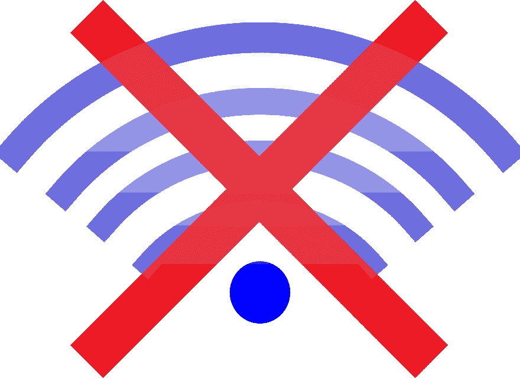

# 您正在实现离线功能吗

> 原文：<https://dev.to/tomavelev/are-you-implementing-offline-functionality-2i3e>

听起来很荒谬，对吧？在当今的互联世界，离线工作的东西？！今天，可能所有东西都有一个 Wi-Fi 模块，并且可以通过编程从外部、远程服务器或设备进行控制，比如电源适配器、灯、相机、电话、电脑、冰箱、吸尘器等等。

但是如果互联网停止了呢？你忘了付钱给网络供应商，有人切断了电缆？我知道，你的手机有 3G/4G，可以当路由器用。但是普通用户会明白吗？您的物联网在本地工作吗——只有内部本地网络可用？

你的软件至少有一些功能可以离线使用吗？不在也没关系。我参与了物联网[ELI-HOME](http://www.eli-home.com/eli/page/)——它主要在我的应用 [What you eat](https://play.google.com/store/apps/details?id=com.tomata_.productscanner) 中的本地网络内工作，除了这个应用中的产品，我已经实现了对所有产品的离线访问。产品理论上是无穷无尽的。但是现在其他的都是有限的，它不会占用太多空间。我计划实现类似的功能，以网站背后。

在过去的四年里，我已经为客户和承包商(除了几个个人)实现了几个 Android 应用程序，他们都希望这个东西尽可能离线工作。这不是核物理。它只需要在软件开发的开始就计划好——主要是离线工作，然后是在线工作。这会节省你的时间和精力。

对于移动平台——Android、Windows Phone、iOS 等——这主要是通过键值存储、SQLite 数据库或任何进行数据管理的第三方库来实现的。他们都可以检查互联网的可用性。在网络上——现代浏览器部分或完全支持上述所有功能，并且浏览器中的 [online](https://developer.mozilla.org/en-US/docs/Web/API/NavigatorOnLine/onLine) 变量，目前—[Web Workers](https://developer.mozilla.org/en-US/docs/Web/API/Web_Workers_API/Using_web_workers)离线执行一些逻辑操作——比如预缓存，即使您离线也能提供内容，处理推送通知等等。

所以，除了你的客户不是一些其他的企业(你期望他有良好的互联网)，除了信息非常非常大，经常更新，事情是特定的，显示旧数据不是一个选项-你应该至少实现一些功能离线。[手机浏览的增加](https://www.google.com/search?q=mobile+vs+desktop+internet+usage+statistics&oq=mobile+vs++statistics)一定会增加你的东西在没有互联网的情况下打开的案例。