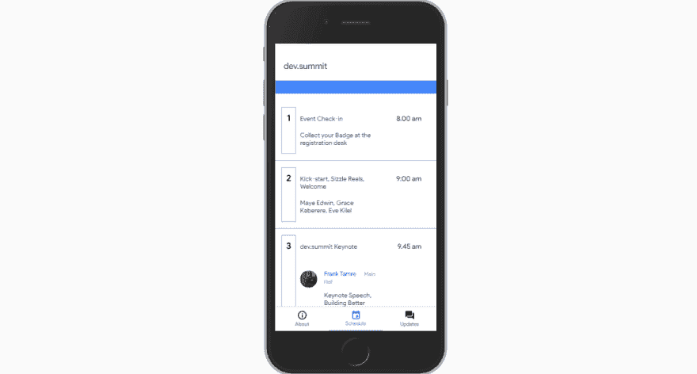

# 介绍渐进式网络用户界面🎉

> 原文：<https://dev.to/mayeedwin/introducing-progressive-web-user-interface-gb8>

到目前为止，我们已经有了令人惊奇的关于[渐进式网络应用](https://pwafire.org)的故事，这真是太棒了。它们适用于每一个用户，不管他们选择什么样的浏览器，因为它们是以渐进增强为核心原则构建的。

## ✅递进**中网 360**

当想到渐进式 Web 应用程序时，请考虑 entitre app cylce。从*你如何在你的后端交付资源*到用户与 pwa 交互时 pwa 看起来如何*。*

用户并不关心你的 web 应用程序或任何应用程序的后端到底发生了什么。他们在你的网络应用上看到的和他们的目标是如何实现的才是王道！

在[的 pwadev 文档](https://pwafire.org/developer/docs/progressive-user-interface/)中阅读更多关于**渐进式网络用户界面**以及我们如何在[pwafire.org](https://pwafire.org)努力开发这一界面的信息