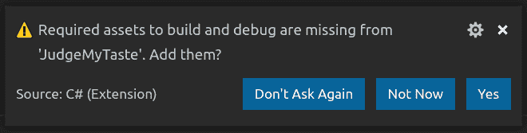
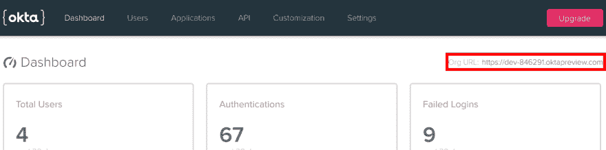
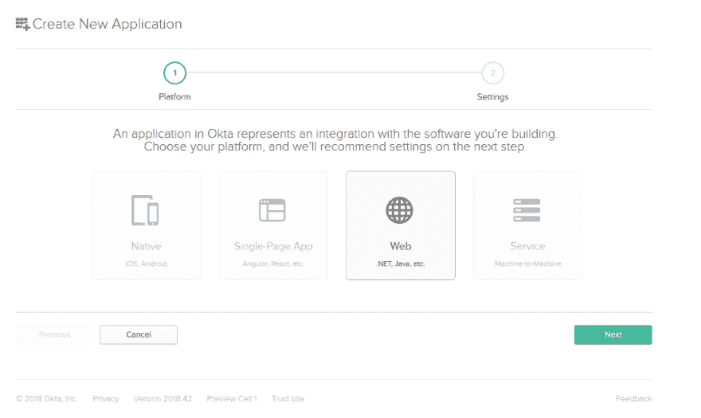
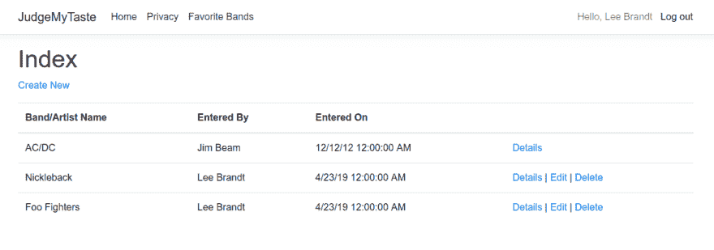

# 使用 ASP.NET 核心 2.2 和 SQL Server 构建 CRUD 应用程序

> 原文：<https://dev.to/oktadev/build-a-crud-app-with-asp-net-core-2-2-and-sql-server-3m78>

我总是说，你可以通过一个人听的音乐来了解他。不要告诉我，当你发现某人喜欢某个特定的乐队或艺术家时，你没有严重怀疑过你是否能和他成为朋友。本着这种精神，我创建了 *JudgeMyTaste* ，这是一个 ASP.NET 的核心网络应用程序，人们可以在这里输入他们最喜欢的乐队或艺术家，这样互联网上的人们就可以公开评判他们。

ASP.NET 和 SQL Server 的组合可能是使用 ASP.NET 的企业中最常见的组合。由于 ASP.NET 核心和 SQL Server 都是跨平台的，您不再需要*和*在 Windows 上运行这种组合了！我将向您展示如何使用 ASP.NET 核心 2.2 和 SQL Server 2016 创建一个基本的 CRUD 应用程序。我将在 Linux 上运行，但是有了这里使用的免费工具，你使用什么操作系统都没关系！

我将使用的适用于所有平台的工具有:

*   SQL Server 2016(我将在 Ubuntu 18.04 上运行)
*   Visual Studio 代码
*   Azure 数据工作室
*   ASP.NET 核心 2.2

一旦你已经为你的平台安装了所有的工具，让我们开始吧！

## 脚手架 ASP.NET 芯 2.2 应用

无论你在什么平台上，CLI 都是可用的。这里使用的命令应该对每个人都一样。为了搭建 ASP.NET 核心 2.2 MVC 应用程序，为它创建一个新文件夹:

```
mkdir JudgeMyTaste 
```

进入新目录:

```
cd JudgeMyTaste 
```

然后运行以下命令:

```
dotnet new mvc 
```

然后用 VS 代码打开新的应用程序。

```
code . 
```

当您在 VS 代码中打开新的应用程序时，您应该在右下角得到一个警告，要求添加一些缺失的资产。继续添加缺失的资产。你会看到在`.vscode`文件夹中添加了一个`launch.json`和一个`tasks.json`文件。

[](https://res.cloudinary.com/practicaldev/image/fetch/s--LSTYb7iH--/c_limit%2Cf_auto%2Cfl_progressive%2Cq_auto%2Cw_880/https://developer.okta.com/assets-jekyll/blog/aspnet22-sqlserver/add-vscode-folder-fa54001a5cca1fc313a2103e2b4da0e49a4cccdc401178d6ae0bdf9bbcc8a418.png)

这将允许您从 VS 代码中运行应用程序。为了验证所有的东西都搭建好了，通过键入`F5`来运行基础应用程序。这将构建应用程序，运行它，并在新的浏览器窗口中打开它。

如果您以前从未运行过 ASP.NET Core 2 . x 应用程序，您可能会注意到一个奇怪的错误页面出现。默认情况下，ASP.NET 核心希望在`HTTPS`上运行。这是 web 应用程序的推荐做法。你可以通过在你的`Startup.cs`中移除到`HTTPS`的重定向或者为你的本地机器生成一个证书来避免这个消息，但是这个错误屏幕只是偶尔出现一次，所以我只是通过点击**高级**并告诉浏览器可以访问这个站点，即使它没有证书。

[](https://res.cloudinary.com/practicaldev/image/fetch/s--Z8f06pzd--/c_limit%2Cf_auto%2Cfl_progressive%2Cq_auto%2Cw_880/https://developer.okta.com/assets-jekyll/blog/aspnet22-sqlserver/not-private-advanced-b3245243b35b8b3ead4b3beea765a51b91d212fd7ee53fcf75b6d25073399b0d.png)

对于您的日常工作，您可能应该创建一个本地开发证书，这样您就再也不会看到这个消息了。

## 创建您的 SQL Server 数据库

打开 Azure Data Studio，使用您在机器上安装 SQL Server 时创建的`SA`密码连接到您的`localhost`服务器。你会注意到它的排列非常像 VS 代码。在连接浏览器中，您将看到`localhost`作为一个连接。右键点击连接，选择**新建查询**，会在右侧打开一个新的查询窗口。开始键入单词`CREATE`，智能感知下拉菜单将打开，其中一个选项将是`sqlCreateDatabase`。选择该选项，将构建一个查询，在查询中出现的三个地方突出显示数据库名称。您可以开始键入数据库名称“JudgeMyTaste”，它将在所有三个位置被替换，因此最终的查询如下所示。

```
-- Create a new database called 'JudgeMyTaste'
-- Connect to the 'master' database to run this snippet
USE master
GO
-- Create the new database if it does not exist already
IF NOT EXISTS (
  SELECT [name]
    FROM sys.databases
    WHERE [name] = N'JudgeMyTaste'
)
CREATE DATABASE JudgeMyTaste
GO 
```

现在，您只需点击窗口顶部的绿色 **Run** 箭头即可创建数据库。简单，不是吗？

现在，当您在连接浏览器中展开**数据库**文件夹时，您将在列表中看到`JudgeMyTaste`数据库。右键单击新数据库并再次选择**新查询**。再次开始输入`CREATE`，这次从显示的选项中选择`sqlCreateTable`。同样，您可以开始键入表名`FavoriteBands`，它将被填充到查询中出现的所有地方。

您还需要向表中添加一些其他列。添加`Id`、`Name`、`EnteredBy`和`EnteredOn`列，使查询看起来像这样:

```
-- Create a new table called '[FavoriteBands]' in schema '[dbo]'
-- Drop the table if it already exists
IF OBJECT_ID('[dbo].[FavoriteBands]', 'U') IS NOT NULL
DROP TABLE [dbo].[FavoriteBands]
GO
-- Create the table in the specified schema
CREATE TABLE [dbo].[FavoriteBands](
  [Id] [int] IDENTITY(1,1) NOT NULL,
  [Name] [varchar](255) NULL,
  [EnteredBy] [varchar](255) NULL,
  [EnteredOn] [date] NULL
);
GO 
```

然后像以前一样，通过单击绿色的 **Run** 箭头来运行查询。

为您的应用程序专门创建一个用户来连接数据库是一个很好的做法。它只拥有与您的数据库交互所需的权限。下面的脚本为数据库创建一个登录名和一个用户，并为该用户分配对数据库的权限。

```
USE master

GO

CREATE LOGIN webapp WITH PASSWORD=N'P@ssw0rd!', DEFAULT_DATABASE=JudgeMyTaste

GO

ALTER LOGIN webapp ENABLE

GO

USE JudgeMyTaste

GO

CREATE USER webapp FOR LOGIN webapp
EXEC sp_addrolemember 'db_owner', 'webapp'

GO 
```

这里看起来似乎发生了很多事情，但它只是为 SQL Server 创建了一个登录，使该登录成为了数据库的用户，并将其添加到数据库的角色。这将允许该登录完成应用程序需要的所有 CRUD 操作。现在，您的应用程序可以使用您的数据库了！

## 将 SQL Server 连接到您的 ASP.NET 核心 2.2 MVC 应用程序

首先，您需要实体框架核心 NuGet 包。要安装它，请在终端中运行以下命令。

```
dotnet add package Microsoft.EntityFrameworkCore.SqlServer --version 2.2.4 
```

首先，将连接字符串添加到 MVC 项目根目录下的`appsettings.json`文件中，使其看起来像这样:

```
{  "Logging":  {  "LogLevel":  {  "Default":  "Warning"  }  },  "AllowedHosts":  "*",  "ConnectionStrings":  {  "JudgeMyTasteDatabase":  "Server=.;Database=JudgeMyTaste;user id=webapp;password=P@ssw0rd!"  }  } 
```

在`Models`文件夹中，创建名为`FavoriteBand.cs`的类文件。

```
using System;
using System.ComponentModel.DataAnnotations;

namespace JudgeMyTaste.Models
{
  public class FavoriteBand
  {
    public int Id { get; set; }
    public string Name { get; set; }
    public string EnteredBy { get; set; }
    public DateTime EnteredOn { get; set; }
  }
} 
```

这个类将用于处理`FavoriteBand`条目。

在项目的根目录下，创建一个名为`Data`的文件夹来存放应用程序的数据库上下文。创建一个名为`JudgeMyTasteContext.cs`的 C#文件，内容如下:

```
using JudgeMyTaste.Models;
using Microsoft.EntityFrameworkCore;

namespace JudgeMyTaste.Data
{
  public class JudgeMyTasteContext : DbContext
  {
    public JudgeMyTasteContext(DbContextOptions<JudgeMyTasteContext> options) : base(options)
    {
    }

    public DbSet<FavoriteBand> FavoriteBands { get; set; }
  }
} 
```

在您的`Startup.cs`文件中，在`ConfigureServices()`方法中，就在`services.AddMvc()...`行之前，添加带有连接字符串的新创建的上下文。

```
services.AddDbContext<JudgeMyTasteContext>(options => options.UseSqlServer(Configuration.GetConnectionString("JudgeMyTasteDatabase"))); 
```

现在，您的数据库已经连接到您的应用程序中了。你需要做的就是为用户创建一些方法来输入他们喜欢的乐队。要为 CLI 获得更多的脚手架好处，请安装代码生成工具。

```
dotnet add package Microsoft.VisualStudio.Web.CodeGeneration.Design 
```

现在，通过从终端运行以下命令，您可以搭建一个控制器来处理`FavoriteBand`类的所有 CRUD 操作。

```
dotnet aspnet-codegenerator controller -name FavoriteBandsController -async -m JudgeMyTaste.Models.FavoriteBand -dc JudgeMyTaste.Data.JudgeMyTasteContext -namespace Controllers -outDir Controllers -udl 
```

这是一个很长的问题，但是如果你把它分解成几个组成部分，就更容易理解了。

第一部分只是为控制器调用`dotnet` CLI 的新`aspnet-codegenerator`命令。您希望控制器的名称为“FavoriteBandsController ”,控制器的动作都为`-async`。用于生成控制器的模型是`JudgeMyTaste.Models.FavoriteBand`类，数据库上下文将是您刚刚创建的`JudgeMyTaste.Data.JudgeMyTasteContext`类。控制器的名称空间和输出目录将是`Controllers`，`-udl`开关告诉生成器使用它将生成的视图的默认布局(是的，它也将为所有东西生成视图！).很酷，对吧？

运行该命令后，您应该会看到控制器及其所有视图出现。剩下的唯一一件事就是创建一个链接，这样用户就可以很容易地找到网站上最喜欢的乐队部分。

在`Views/Shared`文件夹中打开`Layout.cshtml`文件，并添加一个到菜单的链接，以进入站点的新部分。

```
<li class="nav-item">
  <a class="nav-link text-dark" asp-area="" asp-controller="FavoriteBands" asp-action="Index">Favorite Bands</a>
</li> 
```

现在，当您运行该应用程序时，您可以单击 **Favorite Bands** 菜单项，查看所有已输入的 Favorite Bands 列表。当然，现在还没有，所以使用页面顶部的**创建新的**链接添加一个，并看到它出现在列表中。

现在手动添加 **EnteredOn** 值有点麻烦，并且您使用的代码生成器无法知道您可以在保存时将该字段添加到条目中，因此更改`FavoriteBandController`的`Create()`方法以自动添加它。

```
// POST: FavoriteBands/Create
// To protect from overposting attacks, please enable the specific properties you want to bind to, for
// more details see http://go.microsoft.com/fwlink/?LinkId=317598.
[HttpPost]
[ValidateAntiForgeryToken]
public async Task<IActionResult> Create([Bind("Id,Name,EnteredBy")] FavoriteBand favoriteBand)
{
  if (ModelState.IsValid)
  {
    favoriteBand.EnteredOn = DateTime.Now;
    _context.Add(favoriteBand);
    await _context.SaveChangesAsync();
    return RedirectToAction(nameof(Index));
  }
  return View(favoriteBand);
} 
```

唯一改变的是，我从方法签名中的`Bind`语句中删除了`EnteredOn`字段，并在将值`DateTime.Now`保存到数据库之前添加了该值。

## 为您的 ASP.NET 核心 2.2 MVC + SQL Server 应用程序添加身份验证

你现在有的是*好的*，但是目前没有办法阻止用户编辑*其他用户的*条目。我们要确保根据人们实际参加的最喜欢的乐队来评判他们，对吗？

没有理由自己写这个。您可以轻松地集成 [Okta](https://developer.okta.com) 来为您处理认证，并轻松地:

*   [认证](https://developer.okta.com/product/authentication/)和[授权](https://developer.okta.com/product/authorization/)您的用户
*   存储用户数据
*   执行基于密码的[社交登录](https://developer.okta.com/authentication-guide/social-login/)
*   通过[多重身份验证](https://developer.okta.com/use_cases/mfa/)保护您的应用
*   还有更多！查看我们的[产品文档](https://developer.okta.com/documentation/)

注册一个[永远免费的开发者账户](https://developer.okta.com/signup/)(或者如果你已经有了一个就登录)。

[](https://res.cloudinary.com/practicaldev/image/fetch/s--_uDsBNeK--/c_limit%2Cf_auto%2Cfl_progressive%2Cq_auto%2Cw_880/https://developer.okta.com/assets-jekyll/blog/aspnetcore-restapi/okta-signup-accab135cb5e7cb06a3446679d6aef0958ea31b3b9444d87ffb2f70e5882d045.png)

注册并登录后，您将进入您的控制面板。在右上角记下您的 **Org URL** 。

[](https://res.cloudinary.com/practicaldev/image/fetch/s--E48gM6kL--/c_limit%2Cf_auto%2Cfl_progressive%2Cq_auto%2Cw_880/https://developer.okta.com/assets-jekyll/blog/aspnet22-sqlserver/okta-org-url-6b1fce3aeb309d0d36fa0bd6d5a7b29013b0b658c476d09ff9bdfd2413dd5b7a.png)

点击顶部的**应用**菜单项，点击**添加应用**，从向导首页选择**网页**，点击**下一步**。

[](https://res.cloudinary.com/practicaldev/image/fetch/s--l8WmGbEt--/c_limit%2Cf_auto%2Cfl_progressive%2Cq_auto%2Cw_880/https://developer.okta.com/assets-jekyll/blog/aspnet22-sqlserver/okta-new-webapp-714c67efcc38cda5996afa96fd8aeddbde849738548dd48ff676b31a4aa1827e.png)

在下一个屏幕上，将应用程序名称更改为“Judge My Taste App ”,并更新**基本 URIs** 值和**登录重定向 URIs** ,以反映正确的端口和您正在运行`HTTPS`方案的事实。

[](https://res.cloudinary.com/practicaldev/image/fetch/s--MIXwsNqv--/c_limit%2Cf_auto%2Cfl_progressive%2Cq_auto%2Cw_880/https://developer.okta.com/assets-jekyll/blog/aspnet22-sqlserver/okta-app-settings-73f8c1e9334ac11415adc25c788593bf91e3256c9564049b6eb83e534fa15751.png)

然后点击**完成**，你就被带到了申请页面。在**常规设置**选项卡上，点击**编辑**，添加一个 URL 到**注销重定向 URIs** ，值为`https://localhost:5001/signout/callback`。这是 Okta 在注销调用后重定向回的位置。这是由 ASP.NET OIDC 中间件处理的。

## 配置您的 ASP.NET 核心 2.2 MVC 应用进行认证

现在您需要告诉您的应用程序如何使用 Okta 进行身份验证。最简单的方法是使用 Okta 的 ASP.NET SDK。您可以使用下面的命令从 NuGet 安装它:

```
dotnet add package Okta.AspNetCore --version 1.1.5 
```

将一些配置值添加到您的`appsettings.json`文件中，使最终文件看起来像这样:

```
{  "Logging":  {  "LogLevel":  {  "Default":  "Warning"  }  },  "AllowedHosts":  "*",  "ConnectionStrings":  {  "JudgeMyTasteDatabase":  "Server=.;Database=JudgeMyTaste;user id=webapp;password=P@ssw0rd!"  },  "Okta":  {  "ClientId":  "{yourClientId}",  "ClientSecret":  "{yourClientSecret}",  "OktaDomain":  "https://{yourOktaDomain}",  "PostLogoutRedirectUri":  "https://localhost:5001/"  }  } 
```

这个`PostLogoutRedirectUri`是 Okta 重定向回`signout/callback` URL 后中间件将重定向到的 URL。您可以在 MVC 应用程序中使用任何有效的 URL。这里，我只是重定向到应用程序的根目录。

回到`Startup.cs`文件，添加以下`using`语句:

```
using Okta.AspNetCore;
using Microsoft.AspNetCore.Authentication.Cookies; 
```

然后在`ConfigureServices()`方法的最开始添加:

```
var oktaMvcOptions = new OktaMvcOptions();
Configuration.GetSection("Okta").Bind(oktaMvcOptions);
oktaMvcOptions.Scope = new List<string> { "openid", "profile", "email" };
oktaMvcOptions.GetClaimsFromUserInfoEndpoint = true;

services.AddAuthentication(options =>
{
  options.DefaultAuthenticateScheme = CookieAuthenticationDefaults.AuthenticationScheme;
  options.DefaultSignInScheme = CookieAuthenticationDefaults.AuthenticationScheme;
  options.DefaultChallengeScheme = OktaDefaults.MvcAuthenticationScheme;
})
.AddCookie()
.AddOktaMvc(oktaMvcOptions); 
```

这是一段相当密集的代码，但是大部分都是 Okta SDK 所基于的 OIDC 中间件的样板文件。第一部分只是将您刚刚在`appsettings.json`中添加的所有配置值绑定到`oktaMvcOptions`。它还添加了您想要接收的范围(即 OpenID 信息、用户的个人资料和用户的电子邮件地址)。它还告诉中间件，它可以从用户信息端点获取声明，所有 OIDC 身份提供者都有。

当代码添加身份验证时，它告诉 OIDC 提供者使用 cookies 来存储令牌，并且您将从 MVC 应用程序发送用户到 Okta。

要实际连接身份验证，您需要告诉`Configure()`方法使用您刚刚配置的服务。在`app.UseMvc(...)`行之前，添加:

```
app.UseAuthentication(); 
```

Okta 现在已经在您的应用程序中配置好了！您仍然需要设置您的应用程序来质询用户(将他们发送到 Okta 进行身份验证)。

在`Controllers`文件夹中创建一个名为`AccountController`的新控制器，代码如下:

```
using Microsoft.AspNetCore.Authentication.Cookies;
using Microsoft.AspNetCore.Mvc;
using Okta.AspNetCore;

namespace JudgeMyTaste.Controllers
{
  public class AccountController : Controller
  {
    public IActionResult Login()
    {
      if (!HttpContext.User.Identity.IsAuthenticated)
      {
        return Challenge(OktaDefaults.MvcAuthenticationScheme);
      }
      return RedirectToAction("Index", "Home");
    }

    public IActionResult Logout()
    {
      return new SignOutResult(new[]
      {
        OktaDefaults.MvcAuthenticationScheme,
        CookieAuthenticationDefaults.AuthenticationScheme
      });
    }
  }
} 
```

这将给你一个`Login()`和`Logout()`方法来连接一些菜单项。说到这里，在`Views/Shared`中增加一个新的视角叫做`_LoginPartial.cshtml`。这将包含登录菜单项的所有代码。

```
@if (User.Identity.IsAuthenticated)
{
  <ul class="navbar-nav ml-auto">
    <li>
      <span class="navbar-text">Hello, @User.Identity.Name</span>  
      <a onclick="document.getElementById('logout_form').submit();" style="cursor: pointer;">Log out</a>
    </li>
  </ul>
  <form asp-controller="Account" asp-action="Logout" method="post" id="logout_form"></form>
}
else
{
  <ul class="navbar-nav">
    <li><a asp-controller="Account" asp-action="Login">Log in</a></li>
  </ul>
} 
```

更改`Views/Shared/_Layout.cshtml`中的主菜单，将其添加到中，并将主菜单移至左侧，登录菜单位于最右侧。包含菜单的最后一个`div`应该是这样的:

```
<div class="navbar-collapse collapse justify-content-between">
  <ul class="navbar-nav mr-auto">
    <li class="nav-item">
      <a class="nav-link text-dark" asp-area="" asp-controller="Home" asp-action="Index">Home</a>
    </li>
    <li class="nav-item">
      <a class="nav-link text-dark" asp-area="" asp-controller="Home" asp-action="Privacy">Privacy</a>
    </li>
    <li class="nav-item">
      <a class="nav-link text-dark" asp-area="" asp-controller="FavoriteBands" asp-action="Index">Favorite Bands</a>
    </li>
  </ul>
  <partial name="_LoginPartial" />
</div> 
```

`navbar-collapse`的类列表已经改变，增加了将菜单分开的`justify-content-between`类。`ul`的职业也改为`mr-auto`，这将有助于保持它的左侧。最后，登录部分被添加到菜单的末尾。

不要只是坐在那里，发动这个东西，然后评价我喜欢尼克尔贝克！

[](https://res.cloudinary.com/practicaldev/image/fetch/s--wmAXxFiz--/c_limit%2Cf_auto%2Cfl_progressive%2Cq_auto%2Cw_880/https://developer.okta.com/assets-jekyll/blog/aspnet22-sqlserver/final-app-with-auth-running-c3319eccea5ee2dafd2a36e6ef3e74fe2652b174dfa05cea0b734dcc92e5d132.png)

现在，您已经有了一个完整的 CRUD 片，它构建在 ASP.NET Core 2.2 MVC 应用程序中，将数据保存到 SQL Server 数据库中！现在你可以用同样的方法添加喜欢的电影、喜欢的食物和喜欢的饮料，这样你就可以轻松地完全在线判断人们的口味了！！！

## 了解有关 ASP.NET 核心 2.2 和 SQL Server 的更多信息

如果你喜欢这篇文章，你一定会喜欢 Okta 开发者博客上的其他内容！

*   [用 ASP.NET 核心构建一个 graph QL API](https://developer.okta.com/blog/2019/04/16/graphql-api-with-aspnetcore)
*   [用 ASP.NET 核心 2.2 构建一个 REST API](https://developer.okta.com/blog/2019/04/10/build-rest-api-with-aspnetcore)
*   [用 ASP.NET 内核和类型脚本构建一个 CRUD 应用](https://developer.okta.com/blog/2019/03/26/build-a-crud-app-with-aspnetcore-and-typescript)
*   [使用 SQL Server 构建安全节点应用](https://developer.okta.com/blog/2019/03/11/node-sql-server)

一如既往，欢迎在下面发表评论，别忘了在 [Twitter](https://twitter.com/oktadev) 上关注我们，在 [YouTube](https://www.youtube.com/channel/UC5AMiWqFVFxF1q9Ya1FuZ_Q) 上关注我们！