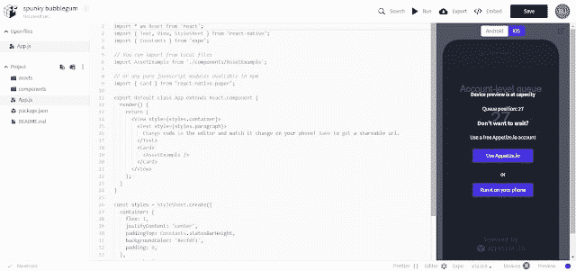

# 了解 React Native 世博会

> 原文：<https://dev.to/skptricks/understanding-expo-for-react-native-298d>

来源:[了解 Expo for React Native](https://www.skptricks.com/2019/04/expo-sdk-and-popular-react-native-playground.html)

世博会是一个伟大的起点。您可以轻松配置和启动一个基本的应用程序，并了解更多有关 React Native 的信息。在没有 Expo 的情况下构建应用程序可以让您在开发中更加灵活，减少依赖性，并允许您以更好的方式与移动设备集成。就受欢迎程度而言，Expo 对于初学者来说绝对是一个受欢迎的解决方案，然而，如果你想成为一名认真的 RN 开发者，你应该在没有 Expo 的情况下构建 RN 应用(至少目前是这样)。

如果你想知道从 React Native 开始是否仍然是一个好主意，在我们看来，这是一个很大的肯定。React Native 在很多公司中越来越受欢迎。软件公司看到了对需要 React Native 知识的服务的大量需求。如果你不是 iOS 用户，或者你没有 MAC，你想看看你的应用程序在 iOS 设备上的外观和工作方式，或者你同时是 iOS 和 Android 用户，想看看你的应用程序在这两种设备上的外观和工作方式，那么 Expo 就是为你准备的。

[点击此处观看演示](https://www.skptricks.com/2019/04/expo-sdk-and-popular-react-native-playground.html)