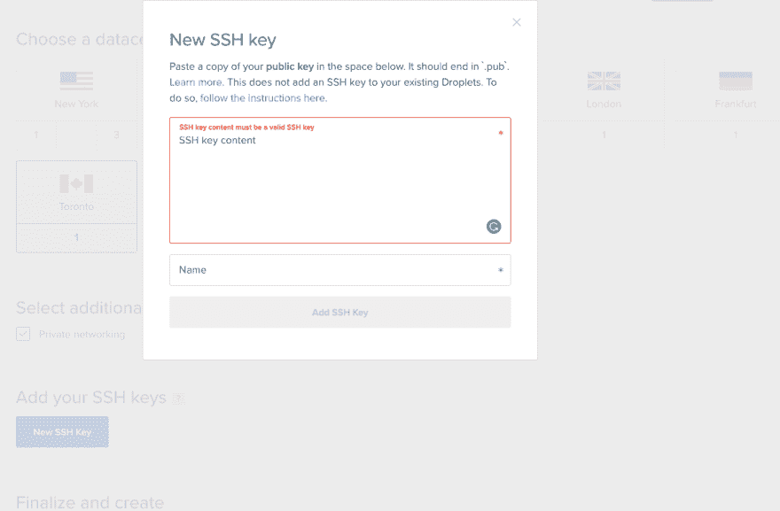
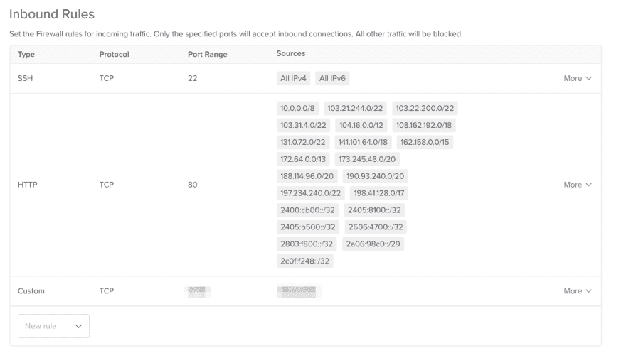
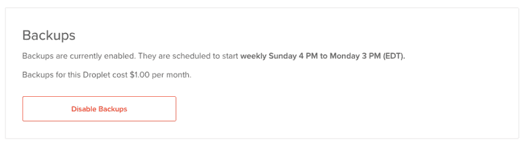

# 想着自己主持？这里有一些提示。

> 原文：<https://dev.to/ypkuby/thinking-of-self-hosting-here-s-some-tips-51dh>

这最初发表在我的博客上，我经常在那里发布技术教程和其他精彩的内容。

这是受 Reddit 帖子的启发，在这个帖子中，作者寻求关于自托管东西的建议。我对锁定您的自托管服务提出了一些看法。

# 为什么要自宿主？

这很有趣，有助于给你真实的世界体验。最重要的是，如果你关心隐私和安全，它可以帮助你锁定环境，让你感觉更舒服。记住，没有什么是防弹的。如果一个有决心的威胁者想要进来，只需要一个小小的错误就能打开防洪闸门。

# 好吧，那我来主持。接下来呢？

欢迎来到激动人心的自助世界！这是一个很好的爱好。系统管理棒极了。

让我们假设您将使用某种风格的 linux，比如 Debian 或 Ubuntu。首先，我总是选择最新的 LTS，对于 Ubuntu，我更喜欢 18.04 的 LTS。我用 DigitalOcean (ref link) 来管理大多数个人事务，包括我和妻子的博客。他们在让开发者和新来者的生活变得超级简单方面做得非常好。

继续在 DigitalOcean 上创建一个帐户，获得一些免费点数，用 Ubuntu 18.04 为自己旋转一个液滴。您将需要一个 SSH 密钥，您可以通过以下操作在 linux 或 mac 上生成一个密钥:

```
ssh-keygen -b 4096 
```

要检索公钥，只需运行这个命令，然后将其粘贴到 DigitalOcean 上的 ssh 密钥槽中(如下所示):

```
cat ~/.ssh/id_rsa.pub 
```

[](https://res.cloudinary.com/practicaldev/image/fetch/s--7QdNUYg1--/c_limit%2Cf_auto%2Cfl_progressive%2Cq_auto%2Cw_880/https://kuby.ca/conteimg/2019/04/image-6.png)

然后，完成并创建您的 droplet！大约 1 分钟内，您的 droplet 就可以上线使用了。

# 访问您的 droplet

你需要使用 ssh，只需输入你的终端(linux/mac)或 Putty/其他 Windows 上的 ssh 客户端:

```
ssh root@$IP_ADDRESS 
```

将$IP_ADDRESS 替换为您的 droplets IP 地址。你被录取了。

# 保护您的水滴

马上，你要做的第一件事就是锁定你的水滴。首先运行一个简单的 apt 更新并安装 fail2ban:

```
apt-get update && apt-get install fail2ban -y 
```

这将更新您的数据包存储库，安装并启用 fail2ban。Fail2ban 为 SSH 创造了奇迹，并帮助禁止暴力攻击者。但是，我们真的不应该将 ssh 端口 22 作为默认端口。

建议(a)更改 SSH 端口，(b)通过防火墙限制对 SSH 的访问，或者(c)两者都做。我总是选择 c 选项。

让我们改变 ssh 端口！我使用 vim(是的，我知道)——但是 nano 是一个很好的选择。如果你没有 nano，运行 apt-get 安装 nano 你就有了。

```
vim /etc/ssh/sshd_config 
```

在前几行中，您应该看到“Port 22”——继续将它更改为您知道的任何值得记忆的端口，选择一些不容易猜到的端口(例如 2222)。在这个例子中，我将使用端口 9132。

继续保存这个文件，然后重启 ssh——一旦完成，您可能需要重新连接。

```
service ssh restart 
```

要重新连接到新端口，请运行:

```
ssh root@$IP_ADDRESS -p $PORT 
```

现在这变得更加困难了，但是让我们想象我们有一个 apache2 服务器正在运行，并且我们使用 Cloudflare。我们希望确保只有 Cloudflare 和我们的 IP 可以直接访问 web 服务器，让我们引入一个来自 DigitalOcean 的[云防火墙。](https://www.digitalocean.com/products/cloud-firewalls/)继续创建一个，并适当地标记它。

您的基本配置应该是这样的(cloudflare 的 IP 列表可在此处获得:[https://www.cloudflare.com/ips/](https://www.cloudflare.com/ips/)

[](https://res.cloudinary.com/practicaldev/image/fetch/s--hVyJlzjt--/c_limit%2Cf_auto%2Cfl_progressive%2Cq_auto%2Cw_880/https://kuby.ca/conteimg/2019/04/image-7.png)

如您所见，HTTP 仅对 Cloudflare 开放。完美。现在，如果你试图访问它，你应该会被防火墙拒绝(除非你把自己列入白名单)。在这个演示中，我打开了 10/8，这样如果你有多个 droplets，它们就可以彼此正常通信(不过，我建议只手动将 IP 列入白名单，而不是整个子网)。YMMV。

# 随时做备份！

DigitalOcean 收取很少的费用来自动完成它们，这个博客花费我 1 美元/月来备份。我建议你也总是保留一份个人备份，以防万一。

[](https://res.cloudinary.com/practicaldev/image/fetch/s--Tml4Wfj---/c_limit%2Cf_auto%2Cfl_progressive%2Cq_auto%2Cw_880/https://kuby.ca/conteimg/2019/04/image-8.png)

# 就是这样！

现在你可以试验并安装你自己的软件，比如 NextCloud 等等。为了进一步阅读，请查看 [/r/homelab](https://reddit.com/r/homelab) 和[/r/self hosted](https://reddit.com/r/selfhosted)——这很容易让人上瘾。

如果你有任何问题，随时给我打电话！