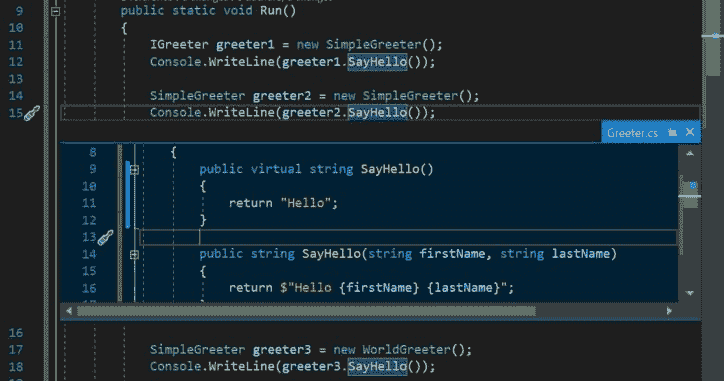
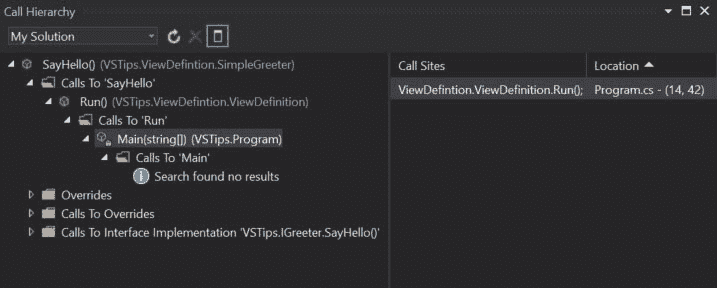

# Visual Studio 提示-代码定义键盘快捷键

> 原文：<https://dev.to/hutchcodes/visual-studio-tips-code-definition-keyboard-shortcuts-21l3>

通常当我们编码时，我们需要看一下定义，或者有时是我们调用的方法的实现。Visual Studio 有一些很好的方法来加速这些任务。

### Goto 定义

要查看变量、类、接口或方法的定义，您可以将光标放在您想要查看其定义的对象上，然后按下`F12`或右击并选择`Goto Definition`。

使用 Goto Definition 的一个问题是，当你使用它来访问一个属性或方法的定义时，它会在声明时访问对象的定义。这意味着，如果您在下面的所有`SayHello()`方法上点击`F12`，您将转到`IGreeter.SayHello`的`greeter1`，转到`SimpleGreeter.SayHello`的`greeter2`，转到`greeter3`的`WorldGreeter.SayHello()`。

```
 IGreeter greeter1 = new SimpleGreeter();
            Console.WriteLine(greeter1.SayHello());

            SimpleGreeter greeter2 = new SimpleGreeter();
            Console.WriteLine(greeter2.SayHello());

            SimpleGreeter greeter3 = new WorldGreeter();
            Console.WriteLine(greeter3.SayHello());

            WorldGreeter greeter4 = new WorldGreeter();
            Console.WriteLine(greeter4.SayHello()); 
```

### 窥视定义

如果您想浏览一下定义而不导航到它的定义，您可以使用`Alt+F12`或右键单击并选择`Peek Definition`。这将在代码编辑器的一个小窗口中显示定义。您仍然可以滚动浏览定义的代码，而不会丢失您正在编辑的代码中的位置。`Esc`关闭窥视窗口。

[](https://res.cloudinary.com/practicaldev/image/fetch/s--3D47O4yw--/c_limit%2Cf_auto%2Cfl_progressive%2Cq_auto%2Cw_880/https://hutchcodes.net/img/2019/PeekDefinition.jpg)

### Goto 实现

如果你想查看一个方法或属性的实现，而不是它的定义，你可以按下`Ctrl+F12`或者右击并选择`Goto Implementation`。如果一个方法只有一个实现，Visual Studio 会将您直接带到该实现。如果有多个实现，它会弹出一个列出实现的窗口。您可以使用箭头键或单击它们来查看实现。

对于上面的代码，它将直接进入`greeter4.SayHello()`的实现，对于所有其他代码，它将打开实现选择器窗口。

### 查找所有引用

有时，查看哪些其他代码正在引用某个方法或属性会很有帮助。为此，你可以使用官方快捷方式`Ctrl+K+R`，或者未列出的快捷方式`Shift+F12`，或者你可以右击并选择`Find All References`。这将打开一个窗口，列出对该方法的所有引用。无论对象是如何声明的，都会显示相同的列表。

### 查看通话层级

有时，能够看到哪些代码调用了方法或属性，以及哪些代码导致了该调用是很方便的。你可以右击你感兴趣的方法或属性，然后选择“查看调用层次结构”或`Ctrl+K, Ctrl+T`。这将打开一个包含您感兴趣的方法或属性的树视图，并允许您深入研究，直到找到导致该方法或属性被调用的初始操作。在下面的例子中，我们可以看到`SayHello()`方法被`Main([string])`调用的`Run()`方法调用。在右边的窗格中，我们可以看到调用`Run()`的行和列，双击会将我们带到那个位置。

[](https://res.cloudinary.com/practicaldev/image/fetch/s--T0uipK5Q--/c_limit%2Cf_auto%2Cfl_progressive%2Cq_auto%2Cw_880/https://hutchcodes.net/img/2019/ViewCallHierarchy.jpg)