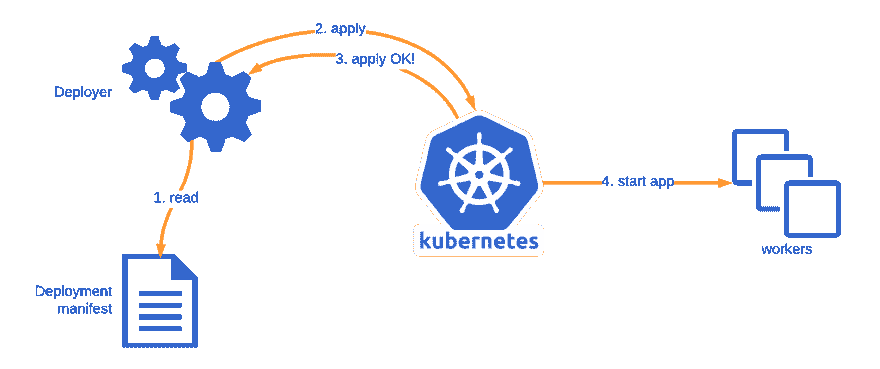
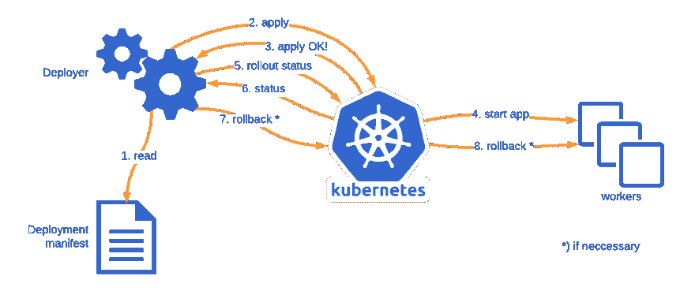

# 检查您的 Kubernetes 部署！

> 原文：<https://dev.to/lepovirta/check-your-kubernetes-deployments-4fbh>

当编写和安装软件时，我们很自然地只关注快乐的道路。毕竟那是大家都想走的路。不幸的是，软件可能经常失败，所以我们也需要对不愉快的路径给予一些关注。

Kubernetes 在这里也不例外。在将软件部署到 Kubernetes 时，很容易把注意力集中在快乐的道路上，而没有正确地检查一切是否如预期的那样进行。在本文中，我将讨论在将应用程序部署到 Kubernetes 时通常会缺少什么，并演示如何改进它。

这篇文章最初发布在[极地小分队的博客](https://medium.com/polarsquad)上。

## 将应用部署到 Kubernetes 的典型流程

在 Kubernetes 中，大多数服务风格的应用程序使用[部署](https://kubernetes.io/docs/concepts/workloads/controllers/deployment/)在 Kubernetes 上运行应用程序。使用部署，您可以描述如何在 Kubernetes 中将应用程序容器作为 Pod 运行，以及要运行多少个应用程序副本。Kubernetes 将负责运行指定数量的副本。

下面是一个 YAML 格式的示例部署清单，用于运行一个简单的 hello world web 应用程序的三个实例:

```
apiVersion: apps/v1
kind: Deployment
metadata:
  labels:
    app: myapp
  name: myapp
spec:
  replicas: 3
  selector:
    matchLabels:
      app: myapp
  template:
    metadata:
      labels:
        app: myapp
    spec:
      containers:
      - image: polarsquad/hello-world-app:master
        name: hello-world
        ports:
        - containerPort: 3000 
```

Enter fullscreen mode Exit fullscreen mode

部署的一个关键特性是 it 如何管理应用程序更新。默认情况下，在 Kubernetes 中更新部署清单会导致应用程序以滚动方式更新。这样，当新版本启动时，您将运行先前版本的部署。在部署清单中，您可以指定在更新期间一次启动和关闭多少个副本。

例如，我们可以将滚动更新策略添加到清单的 spec 部分，在该部分中，我们一次启动一个副本，并确保在升级过程中的任何时间点都没有丢失健康的副本。

```
spec:
 strategy:
   type: RollingUpdate
   rollingUpdate:
     maxUnavailable: 0
     maxSurge: 1 
```

Enter fullscreen mode Exit fullscreen mode

更新通常通过[直接修补清单](https://kubernetes.io/docs/tasks/run-application/update-api-object-kubectl-patch/)或者通过[从文件系统](https://kubernetes.io/docs/concepts/cluster-administration/manage-deployment/)应用完整的部署清单来执行。从 Kubernetes 的角度来看，这没有什么区别。如果清单更新的内容有效，那么 Kubernetes 会很乐意接受更新。大多数情况下，应用程序更新主要包含容器图像标记或您可能拥有的一些环境变量配置的更改。

为了自动化这个过程，您可以选择使用 kubectl 在 CI 管道中部署您的应用程序。

```
kubectl apply -f deployment.yaml 
```

Enter fullscreen mode Exit fullscreen mode

所以现在你有了一个让你的应用在 Kubernetes 上运行的模式和流程。一切都好，对吗？可惜，[没有](https://www.youtube.com/watch?v=GM-e46xdcUo)！

这是一个很好的开始，但通常还不够。一旦 Kubernetes 接受了部署，将部署应用到 Kubernetes 就结束了，而不是在部署完成时。Kubectl apply 甚至不会验证您的应用程序是否启动。下图演示了这个部署流程。

[](https://res.cloudinary.com/practicaldev/image/fetch/s--5qpgzlFb--/c_limit%2Cf_auto%2Cfl_progressive%2Cq_auto%2Cw_880/https://lepovirta.org/posimg/kubernetes_deployment_flow_incomplete.png)

为了正确地检查更新是否按预期进行，我们需要另一个 kubectl 命令的帮助。

## 卷展救援！

这就是 kubectl 的 rollout 命令变得方便的地方！我们可以用它来检查我们的部署情况。

默认情况下，该命令会一直等待，直到部署中的所有单元都已成功启动。当部署成功时，该命令退出，并返回代码零以表示成功。

```
$ kubectl rollout status deployment myapp
Waiting for deployment "myapp" rollout to finish: 0 of 3 updated replicas are available…
Waiting for deployment "myapp" rollout to finish: 1 of 3 updated replicas are available…
Waiting for deployment "myapp" rollout to finish: 2 of 3 updated replicas are available…
deployment "myapp" successfully rolled out 
```

Enter fullscreen mode Exit fullscreen mode

如果部署失败，该命令将退出，并返回一个非零代码来指示失败。

如果您已经在使用 kubectl 从 CI 部署应用程序，那么使用 rollout 来验证您在 CI 中的部署将是轻而易举的事情。通过在部署更改后直接运行 rollout，我们可以阻止 CI 任务完成，直到应用程序部署完成。然后，我们可以使用 rollout 返回的代码来通过或失败 CI 任务。

到目前为止一切顺利，但是 Kubernetes 如何知道应用程序部署何时成功呢？

## 准备就绪探查和截止日期

为了让 Kubernetes 知道应用程序何时准备好，它需要应用程序的一些帮助。Kubernetes 使用[就绪探测器](https://kubernetes.io/docs/tasks/configure-pod-container/configure-liveness-readiness-probes/)来检查应用程序的运行情况。一旦应用程序实例开始用肯定的响应来响应就绪性探测，就认为该实例可以使用了。

对于 web 服务，最简单的实现是一个 [HTTP GET 端点](https://kubernetes.io/docs/tasks/configure-pod-container/configure-liveness-readiness-probes/#define-a-liveness-http-request)，当服务器启动时，它用 200 OK 状态码开始响应。在我们的 hello world 应用程序中，当可以加载索引页面时，我们可以认为应用程序是健康的。下面是我们的 hello world 应用程序的准备就绪探测器配置:

```
readinessProbe:
  httpGet:
    path: /
    port: 3000 
```

Enter fullscreen mode Exit fullscreen mode

运行状况检查的更复杂的实现可能会执行一些后台检查，以验证应用程序为服务请求做好了一切准备，并通过专用的运行状况端点(例如/health 或/ready)提供该信息。由应用程序开发人员来决定应用程序何时准备好，以及如何响应探测。

准备就绪探测器告诉 Kubernetes 应用程序何时准备就绪，但不告诉 Kubernetes 应用程序是否准备就绪。如果应用程序一直失败，它可能永远不会对 Kubernetes 做出积极的响应。那么 Kubernetes 如何知道部署何时会失败呢？在我们的部署清单中，我们可以指定 Kubernetes 在认为部署失败之前应该等待多长时间[。如果部署在截止日期之前没有进行，Kubernetes 会将部署状态标记为失败，而部署状态命令将能够检测到这一点。](https://kubernetes.io/docs/concepts/workloads/controllers/deployment/#progress-deadline-seconds)

```
$ kubectl rollout status deployment myapp
Waiting for deployment "myapp" rollout to finish: 1 out of 3 new replicas have been updated…
error: deployment "myapp" exceeded its progress deadline 
```

Enter fullscreen mode Exit fullscreen mode

截止日期的奇妙之处在于，如果部署能够在截止日期内进行，Kubernetes 将重置截止日期计时器，并再次开始等待。这样，您不必估计整个部署的截止日期，而只需估计应用程序的一个实例。

例如，如果我们将截止时间设置为 30 秒，那么 Kubernetes 将等待 30 秒，等待应用程序准备就绪。如果应用程序准备就绪，Kubernetes 将再等待 30 秒，等待下一个实例准备就绪。

## 脚本自动回滚

目前，当 Kubernetes 中的部署失败时，部署过程会停止，但是失败的部署中的 pod 会保留下来。部署失败时，您的环境可能包含旧部署和新部署的 pod。

为了回到稳定的工作状态，我们可以使用[卷展栏撤销](https://kubernetes.io/docs/concepts/workloads/controllers/deployment/#rolling-back-a-deployment)命令来恢复工作舱并清理失败的部署。

```
$ kubectl rollout undo deployment myapp
deployment.extensions/myapp
$ kubectl rollout status deployment myapp
deployment "myapp" successfully rolled out 
```

Enter fullscreen mode Exit fullscreen mode

厉害！既然我们有了确定部署何时失败以及如何恢复部署的方法，我们就可以用一个简单的 shell 脚本来自动化部署和回滚过程。

```
kubectl apply -f myapp.yaml
if ! kubectl rollout status deployment myapp; then
    kubectl rollout undo deployment myapp
    kubectl rollout status deployment myapp
    exit 1
fi 
```

Enter fullscreen mode Exit fullscreen mode

我们首先展示变更，然后立即等待展示状态。如果首次展示成功，我们将正常继续。如果失败，我们撤销部署，等待撤销完成，并返回一个退出代码为 1 的失败报告。下图演示了这一流程。

[](https://res.cloudinary.com/practicaldev/image/fetch/s--fA4emziK--/c_limit%2Cf_auto%2Cfl_progressive%2Cq_auto%2Cw_880/https://lepovirta.org/posimg/kubernetes_deployment_flow_improved.png)

脚本中没有提到一个重要的警告:kubectl 命令可能会因为网络条件而失败！上面的脚本没有考虑任何连接故障，这意味着脚本可能会将 rollout 命令中的网络故障解释为部署失败。Kubectl 确实会自动重试可重试的错误，但是如果 Kubernetes API 长时间不可用，它最终会失败。

## 结论

在本文中，我讨论了 Kubernetes 中服务风格应用程序使用的典型部署流程，以及这不足以确保安全部署。我介绍了一种通过状态检查和自动回滚过程来扩展部署流程的方法。

我还没有涉及的一个领域是如何在 Helm 中实现相同的检查和自动回滚。当涉及到检测失败的部署时，Helm 部署有其自己的额外怪癖。我将在另一篇文章中讨论这些怪癖。

我已经在 GitHub Gist 中发布了代码示例。感谢阅读！