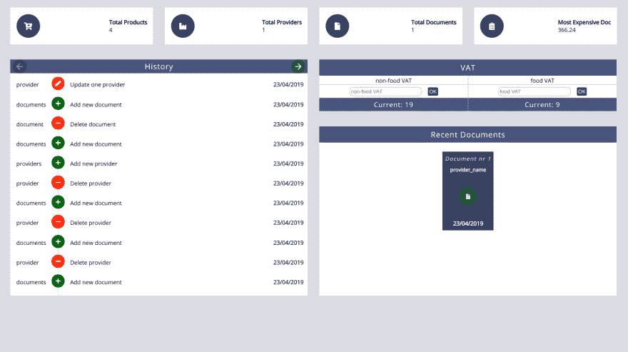
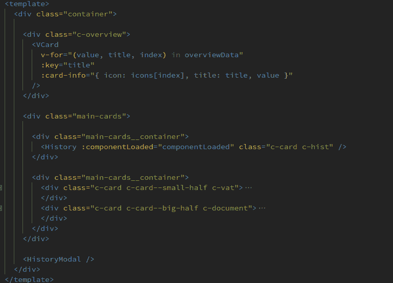
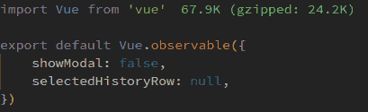
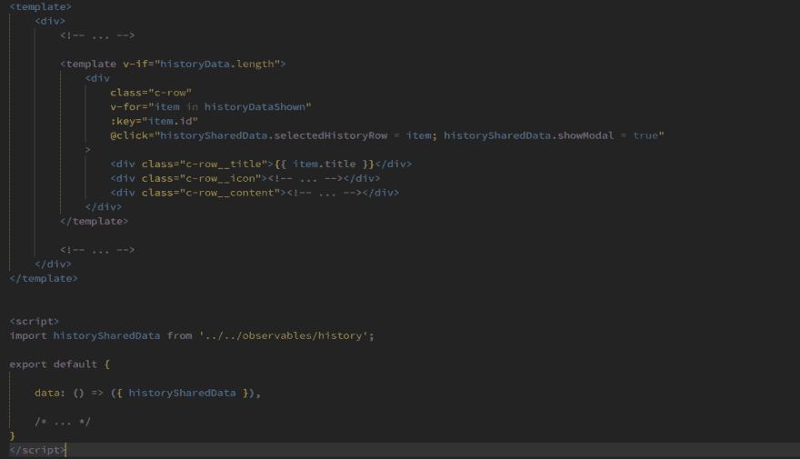
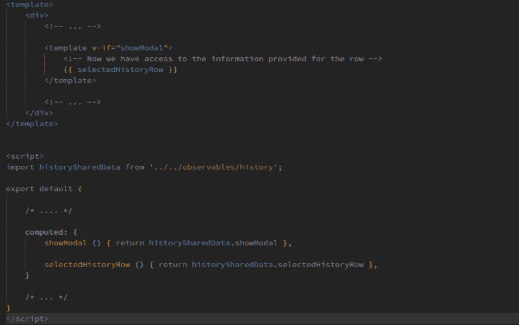

# Vue.js:用 Vue.observable()在组件之间共享数据

> 原文：<https://dev.to/anduser96/vue-js-sharing-data-between-components-with-vue-observable-2lc>

当我在做一个项目时，我发现自己处于一个棘手的境地。(*你可以在这里找到项目[)](https://github.com/Andrei0872/vue-invoice-app)*

我需要找到一种在两个组件之间共享数据的方法，但是数据太小，无法存储在 Vuex 中，通过组件传递数据会使事情变得混乱。

经过一番研究，我找到了我一直在寻找的东西: **Vue.observable()** 。

简单来说，它使一个物体具有反应性。这可以为我们所用:如果在两个组件之间共享的对象被组件 A 修改了，那么这些变化将会反映在组件 B 中(反之亦然)。

## 真实用例

这是仪表板组件的样子:

正如您所注意到的，仪表板由多个卡片组成:历史记录、增值税、文档。

现在，我请你将注意力集中在`History`卡上。
我期望的行为是，每次用户点击一行，就会打开一个模态，显示关于该行的正确信息。

我解决这个问题的方法是创建两个独立的组件，一个显示行，另一个包含模态。

这里的想法翻译成代码:

现在出现了下面的问题:`HistoryModal`组件如何知道一行何时被点击了？

好吧，让我们看看`Vue.observable`能如何帮助我们。

首先，我们在`src/observables/history.js`
 中设置无功对象

在`src/views/dashboard/History.vue`中，我们将反应对象传递给`data`属性，以便在模板中使用它并修改它。
T3T5】

从`History.vue`开始的任何变化都将反映在`src/views/dashboard/HistoryModal.vue`中。一切按预期运行！
T3T5】

## 结论

我希望这篇文章能够对你可能面临的一些类似问题有所启发，或者只是说明 Vue.js 是多么强大。

感谢您的阅读！