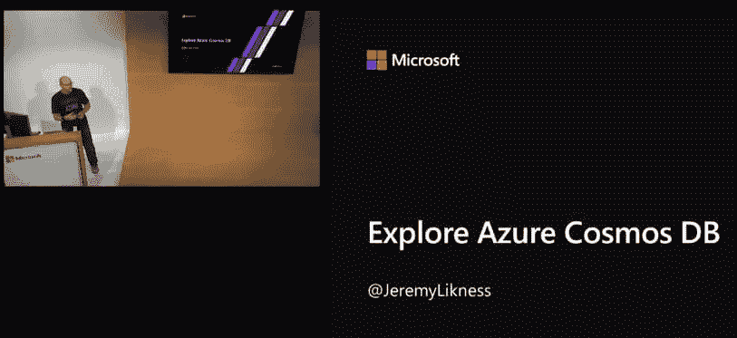

# 制作不差的会议提交材料的惊人秘密

> 原文：<https://dev.to/azure/the-amazing-secret-to-crafting-conference-submissions-that-don-t-suck-hgf>

我花了十年时间做技术报告，在此期间我学到了一些东西。这个系列的目的是与你分享这些经验。这些不是让你成为顶级演讲者的最佳实践或秘密提示，而是基于个人经验的实用建议。

在这个系列中:

*   [为什么说话？](https://dev.to/azure/a-guide-for-everyone-who-wants-to-give-technical-presentations-53bo)
*   [在哪里说话？](https://dev.to/azure/how-to-choose-where-to-give-your-technical-presentation-5g14)
*   [谈话格式](https://dev.to/azure/the-many-flavors-of-technical-presentations-3fjj)
*   征集演示文稿(你在这里)
*   [制作您的演示文稿](https://dev.to/azure/build-a-bomb-diggity-technical-presentation-mic-drop-optional-1fhb)
*   [练习和反馈](https://dev.to/azure/how-to-practice-for-a-lit-presentation-51n9)
*   [准备出行](https://dev.to/azure/what-s-in-the-bag-packing-tips-for-technical-presentations-4k6n)
*   [你演讲的那天](https://dev.to/azure/it-s-time-to-talk-the-day-of-your-presentation-2kpl)
*   [演讲和总结后](https://dev.to/azure/after-your-talk-the-power-of-leverage-2enj)

# 👉🏻“征集陈述”(CFP):创造一个伟大的摘要

嘘。不要告诉任何人，但是*秘密*是，嗯，真的没有秘密。大多数会议对于他们在高质量的提交中寻求什么是透明的。我有好消息和坏消息。首先是坏消息:没有被证实的永远不会在谈话中被拒绝的公式。这种情况经常发生，原因各不相同。一些会议有数千份提交材料要审查，只接受 90 场会议，这可能很难脱颖而出。你可能会和十几个其他人竞争同一个主题。有时候，组织者会忽略经验丰富的演讲者，而是鼓励新的演讲者拥有一个平台(我个人认为这很棒)。

当我开始第一次在家创业时，我的一位导师指出，大约 80%的第一次创业会在第一年失败。有些人失败了，然后决定，“这不适合我。”另一方面，严肃的企业家通过宣布“一个失败”来接受失败。只剩七个了！”想想吧！不要让拒绝让你气馁。如果可能的话，寻求反馈，看看你能否发现为什么你的摘要没有被接受，然后继续前进。

> 杰里米·利克内斯⚡️[@杰里米·利克内斯](https://dev.to/jeremylikness)[@ rabeb _ oth mani](https://twitter.com/Rabeb_Othmani)每时每刻都在发生。这通常意味着:
> ✅我的拒绝是别人的机会
> ✅如果组织者提供反馈，这是一个改进主题/标题/摘要的学习机会
> ✅当会议宣布时，我用它们来校准我下次的重点
> ✅少旅行！2018 年 11 月 06 日下午 18:03

好消息是:你可以使用一些技巧来增加你被注意并最终被接受的机会。作为一个在我的职业生涯中收到接受信比拒绝信多的人，我将概述一下我认为对我有效的方法。

## 标题

我大概把大部分精力都花在标题上了。一个好的标题容易阅读和理解，也许有点聪明，并准确地传达了什么是可以预期的谈话。尽管总有例外，但当我浏览时间表时，与只列出技术的标题相比，更好的标题能给人一种“我有什么好处”的感觉。

> 

作为一个案例研究，让我们来看一个我构建并修改了几次的演示文稿，以便在不同的场所发布多个版本的。这次演讲的重点是一项名为 [Cosmos DB](https://docs.microsoft.com/azure/cosmos-db/introduction?WT.mc_id=devto-blog-jeliknes) 的完全托管的 NoSQL 服务。我最初的听众是一个。NET 开发人员，我认为他们知道这项技术的名字，但不一定知道它的细节。我下面分享的所有标题都来自接受的会话。我的第一个标题很简单:

> **探索(天蓝色)宇宙(DB)**

<figure>

<figcaption>Presenting at Microsoft //build</figcaption>

</figure>

这是对科学兴趣的一个小小的双关语，很简单。当我在俄罗斯演讲时，我被告知观众只想知道，“有什么好东西？”没有太多的小聪明。我演讲中的例子使用了[。NET 核心平台](https://docs.microsoft.com/dotnet/core/?WT.mc_id=devto-blog-jeliknes)，所以我把标题改为:

> **探索蔚蓝的宇宙。网芯 2.0**

我认为这不是我最好的作品，但它至少描述了我所期待的。在做了几次演讲后，我意识到许多开发人员并不了解数据库工作的细节。所以，我把几个好处整合到标题里。该服务建立在云应用程序的云中，使其成为云原生的，旨在提供高度可扩展的 NoSQL 实例。因此，下一次迭代是:

> **面向 NoSQL 的云原生 Azure CosmosDB】**

在另一次会议上，我知道开发人员大多熟悉关系数据库。我想确保他们明白这不是一个“你不会感兴趣的演讲，因为它是关于不同的技术”，而是事实上“一个为你量身定制的演讲，帮助你理解一些新的东西。”所以，我在标题中加了一句对观众的呼吁:

> **使用 Azure CosmosDB 为 SQL 开发人员管理 NoSQL**

这种方法非常成功，我在下一次迭代中做了进一步的改进:

> 对 NoSQL 说“是”。NET SQL 开发人员

注意标题是如何从*什么*演变成*是谁*的。

我提交的下一个会议以远足/户外为主题。我特意为这个主题定制了演讲的标题。演讲题目变成了:

> **(Hitch)徒步旅行者宇宙指南(DB)**

液体错误:内部

这是我给出的其他几个演讲的标题。你对这次谈话的内容有什么感觉吗？标题是否恰当地传达了“对你有什么好处？”我有目的地将类似演讲的标题(基于相同的内容)组合在一起，以展示我是如何随着时间的推移对它们进行调整的。你更喜欢哪个，为什么？

面向云应用和服务的全面托管消息服务:

> **事件网格:互联网的粘合剂**
> **将任何东西连接到任何东西:事件网格的无服务器路由和消息传递**

Azure 无服务器平台:

> **云端代码先行:用 Azure**
> **进行无服务器化**
> **企业无服务器化:幽灵不是*在*机器上，它*是*机器上！**

通过 azure kubriones service(AK)实现坞站和托管库:

> **Azure 中的 Docker 管理和编排**
> **云中的 Docker 容器和编排简介**

职业发展技巧和诀窍:

> **黑你的事业**(不是黑*为*你的事业！)

云存储选项(文件、blobs、表存储和队列):

> **绕 Azure 云存储一圈**

现代 JavaScript 应用中的依赖注入、模板的声明性语法和数据绑定:

> **现代网络开发的三个“D”**

从 JavaScript 开始学习 TypeScript 并重新分解它:

> **通过转换从 JavaScript 键入脚本**

如果你对其他标题感兴趣，你可以浏览我的[演示文档](https://blog.jeremylikness.com/past-presentations-3aa8fe97cf31)，它包含了演示文档和存储库的链接。

> 大多数会议都有网站，在线发布会议标题和摘要，甚至在会议结束后。花些时间浏览标题，获得灵感。这些都是被接受的头衔，所以他们一定做对了什么！最终，你会看到几种模式，比如“用某物构建某物”，“用某物创建应用”，“新事物介绍”，“什么是某物，为什么我应该知道它？”以及一直流行的“如何用某物做某事。”

标题能让你迈出第一步，但摘要能让你破门而入。

## 摘要

摘要有双重目的。首先，它是组织者最终用来缩小提交范围的工具。一个糟糕的标题可能会导致提前淘汰，但是如果你做了最初的删减，你的摘要就是你能给出最后一击的地方。它应该非常简洁，就像标题一样，少关注*是什么*，多关注*对我有什么好处？*

其次，它通常是提供给事件参与者的内容。这是他们必须决定是否愿意在您的会议中投入时间和注意力的唯一信息。如果我不能理解一次会议的真正意义，或者看不到任何价值，我为什么愿意参加？

让我们从我在 2018 年发表的一篇名为“将任何东西连接到任何东西:使用事件网格的无服务器消息传递和路由”的演讲中举个例子。标题虽然有点长，但已经陈述了价值主张(将事物联系在一起)，然后描述了一点“什么”让我们来看几个差的、一般的、好的摘要的例子。

> 这个演讲是关于 Azure Event Grid，一个在应用程序和服务之间发送消息的服务。

👎🏻这种描述严重缺乏...嗯，几乎所有的事情。我知道*发生了什么*，但是我不知道我为什么要关心。对我来说没有价值主张。这会让我的生活更轻松吗？我不知道。谈话会带来价值吗，或者我可以节省一些时间，只是浏览一下文档？让我们再试一次:

> Azure Event Grid 是一个完全托管的智能事件路由服务，允许使用发布-订阅模型进行统一的事件消费。使用 Azure Event Grid 以近乎实时的方式对 Azure 和非 Azure 服务中的相关事件做出反应。了解如何在本演示中使用 Azure Event Grid。

🤞🏻我不得不祈祷这个能通过。它在解释什么是事件网格方面做得更好，甚至试图描述您将学习如何使用它的价值主张，但它仍然存在不足。我将学会如何使用它，这很好，但是我为什么要在乎呢？这是我想学的东西吗？

<figure>

<figcaption>Just another abstract</figcaption>

</figure>

这是我在同事的帮助和反馈下提交的摘要，并被接受了。

> 在这个动手演示中，通过查看一个实际例子来了解事件网格的真正价值。您将能够理解是什么将事件网格与服务总线和消息队列等其他服务区分开来。事件网格是一个 Azure 服务，它在端点之间路由事件。它为几乎任何现有的 Azure 服务提供支持，从存储活动到无服务器 Azure 函数调用。它还支持自定义端点。Event Grid 将为您管理事件，并在准备就绪时将它们发布到您的应用程序，而不是在您的应用程序中承担持续轮询的昂贵开销。

👍🏻这个摘要向我保证我会理解这个值，并分享一点关于这个值是什么(避免连续轮询的开销)。它承诺，它也将有助于澄清为什么我会使用这个相比，其他服务。摘要可能还可以进一步改进(例如，我可以提到节省自己架设服务器的成本，避免成为 24/7 支持的受害者)，但这已经足够了。

这是另一个在同一会议上被接受的摘要:

> 了解如何利用 Azure Cosmos DB 的强大功能，这是一个基于 NoSQL 文档的数据库，提供了真正的“无服务器数据”体验。在本专题讲座中，Jeremy Likness 将向您展示如何通过点击式地理复制和有保证的个位数延迟进行全球扩展。您将学习如何“选择自己的 API”，并能够使用 SQL API、MongoDB、Gremlin(基于图形)、表存储和 Cassandra APIs 与 Azure Cosmos DB 进行交互。中的演示，您将了解如何设置 Azure Cosmos DB 并构建应用程序。NET 和。网芯。

通过阅读本文，您应该知道如何设置它，如何扩展它，以及如何使用。您选择的. NET 平台。

> 提示我之前提到的关于从标题中获得灵感的事情？你可以对摘要做同样的事情。

你会注意到一种流行的形式，我称之为“挑战/回应”以提出问题开始，以提供解决方案结束。“就拿我之前关于 CosmosDB 的摘要来说，它可能是这样设计的:

> 将最新的模式更改推出到数据库时，您是否感到焦头烂额？您的数据库管理员是否因为疯狂地请求优化由您最喜欢的 ORM 工具自动生成的制作拙劣的 SQL 查询而感到沮丧？当您要求使用全球地理复制数据来减少国际市场的延迟时，您的 DBA 笑了吗？有更好的办法！NoSQL 是专为处理可变数据而设计的。Azure CosmosDB 是一个为云构建的完全托管的数据库服务，通过全局复制提供有保证的吞吐量，您可以像在地图上单击一个点一样轻松地设置全局复制。亲自了解失去关系和完整性(即数据库关系和引用完整性)的好处，以及用 CosmosDB 构建它是多么容易！

在提交之前，我可能会减少尺寸，也许会稍微缓和一下开玩笑的语气，但希望你明白我的意思。

## 第二组眼睛👀

一旦你起草了标题和摘要，不要止步于此！找一群朋友和/或同事，分享并获得他们的反馈。越多越好。我认识到我经常离我想表达的主题太近，以至于我的偏见使我无法注意到标题和/或摘要中的明显缺陷。我的同事很乐意参与进来并给我建议，通常我提交的是我根据有价值的反馈反复多次重复的东西。

不确定谁能帮忙？没问题。请直接在这里联系我，或者直接在 Twitter ( [@JeremyLikness](https://twitter.com/jeremylikness) )上给我发消息，我非常乐意审阅您的建议并提供反馈。我很高兴成为你的虚拟导师...毕竟这也是我写这个系列的原因！现在没有借口不得到反馈。

## 内部备注

一些会议提供了一个内部注释部分。他们可能会特别要求你分享以前演讲的链接(如果你做过的话)或其他信息。我认为这是一个很好的机会来分享为什么我的演讲是独一无二的。无论一个话题被讨论了多少次，没有人会和你一样去讨论它。你的工作是找出它的独特之处，并帮助通知组织者。你在工作中是否遇到了一个特定的问题，这个问题提供了一个独特的解决方案？你的项目背后有没有特别的故事？不要犹豫，分享额外的信息，以帮助决策过程。

事实上，如果你是第一次发言，我强烈建议你分享这一点，以及你觉得自己准备好了的原因。描述一下你的激情，或者克服公众演讲恐惧的愿望，或者你解决了一个如此重要的问题，以至于你觉得必须与人分享的事实。所有这些额外的事实可能有助于推动你的决定。

## 网络

许多会议实行“盲提交”格式，从会议中删除姓名以进行更公正的投票(有时标题或摘要会泄露发言者的身份)。其他许多人会考虑说话者的因素。底线是网络可以帮助你。我不是在谈论玩政治游戏(尽管一些演讲者可能会这样做)。

当我参加一个会议时，我总是真诚地感谢这个机会。即使我没有发言，我也一定要会见并感谢组织者和赞助商，并与演讲者和与会者建立联系。如果你经常演讲，你会发现全球技术演讲者的网络很小。我只通过会议和社交媒体认识了很多人。建立你的人际网络有很多好处，其中之一就是说话的机会。

不知道 7 年后这个邀请还有效吗？

> 马特杜菲德[@马特杜菲德](https://dev.to/mattduffield)[@ jeremylikness](https://twitter.com/jeremylikness)12 月你愿意出来给我们的用户群做演讲吗？那将是这个月的第二个星期二。2012 年 8 月 21 日下午 14:17

有一次，我认识一个亚特兰大本地的开发者，他开了一家新公司。他邀请我去他创办的编码学院演讲。他主持了一个 web 开发入门训练营。我介绍了打字稿会话。这对我来说是一次独特的经历，因为这些材料远比我通常提供的材料更具入门水平，而且我可以与大多数初级开发人员互动。

其中一位观众碰巧是即将到来的会议的委员会成员，她在会议结束后遇见了我，问我是否愿意参加他们的活动。这是一个关注科技领域女性的活动，所以我很荣幸作为这项事业的盟友参与其中。第二年，我又被邀请去做了一次演讲，这次演讲的主题超出了我的舒适区，完全集中在职业发展上。进行得非常顺利，我遇到了很多了不起的开发者。仅仅是几年前的一次联系，就为我打开了说话和拓展人脉的机会。

## 提交！

这些是我用来撰写投稿的技巧。我不断更新和调整标题和摘要，但我自己仍有很大的改进空间。就像生活中的大多数事情一样，练习和坚持非常有帮助。记住:不要犹豫去寻求帮助。许多会议在提交过程中会向演讲者提供指导和反馈，如果没有，欢迎你随时联系我。我祝你成功，并鼓励你在你觉得舒服的地方提交。等待接受(或拒绝信)可能是一个漫长而紧张的过程，但坚持下去，最终你会被接受。然后是时候建立你的演示文稿了！

🗣 **我们来讨论一下**你见过的最喜欢的演讲标题是什么？你有什么额外的建议来起草一份高质量的意见书吗？请在下面的评论中分享你的想法！

**上一篇** [演讲格式](https://dev.to/azure/the-many-flavors-of-technical-presentations-3fjj)
T5】下一篇 [建立你的演讲](https://dev.to/azure/build-a-bomb-diggity-technical-presentation-mic-drop-optional-1fhb)

> 这一期的演示示例是一个专题讲座，作为名为“Microsoft Ignite | The Tour”的微软旗舰活动的一部分，将由不同的演示者进行大规模演示。这是一个分组会议，有一个存储库，包含逐步构建和执行演示的说明(您可以在这里探索它[)。我在世界各地做了几次演讲。这段特殊的对话是在阿姆斯特丹录制的。](https://github.com/Microsoft/IgniteTheTour/tree/master/DEV%20-%20Building%20your%20Applications%20for%20the%20Cloud/DEV50)

[https://www.youtube.com/embed/NZYSID8snjI](https://www.youtube.com/embed/NZYSID8snjI)