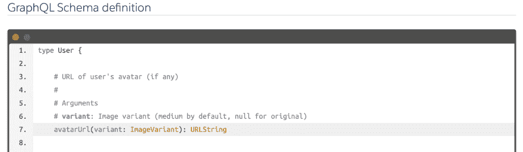
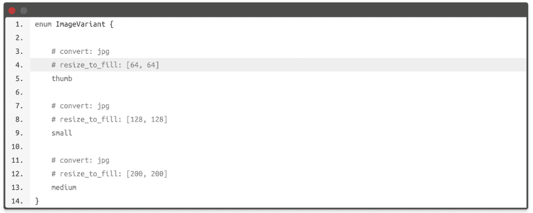

# 主动存储符合 GraphQL Pt。2:公开附件 URL

> 原文：<https://dev.to/evilmartians/active-storage-meets-graphql-pt-2-exposing-attachment-urls-2mdn>

在[之前的帖子](https://dev.to/evilmartians/active-storage-meets-graphql-direct-uploads-3n38)中，我分享了一些关于添加主动存储直接上传到 Rails+GraphQL 应用程序的技巧。

现在我们知道如何上传文件了。下一步是什么？让我们进入下一步:**通过 GraphQL API** 公开附件 URL。

看起来很简单，对吧？不完全是。

这些是我们在自己的应用中实现时面临的挑战:

*   处理 N+1 查询
*   使得客户可以请求特定的图像变体。

## N+1 问题:批量装载救援

让我们首先尝试以一种简单的方式将`avatarUrl`字段添加到我们的`User`类型中:

```
module Types
  class User < GraphQL::Schema::Object
    field :id, ID, null: false
    field :name, String, null: false
    field :avatar_url, String, null: true

    def avatar_url
      # That's an official way for generating
      # Active Storage blobs URLs outside of controllers 😕
      Rails.application.routes.url_helpers
           .rails_blob_url(user.avatar)
    end
  end
end 
```

假设我们有一个返回所有用户的端点，例如`{ users { name avatarUrl } }`。如果您在开发中运行这个查询，并在控制台中查看 Rails 服务器日志，您会看到类似这样的内容:

```
D, [2019-04-15T22:46:45.916467 #2500] DEBUG -- :   User Load (0.9ms)  SELECT users".* FROM "users"
D, [2019-04-15T22:46:45.919362 #2500] DEBUG -- :   ActiveStorage::Attachment Load (0.9ms)  SELECT "active_storage_attachments".* FROM "active_storage_attachments" WHERE "active_storage_attachments"."record_type" = $1 AND "active_storage_attachments"."name" = $2 AND "active_storage_attachments"."record_id" = $3 [["record_type", "User"], ["name", "avatar"], ["record_id", 12]]
D, [2019-04-15T22:46:45.922420 #2500] DEBUG -- :   ActiveStorage::Blob Load (1.0ms)  SELECT "active_storage_blobs".* FROM "active_storage_blobs" WHERE "active_storage_blobs"."id" = $1  [["id", 9]]
D, [2019-04-15T22:46:45.919362 #2500] DEBUG -- :   ActiveStorage::Attachment Load (0.9ms)  SELECT "active_storage_attachments".* FROM "active_storage_attachments" WHERE "active_storage_attachments"."record_type" = $1 AND "active_storage_attachments"."name" = $2 AND "active_storage_attachments"."record_id" = $3 [["record_type", "User"], ["name", "avatar"], ["record_id", 13]]
D, [2019-04-15T22:46:45.922420 #2500] DEBUG -- :   ActiveStorage::Blob Load (1.0ms)  SELECT "active_storage_blobs".* FROM "active_storage_blobs" WHERE "active_storage_blobs"."id" = $1  [["id", 10]]
D, [2019-04-15T22:46:45.919362 #2500] DEBUG -- :   ActiveStorage::Attachment Load (0.9ms)  SELECT "active_storage_attachments".* FROM "active_storage_attachments" WHERE "active_storage_attachments"."record_type" = $1 AND "active_storage_attachments"."name" = $2 AND "active_storage_attachments"."record_id" = $3 [["record_type", "User"], ["name", "avatar"], ["record_id", 14]]
D, [2019-04-15T22:46:45.922420 #2500] DEBUG -- :   ActiveStorage::Blob Load (1.0ms)  SELECT "active_storage_blobs".* FROM "active_storage_blobs" WHERE "active_storage_blobs"."id" = $1  [["id", 15]] 
```

对于每个用户，我们加载一个`ActiveStorage::Attachment`和一个`ActiveStorage::Blob`记录: **2*N + 1** 记录(其中 N 是用户的数量)。

我们已经在[“Rails 5.2:活动存储和超越”](https://evilmartians.com/chronicles/rails-5-2-active-storage-and-beyond)的帖子中讨论过这个问题，所以，我不打算在这里重复技术细节。

**TL；dr** For *经典* Rails 应用我们有一个预加载附件的内置作用域(例如`User.with_attached_avatar`)，或者我们可以自己生成作用域，知道活动存储命名内部关联的方式。

GraphQL 使预加载数据变得更加棘手——我们事先不知道客户端需要哪些数据，也不能只是将`with_attached_<smth>`添加到每个活动记录集合中(因为当我们不需要这些数据时，这会增加额外的开销)。

这就是为什么经典的预加载方法(`includes`、`eager_load`等)。)对构建 GraphQL APIs 帮助不大。相反，大多数应用程序使用 [*批量加载*技术](https://engineering.universe.com/batching-a-powerful-way-to-solve-n-1-queries-every-rubyist-should-know-24e20c6e7b94)。

在 Ruby 应用程序中实现这一点的方法之一是添加 Shopify 的 [`graphql-batch`宝石](https://github.com/Shopify/graphql-batch)。它提供了一个核心 API，用于编写带有类似于[承诺的](http://promisesaplus.com/)接口的*批处理加载器*。

尽管默认情况下 gem 中没有包含批处理加载器，但是我们可以使用一个 [`association_loader`](https://github.com/Shopify/graphql-batch/blob/master/examples/association_loader.rb) 例子来完成我们的任务(更准确地说，我们使用[这个增强版本](https://gist.github.com/palkan/03eb5306a1a3e8addbe8df97a298a466)，它支持作用域和嵌套关联)。

让我们用它来解决我们的 N+1 问题:

```
def avatar_url
  AssociationLoader.for(
    object.class,
    # We should provide the same arguments as
    # the `preload` or `includes` call when do a classic preloading
    avatar_attachment: :blob
  ).load(object).then do |avatar|        
    next if avatar.nil?        
    Rails.application.routes.url_helpers.rails_blob_url(avatar)        
  end
end 
```

**注意:**我们上面用的`then`方法不是 [`#yield_self`](https://ruby-doc.org/core-2.6.2/Object.html#method-i-yield_self) 别名，是 [`promise.rb` gem](https://github.com/lgierth/promise.rb) 提供的 API。

代码看起来有点超载，但是它工作正常，并且只对用户数量进行 3 次独立查询。请继续阅读，看看我们如何将它转化为一个对人类友好的 API。

## 处理变体

我们希望利用 GraphQL 的能力，并允许客户指定所需的图像变量(例如，拇指，封面等。):

[](https://res.cloudinary.com/practicaldev/image/fetch/s--Y1Phggf1--/c_limit%2Cf_auto%2Cfl_progressive%2Cq_auto%2Cw_880/https://thepracticaldev.s3.amazonaws.com/i/mulczhx009kds5c57ix4.png)

从代码的角度来看，我们想要做以下事情:

```
user.avatar.variant(:thumb) # == user.avatar.variant(resize_to_fill: [64, 64]) 
```

不幸的是，活动存储还没有*变体*(预定义、命名的转换)的概念。当[这个 PR](https://github.com/rails/rails/pull/35290) (或者它的变体)被合并时，这可能会包含在 Rails 6.x(其中 x > 0)中。

我们决定不再等待，自己实现这个功能:这个由 [@bibendi](https://github.com/bibendi) 开发的[小补丁](https://gist.github.com/palkan/ac4a2eca053a80047c91160c191b4701)增加了在 YAML 文件
中定义命名变量的能力

```
# config/transformations.yml

thumb:
  convert: jpg
  resize_to_fill: [64, 64]

medium:
  convert: jpg
  resize_to_fill: [200, 200] 
```

由于我们对应用程序中的所有附件都有相同的转换设置，这种全局配置对我们来说很好。

现在我们需要将这个功能集成到我们的 API 中。

首先，我们将一个 [*枚举类型*](https://graphql-ruby.org/type_definitions/enums.html) 添加到我们的模式中，表示来自`transformations.yml` :
的特定变体

```
class ImageVariant < GraphQL::Schema::Enum
  description <<~DESC Image variant generated with libvips via the image_processing gem.
    Read more about options here https://github.com/janko/image_processing/blob/master/doc/vips.md#methods DESC

  ActiveStorage.transformations.each do |key, options|
    value key.to_s, options.map { |k, v| "#{k}: #{v}" }.join("\n"), value: key
  end
end 
```

由于 Ruby 的元编程特性，我们可以使用配置对象动态定义我们的类型——我们的`transfromations.yml`和`ImageVariant`枚举将总是同步的！

[](https://res.cloudinary.com/practicaldev/image/fetch/s--28EU6wWh--/c_limit%2Cf_auto%2Cfl_progressive%2Cq_auto%2Cw_880/https://thepracticaldev.s3.amazonaws.com/i/zyucz9hf42o3qx5zj4ym.png)

最后，让我们更新我们的字段定义以支持变体:

```
module Types
  class User < GraphQL::Schema::Object
    field :avatar_url, String, null: true do
      argument :variant, ImageVariant, required: false
    end

    def avatar_url(variant: nil)
      AssociationLoader.for(
        object.class,
        avatar_attachment: :blob
      ).load(object).then do |avatar|
        next if avatar.nil?
        avatar = avatar.variant(variant) if variant
        Rails.application.routes.url_helpers.url_for(avatar)
      end
    end
  end
end 
```

## 加成:增加一个字段扩展

每当我们想要向类型添加附件 url 字段时，添加这么多代码似乎不是一个好的解决方案，不是吗？

在寻找更好的选项时，我发现了一个用于`graphql-ruby`的[字段扩展](https://graphql-ruby.org/type_definitions/field_extensions.html) API。“看起来正是我要找的东西！”，我想。

让我首先向您展示最终的字段定义:

```
field :avatar_url, String, null: true, extensions: [ImageUrlField] 
```

就是这样！不再有`argument` -s 和装载机。添加扩展使一切都按照我们想要的方式工作！

下面是扩展的注释代码:

```
class ImageUrlField < GraphQL::Schema::FieldExtension
  attr_reader :attachment_assoc

  def apply
    # Here we try to define the attachment name:
    #  - it could be set explicitly via extension options
    #  - or we imply that is the same as the field name w/o "_url"
    # suffix (e.g., "avatar_url" => "avatar") 
    attachment = options&. ||
                  field.original_name.to_s.sub(/_url$/, "")

    # that's the name of the Active Record association
    @attachment_assoc = "#{attachment}_attachment"

    # Defining an argument for the field
    field.argument(
      :variant,
      ImageVariant,
      required: false
    )
  end

  # This method resolves (as it states) the field itself
  # (it's the same as defining a method within a type)
  def resolve(object:, arguments:, **rest)
    AssociationLoader.for(
      object.class,
      # that's where we use our association name
      attachment_assoc => :blob
    )
  end

  # This method is called if the result of the `resolve`
  # is a lazy value (e.g., a Promise – like in our case)
  def after_resolve(value:, arguments:, object:, **rest)
    return if value.nil?

    variant = arguments.fetch(:variant, :medium)
    value = value.variant(variant) if variant

    Rails.application.routes.url_helpers.url_for(value)
  end
end 
```

开心*绘图*和活跃*存储*！

* * *

阅读更多关于 https://evilmartians.com/chronicles 的文章！