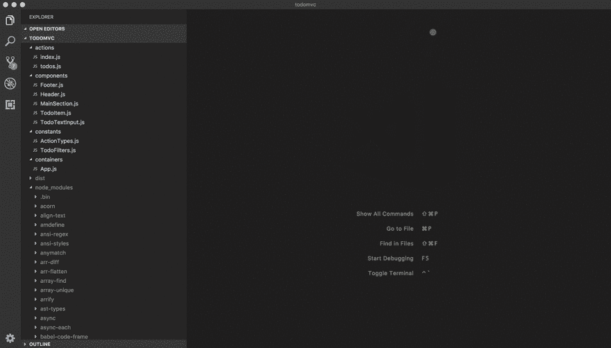

# Redux Devtools:操作堆栈跟踪

> 原文：<https://dev.to/finallynero/redux-action-stack-trace-1m0d>

我最近在 Youtube 上观看了马克·埃里克森在 Reacthaton 2019 的演讲“Redux 的状态”。除了说说 redux 目前的状态(没错！！Redux 没有死)他还谈到了添加到 Redux 开发人员工具中的一个新特性。这被称为动作堆栈跟踪，它帮助您跟踪特定 Redux 动作是从哪里发出的。默认情况下，这个特性是禁用的。当启用时，一个 Trace 标签会被添加到 Redux devtools 中，当你点击一个特定的动作时，它会向你显示该动作被调度的堆栈跟踪。

我认为这是对 Redux devtools 的一个很大的补充，因为不久前我不得不处理一个错误，在我的应用程序中有一个动作被分派，但我不知道在哪里或什么分派了那个动作。

[](https://res.cloudinary.com/practicaldev/image/fetch/s--h4sWReIx--/c_limit%2Cf_auto%2Cfl_progressive%2Cq_66%2Cw_880/https://user-images.githubusercontent.com/7957859/50161148-a1639300-02e3-11e9-80e7-18d3215a0bf8.gif)

> 上图来自 [Redux Devtools 扩展文档](https://github.com/zalmoxisus/redux-devtools-extension/blob/master/docs/Features/Trace.md)

要启用此功能，在设置 redux devtools 时，将`trace`选项设置为`true`。下面是启用此功能的示例。

```
// Without middleware

//import { composeWithDevTools } from "redux-devtools-extension";
//import * as actionCreators from "./actions/index";

const composeEnhancers = composeWithDevTools({
  actionCreators,
  trace: true,
  traceLimit: 25,
})
const store = createStore(reducer, composeEnhancers()) 
```

Enter fullscreen mode Exit fullscreen mode

```
// With thunk middleware 

//import { composeWithDevTools } from "redux-devtools-extension";

const composeEnhancers = composeWithDevTools({ 
    actionCreators, 
    trace: true, 
    traceLimit: 25 
}); 
const store = createStore(reducer, preloadedState, composeEnhancers(
    applyMiddleware(invariant(), thunk) 
)); 
```

Enter fullscreen mode Exit fullscreen mode

```
// With redux-saga middleware 
const composeEnhancers = window.__REDUX_DEVTOOLS_EXTENSION_COMPOSE__ &&

    window.__REDUX_DEVTOOLS_EXTENSION_COMPOSE__({ 
    trace: true, 
    traceLimit: 25 
}) || compose; 
const store = createStore( reducer, composeEnhancers(applyMiddleware(sagaMiddleware)) 
```

Enter fullscreen mode Exit fullscreen mode

您可以查看[示例](https://github.com/zalmoxisus/redux-devtools-extension/commit/64717bb9b3534ff616d9db56c2be680627c7b09d)的文档

我在我的 react 应用程序中使用 create react app，所以我不需要任何额外的设置，但是如果你使用 webpack 配置来设置你自己的应用程序，你需要将 webpack 配置中的`devtool`设置为`source-map`来进行开发。这有助于 Redux devtools 提供原始代码和转换后的源代码之间的映射。