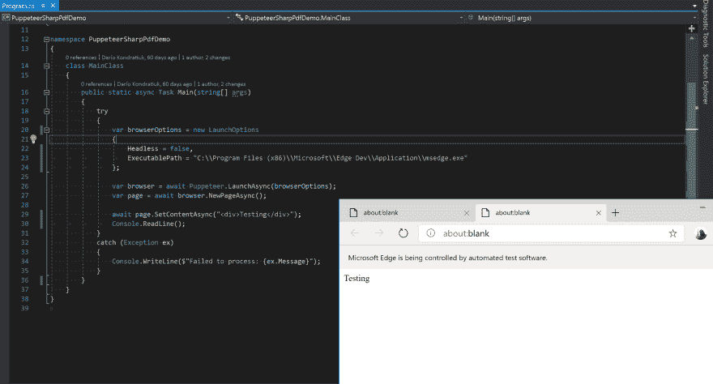
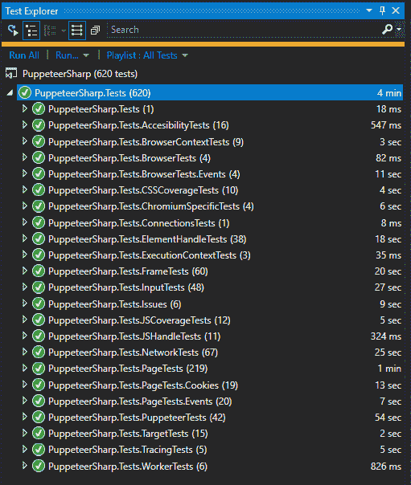

# 使用 puppeter-Sharp 自动化 Microsoft Edge

> 原文：<https://dev.to/hardkoded/automating-microsoft-edge-with-puppeteer-sharp-1pb0>

你可能已经听说了，微软向公众发布了它的 Chromium Edge 浏览器。也许这个问题不符合技术面试问题的标准，但是:

> 如果 puppet er-Sharp 自动化了 chromium，而微软 Edge (insider)是由 Chromium 驱动的，这将意味着...

[](https://i.giphy.com/media/B5AVgxf0OzlyE/giphy.gif)

当您调用`Puppeteer.LaunchAsync`时，您可以在`LaunchOptions`中设置的值之一是[可执行路径](https://www.puppeteersharp.com/api/PuppeteerSharp.LaunchOptions.html#PuppeteerSharp_LaunchOptions_ExecutablePath)。

那么，如果我们通过我们的微软 Edge 浏览器路径启动木偶师，会发生什么？

```
var browser = await Puppeteer.LaunchAsync(new LaunchOptions
{
    Headless = true,
    ExecutablePath = "C:\\Program Files (x86)\\Microsoft\\Edge Dev\\Application\\msedge.exe"
}); 
```

我们来写一个超级简单的例子:

```
var browserOptions = new LaunchOptions
{
    Headless = false,
    ExecutablePath = "C:\\Program Files (x86)\\Microsoft\\Edge Dev\\Application\\msedge.exe"
};

var browser = await Puppeteer.LaunchAsync(browserOptions);
var page = await browser.NewPageAsync();

await page.SetContentAsync("<div>Testing</div>"); 
```

给你！

[](https://res.cloudinary.com/practicaldev/image/fetch/s--QYco1lPx--/c_limit%2Cf_auto%2Cfl_progressive%2Cq_auto%2Cw_880/https://github.com/kblok/kblok.github.io/raw/master/img/microsoft-edge-puppeteer/demo-running.png)

在对 puppet er-sharp 进行了几处调整和对 puppet er 进行了[类似的修改](https://github.com/GoogleChrome/puppeteer/pull/4314)之后，我们成功地让所有测试使用微软 Edge 运行起来！

[](https://res.cloudinary.com/practicaldev/image/fetch/s--hnIXlJpt--/c_limit%2Cf_auto%2Cfl_progressive%2Cq_auto%2Cw_880/https://github.com/kblok/kblok.github.io/raw/master/img/microsoft-edge-puppeteer/tests-running.png)

所以我们可以说，木偶师-夏普 1.14 版完全兼容微软 Edge Insider 75 . 0 . 131 . 0 版。

[](https://res.cloudinary.com/practicaldev/image/fetch/s--yUJ2TyKG--/c_limit%2Cf_auto%2Cfl_progressive%2Cq_66%2Cw_880/https://media1.giphy.com/media/TdfyKrN7HGTIY/giphy.gif%3Fcid%3D790b76115cbda5016531733341f0d371)

不要停止编码！

最初发布于[harkoded.com](http://www.hardkoded.com/blog/automating-microsoft-edge-puppteer-sharp)