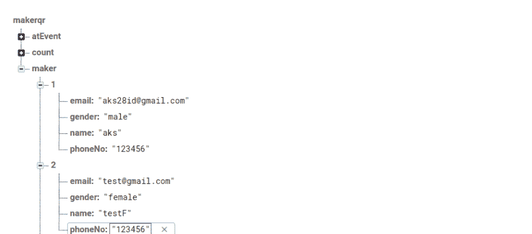

# 从云功能发送带有动态 QR 的个性化电子邮件

> 原文：<https://dev.to/akshay090/sending-personalized-email-from-cloud-function-50al>

这是“构建 formiQR”系列的第二部分。

通过阅读上一篇文章，您可能会有一个类似的实时数据库结构，如下所示

注意:您不会有事件和计数节点，因为我们将在博客系列的其他部分为它们编写代码。

所以看看我们的 maker 节点，或者说注册用户，我们有他们的名字和电子邮件 id。现在，我们需要设置一个云功能，它将能够获得名称和电子邮件，在节点上创建触发器，并向他们发送个性化的电子邮件。

一个关于 firebase 云函数的小简介，如果你是新手，Firebase 的云函数可以让你自动运行后端代码来响应 Firebase 特性触发的事件。

这里有一个[帖子，让你开始使用【firebase cloud 函数，你可以按照它进行到第 4 步，然后我们需要将下面的代码添加到 index.js](https://firebase.google.com/docs/functions/get-started)