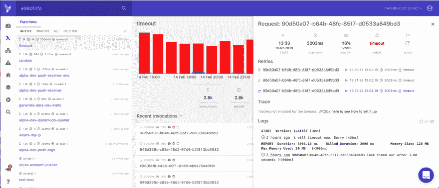

# Dashbird 是 Cloudwatch 的一大进步

> 原文：<https://dev.to/johndemian/dashbird-is-a-great-cloudwatch-alternative-3a65>

我在这篇文章中会有偏见，但这没关系，因为我相信你将在这篇文章中读到的所有信息都是 100%正确的，对双方都是公平的。

### 我们先来看 Cloudwatch。

不要误会我的意思，Cloudwatch 无论如何都不是一个坏工具。事实上，如果你花时间去理解它的复杂性，它对于跟踪你的 AWS 栈中正在发生的事情是相当不错的。这是一个 goto 工具，用于监视 AWS 中的云资源，并允许您一起跟踪所有资源。

Cloudwatch 最好的特性之一是能够设置高级警报，在我看来，这是相当高级的。例如，你可以设置它，这样当一个特定的函数使用 x 数量的内存或者运行时间超过 x 秒时，你就会得到提醒。每当警报被触发时，警报将被发送到您的电子邮件中。

我对 AWS Cloudwatch 的主要问题可能是它显示信息的方式。在云中运行实际的应用程序会使导航日志变得非常困难(这一点我再强调也不为过)，尤其是当您拥有多个资源时。由于日志都是分组在一起的，即使信息都在里面，也要花很多时间才能找到问题的根源。甚至读取日志本身也很棘手，因为它只是一个长的无格式 JSON 字符串。

### 大鸟做的对！

另一方面，Dashbird 并没有重新发明轮子。它只是让开发人员更容易调试他们基于 Lambda 的应用程序，而没有过于复杂的 UI 和拥挤的屏幕信息。

查看调用日志视图。有了 Cloudwatch，你通常可以在一个屏幕上看到所有的调用。为了调试应用程序，您必须手动筛选所有日志，并寻找您正在寻找的特定调用。现在想象你有 10，50，100 个函数。它会很快失控！

切换回 Dashbird。所有的函数都整齐地列在 Lambda 视图下，单击函数会列出该函数的调用，从最近的开始。当应用程序崩溃时，你需要一种快速调试问题的方法，你真的不能花 15 分钟的时间试图弄清楚你在看什么。

日志本身是格式化的，所以信息是交互式的，这对于大型对象来说非常方便，但如果这不是你的风格，你可以随时切换回“原始日志”，并让它以类似于 Cloudwatch 显示日志的方式显示。

最重要的是， [Dashbird](https://dashbird.io) 有一个很酷的新事件管理平台，允许您为警报创建自定义策略。然后，您可以选择一个您希望获得警报的渠道，它可以是电子邮件、Slack 或两者兼有。

Dashbird 的另一个很酷的功能是项目视图，它允许您将项目中的某些功能分组，并作为一个组而不是单个功能进行监控。这对运行在 AWS Lambda 上的微服务帮助极大。

在 lambdas 上搜索一个关键字也是一个很大的群体，以及允许你启动冷启动、重试、超时等的过滤器。

我可以继续下去，但我想我已经表达了我的观点，但不幸的是，如果你仍然不相信，我邀请你查看这个 [Cloudwatch 与 Dashbird 对比页面](https://dashbird.io/free-cloudwatch-alternative/)，它显示了每种服务必须提供的主要功能列表。

## 结论

我是否谈到了这两款出色产品的每一个细节？肯定不是。我的比较是不是有点偏了？也许吧。值得自己花时间去尝试吗？绝对绝对。

前往我们的[注册](https://dashbird.io/register/)页面，查看我们的免费层，获得 1024 MB 的日志，或者如果你喜欢冒险，可以开始免费试用，并试用整个应用程序，真正体验一下 Dashbird 的功能。