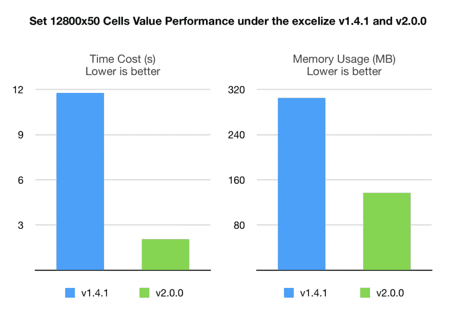

# 超越 2.0.0 发布

> 原文：<https://dev.to/xuri/excelize-2-0-0-released-363m>

[excelise](https://github.com/xuri/excelize)是一个用 pure Go 编写的库，提供了一组允许你读写 XLSX 文件的函数。支持读取和写入由 Microsoft Excel 2007 和更高版本生成的 XLSX 文件。支持保存文件而不丢失 XLSX 的原始图表。此库需要 Go 版本 1.8 或更高版本。完整的 API 文档可以使用 go 的内置文档工具查看，或者在线访问 [go.dev](https://pkg.go.dev/github.com/xuri/excelize) 和 [docs reference](https://xuri.me/excelize/) 。

我们很高兴地宣布 2.0.0 版的发布。特色是一些新的功能领域和许多错误修复。

在[发行说明](https://github.com/xuri/excelize/releases/tag/v2.0.0)中提供了变更摘要。完整的变更列表可在[变更日志](https://github.com/xuri/excelize/compare/v1.4.1...v2.0.0)中找到。

## 发布说明

此版本中最显著的变化是:

#### API 变更

下表列出了与 1.4.1 版相比，2.0.0 版 API 的变化:

| 功能 | 添加`error`返回 | 行号变更 * | 删除 | 新添加 |
| --- | --- | --- | --- | --- |
| 干杯 | × | × | √ | × |
| 标题编号 | × | × | √ | × |
| SplitCellName | × | × | × | √ |
| JoinCellName | × | × | × | √ |
| ColumnNameToNumber | × | × | × | √ |
| ColumnNumberToName | × | × | × | √ |
| 细胞名称坐标 | × | × | × | √ |
| coordonatestocellname | × | × | × | √ |
| SetCellFloat | × | × | × | √ |
| SetCellStyle | √ | × | × | × |
| 插入栏 | √ | × | × | × |
| 移除 Col | √ | × | × | × |
| 移除行 | √ | √ | × | × |
| 插入行 | √ | √ | × | × |
| 复制器 | √ | × | × | × |
| 重复世贸组织 | √ | × | × | × |
| SetRowHeight | √ | × | × | × |
| GetRowHeight | √ | × | × | × |
| GetCellValue | √ | × | × | × |
| GetCellFormula | √ | × | × | × |
| GetCellHyperLink | √ | × | × | × |
| SetCellHyperLink | √ | × | × | × |
| SetCellInt | √ | × | × | × |
| SetCellBool | √ | × | × | × |
| SetCellStr | √ | × | × | × |
| SetCellDefault | √ | × | × | × |
| GetCellStyle | √ | × | × | × |
| SetCellValue | √ | × | × | × |
| 合并细胞 | √ | × | × | × |
| SetSheetRow | √ | × | × | × |
| SetRowVisible | √ | √ | × | × |
| GetRowVisible | √ | √ | × | × |
| setrowooutlinelevel | √ | √ | × | × |
| getrowooutlinelevel | √ | √ | × | × |
| getrows 先生 | √ | × | × | × |
| 列 | √ | × | × | × |
| 搜索表 | √ | × | × | × |
| 获取图片 | √ | × | × | × |
| GetColVisible | √ | × | × | × |
| SetColVisible | √ | × | × | × |
| getcolooutlinelevel | √ | × | × | × |
| setcolooutlinelevel | √ | × | × | × |
| SetColWidth | √ | × | × | × |
| GetColWidth | √ | × | × | × |
| GetMergeCells | √ | × | × | × |
| 保护纸 | √ | × | × | × |
| 取消保护页 | √ | × | × | × |
| UpdateLinkedValue | √ | × | × | × |
| SetSheetVisible | √ | × | × | × |
| 调节器 | √ | × | × | × |
| 调整合并单元格 | √ | × | × | × |
| adjustAutoFilter | √ | × | × | × |
| 准备通话 | √ | × | × | × |
| setDefaultTimeStyle | √ | × | × | × |
| 时间 | √ | × | × | × |
| addDrawingChart | √ | × | × | × |
| addDrawingVML | √ | × | × | × |
| addDrawingPicture | √ | × | × | × |
| gettotalrowscolls | √ | × | × | × |
| 农作物列 | √ | × | × | × |
| addDrawingShape | √ | × | × | × |
| 可调节的 | √ | × | × | × |
| 工作踏板 | √ | × | × | × |
| 复印单 | √ | × | × | × |

*从版本 2.0.0 开始，所有行操作方法都使用从`1`开始的 Excel 行编号，而不是在早期版本的一些方法中使用的从零开始的编号，相关问题#349。

#### 特征

*   为指定行位置的重复行添加了新功能 [`DuplicateRowTo()`](https://pkg.go.dev/github.com/xuri/excelize/v2@v2.0.0#File.WriteTo)
*   [`SetPageLayout()`](https://pkg.go.dev/github.com/xuri/excelize/v2@v2.0.0#File.SetPageLayout) 功能现在支持设置页面方向，相关问题#318
*   [`SetPageLayout()`](https://pkg.go.dev/github.com/xuri/excelize/v2@v2.0.0#File.SetPageLayout) 功能现在支持设置页面大小

#### Bug 修复

*   修复在样式格式中未指定填充时创建空白填充的问题
*   修复 excel 表中数据验证列表中大于`255`的公式字符消失的问题，相关问题#339
*   修复删除单元格公式后 xlsx 损坏的问题，相关问题#346
*   修复了 [`GetComment()`](https://pkg.go.dev/github.com/xuri/excelize/v2@v2.0.0#File.GetComment) 在某些情况下返回工作表和注释之间不正确映射的问题，相关问题#345
*   修复问题#346，解决删除单元格公式后 xlsx 损坏的问题
*   修复问题#377，避免 GetRows 结果中的空列

#### 表现

*   性能优化，添加评论更快，相关问题#347，添加图像、图表和形状更快，相关问题#274
*   添加相同的图像应该会创建一个引用已存储图像副本的绘图，相关问题#359

#### 杂项

*   错别字已修复，godoc 已更新
*   测试再次加强，测试矩阵中增加了 go1.12