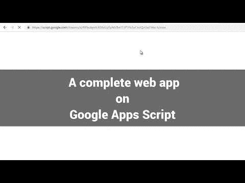
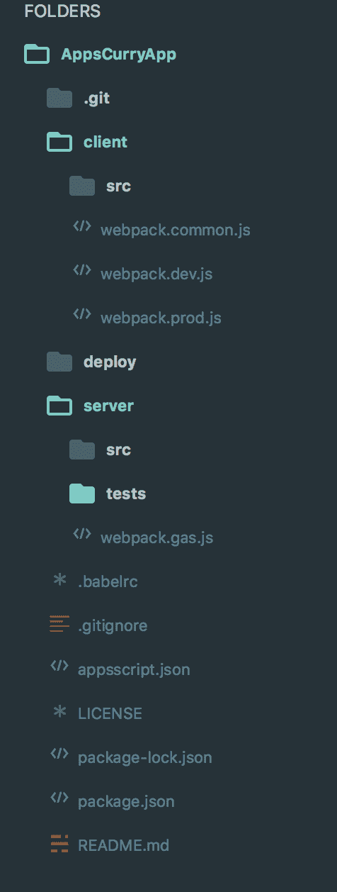
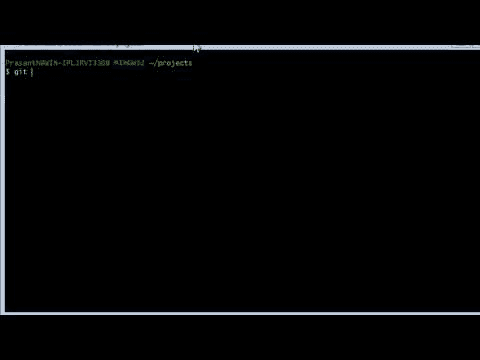

# 使用 Google Sheet 作为数据库，在 Google Apps 脚本上创建完整的 web 应用程序

> 原文：<https://dev.to/prasanthmj/creating-a-complete-web-app-on-google-apps-script-using-google-sheet-as-database-26o8>

Google 的 Apps 脚本应该会引起所有 JavaScript 开发者的兴趣。Apps 脚本有利于自动化。你可以直接访问谷歌的许多服务，比如谷歌表单、Gmail、谷歌文档、谷歌日历等等。在这里看一些 [Google Apps 脚本入门教程。](https://developers.google.com/apps-script/articles/tutorials)

只要有一点点想象力，你就可以使用 Google Apps 脚本创建非常令人兴奋的应用程序和插件。

Apps Script 的第一个限制是它使用了旧版本的 Javascript。它不支持 ES6 及其功能。问题不大。我们可以使用 babel 并交叉编译成兼容版本。下一个限制是没有封装/模块设置。您不能在应用程序脚本环境中直接使用 npm 模块。

谢天谢地，有一个命令行工具叫做 [clasp](https://github.com/google/clasp) 。clasp 工具使得上传你的应用程序脚本代码变得很容易。

因此，在这个项目的第一部分，让我们尝试利用应用脚本中的 ES6 和 npm 模块。我们将使用 Webpack+babel 从我们的源代码创建一个包。然后我们将使用 clasp 工具上传这个包。

请看这里第一部分的代码:
[https://github.com/gsmart-in/AppsCurryStep2](https://github.com/gsmart-in/AppsCurryStep2)

## Webpack 创建捆绑包

最有趣的部分应该是这里的 webpack 配置:
[https://github . com/gsmart-in/apps chrysury step 2/blob/master/web pack . gas . js](https://github.com/gsmart-in/AppsCurryStep2/blob/master/webpack.gas.js)

在服务器文件夹中，您可以看到两个文件:api.js 和 lib.js

api.js 是直接暴露给 Apps 脚本的。该文件只能包含与应用程序脚本兼容的代码，并且可以直接上传。这个文件将只包含全局函数，因为这是什么应用程序脚本将理解。

lib.js 是我们的包入口点。我们可以在 lib.js 及其任何依赖项中使用 ES6 和 npm 模块。总的来说，呼叫结构将是:

api.js -> lib.js ->您的自定义模块。

回到我们的[网络包配置](https://github.com/gsmart-in/AppsCurryStep2/blob/master/webpack.gas.js)

```
output: 
  {
    filename: '[name].bundle.js',
    path: path.resolve(__dirname, 'dist'),
    libraryTarget: 'var',
    library: 'AppLib'
  } 
```

库目标设置为“var ”,库名设置为“AppLib ”,因此可以在 api.js 中访问库(lib.js)中导出的标识，如下所示:

```
function doGet() 
{
    var output = 'Today is '+AppLib.getTodaysDateLongForm()+"\n\n";

    return ContentService.createTextOutput(output);
} 
```

在 webpack 配置的模块部分，我们有 babel 交叉编译的规则。

此外，我们使用复制插件简单地将 api.js 文件复制到输出文件夹(从输出文件夹，我们使用 clasp 工具将生成的代码上传到 Apps 脚本)

## 使用 npm 模块

在 [lib.js](https://github.com/gsmart-in/AppsCurryStep2/blob/master/server/lib.js) 中我们可以使用 ES6 或者任何你想要的高级特性。它还可以包括其他模块。

```
 import * as moment from 'moment';
import _ from 'lodash';

function getTodaysDateLongForm()
{
    return moment().format('LLLL');
} 
```

为了试用这个应用程序，[克隆项目](https://github.com/gsmart-in/AppsCurryStep2)，并按照自述文件页面中的说明进行操作。

在这里阅读详细文章:[在 Google Apps 脚本](http://blog.gsmart.in/es6-and-npm-modules-in-google-apps-script/)中使用 ES6 和 npm 模块。

## 为 Apps 脚本项目创建丰富的 UI

让我们构建一个“请求管理”应用程序。该应用程序将是一个单页应用程序。您将能够创建新的请求(笔记本电脑，电话等)，管理员可以查看，批准或拒绝这些请求。在后端，该应用程序会将请求添加到谷歌表。所以 Google Sheet 充当了数据库的角色。

下面是完整的项目:
[https://github.com/gsmart-in/AppsCurryApp](https://github.com/gsmart-in/AppsCurryApp)

点击此处查看该应用的快速演示:

[](https://www.youtube.com/watch?v=g27PUdZkoYU)

代码分为两部分:“客户端”和“服务器端”。客户端文件夹包含 Vuejs、index.html 和 SCSS 模板，我们将所有这些组合在一起，创建一个捆绑包，即上传的 index.html 文件。

[](https://res.cloudinary.com/practicaldev/image/fetch/s--vb0IPsZ7--/c_limit%2Cf_auto%2Cfl_progressive%2Cq_auto%2Cw_880/https://thepracticaldev.s3.amazonaws.com/i/fpmc1boz1l07pjs6ae0k.png)

服务器文件夹包含在应用程序脚本中运行的代码。ES6 中的代码被编译成与应用程序脚本兼容的代码并被上传。

服务器文件夹还包含服务器端代码的单元测试

### 你必须将所有的 CSS 和 Javascript 捆绑和内联到一个 HTML 文件中！

Google Apps 脚本的一个限制是它只有一个功能来显示你的页面。没有像在普通网站上那样快速链接 javascript/css 文件的方法。所以你要把所有的 JS/CSS 捆绑起来内联。

所以我们使用 HtmlWebpackInlineSourcePlugin web pack 插件将生成的 CSS 和 JS 内联到 index.html

以下是 webpack 配置:

```
const path = require('path');
const merge = require('webpack-merge');
const common = require('./webpack.common.js');
var webpack = require('webpack');
const HtmlWebpackPlugin = require('html-webpack-plugin');
const HtmlWebpackInlineSourcePlugin = require('html-webpack-inline-source-plugin');

module.exports = merge(common, {
    mode: 'production',
  output: {
     filename: '[name].bundle.js',
     path: path.resolve(__dirname, '../deploy/gas')
    },
    plugins: [
     new webpack.ProvidePlugin({
          $: 'jquery',
          jQuery: 'jquery',
          'window.jQuery': 'jquery'
     }),
     new HtmlWebpackPlugin({
          template: 'client/src/index.html',
        inlineSource: '.(js|css)$'
     }),
     new HtmlWebpackInlineSourcePlugin()
   ]
}); 
```

## 结论

这个项目的目的是看看我们能在多大程度上扩展 Apps Script 的限制，使其成为构建完整 web 应用的平台。虽然你还不能在这个平台上构建生产级甚至有限的用户基础应用，但这揭示了这样一个平台的潜力。想象一下，能够创建应用程序，推送应用程序，并且永远不需要担心扩展问题。想象一个内置了用户访问管理的平台。也许有一天，这个例子将有助于创建这样一个更好的、可扩展的通用应用平台。

## App 的视频演示

查看应用程序的完整演示(克隆项目和创建实例)

[](https://www.youtube.com/watch?v=Vt6O4pf98VU)

## 阅读更多

*   [在 Google Apps 脚本中使用 ES6 和 npm 模块](http://blog.gsmart.in/es6-and-npm-modules-in-google-apps-script/)
*   [在 Google Apps 脚本上构建单页面应用程序(使用 Vue 和引导程序)](http://blog.gsmart.in/single-page-apps-vue-bootstrap-on-google-apps-script/)