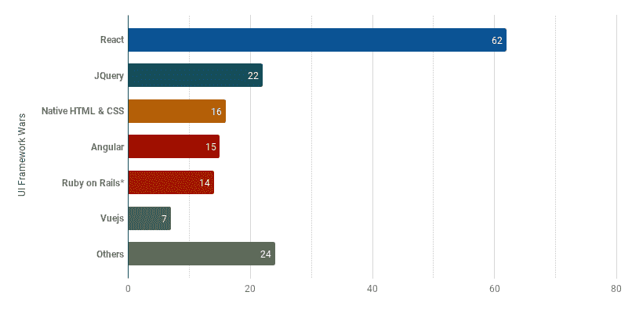
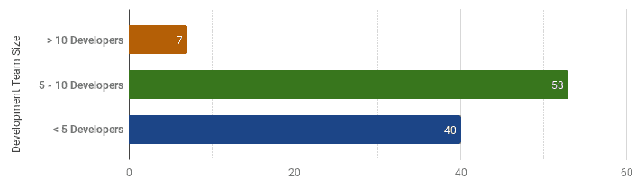
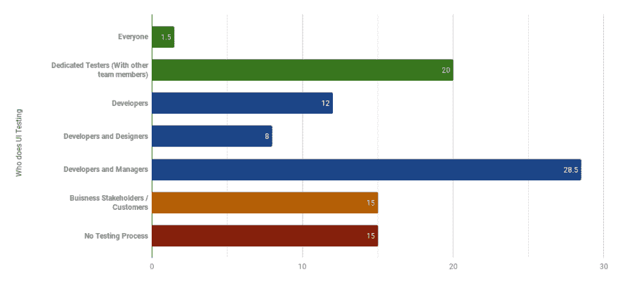
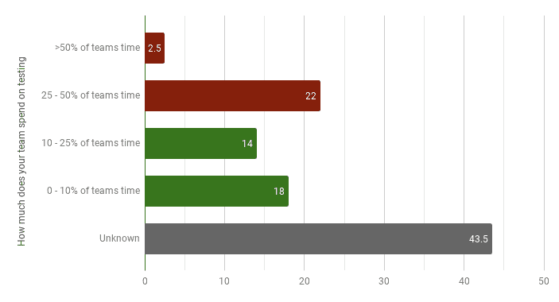
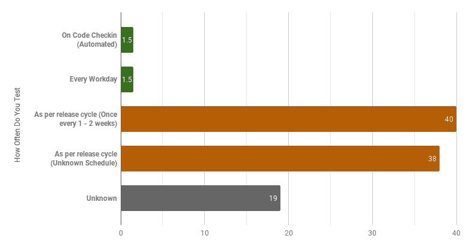
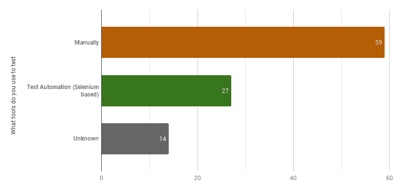
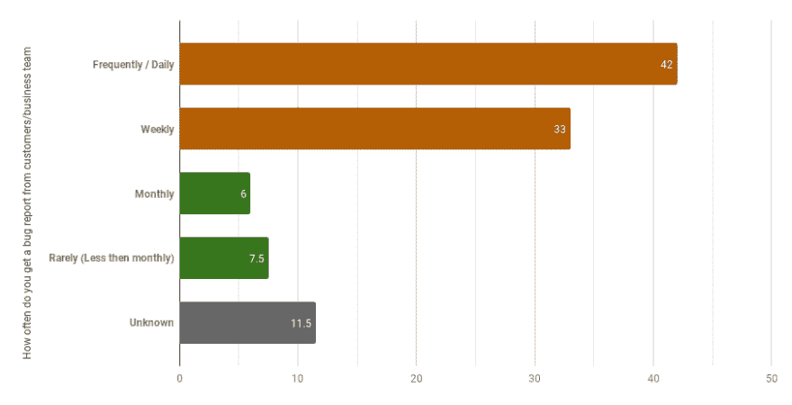
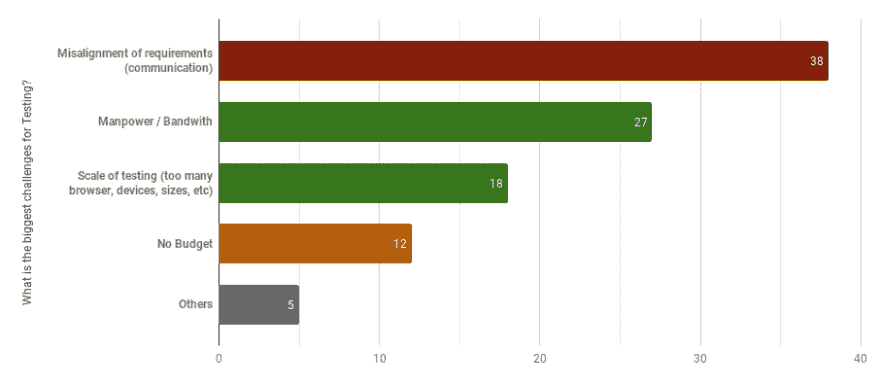
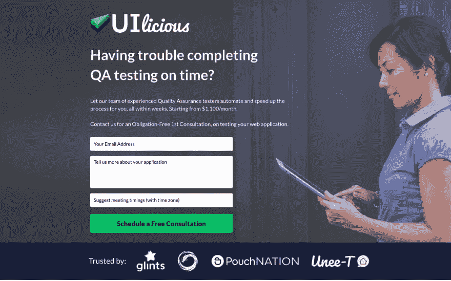

# 🤔UI 框架战争与测试调查(针对🇸🇬的初创企业和中小企业)

> 原文：<https://dev.to/uilicious/ui-framework-wars-testing-survey-results-on-startups-sme-s-in-singapore-1bj1>

你好，

在过去的一个月里，Uilicious 的团队已经走遍了 one north(我们国家的创业中心)和其他几个商业中心，走访了 200 多家企业，调查员工，了解在新加坡🇸🇬的生产和测试中最流行的前端框架

两年前，一家公司在一个小得多的范围内做了一些有趣的事情，以获得事情的总体感觉。希望在接下来的几年里能够重复。

🤔听起来不错？让我们来看看结果

* * *

# UI 框架大战——在产？

> 每个人都想知道正在进行的 UI“标准”战争的最终答案

[](https://res.cloudinary.com/practicaldev/image/fetch/s--HDOUXdke--/c_limit%2Cf_auto%2Cfl_progressive%2Cq_auto%2Cw_880/https://thepracticaldev.s3.amazonaws.com/i/pjppaejqiqho3oexe47l.png)

<figure>

[](https://res.cloudinary.com/practicaldev/image/fetch/s--vS2on42s--/c_limit%2Cf_auto%2Cfl_progressive%2Cq_auto%2Cw_880/https://thepracticaldev.s3.amazonaws.com/i/xlpqswtgrpw17etfubzk.png)

<figcaption>Note that the total is more than 100%, as users are allowed to select multiple options</figcaption>

</figure>

毫无疑问是胜利者🔥当涉及到生产中开发的应用程序时。

对生产的强调是有意的。毕竟，随着新框架最近的变化和宣传，重要的是要记住，对于日常使用和开发中的生产工作负载来说，不断地停留在宣传列车上是缓慢而乏味的，并且从一个框架迁移到另一个框架需要很长时间。JQuery 在过去的 10 年中轻松地位居榜单第二或更高😴

另一个令人惊讶的竞争者，Ruby on Rails。最初它并不是列表中的一个选项，但是在“其他”自由文本选项中有如此多的响应者，所以它被添加到了列表中。

对我个人来说，Vue.js 并不像我希望的那样受欢迎(披露，我们是 Vue.js 的支持者，并帮助组织他们在当地的聚会)。

另一个也许更令人惊讶的结果是:聚合物网组件的回答为 0，这是调查中的一个选项。可能是因为它对于生产来说有点太前沿了🚅

* * *

# 开发团队规模？

[](https://res.cloudinary.com/practicaldev/image/fetch/s--mv_c_dEu--/c_limit%2Cf_auto%2Cfl_progressive%2Cq_auto%2Cw_880/https://thepracticaldev.s3.amazonaws.com/i/c8uvzwkvj15aj9udogyp.png)

在被调查的团队中，有一半的开发团队规模在 5-10 人之间。这是一个很好的迹象，表明大多数公司已经超越了最初的创业时期。

# 谁做测试？

[](https://res.cloudinary.com/practicaldev/image/fetch/s--V024aTDv--/c_limit%2Cf_auto%2Cfl_progressive%2Cq_auto%2Cw_880/https://thepracticaldev.s3.amazonaws.com/i/jmeb3bbit290zpaibat9.png)

有趣的是，尽管程序员劳动力短缺，但大多数公司严重依赖(48.5%)他们的开发人员进行测试。

这在两个方面令人担忧。一个是开发人员通常不会很好地测试他们自己的代码，因为他们视野狭窄。第二，它们也是最昂贵的选择，开发人员的平均工资是专门的人工 QA 工资的两倍😶

然而更令人震惊的是😱有 15%的受访者表示他们没有进行测试，这包括超过 10 人的大型开发团队。

其次是另外 15%的人，他们使用他们的客户自己或者他们的商业利益相关者进行测试。

尽管有些人表示这不是问题，尤其是那些作为解决方案供应商的人，但是这将导致开发团队和业务团队之间不健康的对立关系。当先前修复的错误在回归测试中再次出现时，关系变得更加紧张，在大多数情况下，业务团队面临着客户的愤怒和任何客户业务损失的影响。

理想情况下，一个好的 QA 团队甚至一个专门的 QA 测试人员可以帮助管理，谢天谢地，有 20%的受访者做到了。所以这是一个小小的胜利👍

* * *

> 旁注:下面的结果不包括没有测试过程的团队。
> 
> 未知代表没有直接参与整个测试过程的受访者，因此无法给出准确的答案

* * *

# 你的团队在测试上花了多少时间？

[](https://res.cloudinary.com/practicaldev/image/fetch/s--WCCKZlSj--/c_limit%2Cf_auto%2Cfl_progressive%2Cq_auto%2Cw_880/https://thepracticaldev.s3.amazonaws.com/i/6f6ypjjo3ff0fj9fheki.png)

虽然没有在图表中显示出来，但是拥有一个专门的 QA 有助于降低开发团队花费在测试上的总时间，大多数时间在 0-10%和 10-25%之间😃

对于花费超过 25%时间进行测试的团队来说，测试覆盖率不足往往是主要问题。以及在各种设备和屏幕尺寸的⌛上手动执行测试的实际耗时特性

如果开发人员是测试人员，这就更复杂了，因为这不是对他们时间的有效利用。

# 您多久测试一次您的应用程序？

[](https://res.cloudinary.com/practicaldev/image/fetch/s--tk06-DJf--/c_limit%2Cf_auto%2Cfl_progressive%2Cq_auto%2Cw_880/https://thepracticaldev.s3.amazonaws.com/i/u5gaiwzcs9980mlz7euu.png)

40%的团队似乎在每周或每两周一次的开发和测试发布周期中运行。

随后是按(未知计划)完成部署的时间，通常是每月一次或更少。

最后，为那罕见的 3%的人鼓掌，他们或者在每个工作日或者在每次提交时自动运行他们的测试😎

# 你用什么工具测试？

[](https://res.cloudinary.com/practicaldev/image/fetch/s--mL4W6f9V--/c_limit%2Cf_auto%2Cfl_progressive%2Cq_auto%2Cw_880/https://thepracticaldev.s3.amazonaws.com/i/xjg2cd7n6arj6lo5s2h5.png)

尽管从人工智能到区块链，高科技网络应用的整体增长。所有这些应用的测试都是以相当低技术含量的方式进行的，都是手动进行的🤐

令人振奋的一件事是测试自动化上升了 27%,这比我们两年前看到的大约 5%的结果要高得多。或许预示着一个慢慢成熟的行业。

* * *

# 您多久收到一次来自客户/业务团队的 bug 报告？

[](https://res.cloudinary.com/practicaldev/image/fetch/s--hpI-tCeW--/c_limit%2Cf_auto%2Cfl_progressive%2Cq_auto%2Cw_880/https://thepracticaldev.s3.amazonaws.com/i/7sn29pu2snehk45lxyoo.png)

对大多数人来说，这是一个特别痛苦的问题。从表面上看，每日和每周的 bug 报告似乎是 75%的团队每天面临的苦差事。

几乎每个开发人员都害怕从客户那里得到的东西😭

# 测试最大的挑战是什么？

[](https://res.cloudinary.com/practicaldev/image/fetch/s--VVA95-gA--/c_limit%2Cf_auto%2Cfl_progressive%2Cq_auto%2Cw_880/https://thepracticaldev.s3.amazonaws.com/i/ktb1kbhcs453ijipiu0t.png)

最后，还有一个开放式的问题，团队在测试中面临的最大挑战是什么。

不出所料，沟通仍然是第一大挑战，比例为 38%。对于那些阅读它的人来说，这是对神话人月的一个伟大呼喊。

需求的错误沟通存在于以下任何人之间:客户、业务团队、开发人员、设计人员、经理和测试人员。

其次是在当前人才紧缩的情况下缺乏人力(27%)和 web 测试各种屏幕大小、页面和浏览器的规模(18%)。所有这些都是一家公司乐于提供帮助的好东西。

最后是创业经典，没有预算。在 12%时，这一点从未改变😫

* * *

[](https://res.cloudinary.com/practicaldev/image/fetch/s--Q_MLC8i_--/c_limit%2Cf_auto%2Cfl_progressive%2Cq_auto%2Cw_880/https://thepracticaldev.s3.amazonaws.com/i/9gxtdlkcf7zb7r7ft0pm.jpg)

> 以下是个人对调查的观察和看法。又名。它没有确凿的数据支持。

* * *

# 个人对测试的观察

我们发现有趣的是，大多数被调查的公司要么有他们的整个开发团队，要么团队的大部分外包到海外，这是新加坡持续的程序员人力短缺的一个指标🤔

从各种采访中，一个令人担忧的观察结果是，大多数手动测试的团队，仅仅倾向于为新的特性这样做。没有任何回归检查。或者更可怕的是，那些不做测试的。

这对于极早期的创业公司来说是可以理解的，他们才刚刚起步。但是，有几个不在这个阶段，包括更大的“A/B 系列”级别的初创公司。

作为现代网络的消费者，这一点令人担忧，因为这可以多次解释当使用一个应用程序(比如登录和结账)时出现非常明显的错误时会发生什么，其中缺少简单的回归测试。

这也让我产生了疑问，如果一家公司不愿意投入任何资源来测试功能，那么有什么资源来确保他们系统的安全性呢？尤其是考虑到我自己在其中一些应用程序上的个人数据。

我希望能及时得到改进😧

# 个人对 UI 框架的观察

<figure>

在 UI 框架战争方面，在采访过程中，许多响应者提到了为新项目或作为其迁移计划的一部分，从 React 迁移到其他框架的计划。所以也许明年反应会慢慢倒下来？

<figcaption>bias mode engaged</figcaption>

</figure>

**去观看，去🏎**

* * *

> 那么，如何才能让这一切变得更好呢？

# Uilicious.com 测试平台

首先，我们是一个测试自动化平台，旨在消除网站测试中的所有痛点(因此进行了调查)。而且我们还在根据反馈不断迭代。

为了让用户快速启动并运行，我们的平台允许测试人员轻松地编写这样的测试脚本...

```
// Lets go to dev.to
I.goTo("https://dev.to")

// Fill up search
I.fill("Search", "uilicious")
I.pressEnter()

// I should see myself or my co-founder
I.see("Shi Ling")
I.see("Eugene Cheah") 
```

并生成这样的[可共享的测试结果](https://snippet.uilicious.com/test/public/1cUHCW368zsHrByzHCkzLE)...

[](https://snippet.uilicious.com/test/public/1cUHCW368zsHrByzHCkzLE)

# 智能质量保证即服务

第二，从那时起，我们已经试运行了一些有吸引力的服务。

这在调查结果中显而易见。大多数团队缺乏组建他们自己的专门的质量保证团队所需的资源。这是我们可以帮助的事情，从收集测试需求到编写和维护测试。

[](https://services.uilicious.com/qa-service)

如果调查中的上述测试挑战适用于您，请告诉我们，我们将很乐意帮助您使用我们丰富的测试服务，与我们经验丰富的 QA 工程师一起启动并运行您的完整 QA 流程。

此外，一旦团队发展到足够大，拥有自己的专门 QA 团队，他们就可以接管在平台上编写和维护测试脚本的角色。

我们希望通过测试服务，我们可以帮助团队说服他们的项目经理提高他们网站和产品的整体质量😉让开发团队和他们的项目以及我们的测试平台一起更快地启动和运行。

<figure>

* * *

<figcaption>bias mode dis-engaged</figcaption>

</figure>

# 对于明年的调查，我们应该在哪些方面有所改进？

值得注意的一点是:由于目前的调查规模(~200)，以及数据收集的性质(几乎完全在 one-north)。人们对较小的创业公司有很大的偏好。所以最好把结果当做模糊的指标。这是我们希望在未来改进的地方😵

另一件需要注意的事情是——由于这项调查的性质，其结果大大低估了大型开发团队的代表性。

许多更大的创业公司(他们可能有更大的开发团队)会在入口处有一个办公室经理，拒绝任何调查请求😥

当我们明年重复调查时，我们将分别询问本地和海外团队的规模，这将有助于了解新加坡开发人员的外包率。

类似地，解决方案供应商或网络公司的测试需求也有明显的不同。我们将在明年尝试添加一些内容。伴随着“公司有多老”的问题。

因此，如果您对我们应该如何改进调查有任何想法，请告诉我。

在那之前，作为一个创业者。我得回去找投资人，筹集资金来壮大公司，所以我得走了...

* * *

[](https://res.cloudinary.com/practicaldev/image/fetch/s--zqnDCo3t--/c_limit%2Cf_auto%2Cfl_progressive%2Cq_auto%2Cw_880/https://thepracticaldev.s3.amazonaws.com/i/46wdha7noxft6xch4owu.png)

# 快乐航运🖖🏼🚀